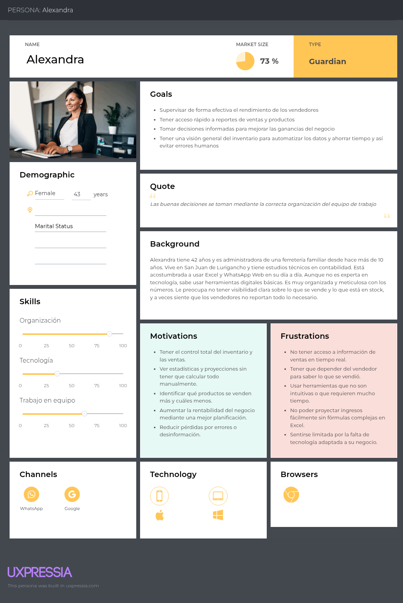
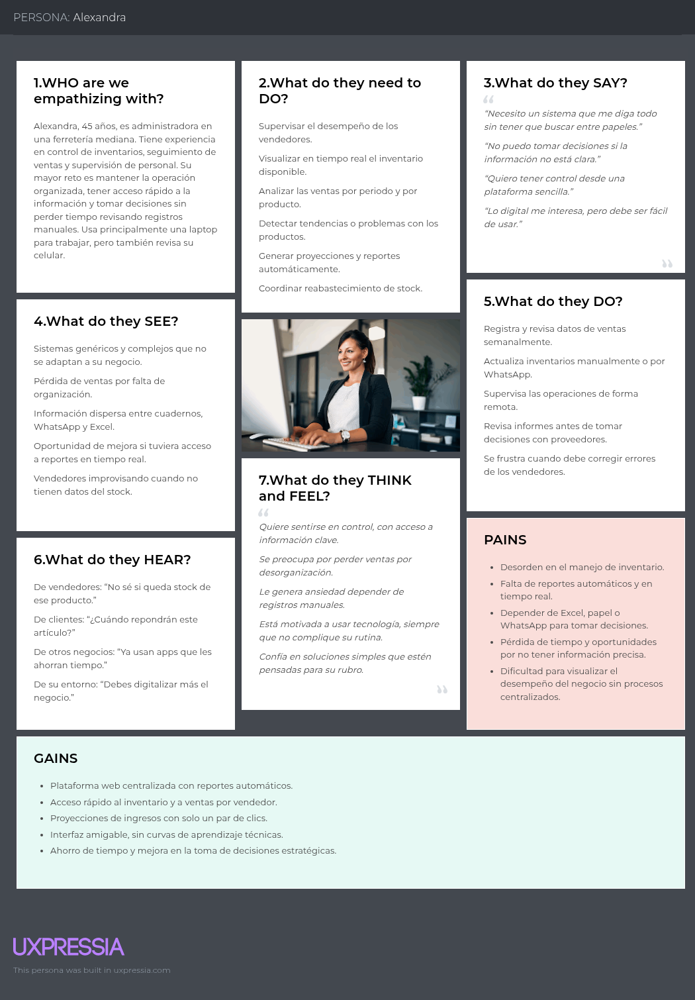

# Softwarinos - Report

  

# Universdiad Peruana de Ciencias Aplicadas

# INGENIERÍA DE SOFTWARE

### Ciclo: 7

## CURSO: Arquitecturas De Software Emergentes | SECCIÓN 4253

Profesor: De Los Rios Fernandez, Christian Luis

# Proyecto de curso

## Informe de Trabajo Final

#### StartUp: Softwarinos

#### Producto: Detekto

### Integrantes:

| Integrantes                            | Codigo     |
| -------------------------------------- | ---------- |
| Ampudia Flores, Jose Carlos Isaac      | u202112936 |
| De La Piedra Quintanilla, Erwin Miquel | U202112179 |
| Elsner De La Torre Ugarte              | u202111654 |
| Gutierrez Zumaeta, Manuel Alonso       | U202112353 |

#### Ciclo 2025-10

##### Abril, 2025

---

# Registro de Versiones del informe

| Versión | Fecha | Autor | Descripción de modificación |
| ------- | ----- | ----- | --------------------------- |
| 0.1     |       |       |                             |
| 0.2     |       |       |                             |
| 0.3     |       |       |                             |
| 0.4     |       |       |                             |
| 0.5     |       |       |                             |

# Project Report Collaboration Insights

Para el desarrollo del proyecto, se ha utilizado la plataforma de GitHub para el control correcto de versiones y la colaboración de los integrantes del equipo. A continuación se presenta el link directo a la organización del equipo:

**Link de organización Softwarinos:**  
[https://github.com/Emergentes-Softwarinos](https://github.com/Emergentes-Softwarinos)

## TB1

Para la entrega de la TB1 se realizó una reunión donde se asignaron las responsabilidades a cada integrante del equipo. A continuación se muestra la siguiente tabla con los detalles:

| Integrante          | Responsabilidad |
| ------------------- | --------------- |
| José Ampudia        |                 |
| Manuel Gutierrez    |                 |
| Miquel De la Piedra |                 |
| Julio De la Torre   |                 |

Durante la elaboración de las aplicaciones, tanto web como mobile, se realizaron _commits_ respectivos con el fin de mantener el orden y un control de versiones eficiente.

Para tener mejor precisión en los integrantes del equipo, a continuación presentamos los usuarios de GitHub de los integrantes:

- José Ampudia (@IsaacAmp24)
- Manuel Gutierrez (@ManuGZ)
- Miquel De la Piedra (@MiquelDlp)
- Julio De la Torre (@)

A continuación se presentan las capturas del repositorio de GitHub donde se realizaron los avances correspondientes.

# Tabla de contenidos

# Studen Outcome

# Capítulo I: Introducción

## 1.1. Startup Profile

En esta sección presentaremos la descripción del startup y los perfiles de los miembros del team.

### 1.1.1. Descripción de la Startup

En Softwarinos, estamos desarrollando una solución con respecto al reconocimiento de objetos a través de una aplicación móvil, para facilitar la búsqueda de productos y la venta de estos mismos por parte de vendedores, además de un seguimiento de estas ventas y proyecciones de parte del administrador.

**Misión**: Crear una aplicación móvil que reconozca objetos de forma rápida y precisa, para ayudar a los vendedores a encontrar y vender productos fácilmente, y permitir a los administradores llevar un mejor control de las ventas y hacer proyecciones para su negocio.

**Visión**: Convertirnos en una empresa destacada en soluciones tecnológicas para el comercio, facilitando el trabajo de vendedores y administradores a través de herramientas inteligentes que mejoran la gestión y el crecimiento de sus negocios.

### 1.1.2. Perfiles de integrantes del equipo

| Foto                                       | Nombre y Descripción                                                                                                                                                                                                                                                                                                                                                                                                                                                                                                       |
| ------------------------------------------ | -------------------------------------------------------------------------------------------------------------------------------------------------------------------------------------------------------------------------------------------------------------------------------------------------------------------------------------------------------------------------------------------------------------------------------------------------------------------------------------------------------------------------- |
|  | **Nombre:** Manuel Alonso Gutierrez Zumaeta **Código:** u202112353 **Descripción:** Soy Manuel Gutierrez, estudiante de la carrera de Ingeniería de Software, tengo 20 años. Tengo experiencia en el desarrollo de aplicaciones web, tanto frontend como backend, programación móvil en Flutter. Me considero una persona responsable y que se propone hacer un buen trabajo.                                                                                                                                        |
|               | **Nombre:** Julio Elsner De La Torre Ugarte **Código:** u202111654 **Descripción:** Estudiante de Ingeniería de software, tengo 21 años. Cuento con experiencia en desarrollo de aplicaciones Web Full Stack (Front, Back-end) y bases de datos. Me considero una persona indagadora y que hace las cosas con una idea plasmada antes de realizarla.                                                                                                                                                                 |
|              | **Nombre:** Erwin Miquel De la Piedra Quintanilla **Código:** u202112179 **Descripción:** Soy Miquel De la Piedra, tengo 21 años, estudiante de la carrera de Ingeniería de Software. Poseo conocimientos relacionados a la programación en C++, Python, HTML y CSS. Además poseo experiencia con el manejo de bases de datos. Considero que estos conocimientos ayudarán a la realización de este trabajo, además de mejorar nuestros métodos de organización y trabajo en equipo.                                  |
|                | **Nombre:** José Carlos Isaac Ampudia Flores **Código:** u202112936 **Descripción:** Soy estudiante de Ingeniería de Software, con sólida formación en desarrollo Backend utilizando frameworks como Spring Boot. También cuento con conocimientos en el desarrollo Frontend, trabajando con herramientas como Angular. Me caracterizo por mi capacidad para trabajar bajo presión, así como por mi enfoque organizado y metódico, lo que me permite adaptarme correctamente a los desafíos del entorno tecnológico. |

## 1.2. Solution Profile

### 1.2.1 Antecedentes y problemática

**What (¿Qué?)**  
 El problema principal es la dificultad que enfrentan ferreterías y comercios de productos físicos para identificar, buscar y gestionar herramientas y materiales de forma rápida y precisa. Los sistemas actuales no están adaptados al sector y requieren conocimientos técnicos o procesos manuales lentos.

- **When (¿Cuándo?)**  
  Este problema ocurre diariamente en el momento de la atención al cliente, la búsqueda de productos en almacén, la actualización del inventario y el registro de ventas. Es especialmente crítico durante horas de alta demanda o cuando se requiere atención eficiente.

- **Where (¿Dónde?)**  
  Sucede en ferreterías, depósitos, puntos de venta físicos y almacenes, donde los empleados necesitan reconocer y registrar productos con rapidez, y los administradores requieren visibilidad clara sobre el movimiento de stock y ventas.

- **Who (¿Quién?)**  
  Afecta principalmente a los vendedores que deben identificar productos de forma rápida, a los clientes que experimentan demoras, y a los administradores que necesitan gestionar inventario y ventas sin sistemas complejos.

- **Why (¿Por qué?)**  
  Porque los sistemas actuales como Shopify, Zoho CRM o TradeGecko están diseñados para otros tipos de negocios, no cuentan con funciones de reconocimiento visual, y son demasiado generales o complejos para el día a día de una ferretería tradicional.

- **How (¿Cómo?)**  
  El problema se intenta resolver actualmente con métodos manuales (catálogos impresos, búsqueda visual, listas), aplicaciones genéricas o incluso sin ningún sistema, lo que lleva a errores, pérdida de tiempo y falta de control.

- **How much (¿Cuánto?)**  
  El impacto puede medirse en tiempo perdido (minutos por venta), errores en inventario, insatisfacción del cliente, y pérdida de ventas por no poder identificar o encontrar un producto a tiempo. A nivel económico, esto representa una baja en la eficiencia operativa y en la competitividad del negocio.

### 1.2.2 Lean UX Process.

#### 1.2.2.1. Lean UX Problem Statements.

#### 1.2.2.2. Lean UX Assumptions.

#### 1.2.2.3. Lean UX Hypothesis Statements.

#### 1.2.2.4. Lean UX Canvas.

## 1.3. Segmentos objetivo.

El estado actual de la gestión de productos en las ferreterías está centrado principalmente en métodos tradicionales, como catálogos físicos y búsqueda manual, lo que resulta en tiempos de espera largos, ineficiencia en la atención al cliente y una gestión de inventario poco precisa. Lo que los sistemas existentes no logran abordar es la integración efectiva de tecnología para agilizar la identificación de productos, mejorar la precisión en el registro de ventas e inventario, y optimizar el seguimiento de las operaciones comerciales.

Nuestro producto, Detekto, resolverá esta brecha mediante el desarrollo de una solución móvil innovadora que utiliza reconocimiento visual a través de la cámara del dispositivo. Nos enfocaremos en proporcionar una plataforma que permita a los vendedores identificar productos rápidamente, registrar ventas, acceder a informes de inventario en tiempo real y obtener reportes automatizados. Además, simplificaremos la gestión del inventario y mejoraremos la comunicación entre vendedores y administradores, todo desde una interfaz sencilla y fácil de usar.

Nuestro enfoque inicial será dirigirnos a ferreterías y pequeños comercios especializados en herramientas y materiales, proporcionando una solución tecnológica accesible que optimice sus procesos. Sabremos que hemos tenido éxito cuando veamos una disminución significativa en los tiempos de atención al cliente, una mejora en la precisión del inventario y una mayor satisfacción tanto de empleados como de clientes, resultando en un aumento en las ventas y eficiencia operativa.

#### 1.2.2.2. Lean UX Assumptions.

- **Business Assumptions**

Los vendedores y administradores de ferreterías necesitan una herramienta rápida y sencilla para identificar productos y gestionar inventarios.

Detekto solucionará esto mediante una app móvil con reconocimiento visual, facilitando la identificación de productos y la gestión de ventas e inventarios.

El modelo de negocio se basará en suscripciones mensuales para ferreterías, con opciones premium como reportes avanzados.

La principal competencia son plataformas generales como Shopify y Zoho CRM, que no están especializadas en ferreterías.

Nos diferenciamos al ofrecer una solución sencilla y enfocada, con reconocimiento visual que ahorra tiempo y mejora la eficiencia operativa.

- **User Assumptions**

  - **¿Quién es el usuario?**  
    Vendedores de ferretería, encargados de mostrador, y administradores de pequeñas y medianas ferreterías.

  - **¿Dónde encaja nuestro producto en su trabajo o vida?**  
    Detekto se utilizará en el punto de venta o durante la organización de inventario, como una herramienta rápida para identificar productos y facilitar su registro, venta o seguimiento.

  - **¿Qué problema tiene nuestro producto? ¿Cómo se resuelve?**  
    El usuario necesita identificar productos sin perder tiempo revisando catálogos físicos o digitales. El reconocimiento visual automatizado reduce este tiempo, mejora la precisión y acelera la atención al cliente.

  - **¿Cuándo y cómo es usado nuestro producto?**  
    Detekto se usa durante el horario laboral en ferreterías, a través de dispositivos móviles (principalmente smartphones) al momento de interactuar con clientes o gestionar productos en bodega.

  - **¿Qué características son importantes?**  
    Reconocimiento visual rápido y preciso, facilidad para registrar ventas, reportes automáticos, historial de productos buscados y acceso desde el celular sin depender de otros sistemas externos.

  - **¿Cómo debe verse nuestro producto y comportarse?**  
    Debe tener una interfaz limpia, visual e intuitiva, con navegación simple, botones grandes y flujos cortos. Debe ser confiable, ágil y estar optimizada para ambientes de trabajo (ruido, poco tiempo, poca conectividad).

- **User Benefits**

  - **Identificación instantánea de productos:**  
    El usuario puede reconocer herramientas y materiales en segundos sin buscar manualmente.

  - **Optimización de ventas y atención al cliente:**  
    Se reduce el tiempo de atención, mejorando la experiencia del cliente y la eficiencia del vendedor.

  - **Gestión simplificada para administradores:**  
    Los responsables pueden monitorear ventas y productos más vendidos desde un panel claro.

  - **Reducción de errores:**  
    Se evita registrar productos incorrectos gracias al reconocimiento visual automatizado.

  - **Adopción sencilla:**  
    La app no requiere conocimientos técnicos avanzados, lo que permite una adopción rápida incluso por usuarios con baja familiaridad digital.

#### 1.2.2.3. Lean UX Hypothesis Statements.

- **Creemos que** la experiencia del vendedor mejorará si se ofrece reconocimiento automático de herramientas mediante la cámara del móvil.**Sabremos que hemos tenido éxito, cuando** el tiempo promedio de identificación de productos disminuya en un 50% durante el primer mes de uso.

- **Creemos que** los administradores podrán tomar mejores decisiones si se les proporciona un panel con reportes automáticos de ventas e inventario.**Sabremos que hemos tenido éxito, cuando** el 70% de los administradores usen el panel semanalmente y reporten una mejora en la gestión del stock en los primeros tres meses.

- **Creemos que** los usuarios adoptarán más rápidamente la app si la interfaz es simple, visual e intuitiva. **Sabremos que hemos tenido éxito, cuando** al menos el 80% de los nuevos usuarios completen su primera venta con ayuda de Detekto en menos de 10 minutos, durante el primer uso.

- **Creemos que** Detekto tendrá una mayor aceptación que soluciones genéricas si se enfoca únicamente en ferreterías. **Sabremos que hemos tenido éxito, cuando** al menos el 60% de los usuarios prefieren Detekto sobre otros sistemas después de un mes de uso, según encuestas de satisfacción.

#### 1.2.2.4. Lean UX Canvas.

## 1.3. Segmentos objetivo.

En esta sección hemos definido dos segmentos objetivo, que representan los públicos a los que estará dirigido nuestro trabajo.

- **Vendedor**: El vendedor va ser el segmento objetivo principal ya que este va a interactuar con la aplicación todo el tiempo, además que será el que tendrá las funcionalidades principales, las cuales una de ellas son el reconocimiento de objetos para que se le facilite la búsqueda de productos, la consulta de stock y la reserva del producto cuando va a realizar una venta a una persona.

- **Administrador**: En este caso el administrador tendrá un rol de supervisor, ya que este no interactúa con la aplicación móvil, sino que tiene una aplicación web donde va a poder ver la lista de los productos, las ventas de que hizo el vendedor, y ademas podra hacer una proyección de cuantas ganancias podría generar un vendedor en un rango de tiempo que el límite.

# Capítulo II: Requirements Elicitation & Analysis

## 2.1. Competidores.

### 2.1.1. Análisis competitivo.

<table><tr><th colspan="6" valign="top">Competitive Analysis Landscape</th></tr>
<tr><td colspan="1" valign="top">¿Por qué llevar a cabo este análisis?</td><td colspan="5" valign="top">El objetivo de este análisis es identificar las características de los competidores y encontrar maneras de diferenciarnos.</td></tr>
<tr><td colspan="2" rowspan="2" valign="top">Startup y Competidores</td><td colspan="1" valign="top">Detekto</td><td colspan="1" valign="top">TradeGecko</td><td colspan="1" valign="top">Zoho CRM</td><td colspan="1" valign="top">Shopify</td></tr>
<tr><td colspan="1" valign="top"></td><td colspan="1" valign="top"></td><td colspan="1" valign="top"></td><td colspan="1" valign="top"></td></tr>
<tr><td rowspan="2" valign="top">Perfil</td><td valign="top">Overview</td>
<td valign="top">App móvil centrada en reconocimiento de herramientas de ferretería mediante cámara. Enfocada en facilitar búsqueda, venta y seguimiento de producto.</td>
<td valign="top">Plataforma de gestión de inventario para pequeñas empresas. Adquirido por QuickBooks.</td>
<td valign="top">CRM completo con automatización de ventas y análisis, enfocado en todo tipo de industria.</td>
<td valign="top">Plataforma de ecommerce para crear y gestionar tiendas online con herramientas integradas de ventas.</td></tr>
<tr><td valign="top">Ventaja competitiva ¿Qué valor ofrece a los clientes?</td>
<td valign="top">Reconocimiento de productos en tiempo real con IA + enfoque específico en ferreterías. Integración con ventas y control.</td>
<td valign="top">Gestión de inventario multi-canal con buena interfaz, pero sin reconocimiento visual.</td>
<td valign="top">Gran capacidad de personalización y automatización, pero no especializado.</td>
<td valign="top">Alto poder de personalización en ecommerce, pero más generalista, sin reconocimiento visual.</td></tr>
<tr><td rowspan="2" valign="top">Perfil de Marketing</td><td valign="top">Mercado objetivo</td>
<td valign="top">Ferreterías, vendedores de productos físicos, administradores de puntos de venta.</td>
<td valign="top">PYMES con múltiples canales de venta.</td>
<td valign="top">Empresas medianas y grandes con procesos de ventas complejos.</td>
<td valign="top">Emprendedores, pymes y empresas que venden en línea.</td></tr>
<tr><td valign="top">Estrategias de marketing</td>
<td valign="top">Enfoque en contenido visual (demostraciones), alianzas con ferreterías, participación en ferias del sector.</td>
<td valign="top">Marketing B2B digital, webinars, presencia en comunidades de comercio electrónico.</td>
<td valign="top">Publicidad online, inbound marketing, fuerza de ventas directa.</td>
<td valign="top">Marketing digital masivo, influencers, SEO, redes sociales.</td></tr>
<tr><td rowspan="3" valign="top">Perfil de producto</td><td valign="top">Productos & Servicios</td>
<td valign="top">Reconocimiento de objetos, gestión de ventas, seguimiento de stock, reportes para administradores.</td>
<td valign="top">Gestión de inventario, pedidos, reportes, integración con ecommerce.</td>
<td valign="top">CRM, automatización de marketing, analíticas, gestión de clientes.</td>
<td valign="top">Tienda online, pagos, envíos, herramientas de marketing y reportes.</td></tr>
<tr><td valign="top">Precios & Costos</td>
<td valign="top">Modelo freemium con funcionalidades avanzadas por suscripción mensual (propuesta).</td>
<td valign="top">Planes desde $39/mes a más de $200, dependiendo de la funcionalidad.</td>
<td valign="top">Planes desde $14/mes, escalables por necesidades.</td>
<td valign="top">Desde $39/mes hasta planes empresariales. Costos adicionales por plugins.</td></tr>
<tr><td valign="top">Canales de distribución (Web y/o Móvil)</td>
<td valign="top">App móvil (iOS/Android), versión web en desarrollo (futuro).</td>
<td valign="top">Web app, sin versión móvil independiente.</td>
<td valign="top">Web app y apps móviles.</td>
<td valign="top">Web app y apps móviles.</td></tr>
<tr><td rowspan="4" valign="top">Análisis SWOT</td><td valign="top">Fortalezas</td>
<td valign="top">Enfoque especializado en ferreterías. Reconocimiento visual innovador. Facilidad de uso.</td>
<td valign="top">Sólido en inventario multi-canal. Buena integración con QuickBooks.</td>
<td valign="top">Potente CRM con automatizaciones. Altamente configurable.</td>
<td valign="top">Ecosistema completo de ecommerce. Alto reconocimiento de marca.</td></tr>
<tr><td valign="top">Debilidades</td>
<td valign="top">Producto nuevo, aún en fase inicial. Menor reconocimiento de marca.</td>
<td valign="top">No incluye funciones de reconocimiento visual. Puede ser complejo para nuevos usuarios.</td>
<td valign="top">No es específico para el sector ferretería. Curva de aprendizaje.</td>
<td valign="top">Competencia feroz, enfoque generalista. Costos ocultos con apps externas.</td></tr>
<tr><td valign="top">Oportunidades</td>
<td valign="top">Asociaciones con proveedores de ferretería. Escalabilidad con inteligencia artificial.</td>
<td valign="top">Integrarse con nuevas plataformas de ecommerce.</td>
<td valign="top">Expandirse en sectores nicho como retail técnico.</td>
<td valign="top">Aumentar integraciones con IA y automatización visual.</td></tr>
<tr><td valign="top">Amenazas</td>
<td valign="top">Entrada de grandes plataformas al nicho. Adopción tecnológica baja en ciertos mercados.</td>
<td valign="top">Dependencia de QuickBooks. Competencia creciente.</td>
<td valign="top">Saturación del mercado CRM. Nuevos players con IA.</td>
<td valign="top">Altos costos de operación. Competencia con marketplaces como Amazon.</td></tr>
</table>

### 2.1.2. Estrategias y tácticas frente a competidores.

Detekto puede diferenciarse en el mercado ofreciendo una solución móvil especializada en el reconocimiento de herramientas y productos de ferretería mediante inteligencia artificial, un enfoque único frente a competidores más generalistas como TradeGecko, Zoho CRM y Shopify. Al centrarse en un mercado específico como el de las ferreterías y comercios de productos físicos, Detekto puede desarrollar funcionalidades para vendedores y administradores, como la identificación instantánea de productos, seguimiento de inventario y reportes automatizados de ventas.

A diferencia de plataformas como Shopify, que están orientadas a la creación de tiendas online generales, Detekto puede destacar por su simplicidad de uso, velocidad en el reconocimiento de objetos y utilidad directa en puntos de venta físicos. Frente a Zoho CRM, que apunta a la gestión de relaciones con clientes de múltiples industrias, Detekto puede posicionarse como una herramienta operativa y directa, que no requiere grandes configuraciones ni curvas de aprendizaje complejas.

Además, el desarrollo de capacidades avanzadas basadas en visión por computadora y el uso de datos para generar proyecciones y sugerencias de ventas permitirá que Detekto evolucione hacia una plataforma inteligente, útil tanto para vendedores como para administradores. Esta tecnología, poco explotada en el sector ferretero, representa una ventaja competitiva significativa.

Para enfrentar a TradeGecko, que ofrece sólidas funciones de gestión de inventario pero sin reconocimiento visual, Detekto puede aprovechar su facilidad de uso desde dispositivos móviles y su interfaz adaptada al trabajo en campo o mostrador. También puede incluir integraciones simples con sistemas contables o puntos de venta, cerrando así el ciclo completo de atención comercial.

Una estrategia de marketing centrada en demostrar el funcionamiento en tiempo real de la app, mediante videos y casos de éxito, junto a alianzas con cadenas de ferreterías, distribuidores de herramientas y cámaras de comercio local, puede permitir a Detekto ganar visibilidad y confianza. Además, capacitar a los usuarios con contenido sencillo y práctico ayudará a reducir barreras tecnológicas en sectores menos digitalizados.

## 2.2. Entrevistas.

### 2.2.1. Diseño de entrevistas.

Se han planteado varias interrogantes dirigidas a nuestro público objetivo, con el fin de recolectar información que nos proporcionen requisitos, lo que fortalecerá para el desarrollo de nuestra solución.

- Segmento 1: Vendedor

  - Preguntas generales (Vendedor):

    - ¿Cuál es tu nombre y edad?
    - ¿En qué distrito vives actualmente?
    - ¿Cuál es tu estado civil y con quién vives?
    - ¿Cuál es tu ocupación actual y cuántos años llevas trabajando como vendedor?
    - ¿Con qué frecuencia usas el celular o dispositivos móviles en tu trabajo?

  - Preguntas sobre necesidades (Vendedor)

    - ¿Cómo sueles buscar un producto en la tienda actualmente?
    - ¿Qué haces cuando un cliente no sabe el nombre de lo que necesita, pero lo describe o muestra una imagen?
    - ¿Cómo verificas si hay stock de un producto?
    - ¿Te sientes cómodo usando tecnología como apps móviles para trabajar? ¿Por qué?

  - Preguntas para profundizar (Vendedor)

    - ¿Te ha pasado que pierdes una venta por no encontrar rápido el producto?
    - ¿Usas alguna aplicación o sistema digital actualmente en tu trabajo? ¿Cuál?
    - ¿Qué tipo de celular usas? (marca/modelo)
    - ¿Qué tan frecuentemente accedes a redes sociales o apps desde el celular?
    - ¿Qué esperas de una app que te ayude en tu trabajo como vendedor?
    - ¿Qué es lo que más te frustra de tu día a día en el trabajo?

- Segmento 2: Administrador

  - Preguntas generales (Administrador):

    - ¿Cuál es su nombre y edad?
    - ¿Dónde vive actualmente?
    - ¿Cuál es su ocupación dentro del negocio? ¿Desde cuándo ocupa ese cargo?
    - ¿Qué nivel educativo tiene?
    - ¿Con qué frecuencia utiliza una computadora en su trabajo?

  - Preguntas sobre necesidades (Administrador)

    - ¿Cómo realiza actualmente el seguimiento de productos y stock en la tienda?
    - ¿Qué tipo de información le gustaría ver respecto a las ventas que realizan los vendedores?
    - ¿Cómo hace proyecciones o predicciones de ingresos o ganancias?
    - ¿Usa alguna herramienta digital (Excel, sistema contable, etc.) para la gestión del negocio?
    - ¿Qué tan cómodo se siente usando plataformas web o dashboards de datos?

  - Preguntas para profundizar (Administrador)

    - ¿Qué tipo de decisiones toma a partir de la información de ventas?
    - ¿Con qué frecuencia revisa el rendimiento de los vendedores?
    - ¿Qué tipo de reportes o gráficos le gustaría ver en una plataforma web?
    - ¿Qué le frustra más al momento de hacer seguimiento o gestión del negocio?
    - ¿Cuáles son sus objetivos principales como administrador de la tienda?

### 2.2.2. Registro de entrevistas.

**Entrevistas realizadas a Vendedores (Segmento 1):**

| **Entrevista 1** | **Carlos Raul** |
| --- | --- |
| **Edad** | 23 |
| **Ocupación** | Vendedor en una ferretería |
| **Distrito** | Villa El Salvador  |
| **Fecha** | 23/04/2025 |
|  | Carlos, un joven vendedor de 23 años que trabaja en una ferretería desde hace casi dos años, compartió su experiencia diaria atendiendo clientes. Actualmente, realiza búsquedas de productos de forma manual, lo que le toma tiempo, especialmente cuando el cliente no conoce el nombre del artículo. En esos casos, Carlos intenta adivinar a partir de fotos o descripciones, lo que muchas veces genera demoras o incluso pérdida de ventas. Destacó que una de sus principales frustraciones es no encontrar rápidamente los productos o confirmar su disponibilidad, ya que no cuentan con un sistema digital de stock. Carlos usa con frecuencia su celular durante el trabajo y se siente cómodo con la tecnología, por lo que considera muy útil una app con reconocimiento de objetos mediante cámara. Espera que esta herramienta le permita identificar productos rápidamente, verificar su precio, stock y ubicación dentro de la tienda para mejorar su atención y eficiencia.|
| **URL de la grabación**  | [Ver grabación](https://upcedupe-my.sharepoint.com/:v:/g/personal/u202112179_upc_edu_pe/EQyW_4djMuFMgKZ8MJIkTT8BO4xZSEQEqDnaa-aJvuoJhg?e=7c6UWt&nav=eyJyZWZlcnJhbEluZm8iOnsicmVmZXJyYWxBcHAiOiJTdHJlYW1XZWJBcHAiLCJyZWZlcnJhbFZpZXciOiJTaGFyZURpYWxvZy1MaW5rIiwicmVmZXJyYWxBcHBQbGF0Zm9ybSI6IldlYiIsInJlZmVycmFsTW9kZSI6InZpZXcifX0%3D)  |
| **Timming** | 0:00 - 5:57 |

| **Entrevista 2** | **Roberto Carranza** |
| --- | --- |
| **Edad** | 25 |
| **Ocupación** | Vendedor de ferretería |
| **Distrito** | Jesús María |
| **Fecha** | 24/02/2025 |
|  | Roberto es un joven vendedor en una ferretería. Actualmente, en su trabajo utilizan un software antiguo para buscar stock y precios, lo cual resulta lento y ha ocasionado pérdida de ventas. Una de sus principales frustraciones es cuando los clientes traen una muestra sin saber el nombre del producto; él tiene que adivinar el nombre y la marca, ya que el sistema solo muestra resultados si se ingresan exactamente esos datos. Roberto considera que una aplicación que reconozca los productos a partir de una muestra y muestre diferentes marcas con precios y stock disponibles le facilitaría mucho el proceso de venta. |
| **URL de la grabación** | [Ver grabación](https://upcedupe-my.sharepoint.com/:v:/g/personal/u202112179_upc_edu_pe/EQyW_4djMuFMgKZ8MJIkTT8BO4xZSEQEqDnaa-aJvuoJhg?e=7c6UWt&nav=eyJyZWZlcnJhbEluZm8iOnsicmVmZXJyYWxBcHAiOiJTdHJlYW1XZWJBcHAiLCJyZWZlcnJhbFZpZXciOiJTaGFyZURpYWxvZy1MaW5rIiwicmVmZXJyYWxBcHBQbGF0Zm9ybSI6IldlYiIsInJlZmVycmFsTW9kZSI6InZpZXcifX0%3D) |
| **Timming** | 5:56 - 13:07 |

| **Entrevista 3** | **Joaquin Rivadeneyra** |
| --- | --- |
| **Edad** | 30 |
| **Ocupación** | Vendedor de ferretería |
| **Distrito** | San Isidro |
| **Fecha** | 25/02/2025 |
|  | La entrevista fue realizada a Joaquín Rivadeneyra, vendedor de una ferretería en San Isidro. Él nos comentó que, aunque actualmente manejan algunas operaciones básicas usando Excel, la actualización manual de la información sobre productos y ventas suele generar problemas, como retrasos y errores. Además, expresó su interés en poder visualizar las ventas de productos directamente desde su celular, de manera organizada por día, semana o mes, a través de una aplicación móvil. Joaquín mostró apertura e interés en adoptar nuevas herramientas digitales que le permitan enfocarse más en brindar una mejor atención al cliente y dejar de lado tareas manuales que podrían automatizarse. |
| **URL de la grabación** | [Ver grabación](https://drive.google.com/file/d/1zkr3rz3kmR91LIvie-rRVOKwGDu31ldK/view?usp=sharing) |
| **Timming** | 13:08 - 14:59 |

**Entrevistas realizadas a Administradores (Segmento 2):**

| **Entrevista 4** | **Luna Doly** |
| --- | --- |
| **Edad** | 30 |
| **Ocupación** | Administradora de una ferretería |
| **Distrito** | Jesús María, Lima |
| **Fecha** | 23/04/2025 |
|  | La entrevista se realizó con Luna, administradora de una ferretería en Lima con más de 7 años de experiencia en el cargo. Actualmente gestiona el negocio utilizando principalmente Excel y realiza el seguimiento del stock y las ventas de forma manual. Está interesada en contar con una plataforma web sencilla que le permita visualizar el rendimiento de los vendedores, los productos más vendidos y hacer proyecciones de ganancias. Aunque se siente cómoda usando computadoras, prefiere herramientas simples y visuales. Sus principales frustraciones incluyen la falta de información actualizada y errores en los registros. Como administradora, su objetivo es optimizar la gestión del negocio, crecer y mejorar la organización interna con ayuda de herramientas digitales. |
| **URL de la grabación** | [Ver grabación](https://upcedupe-my.sharepoint.com/:v:/g/personal/u202112179_upc_edu_pe/EQyW_4djMuFMgKZ8MJIkTT8BO4xZSEQEqDnaa-aJvuoJhg?e=7c6UWt&nav=eyJyZWZlcnJhbEluZm8iOnsicmVmZXJyYWxBcHAiOiJTdHJlYW1XZWJBcHAiLCJyZWZlcnJhbFZpZXciOiJTaGFyZURpYWxvZy1MaW5rIiwicmVmZXJyYWxBcHBQbGF0Zm9ybSI6IldlYiIsInJlZmVycmFsTW9kZSI6InZpZXcifX0%3D) |
| **Timming** | 15:00 - 19:29 |

| **Entrevista 5** | **Sandro Alarcon** |
| --- | --- |
| **Edad** | 22 |
| **Ocupación** | Administradora de una ferretería |
| **Distrito** | San Juan de Lurigancho |
| **Fecha** | 25/04/2025 |
|  | La entrevista fue realizada a Sandro Alarcón, administrador de stock en una ferretería ubicada en Lima. Nos comentó que actualmente sigue utilizando métodos tradicionales como Excel para llevar el control de su inventario y reportes de productos. Sin embargo, señala que este proceso manual suele generar errores y retrasos, ya que depende mucho de la actualización constante y del cruce de información entre áreas. Sandro expresó su interés en adoptar nuevas herramientas digitales que puedan automatizar la gestión de stock y facilitar el trabajo de su equipo, considerando que una mejor organización beneficiaría directamente la eficiencia de las operaciones de la ferretería.

 |
| **URL de la grabación** | [Ver grabación](https://drive.google.com/file/d/1iID1DdarOEO1mxRYp2umK0TZTGq7Nanh/view?usp=sharing) |
| **Timming** | 19:30 - 23:54 |

| **Entrevista 6** | **Oscar Palacios** |
| --- | --- |
| **Edad** | 64 |
| **Ocupación** | Administradora de una ferretería |
| **Distrito** | Ica, Ica |
| **Fecha** | 25/04/2025 |
|  | La entrevista fue realizada a Oscar Palacios, administrador de una ferreteria en Ica, el nos comento como aun mantiene el uso tecnologias populares como Excel, para el manejo de su stock y sus ventas; sin embargo nos comenta también que esto lo mantiene con complicaciones, ya que es necesario realizar este procedemiento de manera manual y estar revisando constantemente los posibles cambios que puedan realizar, además de mantenerlo actualizado manualmente. Nos comenta también su gusto por utilizar nuevas herramientas que le ayuden con estos procesos y ayuden a sus trbajadores, ya que para él ellos son los principales pilares de su negocio.|
| **URL de la grabación** | [Ver grabación](https://upcedupe-my.sharepoint.com/:v:/g/personal/u202112179_upc_edu_pe/EQyW_4djMuFMgKZ8MJIkTT8BO4xZSEQEqDnaa-aJvuoJhg?e=7c6UWt&nav=eyJyZWZlcnJhbEluZm8iOnsicmVmZXJyYWxBcHAiOiJTdHJlYW1XZWJBcHAiLCJyZWZlcnJhbFZpZXciOiJTaGFyZURpYWxvZy1MaW5rIiwicmVmZXJyYWxBcHBQbGF0Zm9ybSI6IldlYiIsInJlZmVycmFsTW9kZSI6InZpZXcifX0%3D) |
| **Timming** | 23:54 - 34:57 |

### 2.2.3. Análisis de entrevistas.

En base a las entrevistas realizadas, se ha llegado a la conclusión de 1 análisis para cada segmento objetivo.

**Segmento 1: Vendedor**

- Entrevista 1: Carlos Raul
Carlos es un joven vendedor de 23 años que tiene casi dos años trabajando en una ferretería. Actualmente, se enfrenta a la frustración de buscar productos de forma manual, lo que genera demoras, especialmente cuando los clientes no saben el nombre del producto. Su principal desafío es encontrar rápidamente los productos y confirmar su disponibilidad, ya que no cuentan con un sistema digital de stock. Carlos se siente cómodo utilizando tecnología y considera útil una app con reconocimiento de objetos para mejorar la eficiencia en su trabajo. Esto le permitiría identificar productos, verificar precios y disponibilidad en tiempo real, mejorando la atención al cliente.

- Entrevista 2: Roberto Carranza
Roberto, un vendedor de 25 años, utiliza un software antiguo para gestionar el stock y los precios de los productos, lo cual resulta ineficiente y le ha causado pérdidas de ventas. Uno de sus mayores problemas es cuando los clientes traen muestras sin saber el nombre del producto, ya que el sistema solo responde a búsquedas exactas. Roberto ve el valor de una aplicación que pueda reconocer productos a partir de una muestra y mostrar diferentes opciones con precios y stock disponible. Esto facilitaría su trabajo, permitiéndole ofrecer mejores opciones al cliente de manera más rápida.

- Entrevista 3: Joaquín Rivadeneyra
Joaquín, un vendedor de 30 años, utiliza Excel para gestionar productos y ventas, pero esto le genera retrasos y errores debido a la actualización manual de la información. Él expresó su interés en una solución que le permita ver las ventas de productos desde su celular, organizadas por día, semana o mes. Está dispuesto a adoptar nuevas herramientas digitales que optimicen su tiempo y le permitan enfocarse más en brindar atención al cliente, delegando tareas administrativas a la tecnología. Esto reflejó una clara necesidad de herramientas que automatizan el proceso de visualización y gestión de ventas.

**Segmento 2: Administrador**

- Entrevista 4: Luna Doly
Luna es una administradora de 30 años con más de 7 años de experiencia en el sector. Actualmente, gestiona el negocio utilizando Excel, lo que le genera frustraciones debido a la falta de información actualizada y errores en los registros. Luna busca una plataforma web sencilla que le permita visualizar el rendimiento de los vendedores, identificar los productos más vendidos y hacer proyecciones de ganancias. A pesar de que se siente cómoda usando computadoras, prefiere herramientas simples y visuales que faciliten la gestión de su negocio, mejoren la organización interna y optimicen los procesos.

- Entrevista 5: Sandro Alarcón
Sandro, administrador de 22 años, utiliza Excel para llevar el control del inventario y los reportes de productos. Aunque se siente cómodo con esta herramienta, reconoce que el proceso manual puede generar errores y retrasos, lo que afecta la eficiencia operativa. Sandro está interesado en herramientas digitales que puedan automatizar la gestión del stock, mejorando la organización y eficiencia de las operaciones de la ferretería. Considera que una solución digital permitiría una mejor coordinación entre los equipos y una optimización de los procesos.

- Entrevista 6: Oscar Palacios
Oscar, administrador de 64 años en Ica, también utiliza Excel para la gestión de stock y ventas, lo que le ha causado complicaciones debido a la necesidad de actualizar la información manualmente. Aunque sigue siendo dependiente de métodos tradicionales, está abierto a adoptar nuevas herramientas digitales que ayuden a automatizar los procesos y optimicen la gestión de la ferretería. Oscar ve a sus trabajadores como los pilares del negocio y considera que la tecnología podría facilitar su trabajo, mejorando la eficiencia en la operación.

## 2.3. Needfinding.

### 2.3.1. User Personas.

A continuación se presentan los perfiles de nuestros segmentos objetivos, tales como los Vendedores, y los Administradores de las ferreterías, esta información es primordial para entender las necesidades específicas y diseñar una herramienta que facilite la detección de objetos de ferretería y de esta manera aumentar sus ventas.

- Segmento 1: Vendedor:

- Segmento 2: Administrador:

### 2.3.2. User Task Matrix.

En esta sección se detallan las tareas principales de los segmentos objetivos, en este caso, los vendedores y administradores de ferreterías, así como su frecuencia e importancia.

<table border="1">
  <tr>
    <th rowspan="2">Tareas</th>
    <th colspan="2">Vendedores</th>
    <th colspan="2">Administradores</th>
  </tr>
  <tr>
    <th>Frecuencia</th>
    <th>Importancia</th>
    <th>Frecuencia</th>
    <th>Importancia</th>
  </tr>
  <tr>
    <td>Buscar productos en el almacén o tienda</td>
    <td>Diario</td>
    <td>Alta</td>
    <td>Quincenal</td>
    <td>Media</td>
  </tr>
  <tr>
    <td>Identificar productos a partir de imágenes o descripciones</td>
    <td>Diario</td>
    <td>Alta</td>
    <td>Rara vez</td>
    <td>Baja</td>
  </tr>
  <tr>
    <td>Consultar stock</td>
    <td>Diario</td>
    <td>Alta</td>
    <td>Semanal</td>
    <td>Alta</td>
  </tr>
  <tr>
    <td>Reservar productos para un cliente</td>
    <td>Varias veces por semana</td>
    <td>Alta</td>
    <td>Ocasional</td>
    <td>Media</td>
  </tr>
  <tr>
    <td>Registrar ventas o informar sobre ventas realizadas</td>
    <td>Diario</td>
    <td>Alta</td>
    <td>Semanal</td>
    <td>Alta</td>
  </tr>
  <tr>
    <td>Hacer seguimiento a ventas realizadas</td>
    <td>Rara vez</td>
    <td>Media</td>
    <td>Semanal</td>
    <td>Alta</td>
  </tr>
  <tr>
    <td>Analizar productos más vendidos</td>
    <td>Rara vez</td>
    <td>Media</td>
    <td>Semanal</td>
    <td>Alta</td>
  </tr>
  <tr>
    <td>Hacer proyecciones de ingresos</td>
    <td>-</td>
    <td>-</td>
    <td>Quincenal</td>
    <td>Alta</td>
  </tr>
  <tr>
    <td>Interactuar con tecnología</td>
    <td>Diario</td>
    <td>Media</td>
    <td>Diario</td>
    <td>Alta</td>
  </tr>
</table>

Las tareas que realizan en una empresa de ferretería son bastante similares a cualquier empresa de ventas, lo cual nos permite identificar las principales necesidades de nuestro público objetivo. A través de este análisis se pudo entender que, el vendedor realiza principalmente tareas operativas con una frecuencia diaria, relacionadas con la atención al cliente y búsqueda de productos. Por otro lado, la administradora desempeña un rol más estratégico y analítico, con tareas menos frecuentes pero de alta importancia, enfocadas a la supervisión de las ventas. Se destaca que ambos segmentos interactúan con herramientas digitales, aunque el enfoque y los propósitos son distintos.

### 2.3.3. Empathy Mapping.

Mediante este gráfico se evidencia las percepciones y sentimientos de los usuarios al interactuar con nuestra solución, este análisis nos permite conocer sobre sus desafíos que ellos poseen, y diseñar una propuesta más adecuada y centrada a sus requisitos.

- Segmento 1 - Vendedor:

- Segmento 2 - Administrador:

### 2.3.4. As-is Scenario Mapping.

En esta sección, se describen los procesos cotidianos, antes de la implementación de nuestra solución, esto nos permite identificar desafíos que sufren nuestro segmento objetivo, y a través de estos, encontrar oportunidades de mejora para mejorar el reconocimiento de objetos y mejorar las ventas en el sector ferretero.

- Segmento 1 - Vendedor:

- Segmento 2 - Administrador:

## 2.4. Ubiquitous Language.

En esta sección, se definen términos clave para el dominio del negocio, basándose en el enfoque de Ubiquitous Language propuesto por Eric Evans en Domain-Driven Design. Estas definiciones buscan asegurar una comunicación clara y efectiva entre los miembros del equipo, alineando el vocabulario técnico con las necesidades del proyecto.

- **Product (Producto)**: Herramienta o material físico que se encuentra en venta dentro de la ferretería.

- **Stock (Stock/Inventario)**: Cantidad disponible de cada producto en el almacén o tienda.

- **Sale (Venta)**: Transacción realizada entre un vendedor y un cliente por uno o más productos.

- **Seller (Vendedor)**: Persona encargada de atender al cliente, identificar los productos y concretar las ventas.

- **Administrator (Administrador)**: Persona responsable de supervisar el negocio, controlar las ventas y monitorear el inventario.

- **Recognition (Reconocimiento visual)**: Proceso por el cual la app identifica un producto mediante la cámara del celular.

- **Reservation (Reserva)**: Acción de apartar un producto para un cliente hasta que se concrete su compra.

- **Report (Reporte)**: Documento o visualización con datos organizados sobre ventas, productos o inventario.

- **Projection (Proyección)**: Estimación de ventas o ingresos futuros basada en el análisis de datos pasados.

- **Unavailable Product (Producto no disponible):** Producto que no se encuentra en stock al momento de la búsqueda.

- **Best Seller (Producto más vendido)**: Producto que ha tenido mayor número de ventas en un período determinado.

- **Break in Stock (Quiebre de stock)**: Situación en la que se agota un producto y no se cuenta con reposición inmediata.

- **Storefront (Mostrador)**: Zona de atención al cliente donde el vendedor interactúa directamente y realiza las ventas.

- **Warehouse (Almacén)**: Espacio físico donde se guardan los productos no exhibidos.

- **Shift (Turno)**: Período asignado de trabajo para los vendedores en el día.

- **Sales Summary (Resumen de ventas)**: Informe breve que muestra el total de ventas realizadas en un día o período específico.

- **Restock (Reabastecimiento)**: Acción de reponer productos que se han agotado en el inventario.

- **Visual Search (Búsqueda visual)**: Método para encontrar un producto a través de una imagen o la cámara, en lugar de una búsqueda por nombre.

# Capítulo III: Requirements Specification

## 3.1. To-Be Scenario Mapping.

## 3.2. User Stories.

## 3.3. Impact Mapping.

## 3.4. Product Backlog.

# Capítulo IV: Strategic-Level Software Design.

## 4.1. Strategic-Level Attribute-Driven Design.

### 4.1.1. Design Purpose.

### 4.1.2. Attribute-Driven Design Inputs.

#### 4.1.2.1. Primary Functionality (Primary User Stories).

#### 4.1.2.2. Quality attribute Scenarios.

#### 4.1.2.3. Constraints.

### 4.1.3. Architectural Drivers Backlog.

### 4.1.4. Architectural Design Decisions.

### 4.1.5. Quality Attribute Scenario Refinements.

## 4.2. Strategic-Level Domain-Driven Design.

### 4.2.1. EventStorming.

### 4.2.2. Candidate Context Discovery.

### 4.2.3. Domain Message Flows Modeling.

### 4.2.4. Bounded Context Canvases.

### 4.2.5. Context Mapping.

## 4.3. Software Architecture.

### 4.3.1. Software Architecture System Landscape Diagram.

### 4.3.1. Software Architecture Context Level Diagrams.

### 4.3.2. Software Architecture Container Level Diagrams.

### 4.3.3. Software Architecture Deployment Diagrams.
