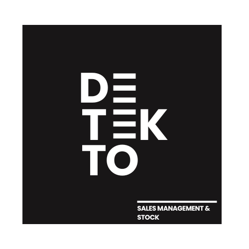
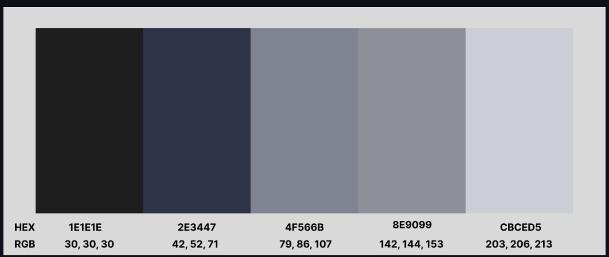
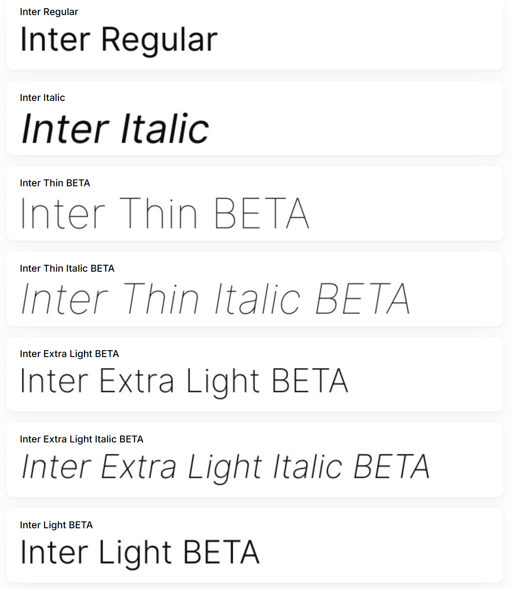
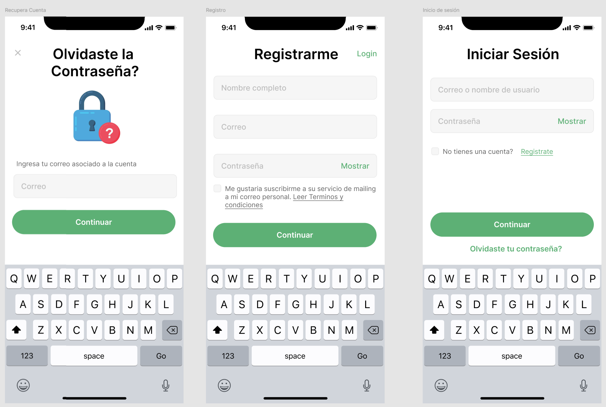
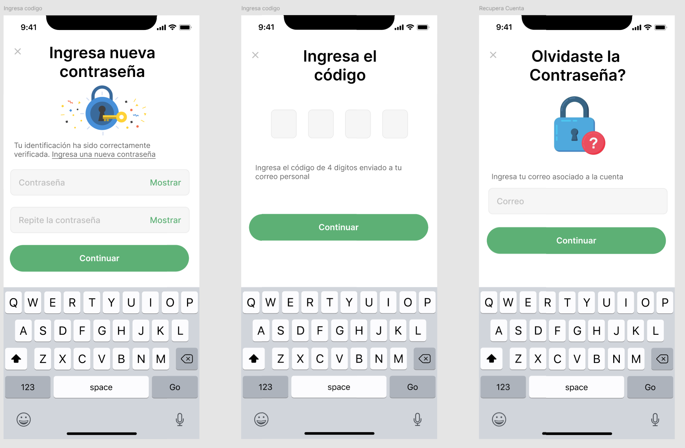
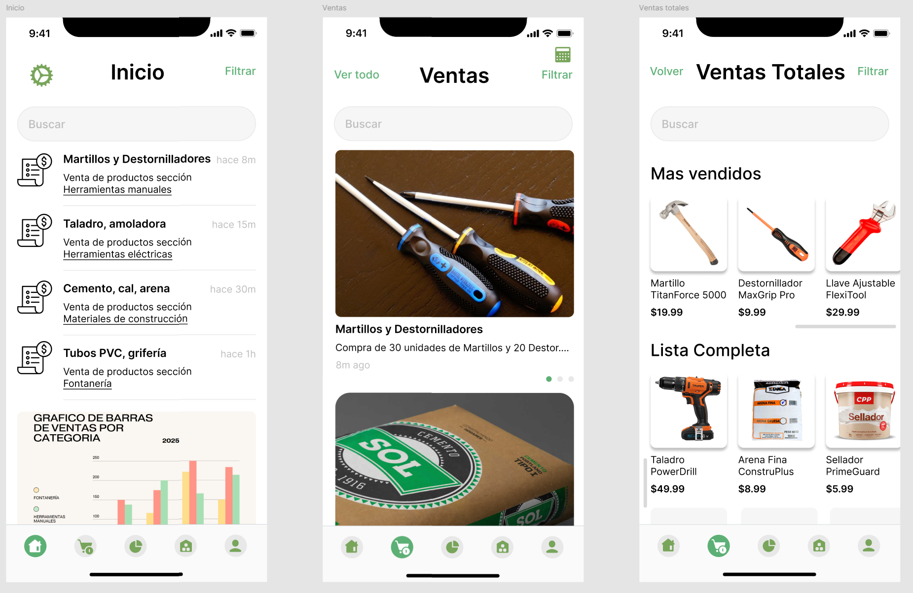
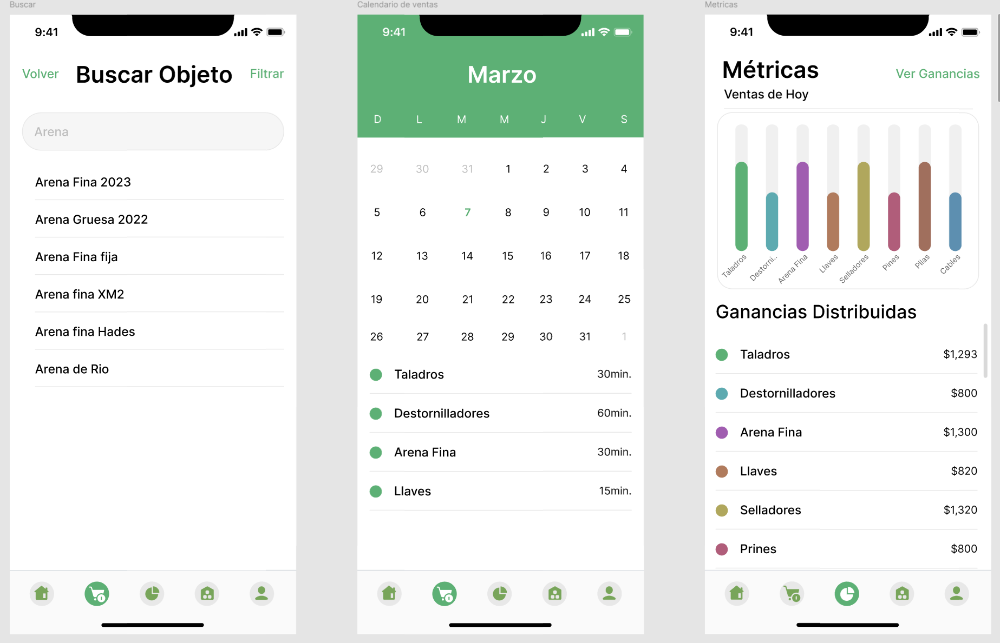
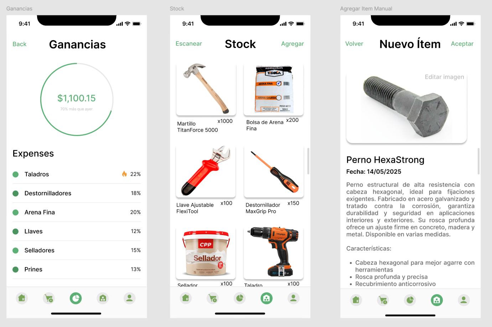
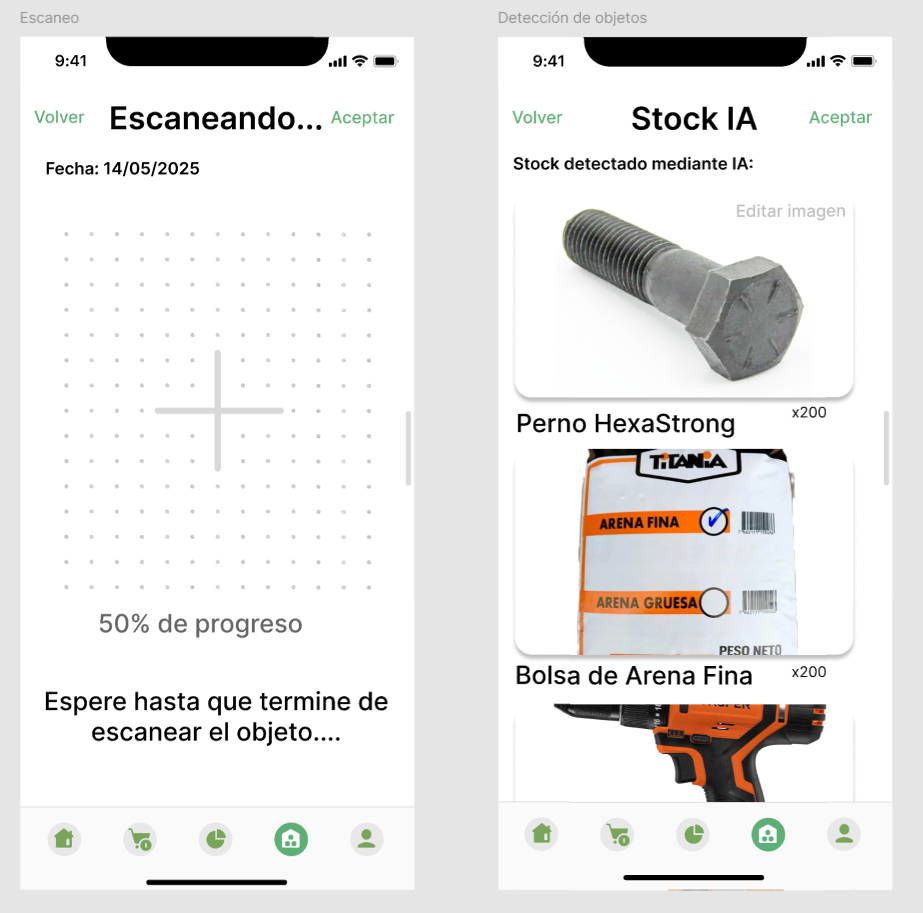
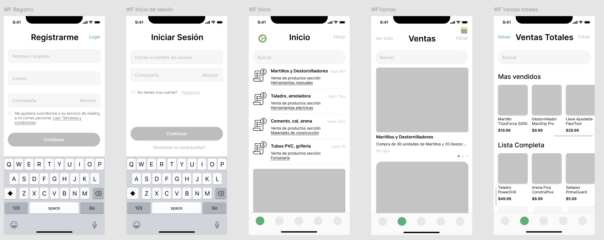

# Softwarinos - Report

  

# Universdiad Peruana de Ciencias Aplicadas

# INGENIERÍA DE SOFTWARE

### Ciclo: 8

## CURSO: Arquitecturas De Software Emergentes | SECCIÓN 4253

Profesor: De Los Rios Fernandez, Christian Luis

# Proyecto de curso

## Informe de Trabajo Final

#### StartUp: Softwarinos

#### Producto: Detekto

### Integrantes:

| Integrantes                            | Codigo     |
| -------------------------------------- | ---------- |
|  Ampudia Flores, Jose Carlos Isaac| u202112936 |
|  De La Piedra Quintanilla, Erwin Miquel      | U202112179 |
|  Elsner De La Torre Ugarte, Julio Esteban         | u202111654 |
| Gutierrez Zumaeta, Manuel Alonso           | U202112353 |

#### Ciclo 2025-10

##### Abril, 2025

---

# Registro de Versiones del informe

| Versión | Fecha | Autor | Descripción de modificación |
|---------|-------|--------|------------------------------|
| 0.1     |       |        |                              |
| 0.2     |       |        |                              |
| 0.3     |       |        |                              |
| 0.4     |       |        |                              |
| 0.5     |       |        |                              |

# Project Report Collaboration Insights
Para el desarrollo del proyecto, se ha utilizado la plataforma de GitHub para el control correcto de versiones y la colaboración de los integrantes del equipo. A continuación se presenta el link directo a la organización del equipo:

**Link de organización Softwarinos:**  
[https://github.com/Emergentes-Softwarinos](https://github.com/Emergentes-Softwarinos)

## TB1

Para la entrega de la TB1 se realizó una reunión donde se asignaron las responsabilidades a cada integrante del equipo. A continuación se muestra la siguiente tabla con los detalles:

| Integrante           | Responsabilidad |
|----------------------|-----------------|
| José Ampudia         |                 |
| Manuel Gutierrez     |                 |
| Miquel De la Piedra  |                 |
| Julio De la Torre    |   Diagrama C4 Y todos sus aspectos              |

Durante la elaboración de las aplicaciones, tanto web como mobile, se realizaron *commits* respectivos con el fin de mantener el orden y un control de versiones eficiente.

Para tener mejor precisión en los integrantes del equipo, a continuación presentamos los usuarios de GitHub de los integrantes:

- José Ampudia (@IsaacAmp24)  
- Manuel Gutierrez (@ManuGZ)  
- Miquel De la Piedra (@MiquelDlp)  
- Julio De la Torre (@)  

A continuación se presentan las capturas del repositorio de GitHub donde se realizaron los avances correspondientes.

# Tabla de contenidos

# Studen Outcome

# Capítulo I: Introducción
## 1.1. Startup Profile
### 1.1.1. Descripción de la Startup
### 1.1.2. Perfiles de integrantes del equipo
## 1.2. Solution Profile
### 1.2.1 Antecedentes y problemática
### 1.2.2 Lean UX Process.
#### 1.2.2.1. Lean UX Problem Statements.
#### 1.2.2.2. Lean UX Assumptions.
#### 1.2.2.3. Lean UX Hypothesis Statements.
#### 1.2.2.4. Lean UX Canvas.
## 1.3. Segmentos objetivo.
# Capítulo II: Requirements Elicitation & Analysis
## 2.1. Competidores.
### 2.1.1. Análisis competitivo.
### 2.1.2. Estrategias y tácticas frente a competidores.
## 2.2. Entrevistas.
### 2.2.1. Diseño de entrevistas.
### 2.2.2. Registro de entrevistas.
### 2.2.3. Análisis de entrevistas.
## 2.3. Needfinding.
### 2.3.1. User Personas.
### 2.3.2. User Task Matrix.
### 2.3.3. Empathy Mapping.
### 2.3.4. As-is Scenario Mapping.
## 2.4. Ubiquitous Language.
# Capítulo III: Requirements Specification
## 3.1. To-Be Scenario Mapping.
## 3.2. User Stories.
## 3.3. Impact Mapping.
## 3.4. Product Backlog.
# Capítulo IV: Strategic-Level Software Design.
## 4.1. Strategic-Level Attribute-Driven Design.
### 4.1.1. Design Purpose.
### 4.1.2. Attribute-Driven Design Inputs.
#### 4.1.2.1. Primary Functionality (Primary User Stories).
#### 4.1.2.3. Constraints.
### 4.1.2.2. Technical Stories
### 4.1.3. Architectural Drivers Backlog.
### 4.1.3. Architectural Drivers Backlog
### 4.1.4. Architectural Design Decisions.
### 4.1.4. Architectural Design Decisions
### 4.1.5. Quality Attribute Scenario Refinements.
### 4.1.5. Quality Attribute Scenario Refinements
## 4.2. Strategic-Level Domain-Driven Design.
### 4.2.1. EventStorming.
### 4.2.2. Candidate Context Discovery.
### 4.2.3. Domain Message Flows Modeling.
### 4.2.4. Bounded Context Canvases.
### 4.2.5. Context Mapping.
## 4.3. Software Architecture.
### 4.3.1. Software Architecture System Landscape Diagram.
### 4.3.1. Software Architecture Context Level Diagrams.
### 4.3.2. Software Architecture Container Level Diagrams.
### 4.3.3. Software Architecture Deployment Diagrams.

# Capítulo V: Tactical-Level Software Design.
## 5.1. Bounded Context: IAM
### 5.1.1. Domain Layer.
En la capa de dominio del contexto de IAM de la aplicacion, se definen las entidades del usuario y roles. El usuario representa a diferentes tipos de usuarios que interactuan con la aplicacion. Los roles definen los permisos y privilegios de cada usuario.

### Aggregate 1: Usuario

| **Nombre** | **Categoría** | **Proposito** |
|------------|----------------|----------------|
| Usuario    | Entidad        | Representa a un usuario de la aplicación de Detekto, y contiene información sobre la identidad y los roles del usuario. |

#### Atributos del Usuario

| **Nombre** | **Tipo de dato** | **Visibilidad** | **Descripción** |
|------------|------------------|-----------------|-----------------|
| id         | UUID             | Privado         | Identificador único del usuario. |
| nombre     | String           | Privado         | Nombre del usuario. |
| email      | String           | Privado         | Correo electrónico del usuario. |
| password   | String           | Privado         | Contraseña del usuario. |
| fechaCreacion | DateTime      | Privado         | Fecha de creación del usuario. |

#### Metodos del Usuario

| **Nombre** | **Tipo de retorno** | **Visibilidad** | **Descripción** |
|------------|---------------------|-----------------|-----------------|
| Constructor | Void | Public | Constructor de la clase Usuario. |
| authenticateUser | Boolean | Public | Autentica al usuario utilizando su correo electrónico y contraseña. |

### Aggregate 2: Role

| **Nombre** | **Categoría** | **Proposito** |
|------------|----------------|----------------|
| Role       | Entidad        | Representa un rol de usuario en la aplicación de Detekto, y contiene información sobre los permisos asociados a ese rol. |

#### Atributos del Role

| **Nombre** | **Tipo de dato** | **Visibilidad** | **Descripción** |
|------------|------------------|-----------------|-----------------|
| id         | UUID             | Privado         | Identificador único del rol. |
|
| nombre     | String           | Privado         | Nombre del rol. |
| permisos   | List<String>     | Privado         | Lista de permisos asociados al rol. |

#### Metodos del Role

| **Nombre** | **Tipo de retorno** | **Visibilidad** | **Descripción** |
|------------|---------------------|-----------------|-----------------|
| Constructor | Void | Public | Constructor de la clase Role. |
| addPermission | Void | Public | Agrega un permiso al rol. |
| getPermissions | List<String> | Public | Devuelve la lista de permisos asociados al rol. |

### 5.1.2. Interface Layer.
En la capa de interfaz del contexto de IAM de la aplicacion, se definen los controladores y servicios que manejan las solicitudes y respuestas de la API. Los controladores son responsables de recibir las solicitudes HTTP y devolver las respuestas correspondientes.

### Controller 1: UsersController

| **Nombre** | **Categoría** | **Proposito** |
|------------|----------------|----------------|
| UsersController | Controlador | Maneja las solicitudes relacionadas con los usuarios, como la autenticación y la creación de nuevos usuarios. |

#### Atributos del UsersController

| **Nombre** | **Tipo de dato** | **Visibilidad** | **Descripción** |
|------------|------------------|-----------------|-----------------|
| userService | UserService     | Privado         | Servicio que maneja la lógica de negocio relacionada con los usuarios. |
| roleService | RoleService     | Privado         | Servicio que maneja la lógica de negocio relacionada con los roles. |

#### Metodos del UsersController

| **Nombre** | **Tipo de retorno** | **Visibilidad** | **Descripción** |
|------------|---------------------|-----------------|-----------------|
| authenticateUser | ResponseEntity | Public | Metodo para el inicio de sesion de un usuario usando credenciales y devuelve un token JWT. |
| registerUser | ResponseEntity | Public | Metodo para registrar un nuevo usuario en la aplicacion. |
| getAllUsers | ResponseEntity | Public | Metodo para obtener todos los usuarios registrados en la aplicacion. |
| getUserById | ResponseEntity | Public | Metodo para obtener un usuario por su ID. |
| updateUser | ResponseEntity | Public | Metodo para actualizar la informacion de un usuario. |
| deleteUser | ResponseEntity | Public | Metodo para eliminar un usuario de la aplicacion. |
| getUserRoles | ResponseEntity | Public | Metodo para obtener los roles de un usuario. |

### Controller 2: RolesController

| **Nombre** | **Categoría** | **Proposito** |
|------------|----------------|----------------|
| RolesController | Controlador | Maneja las solicitudes relacionadas con los roles, como la creación y asignación de roles a usuarios. |

#### Atributos del RolesController

| **Nombre** | **Tipo de dato** | **Visibilidad** | **Descripción** |
|------------|------------------|-----------------|-----------------|
| roleService | RoleService     | Privado         | Servicio que maneja la lógica de negocio relacionada con los roles. |
| userService | UserService     | Privado         | Servicio que maneja la lógica de negocio relacionada con los usuarios. |

#### Metodos del RolesController

| **Nombre** | **Tipo de retorno** | **Visibilidad** | **Descripción** |
|------------|---------------------|-----------------|-----------------|
| getAllRoles | ResponseEntity | Public | Metodo para obtener todos los roles disponibles en la aplicacion. |
| assignRoleToUser | ResponseEntity | Public | Metodo para asignar un rol a un usuario. |
| removeRoleFromUser | ResponseEntity | Public | Metodo para eliminar un rol de un usuario. |

### 5.1.3. Application Layer.
En la capa de aplicacion del contexto de IAM de la aplicacion, se definen los servicios que manejan la logica de negocio relacionada con los usuarios y roles. Estos servicios son utilizados por los controladores para realizar las operaciones necesarias.

### Service 1: UserService
| **Nombre** | **Categoría** | **Proposito** |
|------------|----------------|----------------|
| UserService | Servicio       | Maneja la logica de negocio relacionada con los usuarios, como la autenticacion y la gestion de usuarios. |

### Atributos del UserService

| **Nombre** | **Tipo de dato** | **Visibilidad** | **Descripción** |
|------------|------------------|-----------------|-----------------|
| userRepository | UserRepository | Privado         | Repositorio que maneja la persistencia de los usuarios. |
| passwordEncoder | PasswordEncoder | Privado         | Codificador de contraseñas para la autenticacion de usuarios. |
| jwtHandler | JwtHandler | Privado         | Manejador de tokens JWT para la autenticacion de usuarios. |

#### Metodos del UserService

| **Nombre** | **Tipo de retorno** | **Visibilidad** | **Descripción** |
|------------|---------------------|-----------------|-----------------|
| authenticateUser | User | Public | Autentica a un usuario utilizando su correo electronico y contraseña. |
| registerUser | User | Public | Registra un nuevo usuario en la aplicacion. |
| getAllUsers | List<User> | Public | Devuelve todos los usuarios registrados en la aplicacion. |
| updateUser | User | Public | Actualiza la informacion de un usuario. |
| deleteUser | Void | Public | Elimina un usuario de la aplicacion. |
| getUserById | User | Public | Devuelve un usuario por su ID. |
| getUserByEmail | User | Public | Devuelve un usuario por su correo electronico. |
| getUserRoles | List<Role> | Public | Devuelve los roles de un usuario. |
| assignRoleToUser | Void | Public | Asigna un rol a un usuario. |

#### Service 2: RoleService

| **Nombre** | **Categoría** | **Proposito** |
|------------|----------------|----------------|
| RoleService | Servicio       | Maneja la logica de negocio relacionada con los roles, como la creacion y asignacion de roles a usuarios. |

#### Atributos del RoleService

| **Nombre** | **Tipo de dato** | **Visibilidad** | **Descripción** |
|------------|------------------|-----------------|-----------------|
| roleRepository | RoleRepository | Privado         | Repositorio que maneja la persistencia de los roles. |

#### Metodos del RoleService

| **Nombre** | **Tipo de retorno** | **Visibilidad** | **Descripción** |
|------------|---------------------|-----------------|-----------------|
| getAllRoles | List<Role> | Public | Devuelve todos los roles disponibles en la aplicacion. |
| assignRoleToUser | Void | Public | Asigna un rol a un usuario. |
| removeRoleFromUser | Void | Public | Elimina un rol de un usuario. |

### 5.1.4. Infrastructure Layer.
En la capa de infraestructura del contexto de IAM de la aplicacion, se definen los repositorios que manejan la persistencia de los usuarios y roles. Estos repositorios son utilizados por los servicios para realizar las operaciones necesarias.

### Repository 1: UserRepository

| **Nombre** | **Categoría** | **Proposito** |
|------------|----------------|----------------|
| UserRepository | Repositorio    | Maneja la persistencia de los usuarios en la base de datos. |

#### Metodos del UserRepository

| **Nombre** | **Tipo de retorno** | **Visibilidad** | **Descripción** |
|------------|---------------------|-----------------|-----------------|
| findByEmail | User | Public | Busca un usuario por su correo electronico. |
| findById | User | Public | Busca un usuario por su ID. |
| existsByEmail | Boolean | Public | Verifica si un usuario existe por su correo electronico. |
| save | User | Public | Guarda un usuario en la base de datos. |
| delete | Void | Public | Elimina un usuario de la base de datos. |

### Repository 2: RoleRepository

| **Nombre** | **Categoría** | **Proposito** |
|------------|----------------|----------------|
| RoleRepository | Repositorio    | Maneja la persistencia de los roles en la base de datos. |

#### Metodos del RoleRepository

| **Nombre** | **Tipo de retorno** | **Visibilidad** | **Descripción** |
|------------|---------------------|-----------------|-----------------|
| findById | Role | Public | Busca un rol por su ID. |
| findByName | Role | Public | Busca un rol por su nombre. |
| save | Role | Public | Guarda un rol en la base de datos. |
| deleteById | Void | Public | Elimina un rol de la base de datos. |

### 5.1.6. Bounded Context Software Architecture Component Level Diagrams.
Esta seccion presenta los diagramas de componentes de la arquitectura de software del contexto de IAM. Estos diagramas muestran la estructura y las relaciones entre los diferentes componentes del sistema.

### 5.1.7. Bounded Context Software Architecture Code Level Diagrams.
#### 5.1.7.1. Bounded Context Domain Layer Class Diagrams.
#### 5.1.7.2. Bounded Context Database Design Diagram.

## 5.2. Bounded Context: OBJECT RECOGNITION
### 5.2.1. Domain Layer.
### 5.2.2. Interface Layer.
### 5.2.3. Application Layer.
### 5.2.4. Infrastructure Layer.
### 5.2.6. Bounded Context Software Architecture Component Level Diagrams.
### 5.2.7. Bounded Context Software Architecture Code Level Diagrams.
#### 5.2.7.1. Bounded Context Domain Layer Class Diagrams.
#### 5.2.7.2. Bounded Context Database Design Diagram.

## 5.3. Bounded Context: SALES
### 5.3.1. Domain Layer.
### 5.3.2. Interface Layer.
### 5.3.3. Application Layer.
### 5.3.4. Infrastructure Layer.
### 5.3.6. Bounded Context Software Architecture Component Level Diagrams.
### 5.3.7. Bounded Context Software Architecture Code Level Diagrams.
#### 5.3.7.1. Bounded Context Domain Layer Class Diagrams.
#### 5.3.7.2. Bounded Context Database Design Diagram.

## 5.4. Bounded Context: NOTIFICATIONS
### 5.4.1. Domain Layer.
### 5.4.2. Interface Layer.
### 5.4.3. Application Layer.
### 5.4.4. Infrastructure Layer.
### 5.4.6. Bounded Context Software Architecture Component Level Diagrams.
### 5.4.7. Bounded Context Software Architecture Code Level Diagrams.
#### 5.4.7.1. Bounded Context Domain Layer Class Diagrams.
#### 5.4.7.2. Bounded Context Database Design Diagram.

## 5.5. Bounded Context: TRACKING & MONITORING
### 5.5.1. Domain Layer.
### 5.5.2. Interface Layer.
### 5.5.3. Application Layer.
### 5.5.4. Infrastructure Layer.
### 5.5.6. Bounded Context Software Architecture Component Level Diagrams.
### 5.5.7. Bounded Context Software Architecture Code Level Diagrams.
#### 5.5.7.1. Bounded Context Domain Layer Class Diagrams.
#### 5.5.7.2. Bounded Context Database Design Diagram.

# Capítulo VI: Solution UX Design
## 6.1. Style Guidelines.
En esta sección se definirán las guías visuales clave para el diseño de DETEKTO, incluyendo colores, tipografía, logotipo y tono de comunicación. Estos lineamentos asegurarán una identidad coherente y profesional que refleje los valores de confianza e innovación de la marc
### 6.1.1. General Style Guidelines.
Es fundamental considerar las decisiones y elementos visuales que respaldan los principios generales de diseño para DETEKTO. Por esta razón, resulta esencial definir aspectos clave como la identidad de marca, la paleta de colores y la tipografía. Además, es necesario establecer el tono de comunicación y el lenguaje utilizado, que abarcan características como divertido o serio, formal o casual, respetuoso o irreverente, y entusiasta o sereno.
### 6.1.2. Web, Mobile & Devices Style Guidelines.

  

DETEKTO representa innovación, confianza y eficiencia en la gestión y ventas y stock con reconocimiento por objetos con IA. Nuestra esencia radica en ofrecer soluciones tecnológicas modernas que permiten monitorear, optimizar y mejorar sus ventas. La marca es sinónimo de precisión, confiabilidad y una experiencia de usuario simplificada, orientada a un entorno urbano inteligente.

Logotipo: El logotipo de DETEKTO refleja la identidad de una marca moderna, segura y tecnológica. Mediante una combinación de colores vivos y un diseño minimalista pero sofisticado, el logo simboliza la eficiencia, la confianza y el uso de tecnología de vanguardia en la vigilancia de parqueo. Este logotipo debe transmitir una imagen clara de control, innovación y accesibilidad para usuarios y operadores.
Colores:

  

Se ha utilizado los colores blanco, negro y azul oscuro como colores principales para nuestro diseño.
🔵 Azul oscuro (#2E3447): El color azul oscuro se utiliza como color principal de la marca, aportando confianza, seguridad y modernidad. Representa la tecnología y la eficiencia que caracterizan a DETEKTO en su enfoque hacia la optimización del estacionamiento urbano. Es protagonista en los botones principales, encabezados y elementos destacados de la interfaz.

⚪ Blanco (#FFFFFF): El blanco se emplea como color de fondo predominante, transmitiendo limpieza, claridad y simplicidad en la experiencia del usuario. Sirve como base para resaltar los demás colores y garantizar una lectura fluida, orden visual y una navegación intuitiva.

⚫ Gris (#4F566B / #8E9099): Los tonos grises se utilizan para los textos secundarios, bordes de campos de entrada, íconos y elementos informativos. Brindan equilibrio visual, profesionalismo y elegancia. Este color apoya al azul oscuro sin competir con él, manteniendo una estética sobria y tecnológica.

Tipografía:

  

La tipografía utilizada para DETEKTO es Inter , la cual es, moderna y legible, con líneas limpias y claras. Se ha elegido una fuente que refleje la tecnología y la seguridad de la marca, mientras mantiene un aspecto novedoso y actual. Usaremos las variantes Regular, Medium, Semi-Bold y Bold.

Tonos de Comunicación:

- Formal / Confiable: En DETEKTO adoptamos un tono formal y profesional que transmite confianza y responsabilidad, especialmente en lo relacionado a la seguridad del usuario y la gestión de sus reservas. Sin embargo, mantenemos una comunicación cercana y comprensible, accesible para todos los usuarios que buscan una solución eficiente para estacionar.

- Respetuoso / Cercano: Siempre nos comunicamos con respeto, claridad y empatía. Entendemos las frustraciones comunes en la búsqueda de estacionamiento y respondemos con soluciones y mensajes que conectan con las verdaderas necesidades de nuestros usuarios, manteniendo una relación transparente y honesta.

- Entusiasta / Sereno: Transmitimos entusiasmo por cambiar la forma en que las personas se estacionan en la ciudad, destacando nuestra innovación tecnológica y eficiencia. Al mismo tiempo, mantenemos un tono sereno y confiable que le brinda al usuario la tranquilidad de saber que su experiencia con DETEKTOUp será rápida, segura y sin complicaciones.

## 6.2. Information Architecture.
### 6.2.2. Labeling Systems.

En esta sección se presenta el sistema de etiquetado que Detekto utilizará para facilitar la comprensión y navegación dentro de la plataforma, tanto en la aplicación como en la landing page. Los encabezados estarán organizados de forma clara, accesible y adaptada a los distintos perfiles de usuarios.

Inicio/Home: Vista principal con acceso a funcionalidades clave, como escaneo de productos, sincronización de stock, historial de ventas y alertas de inventario. Se incluirá una introducción breve sobre la misión de Detekto: optimizar la gestión de ventas y control de inventario en tiempo real usando tecnologías inteligentes.

Funcionalidades/Features: Se describirán las principales funcionalidades, como el reconocimiento automático de objetos, actualización en tiempo real del stock, generación de reportes de ventas, integración con sistemas de gestión y facilidad de uso para pequeños y medianos negocios. También se destacará el valor agregado de la automatización del proceso de inventariado mediante escaneo móvil.

Preguntas Frecuentes/FAQs: Se responderán preguntas comunes sobre cómo registrarse, realizar escaneos, sincronizar datos con sistemas externos, revisar el historial de stock y ventas, así como la configuración de notificaciones automáticas.

Contáctanos/Contact Us: Incluirá canales de atención como correo electrónico, WhatsApp y un formulario de contacto directo para soporte técnico o consultas comerciales.

### 6.2.3. Searching Systems.

En esta sección se presenta el sistema de etiquetado que <strong>Detekto</strong> utilizará para facilitar la comprensión y navegación dentro de la plataforma, tanto en la aplicación como en la landing page. Los encabezados estarán organizados de forma clara, accesible y adaptada a los distintos perfiles de usuarios.

<strong>Inicio/Home:</strong> Vista principal con acceso a funcionalidades clave, como escaneo de productos, sincronización de stock, historial de ventas y alertas de inventario. Se incluirá una introducción breve sobre la misión de Detekto: optimizar la gestión de ventas y control de inventario en tiempo real usando tecnologías inteligentes.

<strong>Funcionalidades/Features:</strong> Se describirán las principales funcionalidades, como el reconocimiento automático de objetos, actualización en tiempo real del stock, generación de reportes de ventas, integración con sistemas de gestión y facilidad de uso para pequeños y medianos negocios. También se destacará el valor agregado de la automatización del proceso de inventariado mediante escaneo móvil.

<strong>Preguntas Frecuentes/FAQs:</strong> Se responderán preguntas comunes sobre cómo registrarse, realizar escaneos, sincronizar datos con sistemas externos, revisar el historial de stock y ventas, así como la configuración de notificaciones automáticas.

<strong>Contáctanos/Contact Us:</strong> Incluirá canales de atención como correo electrónico, WhatsApp y un formulario de contacto directo para soporte técnico o consultas comerciales.

<strong>5.2.3. SEO Tags and Meta Tags</strong> 
Para optimizar la visibilidad de <strong>Detekto</strong> en los motores de búsqueda, se definirán las siguientes etiquetas SEO y metadatos para su landing page:

<strong>Title:</strong> Detekto | Gestión inteligente de stock y ventas con escaneo móvil. 
<strong>Description:</strong> Detekto - Escanea, reconoce productos y actualiza tu inventario en tiempo real desde tu celular. 
<strong>Keywords:</strong> gestión de ventas, control de stock, escaneo de productos, inventario inteligente, reconocimiento de objetos, Detekto app. 
<strong>Author:</strong> Detekto Team 
<strong>Canonical:</strong> [URL principal de la landing page, por definir]

<strong>6.2.3. Searching Systems</strong> 
El sistema de búsqueda en <strong>Detekto</strong> ha sido diseñado para brindar rapidez, precisión y facilidad de uso, adaptándose a las necesidades operativas de usuarios que gestionan inventario desde dispositivos móviles. Existen dos modalidades principales de búsqueda implementadas dentro de la plataforma:

<strong>1. Búsqueda por escaneo (Scan-to-Search)</strong> 
El núcleo de Detekto es su sistema de reconocimiento de objetos mediante cámara o escáner móvil. Al escanear un producto, el sistema:
<ul>
<li>Reconoce el objeto utilizando visión por computadora y machine learning.</li>
<li>Busca automáticamente el producto en la base de datos del inventario.</li>
<li>Devuelve los datos asociados, como nombre del producto, cantidad en stock, precio, historial de ventas y alertas relacionadas.</li>
</ul>
Esta búsqueda es ideal para situaciones de alta rotación de productos o actualización inmediata de inventario.

<strong>2. Búsqueda textual (Text Search)</strong> 
La aplicación también permite la búsqueda manual mediante texto para mayor flexibilidad. El usuario puede introducir:
<ul>
<li>Nombre del producto.</li>
<li>Código SKU.</li>
<li>Categoría o etiqueta personalizada.</li>
</ul>
El motor de búsqueda implementa funcionalidades de <em>autocompletado</em>, <em>tolerancia a errores tipográficos (fuzzy search)</em> y <em>filtros por estado de stock</em>, lo que facilita encontrar productos incluso en catálogos extensos.

<strong>Características adicionales:</strong>
<ul>
<li>Historial de búsquedas recientes.</li>
<li>Resultados ordenados por relevancia y frecuencia de actualización.</li>
<li>Acceso rápido desde la barra de navegación superior.</li>
</ul>
Estas funcionalidades permiten que tanto operadores de almacén como encargados de ventas accedan de forma inmediata a la información necesaria, optimizando la toma de decisiones y reduciendo errores operativos.

### 6.2.4. SEO Tags and Meta Tags.

Para optimizar la visibilidad de Detekto en los motores de búsqueda, se definirán las siguientes etiquetas SEO y metadatos para su landing page:

Title: Detekto | Gestión inteligente de stock y ventas con escaneo móvil.

Description: Detekto - Escanea, reconoce productos y actualiza tu inventario en tiempo real desde tu celular.

Keywords: gestión de ventas, control de stock, escaneo de productos, inventario inteligente, reconocimiento de objetos, Detekto app.

Author: Detekto Team

Canonical: [URL principal de la landing page, por definir]

### 6.2.5. Navigation Systems.

La navegación en <strong>Detekto</strong> se diseñará para ofrecer una experiencia fluida, intuitiva y centrada en las tareas más frecuentes del usuario relacionadas con la gestión de ventas e inventario.

<strong>Menú de navegación principal:</strong> Estará disponible en la parte inferior (en dispositivos móviles) o lateral (en tabletas), con acceso directo a secciones como “Inicio”, “Escanear Producto”, “Inventario”, “Ventas”, “Alertas” y “Perfil”. Este menú prioriza las acciones operativas más comunes en el flujo de trabajo de supervisores y vendedores.

<strong>Búsqueda centralizada:</strong> Se incluirá un campo de búsqueda visible y accesible desde la pantalla principal para localizar rápidamente productos por nombre, código SKU o categoría. También podrá activarse el escáner directamente desde esta barra de búsqueda.

<strong>Botones de acción estratégicos (CTAs):</strong> Botones como “Escanear Ahora”, “Actualizar Stock”, “Registrar Venta”, “Enviar Reporte” y “Ver Detalles” estarán claramente identificados y ubicados en lugares clave dentro de cada flujo, facilitando la interacción eficiente con la aplicación.

<strong>Navegación coherente y simplificada:</strong> Toda la plataforma mantendrá una estructura de navegación consistente, con iconografía clara, rutas predecibles, menú de retroceso accesible y jerarquías visuales definidas. Esto permite que tanto nuevos usuarios como operadores experimentados puedan moverse rápidamente dentro de la aplicación sin curva de aprendizaje significativa.

## 6.3. Landing Page UI Design.

**...:**

### 6.3.1. Landing Page Wireframe.
### 6.3.2. Landing Page Mock-up.
## 6.4. Applications UX/UI Design.

**Incia sesion, Registrom, Recupera tu cuenta:**

  

 

**Recupera tu cuenta:**

  

 

**Inicio y Ventas:**

  

 

**Buscar Objeto y Métricas**

  

 

**Ganancias, Stock y Agregar Ítem:**

  

 

**Escaneo de objetos, Stock IA:**

  

 

**Perfil:**

  

 

### 6.4.1. Applications Wireframes.

**PAGINA 1:**

  

 

**PAGINA 2:**

  

 

### 6.4.2. Applications Wireflow Diagrams.

### 6.4.2. Applications Mock-ups.
### 6.4.3. Applications User Flow Diagrams.
## 6.5. Applications Prototyping.
