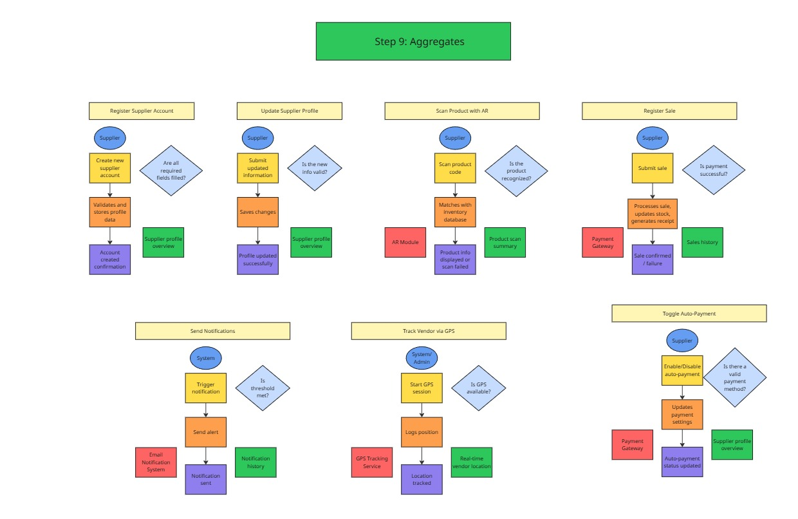
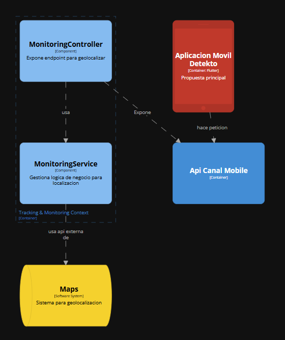

# Softwarinos - Report

<p align="center">
  
</p>

# Universdiad Peruana de Ciencias Aplicadas

# INGENIERÍA DE SOFTWARE

### Ciclo: 8

## CURSO: Arquitecturas De Software Emergentes | SECCIÓN 4253

Profesor: De Los Rios Fernandez, Christian Luis

# Proyecto de curso

## Informe de Trabajo Final

#### StartUp: Softwarinos

#### Producto: Detekto

### Integrantes:

| Integrantes                            | Codigo     |
| -------------------------------------- | ---------- |
| Ampudia Flores, Jose Carlos Isaac      | u202112936 |
| De La Piedra Quintanilla, Erwin Miquel | U202112179 |
| Elsner De La Torre Ugarte              | u202111654 |
| Gutierrez Zumaeta, Manuel Alonso       | U202112353 |

#### Ciclo 2025-10

##### Mayo, 2025

---

# Registro de Versiones del informe

| Versión | Fecha      | Autor                          | Descripción de modificación                                                                                                                                |
| ------- | ---------- | ------------------------------ | ---------------------------------------------------------------------------------------------------------------------------------------------------------- |
| 0.1     | 19-04-2025 | Manuel Gutierrez               | Redacción de Student Outcome, Startup Profile, Descripción de la Startup y Perfiles del equipo.                                                            |
| 0.2     | 21-04-2025 | Jose Ampudia                   | Elaboración del Solution Profile: Antecedentes, Problemática, Lean UX Process (Problem Statements, Assumptions, Hypotheses, Canvas).                       |
| 0.3     | 22-04-2025 | Miquel De la Piedra            | Desarrollo de Segmentos Objetivo, análisis de Competidores, estrategias y tácticas frente a la competencia.                                                |
| 0.4     | 23-04-2025 | Julio Elsner                   | Diseño de entrevistas, registro de entrevistas y análisis de entrevistas.                                                                                  |
| 0.5     | 24-04-2025 | Manuel Gutierrez               | Elaboración de Needfinding: User Personas, User Task Matrix, Empathy Mapping, As-is Scenario Mapping.                                                      |
| 0.6     | 24-04-2025 | Miquel De la Piedra            | Creación de Ubiquitous Language.                                                                                                                           |
| 0.7     | 25-04-2025 | Julio Elsner                   | Desarrollo del To-Be Scenario Mapping, User Stories e Impact Mapping.                                                                                      |
| 0.8     | 25-04-2025 | Jose Ampudia                   | Construcción del Product Backlog y definición del Strategic-Level Attribute-Driven Design: Design Purpose, Inputs, Constraints, Architectural Drivers.     |
| 0.9     | 26-04-2025 | Manuel Gutierrez               | Desarrollo de EventStorming, Candidate Context Discovery, Domain Message Flows Modeling, Context Mapping.                                                  |
| 1.0     | 26-04-2025 | Jose Ampudia                   | Finalización de Software Architecture: Landscape Diagram, Context Level, Container Level y Deployment Diagrams.                                            |
| 1.1     | 30-04-2025 | Julio Elsner, Manuel Gutierrez | Inicio de redacción del Capítulo V: Tactical-Level Software Design. Revisión de estructura por capas y definición inicial del contexto Object-Recognition. |
| 1.2     | 02-05-2025 | Julio Elsner, Jose Ampudia     | Desarrollo de las secciones Domain Layer e Interface Layer del contexto Object-Recognition.                                                                |
| 1.3     | 10-05-2025 | Manuel Gutierrez, Jose Ampudia | Desarrollo de Application Layer e Infrastructure Layer del contexto Object-Recognition.                                                                    |
| 1.4     | 13-05-2025 | Julio Elsner                   | Redacción del Bounded Context: NOTIFICATIONS. Inicio del Capítulo VI con Style Guidelines y General Style Guidelines.                                      |
| 1.5     | 16-05-2025 | Miquel De la Piedra            | Redacción de Web, Mobile & Devices Style Guidelines, y desarrollo de Labeling, Searching y SEO Tags Systems.                                               |
| 1.6     | 17-05-2025 | Jose Ampudia                   | Avance en Navigation Systems, Landing Page Wireframe y Mock-up. Diseño de Applications Wireframes y Wireflow Diagrams.                                     |

# Project Report Collaboration Insights

Para el desarrollo del proyecto, se ha utilizado la plataforma de GitHub para el control correcto de versiones y la colaboración de los integrantes del equipo. A continuación se presenta el link directo a la organización del equipo:

**Link de organización Softwarinos:**  
[https://github.com/Emergentes-Softwarinos](https://github.com/Emergentes-Softwarinos)

## TB1

Para la entrega de la TB1 se realizó una reunión donde se asignaron las responsabilidades a cada integrante del equipo. A continuación se muestra la siguiente tabla con los detalles:

| Integrante          | Responsabilidad                                                                                                                                                                                                                                                                                                                                                                                                      |
| ------------------- | -------------------------------------------------------------------------------------------------------------------------------------------------------------------------------------------------------------------------------------------------------------------------------------------------------------------------------------------------------------------------------------------------------------------- |
| José Ampudia        | Desarrollo del diseño de las entrevistas, registro de entrevistas, Análisis de entrevistas, Needfinding, User Personas, User Task Matrix, Empathy Mapping, As-Is Scenario Mapping, Ubiquitous Language, To-Be Scenario Mapping y User Stories                                                                                                                                                                        |
| Manuel Gutierrez    | Desarrollo de Solution Profile, Antecedentes y problemática, Lean UX Process, Lean UX Problem Statements, Lean UX Assumptions, Lean UX Hypothesis Statements, Lean UX Canvas, Segmentos objetivos, Competidores, Análisis competitivo, Estrategias y tácticas frente a competidorees y Registro de entrevistas                                                                                                       |
| Miquel De la Piedra | Desarrollo del Impact Mapping, Product Backlog, Strategic-Level Attribute-Driven Design, Design Purpose, Attribute-Driven Design Inputs, Primary Functionality (Primary User Stories), Quality attribute Scenarios, Constraints, Architectural Drivers Backlog, Architectural Design Decisions y Quality Attribute Scenario Refinements y Registro de entrevistas                                                    |
| Julio De la Torre   | Desarrollo de Strategic-Level Domain-Driven Design, EventStorming, Candidate Context Discovery, Domain Message Flows Modeling, Bounded Context Canvases, Context Mapping y Software Architecture, Software Architecture System Landscape Diagram, Software Architecture Context Level Diagrams, Software Architecture Container Level Diagrams y Software Architecture Deployment Diagrams y Registro de entrevistas |

## TB2

Para la entrega de la TB2 se realizó una reunión donde se asignaron las responsabilidades a cada integrante del equipo. A continuación se muestra la siguiente tabla con los detalles:
| Integrante | Responsabilidad |
| ------------------- | ---------------------------------------------------------------------------------------------------------------------------------------------------------------------------------------------------------------------------------------------------------------------------------------------------------------------- |
| José Ampudia | Desarrollo de las secciones Domain Layer, Interface Layer, Application Layer e Infrastructure Layer del contexto Object-Recognition. Participación en diseño de Landing Page (wireframe y mock-up), Applications Wireframes y Wireflow Diagrams. |
| Manuel Gutierrez | Redacción inicial del Capítulo V: Tactical-Level Software Design. Participación en la definición del contexto Object-Recognition y desarrollo de Application Layer e Infrastructure Layer. |
| Miquel De la Piedra | Desarrollo de Style Guidelines para Web, Mobile & Devices. Creación de sistemas de etiquetado, búsqueda y SEO (Labeling Systems, Searching Systems y SEO Tags). |
| Julio Elsner | Revisión de estructura por capas y redacción inicial del Capítulo V. Desarrollo del Bounded Context: NOTIFICATIONS. Redacción de General Style Guidelines e inicio del Capítulo VI. Participación en Domain Layer e Interface Layer del contexto Object-Recognition. |

Durante la elaboración de las aplicaciones, tanto web como mobile, se realizaron _commits_ respectivos con el fin de mantener el orden y un control de versiones eficiente.

Para tener mejor precisión en los integrantes del equipo, a continuación presentamos los usuarios de GitHub de los integrantes:

- José Ampudia (@IsaacAmp24)
- Manuel Gutierrez (@ManuGZ)
- Miquel De la Piedra (@MiquelDlp)
- Julio De la Torre (@JulioElsnerDLTU)

A continuación se presentan las capturas del repositorio de GitHub donde se realizaron los avances correspondientes.

# Tabla de contenidos

- [Student Outcome](#student-outcome)

[Capítulo I: Introducción](#capítulo-i-introducción)

- [1.1. Startup Profile](#11-startup-profile)
  - [1.1.1. Descripción de la Startup](#111-descripción-de-la-startup)
  - [1.1.2. Perfiles de integrantes del equipo](#112-perfiles-de-integrantes-del-equipo)
- [1.2. Solution Profile](#12-solution-profile)
  - [1.2.1. Antecedentes y problemática](#121-antecedentes-y-problemática)
  - [1.2.2. Lean UX Process](#122-lean-ux-process)
    - [1.2.2.1. Lean UX Problem Statements](#1221-lean-ux-problem-statements)
    - [1.2.2.2. Lean UX Assumptions](#1222-lean-ux-assumptions)
    - [1.2.2.3. Lean UX Hypothesis Statements](#1223-lean-ux-hypothesis-statements)
    - [1.2.2.4. Lean UX Canvas](#1224-lean-ux-canvas)
- [1.3. Segmentos objetivo](#13-segmentos-objetivo)

[Capítulo II: Requirements Elicitation & Analysis](#capítulo-ii-requirements-elicitation--analysis)

- [2.1. Competidores](#21-competidores)
  - [2.1.1. Análisis competitivo](#211-análisis-competitivo)
  - [2.1.2. Estrategias y tácticas frente a competidores](#212-estrategias-y-tácticas-frente-a-competidores)
- [2.2. Entrevistas](#22-entrevistas)
  - [2.2.1. Diseño de entrevistas](#221-diseño-de-entrevistas)
  - [2.2.2. Registro de entrevistas](#222-registro-de-entrevistas)
  - [2.2.3. Análisis de entrevistas](#223-análisis-de-entrevistas)
- [2.3. Needfinding](#23-needfinding)
  - [2.3.1. User Personas](#231-user-personas)
  - [2.3.2. User Task Matrix](#232-user-task-matrix)
  - [2.3.3. Empathy Mapping](#233-empathy-mapping)
  - [2.3.4. As-is Scenario Mapping](#234-as-is-scenario-mapping)
- [2.4. Ubiquitous Language](#24-ubiquitous-language)

[Capítulo III: Requirements Specification](#capítulo-iii-requirements-specification)

- [3.1. To-Be Scenario Mapping](#31-to-be-scenario-mapping)
- [3.2. User Stories](#32-user-stories)
- [3.3. Impact Mapping](#33-impact-mapping)
- [3.4. Product Backlog](#34-product-backlog)

[Capítulo IV: Strategic-Level Software Design](#capítulo-iv-strategic-level-software-design)

- [4.1. Strategic-Level Attribute-Driven Design](#41-strategic-level-attribute-driven-design)
  - [4.1.1. Design Purpose](#411-design-purpose)
  - [4.1.2. Attribute-Driven Design Inputs](#412-attribute-driven-design-inputs)
    - [4.1.2.1. Primary Functionality (Primary User Stories)](#4121-primary-functionality-primary-user-stories)
    - [4.1.2.2. Quality attribute Scenarios](#4122-quality-attribute-scenarios)
    - [4.1.2.3. Constraints](#4123-constraints)
  - [4.1.3. Architectural Drivers Backlog](#413-architectural-drivers-backlog)
  - [4.1.4. Architectural Design Decisions](#414-architectural-design-decisions)
  - [4.1.5. Quality Attribute Scenario Refinements](#415-quality-attribute-scenario-refinements)
- [4.2. Strategic-Level Domain-Driven Design](#42-strategic-level-domain-driven-design)
  - [4.2.1. EventStorming](#421-eventstorming)
  - [4.2.2. Candidate Context Discovery](#422-candidate-context-discovery)
  - [4.2.3. Domain Message Flows Modeling](#423-domain-message-flows-modeling)
  - [4.2.4. Bounded Context Canvases](#424-bounded-context-canvases)
  - [4.2.5. Context Mapping](#425-context-mapping)
- [4.3. Software Architecture](#43-software-architecture)
  - [4.3.1. Software Architecture System Landscape Diagram](#431-software-architecture-system-landscape-diagram)
  - [4.3.2. Software Architecture Context Level Diagrams](#432-software-architecture-context-level-diagrams)
  - [4.3.3. Software Architecture Container Level Diagrams](#433-software-architecture-container-level-diagrams)
  - [4.3.4. Software Architecture Deployment Diagrams](#434-software-architecture-deployment-diagrams)

### Capítulo V: Tactical-Level Software Design

- [5.X. Bounded Context: Nombre del Contexto](#5x-bounded-context-nombre-del-contexto)
  - [5.X.1. Domain Layer](#5x1-domain-layer)
  - [5.X.2. Interface Layer](#5x2-interface-layer)
  - [5.X.3. Application Layer](#5x3-application-layer)
  - [5.X.4. Infrastructure Layer](#5x4-infrastructure-layer)
  - [5.X.6. Bounded Context Software Architecture Component Level Diagrams](#5x6-bounded-context-software-architecture-component-level-diagrams)
  - [5.X.7. Bounded Context Software Architecture Code Level Diagrams](#5x7-bounded-context-software-architecture-code-level-diagrams)
    - [5.X.7.1. Domain Layer Class Diagrams](#5x71-domain-layer-class-diagrams)
    - [5.X.7.2. Database Design Diagram](#5x72-database-design-diagram)

### Capítulo VI: Solution UX Design

- [6.1. Style Guidelines](#61-style-guidelines)
  - [6.1.1. General Style Guidelines](#611-general-style-guidelines)
  - [6.1.2. Web, Mobile & Devices Style Guidelines](#612-web-mobile--devices-style-guidelines)
- [6.2. Information Architecture](#62-information-architecture)
  - [6.2.2. Labeling Systems](#622-labeling-systems)
  - [6.2.3. Searching Systems](#623-searching-systems)
  - [6.2.4. SEO Tags and Meta Tags](#624-seo-tags-and-meta-tags)
  - [6.2.5. Navigation Systems](#625-navigation-systems)
- [6.3. Landing Page UI Design](#63-landing-page-ui-design)
  - [6.3.1. Landing Page Wireframe](#631-landing-page-wireframe)
  - [6.3.2. Landing Page Mock-up](#632-landing-page-mock-up)
- [6.4. Applications UX/UI Design](#64-applications-uxui-design)
  - [6.4.1. Applications Wireframes](#641-applications-wireframes)
  - [6.4.2. Applications Wireflow Diagrams](#642-applications-wireflow-diagrams)
  - [6.4.3. Applications Mock-ups](#643-applications-mock-ups)
  - [6.4.4. Applications User Flow Diagrams](#644-applications-user-flow-diagrams)
- [6.5. Applications Prototyping](#65-applications-prototyping)

### Capítulo VII: Product Implementation, Validation & Deployment

- [7.1. Software Configuration Management](#71-software-configuration-management)
  - [7.1.1. Development Environment Configuration](#711-development-environment-configuration)
  - [7.1.2. Source Code Management](#712-source-code-management)
  - [7.1.3. Code Style Guide & Conventions](#713-code-style-guide--conventions)
  - [7.1.4. Deployment Configuration](#714-deployment-configuration)
- [7.2. Solution Implementation](#72-solution-implementation)
  - [7.2.X. Sprint n](#72x-sprint-n)
    - [7.2.X.1. Sprint Planning](#72x1-sprint-planning)
    - [7.2.X.2. Sprint Backlog](#72x2-sprint-backlog)
    - [7.2.X.3. Development Evidence](#72x3-development-evidence)
    - [7.2.X.4. Testing Suite Evidence](#72x4-testing-suite-evidence)
    - [7.2.X.5. Execution Evidence](#72x5-execution-evidence)
    - [7.2.X.6. Services Documentation](#72x6-services-documentation)
    - [7.2.X.7. Deployment Evidence](#72x7-deployment-evidence)
    - [7.2.X.8. Team Collaboration Insights](#72x8-team-collaboration-insights)
- [7.3. Validation Interviews](#73-validation-interviews)
  - [7.3.1. Diseño de Entrevistas](#731-diseño-de-entrevistas)
  - [7.3.2. Registro de Entrevistas](#732-registro-de-entrevistas)
  - [7.3.3. Evaluaciones según heurísticas](#733-evaluaciones-según-heurísticas)
- [7.4. Video About-the-Product](#74-video-about-the-product)

### Conclusiones

- [Conclusiones y recomendaciones](#conclusiones-y-recomendaciones)

### Video About-the-Team

- [Video del equipo](#video-del-equipo)

### Bibliografía

- [Referencias](#referencias)

### Anexos

- [Anexos](#anexos)

# Student Outcome

ABET – EAC - Student Outcome 3: Capacidad de comunicarse efectivamente con un
rango de audiencias.

<table>
  <thead>
    <tr>
      <th>Criterio específico</th>
      <th>Acciones realizadas</th>
      <th>Conclusiones</th>
    </tr>
  </thead>
  <tbody>
    <tr>
      <td><strong>Comunica oralmente con efectividad a diferentes rangos de audiencia</strong></td>
      <td>
        <strong>José Ampudia</strong><br />
        <strong>TB1</strong><br />
        Participó activamente en entrevistas con usuarios para la recopilación de información clave sobre necesidades reales. Durante estas sesiones, empleó un lenguaje claro y empático para asegurar la comprensión del propósito del proyecto, facilitando así una retroalimentación útil y precisa.
        <br />
        <strong>TB2</strong><br />
        Explicó verbalmente la estructura y funcionalidad de las capas Domain, Interface, Application e Infrastructure del contexto Object-Recognition durante sesiones técnicas del equipo, logrando que todos comprendieran la relación entre cada componente y su rol en el sistema.
        <br />
        <strong>Manuel Gutierrez</strong><br />
        <strong>TB1</strong><br />
        Comunicó de manera clara la problemática y el enfoque estratégico del proyecto durante las entrevistas con usuarios y discusiones del equipo, asegurando que todos comprendieran la visión general del producto. Además, facilitó sesiones explicativas sobre la propuesta de valor frente a competidores.
        <br />
        <strong>TB2</strong><br />
        Presentó en reuniones del equipo la redacción inicial del Capítulo V, articulando de forma clara cómo se definió el contexto Object-Recognition y las decisiones tomadas sobre la Application Layer e Infrastructure Layer, facilitando su validación por parte de todos los miembros.
        <br /><br />
        <strong>Miquel De la Piedra</strong><br />
        <strong>TB1</strong><br />
        Explicó el propósito y funcionamiento del Impact Mapping a su equipo, así como las decisiones de diseño arquitectónico a nivel estratégico, asegurando que todos los miembros comprendieran la relación entre funcionalidades y metas del proyecto.
        <br />
        <strong>TB2</strong><br />
        Expuso verbalmente las Style Guidelines diseñadas para plataformas Web y Mobile, detallando cómo se aplican los sistemas de etiquetado, búsqueda y SEO en el diseño UX, y resolvió dudas técnicas del equipo para alinear la arquitectura de información con el estilo visual.
        <br /><br />
        <strong>Julio Elsner</strong><br />
        <strong>TB1</strong><br />
        Facilitó el entendimiento de conceptos técnicos complejos como el EventStorming, Candidate Context Discovery y la arquitectura del sistema mediante presentaciones orales y debates dentro del equipo, adaptando el lenguaje técnico según el nivel de conocimiento de la audiencia.
        <br />
        <strong>TB2</strong><br />
        Expuso oralmente el diseño por capas del contexto NOTIFICATIONS, así como la justificación de la redacción inicial del Capítulo VI. Además, facilitó la comunicación entre los miembros para integrar su trabajo con la Domain e Interface Layer del contexto Object-Recognition.
      </td>
      <td>
        Las habilidades de comunicación oral del equipo permitieron un entendimiento claro y compartido del proyecto tanto a nivel técnico como no técnico, mejorando la colaboración con usuarios y entre los miembros del equipo.
      </td>
    </tr>
    <tr>
      <td><strong>Comunica por escrito con efectividad a diferentes rangos de audiencia</strong></td>
      <td>
        <strong>José Ampudia</strong><br />
        <strong>TB1</strong><br />
        Redactó documentos como el análisis de entrevistas, User Personas, y escenarios As-Is/To-Be de forma estructurada y clara, facilitando la comprensión por parte del equipo y stakeholders del contexto del usuario y sus necesidades.
        <br />
        <strong>TB2</strong><br />
        Documentó las capas Domain, Interface, Application e Infrastructure del contexto Object-Recognition con una redacción técnica clara. También aportó en los wireframes y wireflows de las aplicaciones, describiendo los flujos con enfoque funcional y técnico.
        <br /><br />
        <strong>Manuel Gutierrez</strong><br />
        <strong>TB1</strong><br />
        Elaboró entregables como el Lean UX Canvas, Problem Statements y el análisis competitivo con una redacción precisa y orientada a la toma de decisiones estratégicas. Su documentación fue esencial para definir la propuesta de valor del proyecto.
        <br />
        <strong>TB2</strong><br />
        Redactó el borrador estructurado del Capítulo V, describiendo con claridad el enfoque general del diseño táctico. También explicó por escrito las funcionalidades clave de las capas Application e Infrastructure, permitiendo una interpretación consistente por parte de todos.
        <br /><br />
        <strong>Miquel De la Piedra</strong><br />
        <strong>TB1</strong><br />
        Documentó el diseño arquitectónico a través del Attribute-Driven Design y Backlog técnico, asegurando claridad en los lineamientos técnicos para los futuros desarrolladores y partes interesadas.
        <br />
        <strong>TB2</strong><br />
        Escribió las guías de estilo visual y la arquitectura de información para Web y Mobile, incluyendo el desarrollo de los sistemas de etiquetado, búsqueda y SEO. Su redacción estructurada facilitó la implementación posterior por parte del equipo de desarrollo.
        <br /><br />
        <strong>Julio Elsner</strong><br />
        <strong>TB1</strong><br />
        Generó documentación técnica detallada sobre los componentes de la arquitectura del sistema, diagramas y mapeos de contexto, facilitando así la comprensión integral del sistema por parte de audiencias tanto técnicas como no técnicas.
        <br />
        <strong>TB2</strong><br />
        Redactó el contexto NOTIFICATIONS en el Capítulo V, definiendo sus capas y describiendo sus interacciones. También elaboró las secciones introductorias del Capítulo VI, estableciendo las bases conceptuales del diseño UX de forma clara y coherente.
      </td>
      <td>
        La calidad de los entregables escritos permitió transmitir efectivamente tanto el enfoque de usuario como las decisiones técnicas, mejorando la comunicación y coordinación entre todos los actores involucrados.
      </td>
    </tr>
  </tbody>
</table>

# Capítulo I: Introducción

## 1.1. Startup Profile

En esta sección presentaremos la descripción del startup y los perfiles de los miembros del team.

### 1.1.1. Descripción de la Startup

En Softwarinos, estamos desarrollando una solución con respecto al reconocimiento de objetos a través de una aplicación móvil, para facilitar la búsqueda de productos y la venta de estos mismos por parte de vendedores, además de un seguimiento de estas ventas y proyecciones de parte del administrador.

**Misión**: Crear una aplicación móvil que reconozca objetos de forma rápida y precisa, para ayudar a los vendedores a encontrar y vender productos fácilmente, y permitir a los administradores llevar un mejor control de las ventas y hacer proyecciones para su negocio.

**Visión**: Convertirnos en una empresa destacada en soluciones tecnológicas para el comercio, facilitando el trabajo de vendedores y administradores a través de herramientas inteligentes que mejoran la gestión y el crecimiento de sus negocios.

### 1.1.2. Perfiles de integrantes del equipo

| Foto                                                              | Nombre y Descripción                                                                                                                                                                                                                                                                                                                                                                                                                                                                                                       |
| ----------------------------------------------------------------- | -------------------------------------------------------------------------------------------------------------------------------------------------------------------------------------------------------------------------------------------------------------------------------------------------------------------------------------------------------------------------------------------------------------------------------------------------------------------------------------------------------------------------- |
|                         | **Nombre:** Manuel Alonso Gutierrez Zumaeta<br>**Código:** u202112353<br>**Descripción:** Soy Manuel Gutierrez, estudiante de la carrera de Ingeniería de Software, tengo 20 años. Tengo experiencia en el desarrollo de aplicaciones web, tanto frontend como backend, programación móvil en Flutter. Me considero una persona responsable y que se propone hacer un buen trabajo.                                                                                                                                        |
|     | **Nombre:** Julio Elsner De La Torre Ugarte<br>**Código:** u202111654<br>**Descripción:** Estudiante de Ingeniería de software, tengo 21 años. Cuento con experiencia en desarrollo de aplicaciones Web Full Stack (Front, Back-end) y bases de datos. Me considero una persona indagadora y que hace las cosas con una idea plasmada antes de realizarla.                                                                                                                                                                 |
|      | **Nombre:** Erwin Miquel De la Piedra Quintanilla<br>**Código:** u202112179<br>**Descripción:** Soy Miquel De la Piedra, tengo 21 años, estudiante de la carrera de Ingeniería de Software. Poseo conocimientos relacionados a la programación en C++, Python, HTML y CSS. Además poseo experiencia con el manejo de bases de datos. Considero que estos conocimientos ayudarán a la realización de este trabajo, además de mejorar nuestros métodos de organización y trabajo en equipo.                                  |
|  | **Nombre:** José Carlos Isaac Ampudia Flores<br>**Código:** u202112936<br>**Descripción:** Soy estudiante de Ingeniería de Software, con sólida formación en desarrollo Backend utilizando frameworks como Spring Boot. También cuento con conocimientos en el desarrollo Frontend, trabajando con herramientas como Angular. Me caracterizo por mi capacidad para trabajar bajo presión, así como por mi enfoque organizado y metódico, lo que me permite adaptarme correctamente a los desafíos del entorno tecnológico. |

## 1.2. Solution Profile

### 1.2.1 Antecedentes y problemática

- **What (¿Qué?)**  
  El problema principal es la dificultad que enfrentan ferreterías y comercios de productos físicos para identificar, buscar y gestionar herramientas y materiales de forma rápida y precisa. Los sistemas actuales no están adaptados al sector y requieren conocimientos técnicos o procesos manuales lentos.

- **When (¿Cuándo?)**  
  Este problema ocurre diariamente en el momento de la atención al cliente, la búsqueda de productos en almacén, la actualización del inventario y el registro de ventas. Es especialmente crítico durante horas de alta demanda o cuando se requiere atención eficiente.

- **Where (¿Dónde?)**  
  Sucede en ferreterías, depósitos, puntos de venta físicos y almacenes, donde los empleados necesitan reconocer y registrar productos con rapidez, y los administradores requieren visibilidad clara sobre el movimiento de stock y ventas.

- **Who (¿Quién?)**  
  Afecta principalmente a los vendedores que deben identificar productos de forma rápida, a los clientes que experimentan demoras, y a los administradores que necesitan gestionar inventario y ventas sin sistemas complejos.

- **Why (¿Por qué?)**  
  Porque los sistemas actuales como Shopify, Zoho CRM o TradeGecko están diseñados para otros tipos de negocios, no cuentan con funciones de reconocimiento visual, y son demasiado generales o complejos para el día a día de una ferretería tradicional.

- **How (¿Cómo?)**  
  El problema se intenta resolver actualmente con métodos manuales (catálogos impresos, búsqueda visual, listas), aplicaciones genéricas o incluso sin ningún sistema, lo que lleva a errores, pérdida de tiempo y falta de control.

- **How much (¿Cuánto?)**  
  El impacto puede medirse en tiempo perdido (minutos por venta), errores en inventario, insatisfacción del cliente, y pérdida de ventas por no poder identificar o encontrar un producto a tiempo. A nivel económico, esto representa una baja en la eficiencia operativa y en la competitividad del negocio.

### 1.2.2 Lean UX Process.

#### 1.2.2.1. Lean UX Problem Statements.

En las ferreterías, la gestión de productos y la atención al cliente siguen dependiendo en gran medida de métodos tradicionales como la búsqueda manual, el uso de catálogos físicos y sistemas poco especializados. Esta situación genera tiempos de espera prolongados, errores frecuentes en la identificación de productos, una experiencia deficiente para el cliente y una gestión de inventario ineficiente.

Aunque existen plataformas genéricas de ventas y CRM, estas no se adaptan a las particularidades del rubro ferretero. El problema de fondo radica en la falta de soluciones tecnológicas específicas que automaticen y agilicen tareas operativas críticas como la identificación de productos y el control del stock.

Para resolver esta brecha, Detekto propone una solución tecnológica innovadora basada en **tecnologías emergentes** como la **visión computacional**, la **inteligencia artificial** y la **realidad aumentada**. Nuestra aplicación móvil permitirá a los vendedores reconocer herramientas y materiales directamente con la cámara del dispositivo, facilitando el registro de ventas, la gestión de inventario en tiempo real y la generación de reportes automatizados.

Además, Detekto mejorará la coordinación entre vendedores y administradores a través de una interfaz intuitiva, diseñada para entornos de trabajo con alta demanda, ruido y limitaciones técnicas. El enfoque se orienta a ferreterías pequeñas y medianas que buscan digitalizarse sin incurrir en altos costos o en procesos complejos de implementación.

Sabremos que hemos tenido éxito cuando se logre:

- Reducir significativamente los tiempos de atención al cliente.
- Aumentar la precisión del inventario registrado.
- Mejorar la satisfacción tanto del cliente como del personal.
- Observar un incremento en las ventas derivado de procesos más ágiles y eficientes.

#### 1.2.2.2. Lean UX Assumptions.

- **Business Assumptions**

  - Las ferreterías requieren una solución especializada que agilice la identificación de productos y mejore la eficiencia operativa, ya que los sistemas actuales son generalistas y no se adaptan a sus procesos específicos.
  - Una aplicación móvil con reconocimiento visual basado en inteligencia artificial y visión computacional puede reducir significativamente los tiempos de atención al cliente y mejorar la precisión en el registro de ventas e inventario.
  - El modelo de negocio sostenible será mediante suscripciones mensuales, con niveles diferenciados (básico y premium) que incluyan funcionalidades como reportes avanzados y soporte técnico.
  - Las principales soluciones existentes (como Shopify o Zoho CRM) carecen de un enfoque especializado en ferreterías, lo que representa una oportunidad de diferenciación para Detekto.
  - La propuesta de valor de Detekto reside en ofrecer una herramienta intuitiva, eficiente y adaptada al entorno ferretero, que aproveche tecnologías emergentes para resolver tareas repetitivas y propensas a error.

- **User Assumptions**

  - **¿Quién es el usuario?**  
    Vendedores de ferreterías, encargados de atención al cliente, personal de almacén y administradores de pequeños y medianos negocios del rubro.

  - **¿En qué parte de su trabajo encaja Detekto?**  
    Se utiliza en el punto de venta o durante la organización del inventario, donde el tiempo y la precisión son críticos. La app actúa como un asistente digital inmediato.

  - **¿Qué problema resuelve y cómo?**  
    El usuario enfrenta demoras y errores al buscar productos manualmente. Detekto lo soluciona usando visión computacional para identificar herramientas y materiales en segundos, optimizando la atención y reduciendo el margen de error.

  - **¿Cuándo y cómo se usa Detekto?**  
    Durante la jornada laboral, principalmente con smartphones, al interactuar con clientes o al organizar productos en estanterías y almacenes.

  - **¿Qué características son esenciales para el usuario?**  
    Rapidez en el reconocimiento visual, registro automático de productos, generación de reportes, interfaz intuitiva y disponibilidad offline o con conectividad limitada.

  - **¿Cómo debe comportarse la app?**  
    Debe ser robusta y confiable, con una experiencia de usuario optimizada para ambientes dinámicos: botones grandes, flujos de navegación simples, interfaz visual clara y tiempos de respuesta inmediatos.

- **User Benefits**

  - **Reconocimiento automático de productos:**  
    Ahorra tiempo y elimina la necesidad de búsqueda manual en catálogos o bases de datos.

  - **Mejora de la atención al cliente y las ventas:**  
    Permite ofrecer respuestas más rápidas, mejorando la experiencia y acelerando los procesos de compra.

  - **Control eficiente para administradores:**  
    Acceso en tiempo real a métricas clave como productos más vendidos y stock disponible, facilitando la toma de decisiones.

  - **Reducción de errores humanos:**  
    La automatización del reconocimiento disminuye las equivocaciones en el registro y facturación de productos.

  - **Facilidad de adopción:**  
    Pensado para usuarios con bajo nivel de alfabetización digital, lo que garantiza una curva de aprendizaje baja.

---

#### 1.2.2.3. Lean UX Hypothesis Statements.

- **Hipótesis 1**  
  **Creemos que** la experiencia de los vendedores mejorará significativamente si se integra reconocimiento automático de productos mediante la cámara del dispositivo móvil, basado en visión computacional.  
  **Sabremos que hemos tenido éxito cuando** el tiempo promedio de identificación de productos se reduzca al menos en un 50% durante el primer mes de uso.

- **Hipótesis 2**  
  **Creemos que** los administradores tomarán decisiones más efectivas si cuentan con un panel inteligente con reportes automatizados de ventas e inventario.  
  **Sabremos que hemos tenido éxito cuando** al menos el 70% de los administradores accedan al panel semanalmente y reporten mejoras concretas en la gestión de stock en los primeros tres meses.

- **Hipótesis 3**  
  **Creemos que** una interfaz limpia, visual y optimizada para usuarios con poca experiencia tecnológica facilitará la adopción de la app.  
  **Sabremos que hemos tenido éxito cuando** el 80% de los nuevos usuarios completen su primera venta en menos de 10 minutos durante su primer uso.

- **Hipótesis 4**  
  **Creemos que** una solución especializada como Detekto, centrada exclusivamente en el sector ferretero, será preferida frente a plataformas genéricas.  
  **Sabremos que hemos tenido éxito cuando** al menos el 60% de los usuarios prefieran Detekto sobre otras soluciones según los resultados de encuestas de satisfacción después del primer mes.

#### 1.2.2.4. Lean UX Canvas.


## 1.3. Segmentos objetivo.

El estado actual de la gestión de productos en las ferreterías está centrado principalmente en métodos tradicionales, como catálogos físicos y búsqueda manual, lo que resulta en tiempos de espera largos, ineficiencia en la atención al cliente y una gestión de inventario poco precisa. Lo que los sistemas existentes no logran abordar es la integración efectiva de tecnología para agilizar la identificación de productos, mejorar la precisión en el registro de ventas e inventario, y optimizar el seguimiento de las operaciones comerciales.

Nuestro producto, Detekto, resolverá esta brecha mediante el desarrollo de una solución móvil innovadora que utiliza reconocimiento visual a través de la cámara del dispositivo. Nos enfocaremos en proporcionar una plataforma que permita a los vendedores identificar productos rápidamente, registrar ventas, acceder a informes de inventario en tiempo real y obtener reportes automatizados. Además, simplificaremos la gestión del inventario y mejoraremos la comunicación entre vendedores y administradores, todo desde una interfaz sencilla y fácil de usar.

Nuestro enfoque inicial será dirigirnos a ferreterías y pequeños comercios especializados en herramientas y materiales, proporcionando una solución tecnológica accesible que optimice sus procesos. Sabremos que hemos tenido éxito cuando veamos una disminución significativa en los tiempos de atención al cliente, una mejora en la precisión del inventario y una mayor satisfacción tanto de empleados como de clientes, resultando en un aumento en las ventas y eficiencia operativa.

# Capítulo II: Requirements Elicitation & Analysis

## 2.1. Competidores.

### 2.1.1. Análisis competitivo.

<table><tr><th colspan="6" valign="top">Competitive Analysis Landscape</th></tr>
<tr><td colspan="1" valign="top">¿Por qué llevar a cabo este análisis?</td><td colspan="5" valign="top">El objetivo de este análisis es identificar las características de los competidores y encontrar maneras de diferenciarnos.</td></tr>
<tr><td colspan="2" rowspan="2" valign="top">Startup y Competidores</td><td colspan="1" valign="top">Detekto</td><td colspan="1" valign="top">TradeGecko</td><td colspan="1" valign="top">Zoho CRM</td><td colspan="1" valign="top">Shopify</td></tr>
<tr><td colspan="1" valign="top"></td><td colspan="1" valign="top"></td><td colspan="1" valign="top"></td><td colspan="1" valign="top"></td></tr>
<tr><td rowspan="2" valign="top">Perfil</td><td valign="top">Overview</td>
<td valign="top">App móvil centrada en reconocimiento de herramientas de ferretería mediante cámara. Enfocada en facilitar búsqueda, venta y seguimiento de producto.</td>
<td valign="top">Plataforma de gestión de inventario para pequeñas empresas. Adquirido por QuickBooks.</td>
<td valign="top">CRM completo con automatización de ventas y análisis, enfocado en todo tipo de industria.</td>
<td valign="top">Plataforma de ecommerce para crear y gestionar tiendas online con herramientas integradas de ventas.</td></tr>
<tr><td valign="top">Ventaja competitiva ¿Qué valor ofrece a los clientes?</td>
<td valign="top">Reconocimiento de productos en tiempo real con IA + enfoque específico en ferreterías. Integración con ventas y control.</td>
<td valign="top">Gestión de inventario multi-canal con buena interfaz, pero sin reconocimiento visual.</td>
<td valign="top">Gran capacidad de personalización y automatización, pero no especializado.</td>
<td valign="top">Alto poder de personalización en ecommerce, pero más generalista, sin reconocimiento visual.</td></tr>
<tr><td rowspan="2" valign="top">Perfil de Marketing</td><td valign="top">Mercado objetivo</td>
<td valign="top">Ferreterías, vendedores de productos físicos, administradores de puntos de venta.</td>
<td valign="top">PYMES con múltiples canales de venta.</td>
<td valign="top">Empresas medianas y grandes con procesos de ventas complejos.</td>
<td valign="top">Emprendedores, pymes y empresas que venden en línea.</td></tr>
<tr><td valign="top">Estrategias de marketing</td>
<td valign="top">Enfoque en contenido visual (demostraciones), alianzas con ferreterías, participación en ferias del sector.</td>
<td valign="top">Marketing B2B digital, webinars, presencia en comunidades de comercio electrónico.</td>
<td valign="top">Publicidad online, inbound marketing, fuerza de ventas directa.</td>
<td valign="top">Marketing digital masivo, influencers, SEO, redes sociales.</td></tr>
<tr><td rowspan="3" valign="top">Perfil de producto</td><td valign="top">Productos & Servicios</td>
<td valign="top">Reconocimiento de objetos, gestión de ventas, seguimiento de stock, reportes para administradores.</td>
<td valign="top">Gestión de inventario, pedidos, reportes, integración con ecommerce.</td>
<td valign="top">CRM, automatización de marketing, analíticas, gestión de clientes.</td>
<td valign="top">Tienda online, pagos, envíos, herramientas de marketing y reportes.</td></tr>
<tr><td valign="top">Precios & Costos</td>
<td valign="top">Modelo freemium con funcionalidades avanzadas por suscripción mensual (propuesta).</td>
<td valign="top">Planes desde $39/mes a más de $200, dependiendo de la funcionalidad.</td>
<td valign="top">Planes desde $14/mes, escalables por necesidades.</td>
<td valign="top">Desde $39/mes hasta planes empresariales. Costos adicionales por plugins.</td></tr>
<tr><td valign="top">Canales de distribución (Web y/o Móvil)</td>
<td valign="top">App móvil (iOS/Android), versión web en desarrollo (futuro).</td>
<td valign="top">Web app, sin versión móvil independiente.</td>
<td valign="top">Web app y apps móviles.</td>
<td valign="top">Web app y apps móviles.</td></tr>
<tr><td rowspan="4" valign="top">Análisis SWOT</td><td valign="top">Fortalezas</td>
<td valign="top">Enfoque especializado en ferreterías. Reconocimiento visual innovador. Facilidad de uso.</td>
<td valign="top">Sólido en inventario multi-canal. Buena integración con QuickBooks.</td>
<td valign="top">Potente CRM con automatizaciones. Altamente configurable.</td>
<td valign="top">Ecosistema completo de ecommerce. Alto reconocimiento de marca.</td></tr>
<tr><td valign="top">Debilidades</td>
<td valign="top">Producto nuevo, aún en fase inicial. Menor reconocimiento de marca.</td>
<td valign="top">No incluye funciones de reconocimiento visual. Puede ser complejo para nuevos usuarios.</td>
<td valign="top">No es específico para el sector ferretería. Curva de aprendizaje.</td>
<td valign="top">Competencia feroz, enfoque generalista. Costos ocultos con apps externas.</td></tr>
<tr><td valign="top">Oportunidades</td>
<td valign="top">Asociaciones con proveedores de ferretería. Escalabilidad con inteligencia artificial.</td>
<td valign="top">Integrarse con nuevas plataformas de ecommerce.</td>
<td valign="top">Expandirse en sectores nicho como retail técnico.</td>
<td valign="top">Aumentar integraciones con IA y automatización visual.</td></tr>
<tr><td valign="top">Amenazas</td>
<td valign="top">Entrada de grandes plataformas al nicho. Adopción tecnológica baja en ciertos mercados.</td>
<td valign="top">Dependencia de QuickBooks. Competencia creciente.</td>
<td valign="top">Saturación del mercado CRM. Nuevos players con IA.</td>
<td valign="top">Altos costos de operación. Competencia con marketplaces como Amazon.</td></tr>
</table>

### 2.1.2. Estrategias y tácticas frente a competidores.

Detekto puede diferenciarse en el mercado ofreciendo una solución móvil especializada en el reconocimiento de herramientas y productos de ferretería mediante inteligencia artificial, un enfoque único frente a competidores más generalistas como TradeGecko, Zoho CRM y Shopify. Al centrarse en un mercado específico como el de las ferreterías y comercios de productos físicos, Detekto puede desarrollar funcionalidades para vendedores y administradores, como la identificación instantánea de productos, seguimiento de inventario y reportes automatizados de ventas.

A diferencia de plataformas como Shopify, que están orientadas a la creación de tiendas online generales, Detekto puede destacar por su simplicidad de uso, velocidad en el reconocimiento de objetos y utilidad directa en puntos de venta físicos. Frente a Zoho CRM, que apunta a la gestión de relaciones con clientes de múltiples industrias, Detekto puede posicionarse como una herramienta operativa y directa, que no requiere grandes configuraciones ni curvas de aprendizaje complejas.

Además, el desarrollo de capacidades avanzadas basadas en visión por computadora y el uso de datos para generar proyecciones y sugerencias de ventas permitirá que Detekto evolucione hacia una plataforma inteligente, útil tanto para vendedores como para administradores. Esta tecnología, poco explotada en el sector ferretero, representa una ventaja competitiva significativa.

Para enfrentar a TradeGecko, que ofrece sólidas funciones de gestión de inventario pero sin reconocimiento visual, Detekto puede aprovechar su facilidad de uso desde dispositivos móviles y su interfaz adaptada al trabajo en campo o mostrador. También puede incluir integraciones simples con sistemas contables o puntos de venta, cerrando así el ciclo completo de atención comercial.

Una estrategia de marketing centrada en demostrar el funcionamiento en tiempo real de la app, mediante videos y casos de éxito, junto a alianzas con cadenas de ferreterías, distribuidores de herramientas y cámaras de comercio local, puede permitir a Detekto ganar visibilidad y confianza. Además, capacitar a los usuarios con contenido sencillo y práctico ayudará a reducir barreras tecnológicas en sectores menos digitalizados.

## 2.2. Entrevistas.

### 2.2.1. Diseño de entrevistas.

Se han planteado varias interrogantes dirigidas a nuestro público objetivo, con el fin de recolectar información que nos proporcionen requisitos, lo que fortalecerá para el desarrollo de nuestra solución.

- Segmento 1: Vendedor

  - Preguntas generales (Vendedor):

    - ¿Cuál es tu nombre y edad?
    - ¿En qué distrito vives actualmente?
    - ¿Cuál es tu estado civil y con quién vives?
    - ¿Cuál es tu ocupación actual y cuántos años llevas trabajando como vendedor?
    - ¿Con qué frecuencia usas el celular o dispositivos móviles en tu trabajo?

  - Preguntas sobre necesidades (Vendedor)

    - ¿Cómo sueles buscar un producto en la tienda actualmente?
    - ¿Qué haces cuando un cliente no sabe el nombre de lo que necesita, pero lo describe o muestra una imagen?
    - ¿Cómo verificas si hay stock de un producto?
    - ¿Te sientes cómodo usando tecnología como apps móviles para trabajar? ¿Por qué?

  - Preguntas para profundizar (Vendedor)

    - ¿Te ha pasado que pierdes una venta por no encontrar rápido el producto?
    - ¿Usas alguna aplicación o sistema digital actualmente en tu trabajo? ¿Cuál?
    - ¿Qué tipo de celular usas? (marca/modelo)
    - ¿Qué tan frecuentemente accedes a redes sociales o apps desde el celular?
    - ¿Qué esperas de una app que te ayude en tu trabajo como vendedor?
    - ¿Qué es lo que más te frustra de tu día a día en el trabajo?

- Segmento 2: Administrador

  - Preguntas generales (Administrador):

    - ¿Cuál es su nombre y edad?
    - ¿Dónde vive actualmente?
    - ¿Cuál es su ocupación dentro del negocio? ¿Desde cuándo ocupa ese cargo?
    - ¿Qué nivel educativo tiene?
    - ¿Con qué frecuencia utiliza una computadora en su trabajo?

  - Preguntas sobre necesidades (Administrador)

    - ¿Cómo realiza actualmente el seguimiento de productos y stock en la tienda?
    - ¿Qué tipo de información le gustaría ver respecto a las ventas que realizan los vendedores?
    - ¿Cómo hace proyecciones o predicciones de ingresos o ganancias?
    - ¿Usa alguna herramienta digital (Excel, sistema contable, etc.) para la gestión del negocio?
    - ¿Qué tan cómodo se siente usando plataformas web o dashboards de datos?

  - Preguntas para profundizar (Administrador)

    - ¿Qué tipo de decisiones toma a partir de la información de ventas?
    - ¿Con qué frecuencia revisa el rendimiento de los vendedores?
    - ¿Qué tipo de reportes o gráficos le gustaría ver en una plataforma web?
    - ¿Qué le frustra más al momento de hacer seguimiento o gestión del negocio?
    - ¿Cuáles son sus objetivos principales como administrador de la tienda?

### 2.2.2. Registro de entrevistas.

**Entrevistas realizadas a Vendedores (Segmento 1):**

| **Entrevista 1**                                                 | **Carlos Raul**                                                                                                                                                                                                                                                                                                                                                                                                                                                                                                                                                                                                                                                                                                                                                                                                                                                                                                                                                                               |
| ---------------------------------------------------------------- | --------------------------------------------------------------------------------------------------------------------------------------------------------------------------------------------------------------------------------------------------------------------------------------------------------------------------------------------------------------------------------------------------------------------------------------------------------------------------------------------------------------------------------------------------------------------------------------------------------------------------------------------------------------------------------------------------------------------------------------------------------------------------------------------------------------------------------------------------------------------------------------------------------------------------------------------------------------------------------------------- |
| **Edad**                                                         | 23                                                                                                                                                                                                                                                                                                                                                                                                                                                                                                                                                                                                                                                                                                                                                                                                                                                                                                                                                                                            |
| **Ocupación**                                                    | Vendedor en una ferretería                                                                                                                                                                                                                                                                                                                                                                                                                                                                                                                                                                                                                                                                                                                                                                                                                                                                                                                                                                    |
| **Distrito**                                                     | Villa El Salvador                                                                                                                                                                                                                                                                                                                                                                                                                                                                                                                                                                                                                                                                                                                                                                                                                                                                                                                                                                             |
| **Fecha**                                                        | 23/04/2025                                                                                                                                                                                                                                                                                                                                                                                                                                                                                                                                                                                                                                                                                                                                                                                                                                                                                                                                                                                    |
|  | Carlos, un joven vendedor de 23 años que trabaja en una ferretería desde hace casi dos años, compartió su experiencia diaria atendiendo clientes. Actualmente, realiza búsquedas de productos de forma manual, lo que le toma tiempo, especialmente cuando el cliente no conoce el nombre del artículo. En esos casos, Carlos intenta adivinar a partir de fotos o descripciones, lo que muchas veces genera demoras o incluso pérdida de ventas. Destacó que una de sus principales frustraciones es no encontrar rápidamente los productos o confirmar su disponibilidad, ya que no cuentan con un sistema digital de stock. Carlos usa con frecuencia su celular durante el trabajo y se siente cómodo con la tecnología, por lo que considera muy útil una app con reconocimiento de objetos mediante cámara. Espera que esta herramienta le permita identificar productos rápidamente, verificar su precio, stock y ubicación dentro de la tienda para mejorar su atención y eficiencia. |
| **URL de la grabación**                                          | [Ver grabación](https://upcedupe-my.sharepoint.com/:v:/g/personal/u202112179_upc_edu_pe/EQyW_4djMuFMgKZ8MJIkTT8BO4xZSEQEqDnaa-aJvuoJhg?e=7c6UWt&nav=eyJyZWZlcnJhbEluZm8iOnsicmVmZXJyYWxBcHAiOiJTdHJlYW1XZWJBcHAiLCJyZWZlcnJhbFZpZXciOiJTaGFyZURpYWxvZy1MaW5rIiwicmVmZXJyYWxBcHBQbGF0Zm9ybSI6IldlYiIsInJlZmVycmFsTW9kZSI6InZpZXcifX0%3D)                                                                                                                                                                                                                                                                                                                                                                                                                                                                                                                                                                                                                                                       |
| **Timming**                                                      | 0:00 - 5:57                                                                                                                                                                                                                                                                                                                                                                                                                                                                                                                                                                                                                                                                                                                                                                                                                                                                                                                                                                                   |

| **Entrevista 2**                                                 | **Roberto Carranza**                                                                                                                                                                                                                                                                                                                                                                                                                                                                                                                                                                                                                      |
| ---------------------------------------------------------------- | ----------------------------------------------------------------------------------------------------------------------------------------------------------------------------------------------------------------------------------------------------------------------------------------------------------------------------------------------------------------------------------------------------------------------------------------------------------------------------------------------------------------------------------------------------------------------------------------------------------------------------------------- |
| **Edad**                                                         | 25                                                                                                                                                                                                                                                                                                                                                                                                                                                                                                                                                                                                                                        |
| **Ocupación**                                                    | Vendedor de ferretería                                                                                                                                                                                                                                                                                                                                                                                                                                                                                                                                                                                                                    |
| **Distrito**                                                     | Jesús María                                                                                                                                                                                                                                                                                                                                                                                                                                                                                                                                                                                                                               |
| **Fecha**                                                        | 24/02/2025                                                                                                                                                                                                                                                                                                                                                                                                                                                                                                                                                                                                                                |
|  | Roberto es un joven vendedor en una ferretería. Actualmente, en su trabajo utilizan un software antiguo para buscar stock y precios, lo cual resulta lento y ha ocasionado pérdida de ventas. Una de sus principales frustraciones es cuando los clientes traen una muestra sin saber el nombre del producto; él tiene que adivinar el nombre y la marca, ya que el sistema solo muestra resultados si se ingresan exactamente esos datos. Roberto considera que una aplicación que reconozca los productos a partir de una muestra y muestre diferentes marcas con precios y stock disponibles le facilitaría mucho el proceso de venta. |
| **URL de la grabación**                                          | [Ver grabación](https://upcedupe-my.sharepoint.com/:v:/g/personal/u202112179_upc_edu_pe/EQyW_4djMuFMgKZ8MJIkTT8BO4xZSEQEqDnaa-aJvuoJhg?e=7c6UWt&nav=eyJyZWZlcnJhbEluZm8iOnsicmVmZXJyYWxBcHAiOiJTdHJlYW1XZWJBcHAiLCJyZWZlcnJhbFZpZXciOiJTaGFyZURpYWxvZy1MaW5rIiwicmVmZXJyYWxBcHBQbGF0Zm9ybSI6IldlYiIsInJlZmVycmFsTW9kZSI6InZpZXcifX0%3D)                                                                                                                                                                                                                                                                                                   |
| **Timming**                                                      | 5:56 - 13:07                                                                                                                                                                                                                                                                                                                                                                                                                                                                                                                                                                                                                              |

| **Entrevista 3**                                                 | **Joaquin Rivadeneyra**                                                                                                                                                                                                                                                                                                                                                                                                                                                                                                                                                                                                                                                                                     |
| ---------------------------------------------------------------- | ----------------------------------------------------------------------------------------------------------------------------------------------------------------------------------------------------------------------------------------------------------------------------------------------------------------------------------------------------------------------------------------------------------------------------------------------------------------------------------------------------------------------------------------------------------------------------------------------------------------------------------------------------------------------------------------------------------- |
| **Edad**                                                         | 30                                                                                                                                                                                                                                                                                                                                                                                                                                                                                                                                                                                                                                                                                                          |
| **Ocupación**                                                    | Vendedor de ferretería                                                                                                                                                                                                                                                                                                                                                                                                                                                                                                                                                                                                                                                                                      |
| **Distrito**                                                     | San Isidro                                                                                                                                                                                                                                                                                                                                                                                                                                                                                                                                                                                                                                                                                                  |
| **Fecha**                                                        | 25/02/2025                                                                                                                                                                                                                                                                                                                                                                                                                                                                                                                                                                                                                                                                                                  |
|  | La entrevista fue realizada a Joaquín Rivadeneyra, vendedor de una ferretería en San Isidro. Él nos comentó que, aunque actualmente manejan algunas operaciones básicas usando Excel, la actualización manual de la información sobre productos y ventas suele generar problemas, como retrasos y errores. Además, expresó su interés en poder visualizar las ventas de productos directamente desde su celular, de manera organizada por día, semana o mes, a través de una aplicación móvil. Joaquín mostró apertura e interés en adoptar nuevas herramientas digitales que le permitan enfocarse más en brindar una mejor atención al cliente y dejar de lado tareas manuales que podrían automatizarse. |
| **URL de la grabación**                                          | [Ver grabación](https://drive.google.com/file/d/1zkr3rz3kmR91LIvie-rRVOKwGDu31ldK/view?usp=sharing)                                                                                                                                                                                                                                                                                                                                                                                                                                                                                                                                                                                                         |
| **Timming**                                                      | 13:08 - 14:59                                                                                                                                                                                                                                                                                                                                                                                                                                                                                                                                                                                                                                                                                               |

**Entrevistas realizadas a Administradores (Segmento 2):**

| **Entrevista 4**                                                 | **Luna Doly**                                                                                                                                                                                                                                                                                                                                                                                                                                                                                                                                                                                                                                                                                                                                                                                    |
| ---------------------------------------------------------------- | ------------------------------------------------------------------------------------------------------------------------------------------------------------------------------------------------------------------------------------------------------------------------------------------------------------------------------------------------------------------------------------------------------------------------------------------------------------------------------------------------------------------------------------------------------------------------------------------------------------------------------------------------------------------------------------------------------------------------------------------------------------------------------------------------ |
| **Edad**                                                         | 30                                                                                                                                                                                                                                                                                                                                                                                                                                                                                                                                                                                                                                                                                                                                                                                               |
| **Ocupación**                                                    | Administradora de una ferretería                                                                                                                                                                                                                                                                                                                                                                                                                                                                                                                                                                                                                                                                                                                                                                 |
| **Distrito**                                                     | Jesús María, Lima                                                                                                                                                                                                                                                                                                                                                                                                                                                                                                                                                                                                                                                                                                                                                                                |
| **Fecha**                                                        | 23/04/2025                                                                                                                                                                                                                                                                                                                                                                                                                                                                                                                                                                                                                                                                                                                                                                                       |
|  | La entrevista se realizó con Luna, administradora de una ferretería en Lima con más de 7 años de experiencia en el cargo. Actualmente gestiona el negocio utilizando principalmente Excel y realiza el seguimiento del stock y las ventas de forma manual. Está interesada en contar con una plataforma web sencilla que le permita visualizar el rendimiento de los vendedores, los productos más vendidos y hacer proyecciones de ganancias. Aunque se siente cómoda usando computadoras, prefiere herramientas simples y visuales. Sus principales frustraciones incluyen la falta de información actualizada y errores en los registros. Como administradora, su objetivo es optimizar la gestión del negocio, crecer y mejorar la organización interna con ayuda de herramientas digitales. |
| **URL de la grabación**                                          | [Ver grabación](https://upcedupe-my.sharepoint.com/:v:/g/personal/u202112179_upc_edu_pe/EQyW_4djMuFMgKZ8MJIkTT8BO4xZSEQEqDnaa-aJvuoJhg?e=7c6UWt&nav=eyJyZWZlcnJhbEluZm8iOnsicmVmZXJyYWxBcHAiOiJTdHJlYW1XZWJBcHAiLCJyZWZlcnJhbFZpZXciOiJTaGFyZURpYWxvZy1MaW5rIiwicmVmZXJyYWxBcHBQbGF0Zm9ybSI6IldlYiIsInJlZmVycmFsTW9kZSI6InZpZXcifX0%3D)                                                                                                                                                                                                                                                                                                                                                                                                                                                          |
| **Timming**                                                      | 15:00 - 19:29                                                                                                                                                                                                                                                                                                                                                                                                                                                                                                                                                                                                                                                                                                                                                                                    |

| **Entrevista 5**                                                 | **Sandro Alarcon**                                                                                                                                                                                                                                                                                                                                                                                                                                                                                                                                                                                                                                                                                      |
| ---------------------------------------------------------------- | ------------------------------------------------------------------------------------------------------------------------------------------------------------------------------------------------------------------------------------------------------------------------------------------------------------------------------------------------------------------------------------------------------------------------------------------------------------------------------------------------------------------------------------------------------------------------------------------------------------------------------------------------------------------------------------------------------- |
| **Edad**                                                         | 22                                                                                                                                                                                                                                                                                                                                                                                                                                                                                                                                                                                                                                                                                                      |
| **Ocupación**                                                    | Administradora de una ferretería                                                                                                                                                                                                                                                                                                                                                                                                                                                                                                                                                                                                                                                                        |
| **Distrito**                                                     | San Juan de Lurigancho                                                                                                                                                                                                                                                                                                                                                                                                                                                                                                                                                                                                                                                                                  |
| **Fecha**                                                        | 25/04/2025                                                                                                                                                                                                                                                                                                                                                                                                                                                                                                                                                                                                                                                                                              |
|  | La entrevista fue realizada a Sandro Alarcón, administrador de stock en una ferretería ubicada en Lima. Nos comentó que actualmente sigue utilizando métodos tradicionales como Excel para llevar el control de su inventario y reportes de productos. Sin embargo, señala que este proceso manual suele generar errores y retrasos, ya que depende mucho de la actualización constante y del cruce de información entre áreas. Sandro expresó su interés en adoptar nuevas herramientas digitales que puedan automatizar la gestión de stock y facilitar el trabajo de su equipo, considerando que una mejor organización beneficiaría directamente la eficiencia de las operaciones de la ferretería. |

|
| **URL de la grabación** | [Ver grabación](https://drive.google.com/file/d/1iID1DdarOEO1mxRYp2umK0TZTGq7Nanh/view?usp=sharing) |
| **Timming** | 19:30 - 23:54 |

| **Entrevista 6**                                                 | **Oscar Palacios**                                                                                                                                                                                                                                                                                                                                                                                                                                                                                                                                                                                                                                                     |
| ---------------------------------------------------------------- | ---------------------------------------------------------------------------------------------------------------------------------------------------------------------------------------------------------------------------------------------------------------------------------------------------------------------------------------------------------------------------------------------------------------------------------------------------------------------------------------------------------------------------------------------------------------------------------------------------------------------------------------------------------------------- |
| **Edad**                                                         | 64                                                                                                                                                                                                                                                                                                                                                                                                                                                                                                                                                                                                                                                                     |
| **Ocupación**                                                    | Administradora de una ferretería                                                                                                                                                                                                                                                                                                                                                                                                                                                                                                                                                                                                                                       |
| **Distrito**                                                     | Ica, Ica                                                                                                                                                                                                                                                                                                                                                                                                                                                                                                                                                                                                                                                               |
| **Fecha**                                                        | 25/04/2025                                                                                                                                                                                                                                                                                                                                                                                                                                                                                                                                                                                                                                                             |
|  | La entrevista fue realizada a Oscar Palacios, administrador de una ferreteria en Ica, el nos comento como aun mantiene el uso tecnologias populares como Excel, para el manejo de su stock y sus ventas; sin embargo nos comenta también que esto lo mantiene con complicaciones, ya que es necesario realizar este procedemiento de manera manual y estar revisando constantemente los posibles cambios que puedan realizar, además de mantenerlo actualizado manualmente. Nos comenta también su gusto por utilizar nuevas herramientas que le ayuden con estos procesos y ayuden a sus trbajadores, ya que para él ellos son los principales pilares de su negocio. |
| **URL de la grabación**                                          | [Ver grabación](https://upcedupe-my.sharepoint.com/:v:/g/personal/u202112179_upc_edu_pe/EQyW_4djMuFMgKZ8MJIkTT8BO4xZSEQEqDnaa-aJvuoJhg?e=7c6UWt&nav=eyJyZWZlcnJhbEluZm8iOnsicmVmZXJyYWxBcHAiOiJTdHJlYW1XZWJBcHAiLCJyZWZlcnJhbFZpZXciOiJTaGFyZURpYWxvZy1MaW5rIiwicmVmZXJyYWxBcHBQbGF0Zm9ybSI6IldlYiIsInJlZmVycmFsTW9kZSI6InZpZXcifX0%3D)                                                                                                                                                                                                                                                                                                                                |
| **Timming**                                                      | 23:54 - 34:57                                                                                                                                                                                                                                                                                                                                                                                                                                                                                                                                                                                                                                                          |

### 2.2.3. Análisis de entrevistas.

En base a las entrevistas realizadas, se ha llegado a la conclusión de 1 análisis para cada segmento objetivo.

**Segmento 1: Vendedor**

- Entrevista 1: Carlos Raul
  Carlos es un joven vendedor de 23 años que tiene casi dos años trabajando en una ferretería. Actualmente, se enfrenta a la frustración de buscar productos de forma manual, lo que genera demoras, especialmente cuando los clientes no saben el nombre del producto. Su principal desafío es encontrar rápidamente los productos y confirmar su disponibilidad, ya que no cuentan con un sistema digital de stock. Carlos se siente cómodo utilizando tecnología y considera útil una app con reconocimiento de objetos para mejorar la eficiencia en su trabajo. Esto le permitiría identificar productos, verificar precios y disponibilidad en tiempo real, mejorando la atención al cliente.

- Entrevista 2: Roberto Carranza
  Roberto, un vendedor de 25 años, utiliza un software antiguo para gestionar el stock y los precios de los productos, lo cual resulta ineficiente y le ha causado pérdidas de ventas. Uno de sus mayores problemas es cuando los clientes traen muestras sin saber el nombre del producto, ya que el sistema solo responde a búsquedas exactas. Roberto ve el valor de una aplicación que pueda reconocer productos a partir de una muestra y mostrar diferentes opciones con precios y stock disponible. Esto facilitaría su trabajo, permitiéndole ofrecer mejores opciones al cliente de manera más rápida.

- Entrevista 3: Joaquín Rivadeneyra
  Joaquín, un vendedor de 30 años, utiliza Excel para gestionar productos y ventas, pero esto le genera retrasos y errores debido a la actualización manual de la información. Él expresó su interés en una solución que le permita ver las ventas de productos desde su celular, organizadas por día, semana o mes. Está dispuesto a adoptar nuevas herramientas digitales que optimicen su tiempo y le permitan enfocarse más en brindar atención al cliente, delegando tareas administrativas a la tecnología. Esto reflejó una clara necesidad de herramientas que automatizan el proceso de visualización y gestión de ventas.

**Segmento 2: Administrador**

- Entrevista 4: Luna Doly
  Luna es una administradora de 30 años con más de 7 años de experiencia en el sector. Actualmente, gestiona el negocio utilizando Excel, lo que le genera frustraciones debido a la falta de información actualizada y errores en los registros. Luna busca una plataforma web sencilla que le permita visualizar el rendimiento de los vendedores, identificar los productos más vendidos y hacer proyecciones de ganancias. A pesar de que se siente cómoda usando computadoras, prefiere herramientas simples y visuales que faciliten la gestión de su negocio, mejoren la organización interna y optimicen los procesos.

- Entrevista 5: Sandro Alarcón
  Sandro, administrador de 22 años, utiliza Excel para llevar el control del inventario y los reportes de productos. Aunque se siente cómodo con esta herramienta, reconoce que el proceso manual puede generar errores y retrasos, lo que afecta la eficiencia operativa. Sandro está interesado en herramientas digitales que puedan automatizar la gestión del stock, mejorando la organización y eficiencia de las operaciones de la ferretería. Considera que una solución digital permitiría una mejor coordinación entre los equipos y una optimización de los procesos.

- Entrevista 6: Oscar Palacios
  Oscar, administrador de 64 años en Ica, también utiliza Excel para la gestión de stock y ventas, lo que le ha causado complicaciones debido a la necesidad de actualizar la información manualmente. Aunque sigue siendo dependiente de métodos tradicionales, está abierto a adoptar nuevas herramientas digitales que ayuden a automatizar los procesos y optimicen la gestión de la ferretería. Oscar ve a sus trabajadores como los pilares del negocio y considera que la tecnología podría facilitar su trabajo, mejorando la eficiencia en la operación.

## 2.3. Needfinding.

### 2.3.1. User Personas.

A continuación se presentan los perfiles de nuestros segmentos objetivos, tales como los Vendedores, y los Administradores de las ferreterías, esta información es primordial para entender las necesidades específicas y diseñar una herramienta que facilite la detección de objetos de ferretería y de esta manera aumentar sus ventas.

- Segmento 1: Vendedor:


- Segmento 2: Administrador:


### 2.3.2. User Task Matrix.

En esta sección se detallan las tareas principales de los segmentos objetivos, en este caso, los vendedores y administradores de ferreterías, así como su frecuencia e importancia.

<table border="1">
  <tr>
    <th rowspan="2">Tareas</th>
    <th colspan="2">Vendedores</th>
    <th colspan="2">Administradores</th>
  </tr>
  <tr>
    <th>Frecuencia</th>
    <th>Importancia</th>
    <th>Frecuencia</th>
    <th>Importancia</th>
  </tr>
  <tr>
    <td>Buscar productos en el almacén o tienda</td>
    <td>Diario</td>
    <td>Alta</td>
    <td>Quincenal</td>
    <td>Media</td>
  </tr>
  <tr>
    <td>Identificar productos a partir de imágenes o descripciones</td>
    <td>Diario</td>
    <td>Alta</td>
    <td>Rara vez</td>
    <td>Baja</td>
  </tr>
  <tr>
    <td>Consultar stock</td>
    <td>Diario</td>
    <td>Alta</td>
    <td>Semanal</td>
    <td>Alta</td>
  </tr>
  <tr>
    <td>Reservar productos para un cliente</td>
    <td>Varias veces por semana</td>
    <td>Alta</td>
    <td>Ocasional</td>
    <td>Media</td>
  </tr>
  <tr>
    <td>Registrar ventas o informar sobre ventas realizadas</td>
    <td>Diario</td>
    <td>Alta</td>
    <td>Semanal</td>
    <td>Alta</td>
  </tr>
  <tr>
    <td>Hacer seguimiento a ventas realizadas</td>
    <td>Rara vez</td>
    <td>Media</td>
    <td>Semanal</td>
    <td>Alta</td>
  </tr>
  <tr>
    <td>Analizar productos más vendidos</td>
    <td>Rara vez</td>
    <td>Media</td>
    <td>Semanal</td>
    <td>Alta</td>
  </tr>
  <tr>
    <td>Hacer proyecciones de ingresos</td>
    <td>-</td>
    <td>-</td>
    <td>Quincenal</td>
    <td>Alta</td>
  </tr>
  <tr>
    <td>Interactuar con tecnología</td>
    <td>Diario</td>
    <td>Media</td>
    <td>Diario</td>
    <td>Alta</td>
  </tr>
</table>

Las tareas que realizan en una empresa de ferretería son bastante similares a cualquier empresa de ventas, lo cual nos permite identificar las principales necesidades de nuestro público objetivo. A través de este análisis se pudo entender que, el vendedor realiza principalmente tareas operativas con una frecuencia diaria, relacionadas con la atención al cliente y búsqueda de productos. Por otro lado, la administradora desempeña un rol más estratégico y analítico, con tareas menos frecuentes pero de alta importancia, enfocadas a la supervisión de las ventas. Se destaca que ambos segmentos interactúan con herramientas digitales, aunque el enfoque y los propósitos son distintos.

### 2.3.3. Empathy Mapping.

Mediante este gráfico se evidencia las percepciones y sentimientos de los usuarios al interactuar con nuestra solución, este análisis nos permite conocer sobre sus desafíos que ellos poseen, y diseñar una propuesta más adecuada y centrada a sus requisitos.

Segmento 1 - Vendedor:


Segmento 2 - Administrador:


### 2.3.4. As-is Scenario Mapping.

En esta sección, se describen los procesos cotidianos, antes de la implementación de nuestra solución, esto nos permite identificar desafíos que sufren nuestro segmento objetivo, y a través de estos, encontrar oportunidades de mejora para mejorar el reconocimiento de objetos y mejorar las ventas en el sector ferretero.

- Segmento 1 - Vendedor:


- Segmento 2 - Administrador:


## 2.4. Ubiquitous Language.

En esta sección, se definen términos clave para el dominio del negocio, basándose en el enfoque de Ubiquitous Language propuesto por Eric Evans en Domain-Driven Design. Estas definiciones buscan asegurar una comunicación clara y efectiva entre los miembros del equipo, alineando el vocabulario técnico con las necesidades del proyecto.

- **Product (Producto)**: Herramienta o material físico que se encuentra en venta dentro de la ferretería.

- **Stock (Stock/Inventario)**: Cantidad disponible de cada producto en el almacén o tienda.

- **Sale (Venta)**: Transacción realizada entre un vendedor y un cliente por uno o más productos.

- **Seller (Vendedor)**: Persona encargada de atender al cliente, identificar los productos y concretar las ventas.

- **Administrator (Administrador)**: Persona responsable de supervisar el negocio, controlar las ventas y monitorear el inventario.

- **Recognition (Reconocimiento visual)**: Proceso por el cual la app identifica un producto mediante la cámara del celular.

- **Reservation (Reserva)**: Acción de apartar un producto para un cliente hasta que se concrete su compra.

- **Report (Reporte)**: Documento o visualización con datos organizados sobre ventas, productos o inventario.

- **Projection (Proyección)**: Estimación de ventas o ingresos futuros basada en el análisis de datos pasados.

- **Unavailable Product (Producto no disponible):** Producto que no se encuentra en stock al momento de la búsqueda.

- **Best Seller (Producto más vendido)**: Producto que ha tenido mayor número de ventas en un período determinado.

- **Break in Stock (Quiebre de stock)**: Situación en la que se agota un producto y no se cuenta con reposición inmediata.

- **Storefront (Mostrador)**: Zona de atención al cliente donde el vendedor interactúa directamente y realiza las ventas.

- **Warehouse (Almacén)**: Espacio físico donde se guardan los productos no exhibidos.

- **Shift (Turno)**: Período asignado de trabajo para los vendedores en el día.

- **Sales Summary (Resumen de ventas)**: Informe breve que muestra el total de ventas realizadas en un día o período específico.

- **Restock (Reabastecimiento)**: Acción de reponer productos que se han agotado en el inventario.

- **Visual Search (Búsqueda visual)**: Método para encontrar un producto a través de una imagen o la cámara, en lugar de una búsqueda por nombre.

# Capítulo III: Requirements Specification

## 3.1. To-Be Scenario Mapping.

En esta sección, se visualiza el rendimiento esperado de la solución propuesta después de su implementación, se presentarán los flujos de trabajo, las interacciones y las mejoras con respecto al estado actual, resaltando cómo la aplicación propuesta resolverá problemas y optimizará los procesos existentes.

**Segmento 1: Vendedor:**


**Segmento 2: Administrador:**


## 3.2. User Stories.

En esta sección, se presentan las User Stories que rescatan las necesidades principales de nuestros usuarios finales, tanto vendedores como los administradores. Esto nos ayuda a definir y a priorizar funcionalidades críticas para asegurar que la aplicación cumpla con las expectativas del usuario.

<table align="center">
  <thead align="center">
    <tr>
      <th>Epic/User Story ID</th>
      <th>Título</th>
      <th>Descripción</th>
      <th>Criterios de Aceptación</th>
      <th>Relación (EPIC ID)</th>
    </tr>
  </thead>
  <tbody  align="center">
   <tr>
      <td>EP-01</td>
      <td>Gestión de cuenta</td>
      <td  align="justify">Como usuario, quiero gestionar mi cuenta, incluyendo la creación de mi perfil y configuración de preferencias y personalizar mi perfil.</td>
      <td  align="justify">
      -
      </td>
      <td>
         -
      </td>
    </tr>
    <tr>
      <td>EP-02</td>
      <td>Gestión de productos mediante escaneo visual</td>
      <td  align="justify">Como vendedor, quiero usar la cámara para reconocer productos, verificar stock, hacer reservas y revisar escaneos recientes, para agilizar mis tareas.</td>
      <td  align="justify">
      -
      </td>
      <td>
        -
      </td>
    </tr>
    <tr>
      <td>EP-03</td>
      <td>Monitoreo de vendedores en tiempo real</td>
      <td  align="justify">Como administrador, quiero visualizar en tiempo real la ubicación de los vendedores y su actividad para supervisar mejor su desempeño y tomar decisiones oportunas.</td>
      <td  align="justify">
        -
      </td>
      <td>
         -
      </td>
    </tr>
    <tr>
      <td>EP-04</td>
      <td>Control de asistencia de vendedores</td>
      <td  align="justify">Como administrador quiero tener un registro del horario de entrada y salida laboral de los vendedores</td>
      <td  align="justify">
        -
      </td>
      <td>
         -
      </td>
    </tr>
    <tr>
</tr>
    <tr>
      <td>HU-01</td>
      <td>Registrar cuenta</td>
      <td align="justify">Como usuario, quiero crear una cuenta para poder acceder a la aplicación.</td>
      <td  align="justify">
        <strong>Escenario 1: Proceso de registro</strong><br>
        Dado que el usuario desea crear una cuenta, cuando complete el formulario de registro en la aplicación, entonces la cuenta deberá ser creada y el usuario recibirá una confirmación.<br>
        <strong>Escenario 2: Verificación de cuenta</strong><br>
        Dado que el usuario ha registrado una cuenta, cuando la cuenta se cree,entonces el usuario deberá verificar su correo electrónico para activar la cuenta y acceder a la aplicación.</td>
      <td>EP-01</td>
    </tr>
    <tr>
      <td>HU-02</td>
      <td>Iniciar sesión</td>
      <td align="justify">Como usuario, quiero ingresar a mi cuenta para utilizar la aplicación.</td>
      <td  align="justify">
        <strong>Escenario 1: Acceso a la cuenta</strong><br>
        DadoDado que el usuario desea ingresar a la aplicación, cuando ingrese sus credenciales correctas, entonces deberá tener acceso a su cuenta y a todas las funcionalidades.<br>
        <strong>Escenario 2: Mensaje de error.</strong><br>
        Dado que el usuario ha ingresado credenciales incorrectas, cuando intente iniciar sesión, entonces deberá recibir un mensaje de error y la opción de intentar nuevamente.
      </td>
      <td>EP-01</td>
    </tr>
    <tr>
      <td>HU-03</td>
      <td>Cerrar sesión</td>
      <td align="justify">Como usuario quiero cerrar mi sesión para mantener mis datos seguros.</td>
      <td  align="justify">
        <strong>Escenario 1: Cierre de sesión</strong><br>
        Dado que el usuario desea cerrar su sesión, cuando seleccione la opción de cerrar sesión en la aplicación,entonces su sesión deberá finalizar y será redirigido a la pantalla de inicio.<br>
        <strong>Escenario 2: Confirmación de cierre.</strong><br>
        Dado que el usuario ha cerrado su sesión, cuando el proceso se complete, entonces deberá recibir una confirmación de que ha cerrado sesión exitosamente.
      </td>
      <td>EP-01</td>
    </tr>
    <tr>
      <td>HU-04</td>
      <td>Recuperar contraseña</td>
      <td align="justify">Como usuario, quiero recuperar mi contraseña en caso de olvidarla para poder acceder a mi cuenta.</td>
      <td  align="justify">
        <strong>Escenario 1: Solicitar recuperación.</strong><br>
        Dado que el usuario ha olvidado su contraseña, cuando seleccione la opción de recuperación de contraseña o proporcione su dirección de correo electrónico, entonces recibirá un enlace para restablecer la contraseña.<br>
        <strong>Escenario 2: Restablecer contraseña.</strong><br>
        Dado que el usuario ha recibido el enlace de recuperación, cuando siga el enlace y complete el formulario de restablecimiento de contraseña,entonces la contraseña deberá actualizarse y el usuario recibirá una confirmación de que la contraseña ha sido cambiada exitosamente.</td>
      <td>EP-01</td>
    </tr>
    <tr>
      <td>HU-05</td>
      <td>Escanear productos con la cámara</td>
      <td align="justify">Como vendedor, quiero identificar productos escaneándolos con la cámara para ahorrar tiempo.</td>
      <td  align="justify">
        <strong>Escenario 1: Producto reconocido correctamente</strong><br>
        Dado que el vendedor desea reconocer un producto, cuando lo escanee correctamente, entonces el sistema deberá mostrar su nombre, imagen, stock y precio.<br>
        <strong>Escenario 2: Producto no reconocido</strong><br>
        Dado que el vendedor desea reconocer un producto, cuando el sistema no lo identifique, entonces deberá mostrar un mensaje de error y sugerir búsqueda manual.
      </td>
      <td>EP-02</td>
    </tr>
    <tr>
      <td>HU-06</td>
      <td>Verificar disponibilidad en stock</td>
      <td align="justify">Como vendedor, quiero conocer el stock de un producto escaneado para saber si puedo venderlo.</td>
      <td  align="justify">
        <strong>Escenario 1: Mostrar stock actualizado.</strong><br>
        Dado que el vendedor desea verificar disponibilidad, cuando el sistema muestre el producto, entonces deberá indicar su cantidad en stock.<br>
        <strong>Escenario 2: Considerar reservas activas.</strong><br>
        Dado que el vendedor desea información en tiempo real, cuando consulte el stock, entonces este deberá estar actualizado y reflejar reservas activas.
      </td>
      <td>EP-02</td>
    </tr>
    <tr>
      <td>HU-07</td>
      <td>Reservar producto escaneado</td>
      <td align="justify">Como vendedor, quiero reservar productos para asegurar que estén disponibles para el cliente.</td>
      <td  align="justify">
        <strong>Escenario 1: Crear reserva temporal</strong><br>
        Dado que el vendedor desea reservar un producto, cuando lo seleccione, entonces el sistema deberá marcarlo como reservado.<br>
        <strong>Escenario 2: Liberar producto no vendido</strong><br>
        Dado que el vendedor desea mantener la reserva por un tiempo, cuando no se concrete la venta, entonces el producto deberá liberarse automáticamente.</td>
      <td>EP-02</td>
    </tr>
    <tr>
      <td>HU-08</td>
      <td>Ver historial de escaneos recientes.</td>
      <td align="justify">Como vendedor, quiero ver los últimos productos escaneados para acceder a ellos sin repetir el proceso.</td>
      <td  align="justify">
        <strong>Escenario 1: Acceso al historial visual.</strong><br>
        Dado que el vendedor desea revisar productos anteriores, cuando acceda al historial, entonces deberá ver los últimos 10 escaneos con nombre e imagen.<br>
        <strong>Escenario 2: Acceso rápido a escaneo previo.</strong><br>
        Dado que el vendedor desea rapidez, cuando seleccione un producto del historial, entonces deberá cargarse directamente su información.
      </td>
      <td>EP-02</td>
    </tr>
    <tr>
      <td>HU-09</td>
      <td>Registrar una venta</td>
      <td align="justify">Como vendedor, quiero registrar una venta para llevar un control de las transacciones realizadas.</td>
      <td  align="justify">
        <strong>Escenario 1: Registro exitoso de venta</strong><br>
        Dado que el usuario desea recibir notificaciones de riego, cuando el sistema complete un riego, entonces enviará una notificación con detalles sobre el riego realizado.<br>
        <strong>Escenario 2: Validación antes del registro</strong><br>
        Dado que el vendedor desea registrar una venta, cuando el stock sea insuficiente o el producto no esté validado, entonces el sistema deberá impedir el registro y mostrar un mensaje.
      </td>
      <td>EP-02</td>
    </tr>
    <tr>
      <td>HU-10</td>
      <td>Generar recibo de venta</td>
      <td align="justify">Como vendedor, quiero generar un recibo luego de registrar una venta para entregarlo al cliente como comprobante.</td>
      <td  align="justify">
        <strong>Escenario 1: Emisión automática del recibo</strong><br>
        Dado que el vendedor ha registrado una venta, cuando el proceso finalice, entonces el sistema deberá generar un recibo con resumen de productos, precios y total.<br>
        <strong>Escenario 2: Visualizar o reenviar recibo</strong><br>
        Dado que el vendedor desea compartir el recibo, cuando lo seleccione, entonces deberá poder visualizarlo, descargarlo o enviarlo por correo/WhatsApp.
      </td>
      <td>EP-02</td>
    </tr>
    <tr>
      <td>HU-11</td>
      <td>Cancelar venta registrada recientemente</td>
      <td align="justify">Como vendedor, quiero cancelar una venta reciente en caso de error, para corregir información sin afectar el inventario.</td>
      <td  align="justify">
        <strong>Escenario 1: Cancelación dentro de límite de tiempo</strong><br>
        Dado que el vendedor desea cancelar una venta, cuando lo haga dentro de los 5 minutos posteriores al registro, entonces el sistema deberá anularla y actualizar el stock.<br>
        <strong>Escenario 2: Restricción tras tiempo límite</strong><br>
        Dado que el vendedor desea cancelar una venta pasada, cuando haya excedido el tiempo permitido, entonces el sistema deberá bloquear la acción y sugerir contacto con el administrador.
      </td>
      <td>EP-02</td>
    </tr>
     <tr>
      <td>HU-12</td>
      <td>Revisar ventas realizadas</td>
      <td align="justify">Como administrador, quiero revisar el historial de ventas realizadas por los vendedores para supervisar el rendimiento y tomar decisiones basadas en datos.</td>
      <td align="justify">
        <strong>Escenario 1: Consulta de ventas por fecha o vendedor.</strong><br>
        Dado que el administrador desea revisar el historial de ventas, cuando seleccione un rango de fechas o un vendedor específico, entonces el sistema deberá mostrar una lista con las ventas registradas, incluyendo fecha, productos y montos.<br>
        <strong>Escenario 2: Acceso a detalles de cada venta</strong><br>
        Dado que el administrador desea analizar información específica, cuando seleccione una venta de la lista, entonces deberá poder ver el detalle completo: productos vendidos, cantidades, método de pago y total.
        </td>
      <td>EP-02</td>
    </tr>
    <tr>
      <td>HU-13</td>
      <td>Ver ubicación de vendedores activos</td>
      <td align="justify">Como administrador, quiero ver en el mapa la ubicación de los vendedores en tiempo real para supervisar sus rutas.</td>
      <td align="justify">
        <strong>Escenario 1: Seguimiento en vivo</strong><br>
        Dado que el administrador desea supervisar al equipo, cuando abra el panel de seguimiento, entonces el sistema deberá mostrar los vendedores con su última posición.<br>
        <strong>Escenario 2: Actualización continua</strong><br>
        Dado que el administrador desea ver rutas actuales, cuando el vendedor cambie de ubicación, entonces el sistema deberá actualizar automáticamente el mapa.
      </td>
      <td>EP-03</td>
    </tr>
    <tr>
      <td>HU-14</td>
      <td>Recibir alertas por inactividad o desvíos.</td>
      <td align="justify">Como administrador, quiero recibir alertas si un vendedor se detiene por mucho tiempo o se desvía de su ruta para poder actuar rápidamente.</td>
      <td  align="justify">
        <strong>Escenario 1: Notificación por inactividad prolongada</strong><br>
        Dado que el administrador desea detectar problemas, cuando un vendedor no se mueva por más de 20 minutos, entonces el sistema deberá emitir una alerta.<br>
        <strong>Escenario 2: Desvío de zona asignada</strong><br>
        Dado que el administrador desea asegurar el cumplimiento de zonas, cuando un vendedor salga del área establecida, entonces el sistema deberá notificar al administrador.
      </td>
      <td>EP-03</td>
    </tr>
    <tr>
      <td>HU-15</td>
      <td>Consultar historial de rutas por fecha</td>
      <td align="justify">Como administrador, quiero consultar la ruta que siguió un vendedor en un día específico para analizar su productividad.</td>
      <td  align="justify">
        <strong>Escenario 1: Selección de fecha y vendedor</strong><br>
        Dado que el administrador desea revisar rutas pasadas, cuando seleccione una fecha y vendedor, entonces el sistema deberá mostrar el trayecto registrado.<br>
        <strong>Escenario 2: Detalles de movimiento</strong><br>
        Dado que el administrador desea analizar el comportamiento, cuando revise la ruta, entonces deberá ver puntos de inicio, paradas, tiempo total y distancia recorrida.
      </td>
      <td>EP-03</td>
    </tr>
    <tr>
      <td>HU-16</td>
      <td>Registro de Entrada</td>
      <td align="justify">Como vendedor, quiero registrar mi hora de entrada al trabajo para que se contabilice mi asistencia diaria.</td>
      <td  align="justify">
        <strong>Escenario 1: Visualizar opción de marcar entrada</strong><br>
        Dado que el vendedor inicia su jornada laboral,cuando acceda a la sección de asistencia,entonces deberá ver un botón para marcar su entrada.<br>
        <strong>Escenario 2: Registrar la entrada correctamente</strong><br>
        Dado que el vendedor presione "Marcar entrada", cuando se confirme el registro, entonces se deberá almacenar la fecha y hora exacta del ingreso.
      </td>
      <td>EP-04</td>
    </tr>
    <tr>
  <td>HU-17</td>
  <td>Registro de Salida</td>
  <td align="justify">Como vendedor, quiero registrar mi hora de salida para completar mi jornada laboral.</td>
  <td align="justify">
    <strong>Escenario 1: Opción habilitada tras marcar entrada</strong><br>
    Dado que el vendedor ya marcó su entrada, cuando entre nuevamente a la sección de asistencia, entonces deberá ver habilitado el botón de "Marcar salida".<br>
    <strong>Escenario 2: Registrar salida correctamente</strong><br>
    Dado que el vendedor presione "Marcar salida", cuando se confirme el registro, entonces se deberá almacenar la hora de salida y calcular el tiempo trabajado.
  </td>
  <td>EP-04</td>
</tr>
<tr>
      <td>HU-18</td>
      <td>Consultar Historial de Asistencia</td>
      <td align="justify">Como administrador, quiero consultar el historial de asistencia de los vendedores para hacer seguimiento de su cumplimiento.</td>
      <td  align="justify">
        <strong>Escenario 1: Visualizar historial por vendedor</strong><br>
        Dado que el administrador accede al historial, cuando seleccione un vendedor y un rango de fechas, entonces el sistema deberá mostrar los registros de entrada y salida correspondientes.<br>
        <strong>Escenario 2: Exportar historial</strong><br>
        Dado que el administrador ha generado una vista del historial, cuando seleccione "Exportar", entonces el sistema deberá permitir descargar el reporte en PDF o Excel.
      </td>
      <td>EP-04</td>
    </tr>
    <tr>
      <td>HU-19</td>
      <td>Recordatorio de Marcación</td>
      <td align="justify">Como vendedor, quiero recibir una notificación si no he marcado entrada para no olvidar registrar mi asistencia.</td>
      <td  align="justify">
        <strong>Escenario 1: Envío de recordatorio automático</strong><br>
        Dado que es un día laboral y no se ha registrado entrada hasta las 10:00 a.m., cuando el sistema detecte esta condición, entonces enviará una notificación push al dispositivo del vendedor.<br>
        <strong>Escenario 2: No enviar en días no laborales</strong><br>
        Dado que el día está marcado como no laborable en el sistema, cuando no haya registro de entrada, entonces no se deberá enviar ninguna notificación.
      </td>
      <td>EP-04</td>
    </tr>
    <tr>
      <td>HU-20</td>
      <td>Generar Reporte Mensual</td>
      <td align="justify">Como administrador, quiero generar un reporte mensual de asistencia para evaluar el rendimiento del personal.</td>
      <td  align="justify">
        <strong>Escenario 1: Seleccionar mes y empleado</strong><br>
        Dado que el administrador accede al módulo de reportes, cuando seleccione un mes y un vendedor, entonces deberá visualizar el resumen de asistencia.<br>
        <strong>Escenario 2: Descargar reporte</strong><br>
        Dado que el administrador visualiza el resumen mensual, cuando presione "Descargar", entonces el reporte deberá generarse en formato PDF o Excel.
      </td>
      <td>EP-04</td>
    </tr>
    <tr>
      <td>HU-21</td>
      <td>Visualización de reportes diarios de ventas</td>
      <td align="justify">Como administrador, quiero ver un reporte de ventas diario para poder revisar el desempeño de las ventas del día y tomar decisiones sobre el stock.</td>
      <td  align="justify">
        <strong>Escenario 1: Reporte de ventas diarias</strong><br>
        Dado que el administrador ha llegado al final del día, cuando accede al dashboard de reportes, entonces podrá ver un reporte detallado de las ventas del día.<br>
        <strong>Escenario 2: Datos de ventas filtrados</strong><br>
        Dado que el administrador tiene el reporte de ventas diarias, cuando filtra las ventas por categoría o nombre, entonces podrá ver un reporte detallado de las ventas del día.
      </td>
      <td>EP-05</td>
    </tr>
    <tr>
      <td>HU-22</td>
      <td>Visualización sobre sugerencias sobre compras</td>
      <td align="justify">Como administrador, quiero recibir sugerencias de compras basadas en los reportes de ventas para tomar decisiones precisas.</td>
      <td  align="justify">
        <strong>Escenario 1: Sugerencia sobre compras</strong><br>
        Dado que el administrador está visualizando el reporte de ventas, cuando hace clic en un producto específico en el reporte, entonces el sistema mostrará una sugerencia automática sobre el restock del producto.<br>
        <strong>Escenario 2: Proyección de compras futuras</strong><br>
        Dado que el administrador está revisando el reporte de ventas, cuando de clic en “Proyecciones de compras futuras”, entonces el sistema mostrará una proyección basada en las ventas pasadas.
      </td>
      <td>EP-05</td>
    </tr>
    <tr>
      <td>HU-23</td>
      <td>Visualizaciones de proyecciones mensuales o en un rango</td>
      <td align="justify">Como administrador, quiero ver proyecciones mensuales de ventas y stock para poder planificar compras a largo plazo</td>
      <td  align="justify">
        <strong>Escenario 1: Proyecciones mensuales de ventas.</strong><br>
        Dado que el administrador desea planificar compras, cuando accede al panel de proyecciones mensuales, entonces el sistema mostrará una proyección de ventas para los próximos 30 días o un rango basado en datos históricos de ventas.<br>
        <strong>Escenario 2: Proyecciones del stock</strong><br>
        Dado que el administrador desea gestionar el stock, cuando visualiza las proyecciones de ventas, entonces, el sistema calculará y mostrará el stock necesario para cubrir las proyecciones de ventas del mes siguiente.
      </td>
      <td>EP-05</td>
    </tr>
    <tr>
      <td>HU-24</td>
      <td>Exportar reportes a formatos descargables</td>
      <td align="justify">Como administrador, quiero exportar los reportes generados en formatos como PDF o Excel para poder analizarlos fuera de la aplicación.</td>
      <td  align="justify">
        <strong>Escenario 1: Exportación en formato PDF.</strong><br>
        Dado que el administrador está viendo un reporte en la aplicación, cuando de clic al botón “Exportar en PDF”, entonces el sistema generará y descarga el reporte en formato PDF.<br>
        <strong>Escenario 2: Error al exportar en PDF</strong><br>
        Dado que el administrador está observando el reporte en la aplicación y se va el internet o sucede un error externo, cuando de clic a “Exportar en PDF”, entonces la aplicación mostrará un error “Error al exportar PDF”
      </td>
      <td>EP-05</td>
    </tr>
    <tr>
      <td>TS-01</td>
      <td>Desarrollar API para el registro del usuario</td>
      <td align="justify">Como Developer, quiero desarrollar una API RESTful que permita a los usuarios registrar sus cuentas en la aplicación.</td>
      <td  align="justify">
        <strong>Escenario 1: Solicitar creación de cuenta</strong><br>
        Dado que el usuario proporciona su nombre, correo electrónico y contraseña en el formulario de registro, cuando la API recibe la solicitud de registro, entonces debe almacenar los datos en la base de datos y devolver un código de respuesta HTTP 201 (Creado), junto con un mensaje de éxito.<br>
        <strong>Escenario 2: Error en la creación de cuenta</strong><br>
        Dado que el usuario proporciona datos incompletos o inválidos, cuando la API recibe la solicitud, entonces debe devolver un código de respuesta HTTP 400 (Bad Request), con un mensaje que indique los errores de validación (por ejemplo, "El correo electrónico ya está registrado").
      </td>
      <td>EP-01</td>
    </tr>
    <tr>
      <td>TS-02</td>
      <td>Desarrollar API para autenticación de usuario</td>
      <td align="justify">Como Developer, quiero crear una API RESTful que valide las credenciales de los usuarios (correo electrónico y contraseña) para generar un token de autenticación y permitir el acceso a la aplicación.</td>
      <td  align="justify">
        <strong>Escenario 1: Inicio de sesión exitoso.</strong><br>
        Dado que el usuario proporciona credenciales válidas (correo y contraseña), cuando la API recibe la solicitud de inicio de sesión, entonces debe devolver un código de respuesta HTTP 200, junto con el token de autenticación JWT.<br>
        <strong>Escenario 2: Error en inicio de sesión</strong><br>
        Dado que el usuario ingresa credenciales incorrectas, cuando la API recibe la solicitud de inicio de sesión, entonces debe devolver un código de respuesta HTTP 401 (Unauthorized), con un mensaje "Credenciales incorrectas".
      </td>
      <td>EP-01</td>
    </tr>
    <tr>
      <td>TS-03</td>
      <td>Desarrollar API para escanear productos</td>
      <td align="justify">Como Developer, quiero crear una API RESTful que reciba la imagen escaneada de un producto, lo procese y devuelva información relevante como el nombre, precio y stock del producto.</td>
      <td  align="justify">
        <strong>Escenario 1: Escaneo exitoso</strong><br>
        Dado que el vendedor escanea el producto desde la camara de su smartphone, cuando la API recibe la solicitud con el código de barras, entonces debe devolver un código de respuesta HTTP 200, con los datos del producto: nombre, precio, stock disponible.<br>
        <strong>Escenario 2: Escaneo fallido</strong><br>
        Dado que el el vendedor escanea el producto desde la camara de su smartphone, cuando la API no encuentra el producto en la base de datos, entonces debe devolver un código de respuesta HTTP 404 (Not Found), con un mensaje "Producto no encontrado".
      </td>
      <td>EP-02</td>
    </tr>
    <tr>
      <td>TS-04</td>
      <td>Desarrollar API para registrar una venta</td>
      <td align="justify">Como Developer, quiero crear una API RESTful que registre una venta, incluyendo los productos vendidos, cantidades, precios y el total de la transacción.</td>
      <td  align="justify">
        <strong>Escenario 1: Registro de venta exitoso</strong><br>
        Dado que el vendedor proporciona los productos vendidos, sus cantidades y precios, cuando la API recibe la solicitud, entonces debe almacenar los datos de la venta en la base de datos y devolver un código de respuesta HTTP 201 (Creado), junto con los detalles de la venta (productos, cantidades, monto total).<br>
        <strong>Escenario 2: Error en registro de venta debido a stock insuficiente</strong><br>
        Dado que el stock de algún producto es insuficiente, cuando la API recibe la solicitud de venta, entonces debe devolver un código de respuesta HTTP 400 (Bad Request), con el mensaje "Stock insuficiente para el producto [nombre del producto]".
      </td>
      <td>EP-02</td>
    </tr>
    <tr>
      <td>TS-05</td>
      <td>Desarrollar API para generar reportes de ventas</td>
      <td align="justify">Como Developer, quiero desarrollar una API RESTful que permita generar reportes de ventas, filtrados por fecha, vendedor, o categoría de productos, y devolver los datos en formato JSON.</td>
      <td  align="justify">
        <strong>Escenario 1: Solicitar reporte de ventas filtrado</strong><br>
        Dado que el administrador selecciona un rango de fechas y un vendedor, cuando la API recibe la solicitud, entonces debe devolver un código de respuesta HTTP 200, con un listado de ventas que incluyan productos, cantidades, fechas y montos totales.<br>
        <strong>Escenario 2: Error al generar reporte</strong><br>
        Dado que el rango de fechas o los filtros proporcionados son inválidos, cuando la API procesa la solicitud, entonces debe devolver un código de respuesta HTTP 400, con el mensaje "Rango de fechas inválido".
      </td>
      <td>EP-05</td>
    </tr>
    <tr>
      <td>TS-06</td>
      <td>Desarrollar API para exportación de reportes</td>
      <td align="justify">Como Developer, quiero crear una API RESTful que permita exportar los reportes generados en formatos como PDF o Excel, para que el administrador pueda descargarlos.</td>
      <td  align="justify">
        <strong>Escenario 1: Exportación en formato PDF</strong><br>
        Dado que el administrador ha generado un reporte de ventas, cuando selecciona la opción de exportar en formato PDF, entonces la API debe generar el archivo PDF y devolverlo para su descarga con un código de respuesta HTTP 200.<br>
        <strong>Escenario 2: Error al exportar reporte</strong><br>
        Dado que ocurre un problema técnico (por ejemplo, conexión a internet caída), cuando la API intenta generar el reporte, entonces debe devolver un código de respuesta HTTP 500 (Internal Server Error), con el mensaje "Error al exportar reporte".
      </td>
      <td>EP-05</td>
    </tr>
    <tr>
      <td>TS-07</td>
      <td>Desarrollar API para geolocalización de vendedores</td>
      <td align="justify">Como Developer, quiero crear una API RESTful que reciba las coordenadas de los vendedores y las registre en la base de datos para que el administrador pueda ver las ubicaciones en tiempo real.</td>
      <td  align="justify">
        <strong>Escenario 1: Enviar ubicación del vendedor</strong><br>
        Dado que el vendedor envía su ubicación actual (latitud y longitud), cuando la API recibe la solicitud, entonces debe actualizar la base de datos con la nueva ubicación y devolver un código de respuesta HTTP 200.<br>
        <strong>Escenario 2: Error al enviar ubicación</strong><br>
        Dado que la ubicación enviada es inválida o está fuera de un rango permitido, cuando la API procesa la solicitud, entonces debe devolver un código de respuesta HTTP 400, con el mensaje "Ubicación inválida".
      </td>
      <td>EP-03</td>
    </tr>
    <tr>
      <td>TS-08</td>
      <td>API para registrar entrada de asistencia</td>
      <td align="justify">Como Developer, quiero desarrollar un endpoint que permita registrar la hora de entrada de un vendedor, para que el sistema almacene correctamente su inicio de jornada
</td>
      <td  align="justify">
        <strong>Escenario 1: Registrar entrada por primera vez en el día</strong><br>
        Dado que el vendedor ha iniciado sesión y no ha registrado entrada en la fecha actual, Cuando realiza un POST a <code> /api/asistencia/entrada</code> con su ID, Entonces el sistema debe guardar la fecha y hora actuales como hora de entrada
  Y retornar un mensaje de confirmación<br>
        <strong>Escenario 2: Intentar registrar entrada más de una vez</strong><br>
        Dado que el vendedor ya ha registrado su entrada en la fecha actual, cuando realiza un nuevo POST a <code>/api/asistencia/entrada</code> Entonces el sistema debe retornar un mensaje de error indicando que la entrada ya fue registrada
      </td>
      <td>EP-04</td>
    </tr>
    <tr>
      <td>TS-09</td>
      <td>API para registrar salida de asistencia</td>
      <td align="justify">Como Developer, quiero desarrollar un endpoint que registre la hora de salida del vendedor, para que se calcule automáticamente su tiempo trabajado.</td>
      <td  align="justify">
        <strong>Escenario 1: Registrar salida correctamente</strong><br>
        Dado que el vendedor ya registró su entrada en la fecha actual y aún no ha registrado su salida, Cuando realiza un POST a <code>/api/asistencia/salida</code> con su ID Entonces el sistema debe guardar la hora actual como salida.<br>
        <strong>Escenario 2: Intentar registrar salida sin haber registrado entrada</strong><br>
        Dado que el vendedor no ha registrado su entrada en la fecha actual, Cuando realiza un POST a <code>/api/asistencia/salida</code> Entonces el sistema debe retornar un mensaje de error indicando que no se puede registrar la salida sin una entrada previa.<br>
        <strong>Escenario 3: Intentar registrar salida más de una vez</strong><br>
         Dado que el vendedor ya ha registrado su salida en la fecha actual, Cuando realiza otro POST a <code>/api/asistencia/salida</code> Entonces el sistema debe retornar un mensaje de error indicando que la salida ya fue registrada.
      </td>
      <td>EP-04</td>
    </tr>
  </tbody>
</table>

## 3.3. Impact Mapping.

- Vendedor


- Administrador


## 3.4. Product Backlog.

| Orden | User Story ID |                       Título                       |                                                  Descripción                                                   | Story Points |
| :---: | :-----------: | :------------------------------------------------: | :------------------------------------------------------------------------------------------------------------: | :----------: |
|   1   |     HU-01     |                  Registrar cuenta                  |                   Como usuario, quiero crear una cuenta para poder acceder a la aplicación.                    |      2       |
|   2   |     HU-02     |                   Iniciar sesión                   |                     Como usuario, quiero ingresar a mi cuenta para utilizar la aplicación.                     |      1       |
|   3   |     HU-05     |          Escanear productos con la cámara          |          Como vendedor, quiero identificar productos escaneándolos con la cámara para ahorrar tiempo.          |      5       |
|   4   |     HU-06     |         Verificar disponibilidad en stock          |         Como vendedor, quiero conocer el stock de un producto escaneado para saber si puedo venderlo.          |      3       |
|   5   |     HU-07     |            Reservar producto escaneado             |                   Como vendedor, quiero reservar productos para asegurar su disponibilidad.                    |      3       |
|   6   |     HU-08     |        Ver historial de escaneos recientes         |              Como vendedor, quiero ver los últimos productos escaneados para agilizar consultas.               |      2       |
|   7   |     HU-09     |                Registrar una venta                 |              Como vendedor, quiero registrar una venta para llevar control de las transacciones.               |      5       |
|   8   |     HU-10     |              Generar recibo de venta               |             Como vendedor, quiero generar un recibo luego de registrar una venta para el cliente.              |      3       |
|   9   |     HU-11     |      Cancelar venta registrada recientemente       |                      Como vendedor, quiero cancelar una venta reciente en caso de error.                       |      3       |
|  10   |     HU-16     |                Registro de Entrada                 |                         Como vendedor, quiero registrar mi hora de entrada al trabajo.                         |      2       |
|  11   |     HU-17     |                 Registro de Salida                 |                  Como vendedor, quiero registrar mi hora de salida para completar la jornada.                  |      2       |
|  12   |     HU-19     |             Recordatorio de Marcación              |                    Como vendedor, quiero recibir una notificación si olvido marcar entrada.                    |      2       |
|  13   |     HU-03     |                   Cerrar sesión                    |                      Como usuario, quiero cerrar sesión para mantener mis datos seguros.                       |      1       |
|  14   |     HU-04     |                Recuperar Contraseña                |                           Como usuario, quiero recuperar mi contraseña si la olvido.                           |      2       |
|  15   |     HU-12     |             Revisar ventas realizadas              |                    Como administrador, quiero revisar ventas realizadas por los vendedores.                    |      5       |
|  16   |     HU-21     |    Visualización de reportes diarios de ventas     |                Como administrador, quiero ver reportes diarios de ventas para gestionar stock.                 |      5       |
|  17   |     HU-22     |     Visualización sobre sugerencias de compras     |                     Como administrador, quiero recibir sugerencias automáticas de compras.                     |      3       |
|  18   |     HU-23     |  Visualización de proyecciones mensuales o rango   |                         Como administrador, quiero ver proyecciones de ventas y stock.                         |      3       |
|  19   |     HU-24     |     Exportar reportes a formatos descargables      |                        Como administrador, quiero exportar los reportes en PDF o Excel.                        |      2       |
|  20   |     HU-13     |        Ver ubicación de vendedores activos         |                     Como administrador, quiero ver en el mapa la ubicación de vendedores.                      |      5       |
|  21   |     HU-14     |     Recibir alertas por inactividad o desvíos      |              Como administrador, quiero recibir alertas si un vendedor está inactivo o desviado.               |      5       |
|  22   |     HU-15     |       Consultar historial de rutas por fecha       |                    Como administrador, quiero consultar rutas seguidas por los vendedores.                     |      3       |
|  23   |     HU-18     |         Consultar Historial de Asistencia          |                 Como administrador, quiero consultar el historial de asistencia de vendedores.                 |      3       |
|  24   |     HU-20     |              Generar Reporte Mensual               |                      Como administrador, quiero generar un reporte mensual de asistencia.                      |      2       |
|  25   |     TS-01     |      Desarrollar API para registro de usuario      |              Como Developer, quiero desarrollar una API que permita registrar cuentas de usuario.              |      3       |
|  26   |     TS-02     |   Desarrollar API para autenticación de usuario    |         Como Developer, quiero crear una API que valide credenciales y genere token de autenticación.          |      3       |
|  27   |     TS-03     |      Desarrollar API para escanear productos       | Como Developer, quiero crear una API que reciba imagen o código de barras y devuelva información del producto. |      5       |
|  28   |     TS-04     |      Desarrollar API para registrar una venta      |           Como Developer, quiero crear una API que registre productos vendidos, cantidades y total.            |      5       |
|  29   |     TS-05     |  Desarrollar API para generar reportes de ventas   |    Como Developer, quiero crear una API que genere reportes filtrados por fechas, vendedores o categorías.     |      5       |
|  30   |     TS-06     |    Desarrollar API para exportación de reportes    |             Como Developer, quiero crear una API que permita exportar los reportes en PDF o Excel.             |      3       |
|  31   |     TS-07     | Desarrollar API para geolocalización de vendedores |          Como Developer, quiero crear una API que registre coordenadas de vendedores en tiempo real.           |      5       |

# Capítulo IV: Strategic-Level Software Design.

## 4.1. Strategic-Level Attribute-Driven Design.

### 4.1.1. Design Purpose.

El propósito del diseño es desarrollar una solución tecnológica compuesta por una aplicación móvil para vendedores y una aplicación web para administradores. Esta solución debe facilitar la **gestión de productos**, **ventas y stock**, optimizando los tiempos de atención y asegurando la trazabilidad de las operaciones.

### 4.1.2. Attribute-Driven Design Inputs.

- Como **vendedor**, quiero usar reconocimiento de objetos para identificar productos rápidamente.

- Como **vendedor**, quiero verificar el stock en tiempo real para confirmar la disponibilidad del producto.

- Como **vendedor**, quiero reservar productos para asegurar que estén disponibles para el cliente.

- Como **vendedor**, quiero registrar las ventas para llevar un control de las transacciones.

- Como **vendedor**, quiero generar facturas para entregar un comprobante de compra al cliente.

- Como **administrador**, quiero revisar las ventas para mantener el control financiero.

- Como **administrador**, quiero ver y actualizar la lista de productos desde la web.

- Como **administrador**, quiero gestionar el inventario para evitar desabastecimientos o excesos.

- Como **administrador**, quiero crear y gestionar usuarios con diferentes roles y permisos.

- Como **administrador**, quiero generar reportes de ventas e inventario para la toma de decisiones.

- Como **cliente**, quiero ver el catálogo de productos con sus descripciones y precios.

#### 4.1.2.1. Primary Functionality (Primary User Stories).

Con el objetivo de priorizar las historias de usuario clave para el funcionamiento básico del sistema y la satisfacción de los usuarios finales, se listaron aquellas con mayor impacto funcional y valor de negocio en el _product backlog_.

| ID   | Título                                | Descripción                                                                                                                                                      | Criterios de Aceptación                                                                                                                                                                                                                                                                                                                                                                                                  | Relacionado con (Epic ID) |
| ---- | ------------------------------------- | ---------------------------------------------------------------------------------------------------------------------------------------------------------------- | ------------------------------------------------------------------------------------------------------------------------------------------------------------------------------------------------------------------------------------------------------------------------------------------------------------------------------------------------------------------------------------------------------------------------ | ------------------------- |
| US01 | Reconocimiento de Producto por Imagen | Como vendedor, quiero escanear un producto con la cámara del celular para obtener su información automáticamente, de forma rápida y precisa.                     | Escenario 1: Reconocimiento exitoso. Dado que el vendedor escanea un producto, cuando el sistema reconoce el objeto, entonces se muestra su información (nombre, precio, stock).<br>Escenario 2: Error en reconocimiento. Dado que el sistema no reconoce el producto, cuando el vendedor lo escanea, entonces se muestra un mensaje indicando que no se encontró y se sugiere verificar la imagen o buscar manualmente. | EP01                      |
| US02 | Registro de Venta                     | Como vendedor, quiero registrar rápidamente la venta de un producto reconocido, para agilizar el proceso de atención al cliente.                                 | Escenario 1: Venta registrada correctamente. Dado que el producto fue reconocido, cuando el vendedor selecciona "Registrar venta", entonces la venta se almacena en el sistema y se actualiza el stock.<br>Escenario 2: Error en el registro. Dado un fallo en el sistema, cuando el vendedor intenta registrar la venta, entonces se muestra un mensaje de error y se sugiere reintentar.                               | EP02                      |
| US03 | Seguimiento de Ventas                 | Como administrador, quiero acceder a un panel donde pueda ver un resumen de las ventas realizadas, para monitorear el rendimiento del negocio.                   | Escenario 1: Visualización de estadísticas. Dado que el administrador accede al panel de ventas, cuando selecciona un rango de fechas, entonces el sistema muestra gráficos y datos agregados.<br>Escenario 2: Fallo en la carga del panel. Dado un error del sistema, cuando el administrador intenta visualizar las estadísticas, entonces se muestra un mensaje indicando la falla.                                   | EP03                      |
| US04 | Proyecciones de Ventas                | Como administrador, quiero ver proyecciones de ventas futuras basadas en el historial, para tomar decisiones informadas sobre inventario y estrategia comercial. | Escenario 1: Proyección generada. Dado que el sistema cuenta con suficientes datos históricos, cuando el administrador solicita una proyección, entonces se muestra un gráfico con estimaciones de venta.<br>Escenario 2: Datos insuficientes. Dado que el historial de ventas es insuficiente, cuando se solicite una proyección, el sistema informará que no puede generar predicciones precisas aún.                  | EP04                      |

#### 4.1.2.2. Quality attribute Scenarios.

| **Aspecto**    | **Escenario**                                                                                                                                        | **Respuesta**                                                             |
| -------------- | ---------------------------------------------------------------------------------------------------------------------------------------------------- | ------------------------------------------------------------------------- |
| Rendimiento    | Cuando un vendedor escanea un objeto, la aplicación debe mostrar la información del producto en 2 segundos.                                          | Alta prioridad, debe cumplirse para asegurar la satisfacción del usuario. |
| Usabilidad     | La interfaz de la aplicación móvil debe ser intuitiva, permitiendo que un nuevo vendedor aprenda las funciones básicas en 10 minutos de uso inicial. | El diseño debe priorizar la claridad y la navegación sencilla.            |
| Seguridad      | El acceso a datos sensibles como los registros de ventas debe requerir mecanismos de autenticación y autorización.                                   | Crítico para proteger la información del negocio.                         |
| Disponibilidad | La aplicación debe estar disponible el 99.9% del tiempo durante las horas de trabajo.                                                                | Necesario para operaciones diarias confiables.                            |
| Mantenibilidad | El código debe ser modular y bien documentado para permitir actualizaciones y depuraciones sencillas.                                                | Mejora la eficiencia del desarrollo y soporte a largo plazo.              |

#### 4.1.2.3. Constraints.

A continuación se detallan las restricciones arquitectónicas que impactan el desarrollo de la aplicación:

**Topología de la red:**

La aplicación debe operar correctamente en redes locales heterogéneas, ya que será utilizada por distintas ferreterías que pueden tener infraestructuras de red limitadas o no estandarizadas. El sistema debe garantizar una conexión estable con APIs privadas de cada negocio y permitir reintentos en caso de fallos por latencia o pérdida de conexión.

**Proveedor de base de datos:**

No se utilizará una base de datos centralizada para toda la información operacional de las ferreterías. En su lugar, cada ferretería mantendrá su propio sistema de gestión (ERP, inventario, etc.), y Detekto deberá conectarse mediante APIs específicas provistas por cada cliente. Esto implica que el sistema debe ser capaz de adaptarse a distintos esquemas de datos y formatos de respuesta, usando adaptadores o middlewares para la integración. Internamente, Detekto podrá mantener una base temporal para almacenamiento de eventos o ventas, con consultas diarias sincronizadas.

**Entorno web:**

La aplicación web para administradores debe estar preparada para interactuar con APIs externas (propias de cada ferretería) y con el backend de Detekto. Debe permitir configuración de endpoints por cliente, manejo de autenticación por API Key o token JWT, y ser compatible con navegadores modernos (Chrome, Firefox, Safari). Debe alojarse en servidores seguros con configuración HTTPS y protección CORS activa.

**Servidores:**

El backend de Detekto será desplegado en contenedores Docker bajo infraestructura cloud (Railway, Render o similares). Debido a las limitaciones de estos entornos (recursos, concurrencia, tiempo de actividad), se deben evitar procesos de sincronización pesados o que dependan de disponibilidad constante de las APIs externas. Se recomienda establecer mecanismos de consulta programada (ej. cron jobs nocturnos) para actualizar información crítica como ventas e inventario.

**Software de terceros:**

Detekto debe integrarse con servicios externos según las necesidades de cada ferretería. Esto incluye:

APIs propias del cliente (ERP, stock, catálogo)

Servicios de notificación (email, WhatsApp Business API)

Herramientas de localización o seguimiento (Google Maps API u open source alternativos)
La aplicación debe manejar límites de consumo (rate limits) y fallos en integraciones de forma desacoplada.

**Normas y regulaciones:**

Detekto debe garantizar que los datos de cada ferretería se manejen de forma aislada y segura (multitenancy). Cada instancia debe respetar la privacidad del cliente, evitando compartir o almacenar de forma cruzada información sensible. Además, se debe cumplir con la Ley N° 29733 de Protección de Datos Personales. Toda la comunicación debe realizarse mediante conexiones cifradas (TLS), y los accesos deben estar protegidos mediante autenticación robusta por rol (administrador, vendedor, cliente).

### 4.1.2.2. Technical Stories

Estas historias técnicas representan tareas esenciales para el soporte de funcionalidades clave, así como la mantenibilidad, rendimiento y seguridad de la aplicación.

| Technical Story ID | Título                                    | Descripción                                                                                                                                  | Criterios de Aceptación                                                                                                                                                                                                                        | Relacionado con (Epic ID) |
| ------------------ | ----------------------------------------- | -------------------------------------------------------------------------------------------------------------------------------------------- | ---------------------------------------------------------------------------------------------------------------------------------------------------------------------------------------------------------------------------------------------- | ------------------------- |
| TS01               | Integración del Reconocimiento por Cámara | Implementar la funcionalidad que permite acceder a la cámara del dispositivo móvil para capturar imágenes y analizarlas con el modelo de IA. | Escenario 1: Acceso correcto a la cámara. Cuando el usuario activa la cámara desde la app, entonces se debe abrir correctamente y permitir capturar una imagen.<br>Escenario 2: Fallo de acceso. Si la cámara no puede abrirse, mostrar error. | EP01                      |
| TS02               | Entrenamiento del Modelo de IA            | Entrenar y validar un modelo de machine learning capaz de identificar productos desde imágenes capturadas.                                   | Escenario 1: Precisión mayor al 90%. Al evaluar el modelo, debe alcanzar al menos un 90% de precisión en el reconocimiento.<br>Escenario 2: Generación de reporte de métricas de desempeño del modelo.                                         | EP01                      |
| TS03               | API de Ventas                             | Diseñar e implementar una API RESTful para registrar y consultar ventas realizadas a través de la aplicación móvil.                          | Escenario 1: Registro exitoso. Cuando se envía una venta por POST, debe almacenarse correctamente y devolver una respuesta 200.<br>Escenario 2: Validación de campos obligatorios en el request.                                               | EP02                      |
| TS04               | Panel de Control para Administradores     | Crear el módulo backend y frontend para mostrar las estadísticas de ventas y proyecciones a los administradores.                             | Escenario 1: El administrador puede consultar estadísticas por fecha y ver gráficos.<br>Escenario 2: El sistema debe alertar si los datos son insuficientes para proyecciones.                                                                 | EP03 / EP04               |
| TS05               | Sistema de Autenticación                  | Implementar un sistema de autenticación segura con tokens JWT para proteger rutas de administrador y vendedor.                               | Escenario 1: Login válido. Dado un usuario registrado, cuando introduce sus credenciales, recibe un token JWT válido.<br>Escenario 2: Acceso restringido sin token. Si no hay token, no se puede acceder a rutas protegidas.                   | EP03                      |

### 4.1.3. Architectural Drivers Backlog

Esta sección identifica los impulsores clave de la arquitectura que influyen significativamente en las decisiones de diseño del sistema.

| Driver ID | Título de Driver                         | Descripción                                                                                                 | Importancia para Stakeholders | Impacto en Architecture Technical Complexity |
| --------- | ---------------------------------------- | ----------------------------------------------------------------------------------------------------------- | ----------------------------- | -------------------------------------------- |
| AD01      | Rendimiento en Reconocimiento de Objetos | El sistema debe reconocer objetos en menos de 2 segundos para asegurar fluidez en la experiencia de venta.  | High                          | High                                         |
| AD02      | Seguridad de Datos de Ventas             | Los datos de ventas y usuarios deben estar protegidos mediante autenticación y autorización robusta.        | High                          | Medium                                       |
| AD03      | Escalabilidad del Sistema                | El sistema debe poder escalar a múltiples usuarios y dispositivos sin pérdida significativa de rendimiento. | Medium                        | High                                         |
| AD04      | Disponibilidad de la Aplicación          | La app debe estar disponible el 99.9% del tiempo durante horarios de venta.                                 | High                          | Medium                                       |
| AD05      | Mantenibilidad del Código                | El sistema debe tener un código modular y documentado para facilitar actualizaciones futuras.               | Medium                        | Medium                                       |
| AD06      | Interfaz Intuitiva                       | La interfaz debe ser lo suficientemente sencilla como para que un nuevo usuario la aprenda en 10 minutos.   | High                          | Low                                          |

### 4.1.4. Architectural Design Decisions.

Esta sección documenta las decisiones arquitectónicas clave tomadas durante el desarrollo del sistema, incluyendo el contexto, las alternativas evaluadas y las razones de la elección final.

| Decisión ID | Título de la Decisión                        | Descripción                                                                                                                                       | Justificación                                                                                                 |
| ----------- | -------------------------------------------- | ------------------------------------------------------------------------------------------------------------------------------------------------- | ------------------------------------------------------------------------------------------------------------- |
| DD01        | Uso de Arquitectura Basada en Componentes    | Se decidió estructurar la aplicación móvil y backend en componentes independientes (reconocimiento, ventas, autenticación, administración, etc.). | Favorece la mantenibilidad, permite trabajo paralelo y facilita futuras migraciones a microservicios.         |
| DD02        | Integración de Modelo IA con TensorFlow Lite | Se optó por usar TensorFlow Lite para correr el modelo de reconocimiento de objetos directamente en dispositivos móviles.                         | Alta precisión y velocidad en dispositivos móviles; buena compatibilidad con Android/iOS.                     |
| DD03        | Almacenamiento en Firebase y Firestore       | Se eligió Firebase Authentication y Firestore para el backend de autenticación y almacenamiento de datos.                                         | Reduce complejidad operativa, ofrece escalabilidad y se integra fácilmente con apps móviles.                  |
| DD04        | Uso de JWT para Autenticación                | Se decidió implementar autenticación basada en tokens JWT para proteger endpoints y gestionar sesiones de usuario.                                | Es una solución moderna, segura y ampliamente utilizada en aplicaciones móviles/web.                          |
| DD05        | Framework Flutter para el Frontend           | Se seleccionó Flutter como tecnología base para el desarrollo de la app móvil.                                                                    | Permite desarrollo multiplataforma nativo (Android/iOS), alta velocidad de desarrollo y buena experiencia UX. |
| DD06        | API RESTful para Comunicación entre Módulos  | Se adoptó REST como estilo arquitectónico para la comunicación entre frontend y backend.                                                          | Simplicidad, amplia adopción y fácil de consumir desde cualquier cliente HTTP.                                |
| DD07        | Diseño Responsivo y Accesibilidad            | Se tomó la decisión de diseñar la interfaz siguiendo principios de diseño accesible y adaptable a distintos tamaños de pantalla.                  | Mejora la experiencia del usuario y asegura inclusión de distintos perfiles de usuarios.                      |

### 4.1.5. Quality Attribute Scenario Refinements

Refinamientos detallados para los escenarios de atributos de calidad, con el objetivo de precisar sus condiciones, respuestas esperadas y métricas asociadas.

| Quality Attribute | Escenario Original                                                      | Refinamiento                                                                                                                           |
| ----------------- | ----------------------------------------------------------------------- | -------------------------------------------------------------------------------------------------------------------------------------- |
| Rendimiento       | Mostrar información del producto en 2 segundos tras escanear un objeto  | El sistema debe garantizar que el tiempo total desde que el usuario abre la cámara hasta mostrar los resultados no exceda los 2000 ms. |
| Usabilidad        | Interfaz intuitiva que permita aprender funciones básicas en 10 minutos | Al menos el 90% de los nuevos usuarios debe poder completar una venta simulada en menos de 10 minutos sin ayuda externa.               |
| Seguridad         | Requiere autenticación para acceder a datos sensibles                   | El acceso a datos sensibles debe requerir autenticación multifactor y roles de usuario (admin/vendedor) diferenciados.                 |
| Disponibilidad    | Disponible el 99.9% del tiempo durante horas de trabajo                 | Debe haber monitoreo activo y recuperación automática ante fallos para garantizar la disponibilidad mínima de 99.9% entre 8am y 8pm.   |
| Mantenibilidad    | Código modular y documentado                                            | Todo nuevo módulo debe incluir pruebas unitarias, comentarios explicativos y cumplir con las guías internas de estilo y arquitectura.  |

## 4.2. Strategic-Level Domain-Driven Design.

### 4.2.1. EventStorming.

Dentro de este punto nos encontramos con estos 9 pasos a realizar:

**Step 1: Unstructured Exploration**

En este paso, se detectaron los siguientes puntos, los cuales posteriormente fueron utilizados dentro del sistema.


**Step 2: Timelines:**

En este paso se realizaron las distintas conexiones entre eventos del flujo de la aplicación.


**Step 3: Pain points**

En este paso se colocaron los eventos críticos y sus respectivos pain events identificados.


**Step 4: Pivotal points**

En este paso se incluyeron los pivotal points dentro del flujo de la aplicación


**Step 5: Commands**

En este paso se identificó los comandos realizados por sus respectivos actores.


**Step 6: Policies**

En este paso se incluyeron las políticas, escenarios donde la aplicación ejecuta alguna acción.


**Step 7: Read Models**

En este paso se realizó el modelo de lectura de cada sistema de la aplicación.


**Step 8: External systems**

En este paso se identificaron algunos sistemas externos.


**Step 9: Aggregates**

En este paso se implementan los agregados de cada sistema de la aplicación.



### 4.2.2. Candidate Context Discovery.

En este punto luego de la realización del Event storming, se identificaron los bounded context a trabajar. En este caso se lograron identificar 5.


Aquí podemos apreciarlo completo:


### 4.2.3. Domain Message Flows Modeling.

**Actor:** Supplier

**Escenario:** El proveedor inicia sesión


**Actor:** Supplier

**Escenario:** El proveedor registra una venta luego del escaneo exitoso


**Actor:** Supplier

**Escenario:** El proveedor registra una venta luego del escaneo exitoso


**Actor:** Admin

**Escenario:** El administrador revisa rutas y estado en vivo de vendedores


### 4.2.4. Bounded Context Canvases.

- IAM:


- Sales:


- Object Recognition:


- Tracking & Monitoring:


- Notifications:


- Reporting:


### 4.1.2 Context Mapping

Después de realizar la técnica de **EventStorming**, se identificaron los siguientes **4 Bounded Contexts**:

- **Stock Management**  
  Encargado de la gestión automática de inventario mediante reconocimiento de objetos usando modelos de TensorFlow.

- **Sales Tracking**  
  Encargado de registrar, visualizar y analizar las ventas realizadas a lo largo del día mediante la aplicación web.

- **User Management**  
  Responsable de la creación, autenticación y gestión de usuarios en el sistema.

- **Product Catalog**  
  Encargado de almacenar y administrar información detallada de los productos (nombre, descripción, precio, imagen de referencia, etc).

---

Se ha decidido utilizar los patrones de **Conformist** y **Customer/Supplier** para definir la relación entre los Bounded Contexts:

## Conformist

- **Definición:**  
  Los Bounded Contexts tienen modelos de dominio similares y pueden adaptarse fácilmente entre sí sin comprometer la integridad de sus modelos. Se adopta un enfoque conformista cuando no se requiere modificar el modelo del proveedor.

- **Uso en el sistema:**  
  El Bounded Context de **Sales Tracking** necesita acceder a datos de productos gestionados por **Product Catalog** (por ejemplo, nombre del producto, precio) para poder registrar ventas correctamente.  
  Dado que el modelo de producto es estable y compatible, **Sales Tracking** actúa como **Conformist** respecto a **Product Catalog**.

---


Link del LucidChart: https://lucid.app/lucidchart/ebfb06fe-73a6-4849-b4dc-4d220b98fe36/edit?viewport_loc=-1926%2C-1255%2C1933%2C1013%2C0_0&invitationId=inv_c91eb06c-12ca-4864-a806-19eaf5e528d8

## 4.3. Software Architecture.

### 4.3.1. Software Architecture System Landscape Diagram.

<p align="center">
  
</p>

### 4.3.2. Software Architecture Context Level Diagrams.

<p align="center">
  
</p>

### 4.3.3. Software Architecture Deployment Diagrams.

<p align="center">
  
</p>
<p align="center">
  
</p>

# Capítulo V: Tactical-Level Software Design.

## 5.1. Bounded Context: IAM

### 5.1.1. Domain Layer.

En la capa de dominio del contexto de IAM de la aplicacion, se definen las entidades del usuario y roles. El usuario representa a diferentes tipos de usuarios que interactuan con la aplicacion. Los roles definen los permisos y privilegios de cada usuario.

### Aggregate 1: Usuario

| **Nombre** | **Categoría** | **Proposito**                                                                                                           |
| ---------- | ------------- | ----------------------------------------------------------------------------------------------------------------------- |
| Usuario    | Entidad       | Representa a un usuario de la aplicación de Detekto, y contiene información sobre la identidad y los roles del usuario. |

#### Atributos del Usuario

| **Nombre**    | **Tipo de dato** | **Visibilidad** | **Descripción**                  |
| ------------- | ---------------- | --------------- | -------------------------------- |
| id            | UUID             | Privado         | Identificador único del usuario. |
| nombre        | String           | Privado         | Nombre del usuario.              |
| email         | String           | Privado         | Correo electrónico del usuario.  |
| password      | String           | Privado         | Contraseña del usuario.          |
| fechaCreacion | DateTime         | Privado         | Fecha de creación del usuario.   |

#### Metodos del Usuario

| **Nombre**       | **Tipo de retorno** | **Visibilidad** | **Descripción**                                                     |
| ---------------- | ------------------- | --------------- | ------------------------------------------------------------------- |
| Constructor      | Void                | Public          | Constructor de la clase Usuario.                                    |
| authenticateUser | Boolean             | Public          | Autentica al usuario utilizando su correo electrónico y contraseña. |

### Aggregate 2: Role

| **Nombre** | **Categoría** | **Proposito**                                                                                                            |
| ---------- | ------------- | ------------------------------------------------------------------------------------------------------------------------ |
| Role       | Entidad       | Representa un rol de usuario en la aplicación de Detekto, y contiene información sobre los permisos asociados a ese rol. |

#### Atributos del Role

| **Nombre** | **Tipo de dato** | **Visibilidad** | **Descripción**                     |
| ---------- | ---------------- | --------------- | ----------------------------------- |
| id         | UUID             | Privado         | Identificador único del rol.        |
| nombre     | String           | Privado         | Nombre del rol.                     |
| permisos   | List<String>     | Privado         | Lista de permisos asociados al rol. |

#### Metodos del Role

| **Nombre**     | **Tipo de retorno** | **Visibilidad** | **Descripción**                                 |
| -------------- | ------------------- | --------------- | ----------------------------------------------- |
| Constructor    | Void                | Public          | Constructor de la clase Role.                   |
| addPermission  | Void                | Public          | Agrega un permiso al rol.                       |
| getPermissions | List<String>        | Public          | Devuelve la lista de permisos asociados al rol. |

### 5.1.2. Interface Layer.

En la capa de interfaz del contexto de IAM de la aplicacion, se definen los controladores y servicios que manejan las solicitudes y respuestas de la API. Los controladores son responsables de recibir las solicitudes HTTP y devolver las respuestas correspondientes.

### Controller 1: UsersController

| **Nombre**      | **Categoría** | **Proposito**                                                                                                 |
| --------------- | ------------- | ------------------------------------------------------------------------------------------------------------- |
| UsersController | Controlador   | Maneja las solicitudes relacionadas con los usuarios, como la autenticación y la creación de nuevos usuarios. |

#### Atributos del UsersController

| **Nombre**  | **Tipo de dato** | **Visibilidad** | **Descripción**                                                        |
| ----------- | ---------------- | --------------- | ---------------------------------------------------------------------- |
| userService | UserService      | Privado         | Servicio que maneja la lógica de negocio relacionada con los usuarios. |
| roleService | RoleService      | Privado         | Servicio que maneja la lógica de negocio relacionada con los roles.    |

#### Metodos del UsersController

| **Nombre**       | **Tipo de retorno** | **Visibilidad** | **Descripción**                                                                            |
| ---------------- | ------------------- | --------------- | ------------------------------------------------------------------------------------------ |
| authenticateUser | ResponseEntity      | Public          | Metodo para el inicio de sesion de un usuario usando credenciales y devuelve un token JWT. |
| registerUser     | ResponseEntity      | Public          | Metodo para registrar un nuevo usuario en la aplicacion.                                   |
| getAllUsers      | ResponseEntity      | Public          | Metodo para obtener todos los usuarios registrados en la aplicacion.                       |
| getUserById      | ResponseEntity      | Public          | Metodo para obtener un usuario por su ID.                                                  |
| updateUser       | ResponseEntity      | Public          | Metodo para actualizar la informacion de un usuario.                                       |
| deleteUser       | ResponseEntity      | Public          | Metodo para eliminar un usuario de la aplicacion.                                          |
| getUserRoles     | ResponseEntity      | Public          | Metodo para obtener los roles de un usuario.                                               |

### Controller 2: RolesController

| **Nombre**      | **Categoría** | **Proposito**                                                                                         |
| --------------- | ------------- | ----------------------------------------------------------------------------------------------------- |
| RolesController | Controlador   | Maneja las solicitudes relacionadas con los roles, como la creación y asignación de roles a usuarios. |

#### Atributos del RolesController

| **Nombre**  | **Tipo de dato** | **Visibilidad** | **Descripción**                                                        |
| ----------- | ---------------- | --------------- | ---------------------------------------------------------------------- |
| roleService | RoleService      | Privado         | Servicio que maneja la lógica de negocio relacionada con los roles.    |
| userService | UserService      | Privado         | Servicio que maneja la lógica de negocio relacionada con los usuarios. |

#### Metodos del RolesController

| **Nombre**         | **Tipo de retorno** | **Visibilidad** | **Descripción**                                                   |
| ------------------ | ------------------- | --------------- | ----------------------------------------------------------------- |
| getAllRoles        | ResponseEntity      | Public          | Metodo para obtener todos los roles disponibles en la aplicacion. |
| assignRoleToUser   | ResponseEntity      | Public          | Metodo para asignar un rol a un usuario.                          |
| removeRoleFromUser | ResponseEntity      | Public          | Metodo para eliminar un rol de un usuario.                        |

### 5.1.3. Application Layer.

En la capa de aplicacion del contexto de IAM de la aplicacion, se definen los servicios que manejan la logica de negocio relacionada con los usuarios y roles. Estos servicios son utilizados por los controladores para realizar las operaciones necesarias.

### Service 1: UserService

| **Nombre**  | **Categoría** | **Proposito**                                                                                             |
| ----------- | ------------- | --------------------------------------------------------------------------------------------------------- |
| UserService | Servicio      | Maneja la logica de negocio relacionada con los usuarios, como la autenticacion y la gestion de usuarios. |

### Atributos del UserService

| **Nombre**      | **Tipo de dato** | **Visibilidad** | **Descripción**                                               |
| --------------- | ---------------- | --------------- | ------------------------------------------------------------- |
| userRepository  | UserRepository   | Privado         | Repositorio que maneja la persistencia de los usuarios.       |
| passwordEncoder | PasswordEncoder  | Privado         | Codificador de contraseñas para la autenticacion de usuarios. |
| jwtHandler      | JwtHandler       | Privado         | Manejador de tokens JWT para la autenticacion de usuarios.    |

#### Metodos del UserService

| **Nombre**       | **Tipo de retorno** | **Visibilidad** | **Descripción**                                                       |
| ---------------- | ------------------- | --------------- | --------------------------------------------------------------------- |
| authenticateUser | User                | Public          | Autentica a un usuario utilizando su correo electronico y contraseña. |
| registerUser     | User                | Public          | Registra un nuevo usuario en la aplicacion.                           |
| getAllUsers      | List<User>          | Public          | Devuelve todos los usuarios registrados en la aplicacion.             |
| updateUser       | User                | Public          | Actualiza la informacion de un usuario.                               |
| deleteUser       | Void                | Public          | Elimina un usuario de la aplicacion.                                  |
| getUserById      | User                | Public          | Devuelve un usuario por su ID.                                        |
| getUserByEmail   | User                | Public          | Devuelve un usuario por su correo electronico.                        |
| getUserRoles     | List<Role>          | Public          | Devuelve los roles de un usuario.                                     |
| assignRoleToUser | Void                | Public          | Asigna un rol a un usuario.                                           |

#### Service 2: RoleService

| **Nombre**  | **Categoría** | **Proposito**                                                                                             |
| ----------- | ------------- | --------------------------------------------------------------------------------------------------------- |
| RoleService | Servicio      | Maneja la logica de negocio relacionada con los roles, como la creacion y asignacion de roles a usuarios. |

#### Atributos del RoleService

| **Nombre**     | **Tipo de dato** | **Visibilidad** | **Descripción**                                      |
| -------------- | ---------------- | --------------- | ---------------------------------------------------- |
| roleRepository | RoleRepository   | Privado         | Repositorio que maneja la persistencia de los roles. |

#### Metodos del RoleService

| **Nombre**         | **Tipo de retorno** | **Visibilidad** | **Descripción**                                        |
| ------------------ | ------------------- | --------------- | ------------------------------------------------------ |
| getAllRoles        | List<Role>          | Public          | Devuelve todos los roles disponibles en la aplicacion. |
| assignRoleToUser   | Void                | Public          | Asigna un rol a un usuario.                            |
| removeRoleFromUser | Void                | Public          | Elimina un rol de un usuario.                          |

### 5.1.4. Infrastructure Layer.

En la capa de infraestructura del contexto de IAM de la aplicacion, se definen los repositorios que manejan la persistencia de los usuarios y roles. Estos repositorios son utilizados por los servicios para realizar las operaciones necesarias.

### Repository 1: UserRepository

| **Nombre**     | **Categoría** | **Proposito**                                               |
| -------------- | ------------- | ----------------------------------------------------------- |
| UserRepository | Repositorio   | Maneja la persistencia de los usuarios en la base de datos. |

#### Metodos del UserRepository

| **Nombre**    | **Tipo de retorno** | **Visibilidad** | **Descripción**                                          |
| ------------- | ------------------- | --------------- | -------------------------------------------------------- |
| findByEmail   | User                | Public          | Busca un usuario por su correo electronico.              |
| findById      | User                | Public          | Busca un usuario por su ID.                              |
| existsByEmail | Boolean             | Public          | Verifica si un usuario existe por su correo electronico. |
| save          | User                | Public          | Guarda un usuario en la base de datos.                   |
| delete        | Void                | Public          | Elimina un usuario de la base de datos.                  |

### Repository 2: RoleRepository

| **Nombre**     | **Categoría** | **Proposito**                                            |
| -------------- | ------------- | -------------------------------------------------------- |
| RoleRepository | Repositorio   | Maneja la persistencia de los roles en la base de datos. |

#### Metodos del RoleRepository

| **Nombre** | **Tipo de retorno** | **Visibilidad** | **Descripción**                     |
| ---------- | ------------------- | --------------- | ----------------------------------- |
| findById   | Role                | Public          | Busca un rol por su ID.             |
| findByName | Role                | Public          | Busca un rol por su nombre.         |
| save       | Role                | Public          | Guarda un rol en la base de datos.  |
| deleteById | Void                | Public          | Elimina un rol de la base de datos. |

### 5.1.6. Bounded Context Software Architecture Component Level Diagrams.

Esta seccion presenta los diagramas de componentes de la arquitectura de software del contexto de IAM. Estos diagramas muestran la estructura y las relaciones entre los diferentes componentes del sistema.


### 5.1.7. Bounded Context Software Architecture Code Level Diagrams.

En esta seccion, el equipo de Softwarinos presenta la implementacion de los componentes dentro de cada contexto.

- **Domain Layer Class Diagrams**: Muestra la estructura de las clases y sus relaciones en el contexto de IAM.

- **Database Design Diagram**: Presenta el diseño de la base de datos, incluyendo las tablas y sus relaciones.

#### 5.1.7.1. Bounded Context Domain Layer Class Diagrams.

En esta seccion se presentan los diagramas de clases del contexto de IAM, en el que se muestrran las entidades claves para la autenticacion del usuario, los roles, junto la relacion que tienen los mismos


#### 5.1.7.2. Bounded Context Database Design Diagram.

En esta seccion, el diagrama de base de datos nos muestra la estructura de las tablas y sus relaciones en el contexto de IAM. Este diagrama es fundamental para entender cómo se almacenan y gestionan los datos en la aplicación.


## 5.2. Bounded Context: OBJECT RECOGNITION

### 5.2.1. Domain Layer.

En la capa de dominio del contexto de Object-Recognition de la aplicación, se definen las entidades centrales que permiten registrar y gestionar los datos generados por el reconocimiento visual de herramientas y materiales. Este contexto no realiza inferencias directamente, sino que registra los resultados obtenidos desde la app móvil y permite el seguimiento de versiones del modelo de reconocimiento.

### Aggregate 1: ImageRecognition

| **Nombre**       | **Categoría** | **Proposito**                                                                                                                                                                     |
| ---------------- | ------------- | --------------------------------------------------------------------------------------------------------------------------------------------------------------------------------- |
| ImageRecognition | Entidad       | Representa una imagen escaneada por la app móvil que ha sido identificada mediante reconocimiento visual. Guarda el resultado, la confianza del modelo, y el producto reconocido. |

#### Atributos del ImageRecognition

| **Nombre**    | **Tipo de dato**     | **Visibilidad** | **Descripción**                                                                  |
| ------------- | -------------------- | --------------- | -------------------------------------------------------------------------------- |
| id            | UUID                 | Privado         | Identificador único de la imagen reconocida.                                     |
| nombreArchivo | String               | Privado         | Nombre del archivo de la imagen escaneada.                                       |
| resultado     | String               | Privado         | Resultado del reconocimiento visual (Ej: "Destornillador").                      |
| fechaEscaneo  | LocalDateTime        | Privado         | Fecha y hora en que se realizó el escaneo.                                       |
| productoId    | UUID                 | Privado         | Identificador al producto reconocido (referencia al contexto externo **SALES**). |
| estado        | EstadoReconocimiento | Privado         | Estado del reconocimiento (Ej: "Pendiente", "Exitoso", "Fallido").               |

#### Metodos del ImageRecognition

| **Nombre**       | **Tipo de retorno** | **Visibilidad** | **Descripción**                                    |
| ---------------- | ------------------- | --------------- | -------------------------------------------------- |
| Constructor      | Void                | Public          | Constructor de la clase ImageRecognition.          |
| asociarProducto  | Void                | Public          | Asocia un producto al reconocimiento de la imagen. |
| actualizarEstado | Void                | Public          | Actualiza el estado del reconocimiento.            |

### Aggregate 2: VersionModeloReconocimiento

| **Nombre**                  | **Categoría** | **Proposito**                                                                                                                                                           |
| --------------------------- | ------------- | ----------------------------------------------------------------------------------------------------------------------------------------------------------------------- |
| VersionModeloReconocimiento | Entidad       | Representa una versión del modelo de reconocimiento visual utilizado en la app Detekto, incluyendo información sobre la fecha de implementación y el estado del modelo. |

#### Atributos del VersionModeloReconocimiento

| **Nombre**          | **Tipo de dato** | **Visibilidad** | **Descripción**                                           |
| ------------------- | ---------------- | --------------- | --------------------------------------------------------- |
| id                  | UUID             | Privado         | Identificador único de la versión del modelo.             |
| version             | String           | Privado         | Número de versión del modelo (Ej: "1.0.0").               |
| rutaModelo          | String           | Privado         | Ruta del modelo .tflite utilizado para el reconocimiento. |
| fechaImplementacion | LocalDateTime    | Privado         | Fecha y hora en que se implementó la versión del modelo.  |

#### Metodos del VersionModeloReconocimiento

| **Nombre**      | **Tipo de retorno** | **Visibilidad** | **Descripción**                                      |
| --------------- | ------------------- | --------------- | ---------------------------------------------------- |
| Constructor     | Void                | Public          | Constructor de la clase VersionModeloReconocimiento. |
| esVersionActual | Boolean             | Public          | Verifica si la versión del modelo es la actual.      |

#### Enum 1: EstadoReconocimiento

| **Nombre**           | **Categoría** | **Proposito**                                                         |
| -------------------- | ------------- | --------------------------------------------------------------------- |
| EstadoReconocimiento | Enumeración   | Enum que representa los posibles estados de un reconocimiento visual. |

#### Valores del Enum

- **PENDIENTE**: El reconocimiento está pendiente de ser procesado.
- **EXITOSO**: El reconocimiento se realizó con éxito y se obtuvo un resultado.
- **FALLIDO**: El reconocimiento falló y no se obtuvo un resultado.

### 5.2.2. Interface Layer.

En esta capa se define el controlador encargado de recibir solicitudes relacionadas con el registro y gestión de imágenes reconocidas. Aunque el reconocimiento ocurre en la app móvil, el backend permite guardar y auditar estos eventos.

#### Controller: ReconocimientoController

| **Nombre**               | **Categoría** | **Propósito**                                                                                         |
| ------------------------ | ------------- | ----------------------------------------------------------------------------------------------------- |
| ReconocimientoController | Controlador   | Maneja las solicitudes HTTP relacionadas con la recepción de imágenes reconocidas desde la app móvil. |

**Métodos**

| **Nombre**          | **Tipo de retorno** | **Visibilidad** | **Descripción**                                                |
| ------------------- | ------------------- | --------------- | -------------------------------------------------------------- |
| registrarImagen     | ResponseEntity      | Público         | Recibe una imagen reconocida y la registra en el sistema.      |
| obtenerPorProducto  | ResponseEntity      | Público         | Devuelve las imágenes asociadas a un determinado producto.     |
| obtenerEstadisticas | ResponseEntity      | Público         | Devuelve estadísticas sobre los resultados del reconocimiento. |

### 5.2.3. Application Layer.

En esta capa se orquesta la lógica del dominio. El servicio principal permite registrar imágenes y asociarlas con una versión del modelo.

#### Service: ReconocimientoService

| **Nombre**            | **Categoría** | **Propósito**                                                                                          |
| --------------------- | ------------- | ------------------------------------------------------------------------------------------------------ |
| ReconocimientoService | Servicio      | Encapsula la lógica de negocio para registrar imágenes reconocidas y asociarlas a modelos y productos. |

**Métodos**

| **Nombre**       | **Tipo de retorno** | **Visibilidad** | **Descripción**                                                        |
| ---------------- | ------------------- | --------------- | ---------------------------------------------------------------------- |
| registrarImagen  | ImagenReconocida    | Público         | Registra una imagen reconocida con su predicción y versión del modelo. |
| asociarProducto  | Void                | Público         | Asocia un producto a una imagen previamente registrada.                |
| actualizarEstado | Void                | Público         | Cambia el estado de una imagen reconocida.                             |

#### Service: VersionModeloService

| **Nombre**          | **Categoría** | **Propósito**                                                                                            |
| ------------------- | ------------- | -------------------------------------------------------------------------------------------------------- |
| ModelVersionService | Servicio      | Maneja la lógica de negocio relacionada con el control de versiones del modelo de reconocimiento visual. |

**Métodos**

| **Nombre**            | **Tipo de retorno**               | **Visibilidad** | **Descripción**                         |
| --------------------- | --------------------------------- | --------------- | --------------------------------------- |
| registrarNuevaVersion | VersionModeloReconocimiento       | Público         | Registra una nueva versión del modelo.  |
| establecerComoActual  | Void                              | Público         | Marca una versión como la actual.       |
| obtenerVersionActual  | VersionModeloReconocimiento       | Público         | Devuelve la versión actual en uso.      |
| listarVersiones       | List<VersionModeloReconocimiento> | Público         | Retorna todas las versiones del modelo. |

### 5.2.4. Infrastructure Layer.

Esta capa se encarga de manejar la persistencia de las entidades del dominio, así como integrarse con sistemas externos si se requiere almacenar imágenes o versiones del modelo.

#### Repository: ImagenReconocidaRepository

| **Nombre**                 | **Categoría** | **Propósito**                                                            |
| -------------------------- | ------------- | ------------------------------------------------------------------------ |
| ImagenReconocidaRepository | Repositorio   | Accede a la base de datos para guardar y recuperar imágenes reconocidas. |

**Métodos**

| **Nombre**       | **Tipo de retorno**    | **Visibilidad** | **Descripción**                       |
| ---------------- | ---------------------- | --------------- | ------------------------------------- |
| save             | ImagenReconocida       | Público         | Guarda una nueva imagen reconocida.   |
| findByProductoId | List<ImagenReconocida> | Público         | Recupera imágenes por ID de producto. |

---

#### Repository: VersionModeloRepository

| **Nombre**              | **Categoría** | **Propósito**                                   |
| ----------------------- | ------------- | ----------------------------------------------- |
| VersionModeloRepository | Repositorio   | Accede a las versiones de los modelos cargados. |

**Métodos**

| **Nombre** | **Tipo de retorno**         | **Visibilidad** | **Descripción**                                     |
| ---------- | --------------------------- | --------------- | --------------------------------------------------- |
| save       | VersionModeloReconocimiento | Público         | Guarda una nueva versión del modelo.                |
| findActual | VersionModeloReconocimiento | Público         | Recupera la versión del modelo marcada como actual. |

### 5.2.6. Bounded Context Software Architecture Component Level Diagrams.

Esta seccion presenta los diagramas de componentes de la arquitectura de software del contexto de **OBJECT RECOGNITION**. Estos diagramas muestran la estructura y las relaciones entre los diferentes componentes del sistema.


### 5.2.7. Bounded Context Software Architecture Code Level Diagrams.

#### 5.2.7.1. Bounded Context Domain Layer Class Diagrams.

En esta seccion se presentan los diagramas de clases del contexto de OBJECT RECOGNITION, en el que se muestrran las entidades claves para la gestion del reconocimiento de objetos, junto la relacion que tienen los mismos.


#### 5.2.7.2. Bounded Context Database Design Diagram.

En esta seccion, el diagrama de base de datos nos muestra la estructura de las tablas y sus relaciones en el contexto de OBJECT RECOGNITION. Este diagrama es fundamental para entender cómo se almacenan y gestionan los datos en la aplicación.


## 5.3. Bounded Context: SALES

### 5.3.1. Domain Layer.

En la capa de dominio del contexto de SALES de la aplicación, se definen las entidades principales que permiten registrar y gestionar las ventas realizadas por los usuarios.  
Una venta contiene productos, cantidades, totales y la información del cliente que realizó la compra.

### Aggregate 1: Sale

| **Nombre** | **Categoría** | **Propósito**                                                                                                                                  |
| ---------- | ------------- | ---------------------------------------------------------------------------------------------------------------------------------------------- |
| Sale       | Entidad       | Representa una venta realizada dentro de la aplicación, incluyendo la fecha, los productos vendidos, el cliente y el estado de la transacción. |

#### Atributos del Sale

| **Nombre** | **Tipo de dato** | **Visibilidad** | **Descripción**                                |
| ---------- | ---------------- | --------------- | ---------------------------------------------- |
| id         | UUID             | Privado         | Identificador único de la venta.               |
| fecha      | DateTime         | Privado         | Fecha en la que se realizó la venta.           |
| total      | Decimal          | Privado         | Monto total de la venta.                       |
| metodoPago | String           | Privado         | Medio de pago utilizado por el cliente.        |
| usuarioId  | UUID             | Privado         | ID del usuario que realizó la venta.           |
| estado     | EstadoVenta      | Privado         | Estado actual de la venta.                     |
| items      | List<Product>    | Privado         | Lista de productos vendidos en la transacción. |

#### Métodos del Sale

| **Nombre**       | **Tipo de retorno** | **Visibilidad** | **Descripción**                          |
| ---------------- | ------------------- | --------------- | ---------------------------------------- |
| calcularTotal    | Decimal             | Public          | Calcula el monto total de la venta.      |
| marcarComoPagada | Void                | Public          | Cambia el estado de la venta a "PAGADA". |
| cancelar         | Void                | Public          | Cancela la venta cambiando su estado.    |

### Aggregate 2: Product

| **Nombre** | **Categoría** | **Propósito**                                                                    |
| ---------- | ------------- | -------------------------------------------------------------------------------- |
| Product    | Entidad       | Representa un producto incluido en una venta, con su cantidad y precio unitario. |

#### Atributos del Product

| **Nombre**     | **Tipo de dato** | **Visibilidad** | **Descripción**                             |
| -------------- | ---------------- | --------------- | ------------------------------------------- |
| productoId     | UUID             | Privado         | ID del producto vendido.                    |
| cantidad       | Int              | Privado         | Cantidad vendida del producto.              |
| precioUnitario | Decimal          | Privado         | Precio por unidad del producto en la venta. |

#### Métodos del Product

| **Nombre**       | **Tipo de retorno** | **Visibilidad** | **Descripción**                                    |
| ---------------- | ------------------- | --------------- | -------------------------------------------------- |
| calcularSubtotal | Decimal             | Public          | Calcula el subtotal del ítem (cantidad \* precio). |

### Enumerado: EstadoVenta

| **Nombre**  | **Tipo** | **Propósito**                                     |
| ----------- | -------- | ------------------------------------------------- |
| EstadoVenta | Enum     | Define el estado de una venta dentro del sistema. |

**Valores posibles:**

- PENDIENTE
- PAGADA
- CANCELADA

### 5.3.2. Interface Layer.

En la capa de interfaz del contexto de SALES de la aplicacion, se definen los controladores y servicios que manejan las solicitudes y respuestas de la API. Los controladores son responsables de recibir las solicitudes HTTP y devolver las respuestas correspondientes.

### Controller 1: SalesController

| **Nombre**      | **Categoría** | **Proposito**                                        |
| --------------- | ------------- | ---------------------------------------------------- |
| SalesController | Controlador   | Expone endpoints públicos para la gestión de ventas. |

#### Atributos del SalesController

| **Nombre**  | **Tipo de dato** | **Visibilidad** | **Descripción**                                         |
| ----------- | ---------------- | --------------- | ------------------------------------------------------- |
| saleService | SaleService      | Privado         | Servicio que maneja la lógica de negocio de las ventas. |

#### Metodos del SalesController

| **Nombre**       | **Tipo de retorno** | **Visibilidad** | **Descripción**                                                            |
| ---------------- | ------------------- | --------------- | -------------------------------------------------------------------------- |
| registerSale     | ResponseEntity      | Public          | Método para registrar una nueva venta en el sistema.                       |
| getAllSales      | ResponseEntity      | Public          | Método para obtener todas las ventas registradas en la aplicación.         |
| getSaleById      | ResponseEntity      | Public          | Método para obtener los detalles de una venta por su ID.                   |
| deleteSale       | ResponseEntity      | Public          | Método para eliminar una venta existente.                                  |
| getSalesByUserId | ResponseEntity      | Public          | Método para obtener todas las ventas realizadas por un usuario específico. |

### 5.3.3. Application Layer.

En la capa de aplicacion del contexto de IAM de la aplicacion, se definen los servicios que manejan la logica de negocio relacionada con los usuarios y roles. Estos servicios son utilizados por los controladores para realizar las operaciones necesarias.

### Service 1: SalesService

| **Nombre**   | **Categoría** | **Propósito**                                                                          |
| ------------ | ------------- | -------------------------------------------------------------------------------------- |
| SalesService | Servicio      | Maneja la lógica de negocio relacionada con el registro, consulta y gestión de ventas. |

### Atributos del SalesService

| **Nombre**      | **Tipo de dato** | **Visibilidad** | **Descripción**                                         |
| --------------- | ---------------- | --------------- | ------------------------------------------------------- |
| salesRepository | SalesRepository  | Privado         | Repositorio que gestiona la persistencia de las ventas. |

#### Métodos del SalesService

| **Nombre**       | **Tipo de retorno** | **Visibilidad** | **Descripción**                                        |
| ---------------- | ------------------- | --------------- | ------------------------------------------------------ |
| registerSale     | Sale                | Public          | Registra una nueva venta en el sistema.                |
| getAllSales      | List<Sale>          | Public          | Retorna todas las ventas registradas en la aplicación. |
| getSaleById      | Sale                | Public          | Obtiene los detalles de una venta a partir de su ID.   |
| deleteSale       | Void                | Public          | Elimina una venta existente por su ID.                 |
| getSalesByUserId | List<Sale>          | Public          | Devuelve las ventas asociadas a un usuario específico. |

### 5.3.4. Infrastructure Layer.

En la capa de infraestructura del contexto de SALES de la aplicacion, se definen los repositorios que manejan la persistencia de los usuarios y roles. Estos repositorios son utilizados por los servicios para realizar las operaciones necesarias.

### Repository 1: SalesRepository

| **Nombre**      | **Categoría** | **Propósito**                                             |
| --------------- | ------------- | --------------------------------------------------------- |
| SalesRepository | Repositorio   | Maneja la persistencia de las ventas en la base de datos. |

#### Métodos del SalesRepository

| **Nombre**   | **Tipo de retorno** | **Visibilidad** | **Descripción**                                        |
| ------------ | ------------------- | --------------- | ------------------------------------------------------ |
| findAll      | List<Sale>          | Public          | Retorna todas las ventas almacenadas.                  |
| findById     | Sale                | Public          | Busca una venta por su ID.                             |
| findByUserId | List<Sale>          | Public          | Devuelve las ventas asociadas a un usuario específico. |
| save         | Sale                | Public          | Guarda una venta en la base de datos.                  |
| deleteById   | Void                | Public          | Elimina una venta específica de la base de datos.      |

### 5.3.6. Bounded Context Software Architecture Component Level Diagrams.

Esta seccion presenta los diagramas de componentes de la arquitectura de software del contexto de **SALES**. Estos diagramas muestran la estructura y las relaciones entre los diferentes componentes del sistema.


### 5.3.7. Bounded Context Software Architecture Code Level Diagrams.

En esta seccion, el equipo de Softwarinos presenta la implementacion de los componentes dentro de cada contexto.

- **Domain Layer Class Diagrams**: Muestra la estructura de las clases y sus relaciones en el contexto de SALES.

- **Database Design Diagram**: Presenta el diseño de la base de datos, incluyendo las tablas y sus relaciones.

#### 5.3.7.1. Bounded Context Domain Layer Class Diagrams.

En esta seccion se presentan los diagramas de clases del contexto de SALES, en el que se muestrran las entidades claves para la autenticacion del usuario, los roles, junto la relacion que tienen los mismos


#### 5.3.7.2. Bounded Context Database Design Diagram.

En esta seccion, el diagrama de base de datos nos muestra la estructura de las tablas y sus relaciones en el contexto de SALES. Este diagrama es fundamental para entender cómo se almacenan y gestionan los datos en la aplicación.


## 5.4. Bounded Context: NOTIFICATIONS

### 5.4.1. Domain Layer.

En la capa de dominio del contexto de Notifications, se definen las entidades y servicios que permiten gestionar el envío de notificaciones hacia los administradores o usuarios del sistema. Las notificaciones pueden enviarse a través de canales externos como el correo electrónico, y se lleva un registro de su estado.

#### Aggregate 1: Notificacion

| **Nombre**   | **Categoría** | **Propósito**                                                                                                                |
| ------------ | ------------- | ---------------------------------------------------------------------------------------------------------------------------- |
| Notificacion | Entidad       | Representa un mensaje dirigido a un usuario, el cual puede ser enviado mediante un canal externo como el correo electrónico. |

**Atributos**

| **Nombre**        | **Tipo de dato**   | **Visibilidad** | **Descripción**                                                 |
| ----------------- | ------------------ | --------------- | --------------------------------------------------------------- |
| id                | UUID               | Privado         | Identificador único de la notificación.                         |
| destinatarioEmail | String             | Privado         | Correo del destinatario de la notificación.                     |
| asunto            | String             | Privado         | Título o asunto de la notificación.                             |
| mensaje           | String             | Privado         | Contenido del mensaje enviado.                                  |
| fechaEnvio        | LocalDateTime      | Privado         | Fecha y hora en la que se intentó enviar la notificación.       |
| estado            | EstadoNotificacion | Privado         | Estado actual de la notificación (enviada, fallida, pendiente). |

**Métodos**

| **Nombre**        | **Tipo de retorno** | **Visibilidad** | **Descripción**             |
| ----------------- | ------------------- | --------------- | --------------------------- |
| Constructor       | Void                | Público         | Constructor de la clase.    |
| marcarComoEnviada | Void                | Público         | Cambia el estado a ENVIADA. |
| marcarComoFallida | Void                | Público         | Cambia el estado a FALLIDA. |

#### Enum: EstadoNotificacion

| **Nombre**         | **Categoría** | **Propósito**                                                     |
| ------------------ | ------------- | ----------------------------------------------------------------- |
| EstadoNotificacion | Enumeración   | Enum que representa el estado actual de una notificación enviada. |

**Valores del Enum**

- **ENVIADA**: La notificación fue enviada exitosamente.
- **FALLIDA**: La notificación no pudo ser enviada.
- **PENDIENTE**: La notificación está pendiente de envío.

### 5.4.2. Interface Layer.

En esta capa se define el controlador que expone los endpoints para consultar o generar notificaciones desde otros módulos de la aplicación.

#### Controller: NotificacionesController

| **Nombre**               | **Categoría** | **Propósito**                                                                            |
| ------------------------ | ------------- | ---------------------------------------------------------------------------------------- |
| NotificacionesController | Controlador   | Maneja las solicitudes relacionadas con la generación y visualización de notificaciones. |

**Métodos**

| **Nombre**           | **Tipo de retorno** | **Visibilidad** | **Descripción**                                                  |
| -------------------- | ------------------- | --------------- | ---------------------------------------------------------------- |
| enviarNotificacion   | ResponseEntity      | Público         | Recibe los datos de una notificación y la envía al destinatario. |
| listarNotificaciones | ResponseEntity      | Público         | Devuelve la lista de notificaciones registradas.                 |
| obtenerPorEstado     | ResponseEntity      | Público         | Devuelve las notificaciones según su estado.                     |

### 5.4.3. Application Layer.

En esta capa se orquesta el envío de notificaciones, validando la lógica del negocio antes de delegar a la infraestructura el envío final.

#### Service: NotificacionService

| **Nombre**          | **Categoría** | **Propósito**                                                                         |
| ------------------- | ------------- | ------------------------------------------------------------------------------------- |
| NotificacionService | Servicio      | Se encarga de validar, registrar y gestionar el proceso de envío de una notificación. |

**Métodos**

| **Nombre**               | **Tipo de retorno** | **Visibilidad** | **Descripción**                                      |
| ------------------------ | ------------------- | --------------- | ---------------------------------------------------- |
| crearYEnviarNotificacion | Notificacion        | Público         | Registra una nueva notificación y gestiona su envío. |
| listarNotificaciones     | List<Notificacion>  | Público         | Devuelve la lista de notificaciones registradas.     |
| obtenerPorEstado         | List<Notificacion>  | Público         | Devuelve notificaciones según su estado.             |

#### External Service Interface: EmailSender

| **Nombre**  | **Categoría** | **Propósito**                                                                     |
| ----------- | ------------- | --------------------------------------------------------------------------------- |
| EmailSender | Interface     | Representa un proveedor externo de correo que permite el envío de notificaciones. |

**Métodos**

| **Nombre** | **Tipo de retorno** | **Descripción**                                           |
| ---------- | ------------------- | --------------------------------------------------------- |
| enviar     | Boolean             | Envía un correo al destinatario y retorna si fue exitoso. |

### 5.4.4. Infrastructure Layer.

Esta capa se encarga de la persistencia de las notificaciones y de su envío a través de sistemas externos como servicios de correo.

#### Repository: NotificacionRepository

| **Nombre**             | **Categoría** | **Propósito**                                 |
| ---------------------- | ------------- | --------------------------------------------- |
| NotificacionRepository | Repositorio   | Maneja la persistencia de las notificaciones. |

**Métodos**

| **Nombre**   | **Tipo de retorno** | **Visibilidad** | **Descripción**                                |
| ------------ | ------------------- | --------------- | ---------------------------------------------- |
| save         | Notificacion        | Público         | Guarda una notificación en la base de datos.   |
| findByEstado | List<Notificacion>  | Público         | Recupera notificaciones filtradas por estado.  |
| findAll      | List<Notificacion>  | Público         | Devuelve todas las notificaciones registradas. |

### 5.4.6. Bounded Context Software Architecture Component Level Diagrams.

Esta seccion presenta los diagramas de componentes de la arquitectura de software del contexto de **NOTIFICATIONS**. Estos diagramas muestran la estructura y las relaciones entre los diferentes componentes del sistema.


### 5.4.7. Bounded Context Software Architecture Code Level Diagrams.

Esta seccion presenta la implementacion de los componentes dentro de cada contexto.

- **Domain Layer Class Diagrams**: Muestra la estructura de las clases y sus relaciones en el contexto de NOTIFICATIONS.

- **Database Design Diagram**: Presenta el diseño de la base de datos, incluyendo las tablas y sus relaciones.

#### 5.4.7.1. Bounded Context Domain Layer Class Diagrams.

En esta seccion se presenta el diagrama de clases del contexto de NOTIFICATIONS, en el que se muestrran las entidades primordiales para la gestion de las notificaciones, junto la relacion que tienen los mismos.


#### 5.4.7.2. Bounded Context Database Design Diagram.

En esta seccion, el diagrama de base de datos nos muestra la estructura de las tablas y sus relaciones en el contexto de NOTIFICATIONS. Este diagrama es fundamental para entender cómo se almacenan y gestionan los datos en la aplicación.


## 5.5. Bounded Context: TRACKING & MONITORING

### 5.5.1. Domain Layer.

En la capa de dominio del contexto de **Tracking & Monitoring**, se definen las entidades responsables de representar la ubicación de los usuarios y el seguimiento en tiempo real.  
Este módulo permite almacenar, actualizar y consultar la posición geográfica de un usuario para fines de monitoreo, seguridad o logística.

### Aggregate 1: Location

| **Nombre** | **Categoría** | **Propósito**                                                               |
| ---------- | ------------- | --------------------------------------------------------------------------- |
| Location   | Entidad       | Representa la ubicación geográfica de un usuario en un momento determinado. |

#### Atributos del Location

| **Nombre** | **Tipo de dato** | **Visibilidad** | **Descripción**                                  |
| ---------- | ---------------- | --------------- | ------------------------------------------------ |
| id         | UUID             | Privado         | Identificador único de la ubicación.             |
| userId     | UUID             | Privado         | Identificador del usuario al que pertenece.      |
| latitud    | Double           | Privado         | Coordenada de latitud.                           |
| longitud   | Double           | Privado         | Coordenada de longitud.                          |
| fechaHora  | DateTime         | Privado         | Fecha y hora en la que se registró la ubicación. |

#### Métodos del Location

| **Nombre** | **Tipo de retorno** | **Visibilidad** | **Descripción**                                      |
| ---------- | ------------------- | --------------- | ---------------------------------------------------- |
| actualizar | Void                | Public          | Permite actualizar latitud y longitud.               |
| esReciente | Boolean             | Public          | Indica si la ubicación fue registrada recientemente. |

### Aggregate 2: TrackingSession

| **Nombre**      | **Categoría** | **Propósito**                                              |
| --------------- | ------------- | ---------------------------------------------------------- |
| TrackingSession | Entidad       | Representa una sesión de seguimiento activo de un usuario. |

#### Atributos del TrackingSession

| **Nombre**  | **Tipo de dato** | **Visibilidad** | **Descripción**                                     |
| ----------- | ---------------- | --------------- | --------------------------------------------------- |
| id          | UUID             | Privado         | Identificador único de la sesión.                   |
| userId      | UUID             | Privado         | Usuario que está siendo monitoreado.                |
| inicio      | DateTime         | Privado         | Fecha y hora de inicio del seguimiento.             |
| fin         | DateTime?        | Privado         | Fecha y hora de finalización (puede ser nula).      |
| ubicaciones | List<Location>   | Privado         | Lista de ubicaciones registradas durante la sesión. |

#### Métodos del TrackingSession

| **Nombre**       | **Tipo de retorno** | **Visibilidad** | **Descripción**                                              |
| ---------------- | ------------------- | --------------- | ------------------------------------------------------------ |
| agregarUbicacion | Void                | Public          | Añade una nueva ubicación al historial de la sesión.         |
| finalizarSesion  | Void                | Public          | Marca la sesión como finalizada.                             |
| obtenerRecorrido | List<Location>      | Public          | Devuelve la lista de ubicaciones ordenadas cronológicamente. |

### 5.5.2. Interface Layer.

En la capa de interfaz del contexto de TRACKING & MONITORING de la aplicacion, se definen los controladores y servicios que manejan las solicitudes y respuestas de la API. Los controladores son responsables de recibir las solicitudes HTTP y devolver las respuestas correspondientes.

### Controller 1: MonitoringController

| **Nombre**           | **Categoría** | **Propósito**                                         |
| -------------------- | ------------- | ----------------------------------------------------- |
| MonitoringController | Controlador   | Expone endpoints públicos para geolocalizar usuarios. |

#### Atributos del MonitoringController

| **Nombre**        | **Tipo de dato**  | **Visibilidad** | **Descripción**                                             |
| ----------------- | ----------------- | --------------- | ----------------------------------------------------------- |
| monitoringService | MonitoringService | Privado         | Servicio que contiene la lógica de negocio de localización. |

#### Métodos del MonitoringController

| **Nombre**         | **Tipo de retorno** | **Visibilidad** | **Descripción**                                      |
| ------------------ | ------------------- | --------------- | ---------------------------------------------------- |
| getCurrentLocation | ResponseEntity      | Public          | Retorna la ubicación actual del usuario.             |
| trackUserLocation  | ResponseEntity      | Public          | Realiza el seguimiento de un usuario en tiempo real. |

### 5.5.3. Application Layer.

En la capa de aplicacion del contexto de TRACKING & MONITORING de la aplicacion, se definen los servicios que manejan la logica de negocio relacionada con los usuarios y roles. Estos servicios son utilizados por los controladores para realizar las operaciones necesarias.

### Service 1: MonitoringService

| **Nombre**        | **Categoría** | **Propósito**                                                 |
| ----------------- | ------------- | ------------------------------------------------------------- |
| MonitoringService | Servicio      | Gestiona la lógica de negocio para la obtención de ubicación. |

### Atributos del MonitoringService

| **Nombre**    | **Tipo de dato** | **Visibilidad** | **Descripción**                                        |
| ------------- | ---------------- | --------------- | ------------------------------------------------------ |
| mapsApiClient | MapsAPIClient    | Privado         | Cliente que consume la API de geolocalización externa. |

#### Métodos del MonitoringService

| **Nombre**      | **Tipo de retorno** | **Visibilidad** | **Descripción**                                                |
| --------------- | ------------------- | --------------- | -------------------------------------------------------------- |
| fetchLocation   | Location            | Public          | Consulta la ubicación del usuario mediante el sistema externo. |
| trackInRealtime | Stream<Location>    | Public          | Inicia la monitorización en tiempo real de un usuario.         |

### 5.5.4. Infrastructure Layer.

Esta capa define el repositorio responsable de acceder y persistir los datos relacionados con la ubicación y sesiones de seguimiento en la base de datos del sistema.

### Repository 1: LocationRepository

| **Nombre**         | **Categoría** | **Propósito**                                                            |
| ------------------ | ------------- | ------------------------------------------------------------------------ |
| LocationRepository | Repositorio   | Gestiona la persistencia de las ubicaciones geográficas de los usuarios. |

#### Métodos del LocationRepository

| **Nombre**         | **Tipo de retorno** | **Visibilidad** | **Descripción**                                       |
| ------------------ | ------------------- | --------------- | ----------------------------------------------------- |
| save               | Location            | Public          | Guarda una nueva ubicación en la base de datos.       |
| findByUserId       | List<Location>      | Public          | Obtiene todas las ubicaciones asociadas a un usuario. |
| findLatestByUserId | Location            | Public          | Retorna la última ubicación registrada de un usuario. |
| deleteByUserId     | Void                | Public          | Elimina las ubicaciones asociadas a un usuario.       |

### Repository 2: TrackingSessionRepository

| **Nombre**                | **Categoría** | **Propósito**                                                       |
| ------------------------- | ------------- | ------------------------------------------------------------------- |
| TrackingSessionRepository | Repositorio   | Administra el acceso a las sesiones de seguimiento de los usuarios. |

#### Métodos del TrackingSessionRepository

| **Nombre**                | **Tipo de retorno**   | **Visibilidad** | **Descripción**                                            |
| ------------------------- | --------------------- | --------------- | ---------------------------------------------------------- |
| save                      | TrackingSession       | Public          | Guarda una nueva sesión de seguimiento.                    |
| findActiveByUserId        | TrackingSession       | Public          | Devuelve la sesión activa actual de un usuario, si existe. |
| findById                  | TrackingSession       | Public          | Busca una sesión por su identificador.                     |
| closeSessionById          | Void                  | Public          | Finaliza una sesión marcándola con fecha de cierre.        |
| getSessionHistoryByUserId | List<TrackingSession> | Public          | Retorna todas las sesiones de seguimiento de un usuario.   |

### 5.5.6. Bounded Context Software Architecture Component Level Diagrams.

Esta seccion presenta los diagramas de componentes de la arquitectura de software del contexto de TRACKING & MONITORING. Estos diagramas muestran la estructura y las relaciones entre los diferentes componentes del sistema.


### 5.5.7. Bounded Context Software Architecture Code Level Diagrams.

En esta seccion, el equipo de Softwarinos presenta la implementacion de los componentes dentro de cada contexto.

- **Domain Layer Class Diagrams**: Muestra la estructura de las clases y sus relaciones en el contexto de TRACKING & MONITORING.

  - **Database Design Diagram**: Presenta el diseño de la base de datos, incluyendo las tablas y sus relaciones.

#### 5.5.7.1. Bounded Context Domain Layer Class Diagrams.

En esta seccion se presentan los diagramas de clases del contexto de TRACKING & MONITORING, en el que se muestrran las entidades claves para la autenticacion del usuario, los roles, junto la relacion que tienen los mismos


#### 5.5.7.2. Bounded Context Database Design Diagram.

En esta seccion, el diagrama de base de datos nos muestra la estructura de las tablas y sus relaciones en el contexto de TRACKING & MONITORING. Este diagrama es fundamental para entender cómo se almacenan y gestionan los datos en la aplicación.


# Capítulo VI: Solution UX Design

## 6.1. Style Guidelines.

En esta sección se definirán las guías visuales clave para el diseño de DETEKTO, incluyendo colores, tipografía, logotipo y tono de comunicación. Estos lineamentos asegurarán una identidad coherente y profesional que refleje los valores de confianza e innovación de la marc

### 6.1.1. General Style Guidelines.

Es fundamental considerar las decisiones y elementos visuales que respaldan los principios generales de diseño para DETEKTO. Por esta razón, resulta esencial definir aspectos clave como la identidad de marca, la paleta de colores y la tipografía. Además, es necesario establecer el tono de comunicación y el lenguaje utilizado, que abarcan características como divertido o serio, formal o casual, respetuoso o irreverente, y entusiasta o sereno.

### 6.1.2. Web, Mobile & Devices Style Guidelines.

<p align="center">
  
</p>

<p align="justify">
DETEKTO representa innovación, confianza y eficiencia en la gestión y ventas y stock con reconocimiento por objetos con IA. Nuestra esencia radica en ofrecer soluciones tecnológicas modernas que permiten monitorear, optimizar y mejorar sus ventas. La marca es sinónimo de precisión, confiabilidad y una experiencia de usuario simplificada, orientada a un entorno urbano inteligente.
</p>
<p align="justify">
Logotipo: El logotipo de DETEKTO refleja la identidad de una marca moderna, segura y tecnológica. Mediante una combinación de colores vivos y un diseño minimalista pero sofisticado, el logo simboliza la eficiencia, la confianza y el uso de tecnología de vanguardia en la vigilancia de parqueo. Este logotipo debe transmitir una imagen clara de control, innovación y accesibilidad para usuarios y operadores.
Colores:
</p>

<p align="center">
  

<p align="justify">
Se ha utilizado los colores blanco, negro y azul oscuro como colores principales para nuestro diseño.
🔵 Azul oscuro (#2E3447): El color azul oscuro se utiliza como color principal de la marca, aportando confianza, seguridad y modernidad. Representa la tecnología y la eficiencia que caracterizan a DETEKTO en su enfoque hacia la optimización del estacionamiento urbano. Es protagonista en los botones principales, encabezados y elementos destacados de la interfaz.

⚪ Blanco (#FFFFFF): El blanco se emplea como color de fondo predominante, transmitiendo limpieza, claridad y simplicidad en la experiencia del usuario. Sirve como base para resaltar los demás colores y garantizar una lectura fluida, orden visual y una navegación intuitiva.

⚫ Gris (#4F566B / #8E9099): Los tonos grises se utilizan para los textos secundarios, bordes de campos de entrada, íconos y elementos informativos. Brindan equilibrio visual, profesionalismo y elegancia. Este color apoya al azul oscuro sin competir con él, manteniendo una estética sobria y tecnológica.

</p>
Tipografía:

<p align="center">
  
</p>

<p align="justify">
La tipografía utilizada para DETEKTO es Inter , la cual es, moderna y legible, con líneas limpias y claras. Se ha elegido una fuente que refleje la tecnología y la seguridad de la marca, mientras mantiene un aspecto novedoso y actual. Usaremos las variantes Regular, Medium, Semi-Bold y Bold.

Tonos de Comunicación:

- Formal / Confiable: En DETEKTO adoptamos un tono formal y profesional que transmite confianza y responsabilidad, especialmente en lo relacionado a la seguridad del usuario y la gestión de sus reservas. Sin embargo, mantenemos una comunicación cercana y comprensible, accesible para todos los usuarios que buscan una solución eficiente para estacionar.

- Respetuoso / Cercano: Siempre nos comunicamos con respeto, claridad y empatía. Entendemos las frustraciones comunes en la búsqueda de estacionamiento y respondemos con soluciones y mensajes que conectan con las verdaderas necesidades de nuestros usuarios, manteniendo una relación transparente y honesta.

- Entusiasta / Sereno: Transmitimos entusiasmo por cambiar la forma en que las personas se estacionan en la ciudad, destacando nuestra innovación tecnológica y eficiencia. Al mismo tiempo, mantenemos un tono sereno y confiable que le brinda al usuario la tranquilidad de saber que su experiencia con DETEKTOUp será rápida, segura y sin complicaciones.
</p>

## 6.2. Information Architecture.

### 6.2.2. Labeling Systems.

<p align="justify">
En esta sección se presenta el sistema de etiquetado que Detekto utilizará para facilitar la comprensión y navegación dentro de la plataforma, tanto en la aplicación como en la landing page. Los encabezados estarán organizados de forma clara, accesible y adaptada a los distintos perfiles de usuarios.
</p>
<p align="justify">
Inicio/Home: Vista principal con acceso a funcionalidades clave, como escaneo de productos, sincronización de stock, historial de ventas y alertas de inventario. Se incluirá una introducción breve sobre la misión de Detekto: optimizar la gestión de ventas y control de inventario en tiempo real usando tecnologías inteligentes.
<p align="justify">
Funcionalidades/Features: Se describirán las principales funcionalidades, como el reconocimiento automático de objetos, actualización en tiempo real del stock, generación de reportes de ventas, integración con sistemas de gestión y facilidad de uso para pequeños y medianos negocios. También se destacará el valor agregado de la automatización del proceso de inventariado mediante escaneo móvil.
<p align="justify">
Preguntas Frecuentes/FAQs: Se responderán preguntas comunes sobre cómo registrarse, realizar escaneos, sincronizar datos con sistemas externos, revisar el historial de stock y ventas, así como la configuración de notificaciones automáticas.
<p align="justify">
Contáctanos/Contact Us: Incluirá canales de atención como correo electrónico, WhatsApp y un formulario de contacto directo para soporte técnico o consultas comerciales.
</p>

### 6.2.3. Searching Systems.

<p align="justify">
En esta sección se presenta el sistema de etiquetado que <strong>Detekto</strong> utilizará para facilitar la comprensión y navegación dentro de la plataforma, tanto en la aplicación como en la landing page. Los encabezados estarán organizados de forma clara, accesible y adaptada a los distintos perfiles de usuarios.
</p>

<p align="justify">
<strong>Inicio/Home:</strong> Vista principal con acceso a funcionalidades clave, como escaneo de productos, sincronización de stock, historial de ventas y alertas de inventario. Se incluirá una introducción breve sobre la misión de Detekto: optimizar la gestión de ventas y control de inventario en tiempo real usando tecnologías inteligentes.
</p>

<p align="justify">
<strong>Funcionalidades/Features:</strong> Se describirán las principales funcionalidades, como el reconocimiento automático de objetos, actualización en tiempo real del stock, generación de reportes de ventas, integración con sistemas de gestión y facilidad de uso para pequeños y medianos negocios. También se destacará el valor agregado de la automatización del proceso de inventariado mediante escaneo móvil.
</p>

<p align="justify">
<strong>Preguntas Frecuentes/FAQs:</strong> Se responderán preguntas comunes sobre cómo registrarse, realizar escaneos, sincronizar datos con sistemas externos, revisar el historial de stock y ventas, así como la configuración de notificaciones automáticas.
</p>

<p align="justify">
<strong>Contáctanos/Contact Us:</strong> Incluirá canales de atención como correo electrónico, WhatsApp y un formulario de contacto directo para soporte técnico o consultas comerciales.
</p>

<p align="justify">
<strong>5.2.3. SEO Tags and Meta Tags</strong><br>
Para optimizar la visibilidad de <strong>Detekto</strong> en los motores de búsqueda, se definirán las siguientes etiquetas SEO y metadatos para su landing page:
</p>

<p align="justify">
<strong>Title:</strong> Detekto | Gestión inteligente de stock y ventas con escaneo móvil.<br>
<strong>Description:</strong> Detekto - Escanea, reconoce productos y actualiza tu inventario en tiempo real desde tu celular.<br>
<strong>Keywords:</strong> gestión de ventas, control de stock, escaneo de productos, inventario inteligente, reconocimiento de objetos, Detekto app.<br>
<strong>Author:</strong> Detekto Team<br>
<strong>Canonical:</strong> [URL principal de la landing page, por definir]
</p>

<p align="justify">
<strong>6.2.3. Searching Systems</strong><br>
El sistema de búsqueda en <strong>Detekto</strong> ha sido diseñado para brindar rapidez, precisión y facilidad de uso, adaptándose a las necesidades operativas de usuarios que gestionan inventario desde dispositivos móviles. Existen dos modalidades principales de búsqueda implementadas dentro de la plataforma:
</p>

<p align="justify">
<strong>1. Búsqueda por escaneo (Scan-to-Search)</strong><br>
El núcleo de Detekto es su sistema de reconocimiento de objetos mediante cámara o escáner móvil. Al escanear un producto, el sistema:
<ul>
<li>Reconoce el objeto utilizando visión por computadora y machine learning.</li>
<li>Busca automáticamente el producto en la base de datos del inventario.</li>
<li>Devuelve los datos asociados, como nombre del producto, cantidad en stock, precio, historial de ventas y alertas relacionadas.</li>
</ul>
Esta búsqueda es ideal para situaciones de alta rotación de productos o actualización inmediata de inventario.
</p>

<p align="justify">
<strong>2. Búsqueda textual (Text Search)</strong><br>
La aplicación también permite la búsqueda manual mediante texto para mayor flexibilidad. El usuario puede introducir:
<ul>
<li>Nombre del producto.</li>
<li>Código SKU.</li>
<li>Categoría o etiqueta personalizada.</li>
</ul>
El motor de búsqueda implementa funcionalidades de <em>autocompletado</em>, <em>tolerancia a errores tipográficos (fuzzy search)</em> y <em>filtros por estado de stock</em>, lo que facilita encontrar productos incluso en catálogos extensos.
</p>

<p align="justify">
<strong>Características adicionales:</strong>
<ul>
<li>Historial de búsquedas recientes.</li>
<li>Resultados ordenados por relevancia y frecuencia de actualización.</li>
<li>Acceso rápido desde la barra de navegación superior.</li>
</ul>
Estas funcionalidades permiten que tanto operadores de almacén como encargados de ventas accedan de forma inmediata a la información necesaria, optimizando la toma de decisiones y reduciendo errores operativos.
</p>

### 6.2.4. SEO Tags and Meta Tags.

<p align="justify">
Para optimizar la visibilidad de Detekto en los motores de búsqueda, se definirán las siguientes etiquetas SEO y metadatos para su landing page:
<p align="justify">
Title: Detekto | Gestión inteligente de stock y ventas con escaneo móvil.
<p align="justify">
Description: Detekto - Escanea, reconoce productos y actualiza tu inventario en tiempo real desde tu celular.
<p align="justify">
Keywords: gestión de ventas, control de stock, escaneo de productos, inventario inteligente, reconocimiento de objetos, Detekto app.
<p align="justify">
Author: Detekto Team
<p align="justify">
Canonical: [URL principal de la landing page, por definir]

### 6.2.5. Navigation Systems.

<p align="justify">
La navegación en <strong>Detekto</strong> se diseñará para ofrecer una experiencia fluida, intuitiva y centrada en las tareas más frecuentes del usuario relacionadas con la gestión de ventas e inventario.
</p>

<p align="justify">
<strong>Menú de navegación principal:</strong> Estará disponible en la parte inferior (en dispositivos móviles) o lateral (en tabletas), con acceso directo a secciones como “Inicio”, “Escanear Producto”, “Inventario”, “Ventas”, “Alertas” y “Perfil”. Este menú prioriza las acciones operativas más comunes en el flujo de trabajo de supervisores y vendedores.
</p>

<p align="justify">
<strong>Búsqueda centralizada:</strong> Se incluirá un campo de búsqueda visible y accesible desde la pantalla principal para localizar rápidamente productos por nombre, código SKU o categoría. También podrá activarse el escáner directamente desde esta barra de búsqueda.
</p>

<p align="justify">
<strong>Botones de acción estratégicos (CTAs):</strong> Botones como “Escanear Ahora”, “Actualizar Stock”, “Registrar Venta”, “Enviar Reporte” y “Ver Detalles” estarán claramente identificados y ubicados en lugares clave dentro de cada flujo, facilitando la interacción eficiente con la aplicación.
</p>

<p align="justify">
<strong>Navegación coherente y simplificada:</strong> Toda la plataforma mantendrá una estructura de navegación consistente, con iconografía clara, rutas predecibles, menú de retroceso accesible y jerarquías visuales definidas. Esto permite que tanto nuevos usuarios como operadores experimentados puedan moverse rápidamente dentro de la aplicación sin curva de aprendizaje significativa.
</p>

## 6.3. Landing Page UI Design.

### 6.3.1. Landing Page Wireframe.

**Seccion Home**

<p align="center">
  
</p>
<br>

**Seccion Nosotros**

<p align="center">
  
</p>
<br>

**Seccion About the product/Aplicacion**

<p align="center">
  
</p>
<br>

**Seccion About the team/Equipo**

<p align="center">
  
</p>
<br>

### 6.3.2. Landing Page Mock-up.

**Seccion Home**

<p align="center">
  
</p>
<br>

**Seccion Nosotros**

<p align="center">
  
</p>
<br>

**Seccion About the product/Aplicacion**

<p align="center">
  
</p>
<br>

**Seccion About the team/Equipo**

<p align="center">
  
</p>
<br>

## 6.4. Applications UX/UI Design.

**Incia sesion, Registrom, Recupera tu cuenta:**

<p align="center">
  
</p>
<br>

**Recupera tu cuenta:**

<p align="center">
  
</p>
<br>

**Inicio y Ventas:**

<p align="center">
  
</p>
<br>

**Buscar Objeto y Métricas**

<p align="center">
  
</p>
<br>

**Ganancias, Stock y Agregar Ítem:**

<p align="center">
  
</p>
<br>

**Escaneo de objetos, Stock IA:**

<p align="center">
  
</p>
<br>

**Perfil:**

<p align="center">
  
</p>
<br>

### 6.4.1. Applications Wireframes.

**PAGINA 1:**

<p align="center">
  
</p>
<br>

**PAGINA 2:**

<p align="center">
  
</p>
<br>

### 6.4.2. Applications Wireflow Diagrams.

<p align="justify">
Los siguientes diagramas de wireflow representan visualmente las pantallas y transiciones más relevantes de la aplicación móvil DETEKTO, diseñada para la gestión de ventas en ferreterías. A diferencia del user flow, los wireflows integran tanto la lógica de navegación como la disposición preliminar de los elementos visuales en cada vista, lo cual permite validar tempranamente la experiencia de usuario (UX) antes del diseño definitivo.

**login-wireflow-mov**

<p align="justify">
-Este wireflow refleja el proceso de autenticación en la aplicación DETEKTO. Comprende las pantallas de registro e inicio de sesión, incluyendo validaciones básicas y opciones como el acceso a términos y condiciones. Se prioriza una interfaz simple y clara para garantizar un acceso ágil desde dispositivos móviles.

<p align="center">
  
</p>
<br>

**ventas-wireflow-mov**

<p align="justify">
- Este flujo simula el proceso de revisión de ventas. Desde la pantalla de resumen hasta el detalle de productos más vendidos, permite al usuario filtrar por fecha o categoría y visualizar datos clave que apoyan la toma de decisiones en tiempo real.

<p align="center">
  
</p>
<br>

**EscaneoIA-wireflow**

<p align="justify">
- Uno de los elementos diferenciadores de DETEKTO es su capacidad de detectar productos mediante visión por computadora. Este flujo muestra cómo el usuario puede escanear el entorno de su almacén o tienda, y la app detecta automáticamente productos mediante IA, listando los artículos reconocidos y facilitando su registro en el inventario sin intervención manual.

<p align="center">
  
</p>
<br>

**métricas-wireflow-mov**

<p align="justify">
- Aquí se representa la visualización de indicadores clave como ventas del día, productos con mayor rotación y distribución de ingresos. Este flujo permite al usuario analizar rápidamente el rendimiento del negocio y detectar oportunidades de mejora.

<p align="center">
  
</p>
<br>

**perfil-wireflow-mov**

<p align="justify">
- Describe el flujo de navegación hacia la configuración del perfil del usuario. Se incluye la posibilidad de editar información personal y cerrar sesión, manteniendo una estructura simple y funcional.

<p align="center">
  
</p>
<br>

### 6.4.3. Applications Mock-ups.

Se evidencian los Mocku-Ups finales de la aplicación móvil:

**Incia sesion, Registro, Recupera tu cuenta:**
<p align="center">
  
</p>
<br>

**Recupera tu cuenta:**
<p align="center">
  
</p>
<br>

**Inicio y Ventas:**
<p align="center">
  
</p>
<br>

**Buscar Objeto y Métricas**
<p align="center">
  
</p>
<br>

**Ganancias, Stock y Agregar Ítem:**
<p align="center">
  
</p>
<br>

**Escaneo de objetos, Stock IA:**
<p align="center">
  
</p>
<br>

**Perfil:**
<p align="center">
  
</p>
<br>


### 6.4.4. Applications User Flow Diagrams.

<p align="justify">
En esta sección se describen los principales flujos de usuario diseñados para la aplicación móvil del proyecto DETEKTO, orientada a la gestión y control de inventario mediante inteligencia artificial. Cada flujo representa el recorrido lógico que realiza un usuario al interactuar con las funcionalidades del sistema, asegurando una experiencia intuitiva, funcional y alineada con los objetivos del negocio.

<br>
<p align="justify">
El flujo de autenticación incluye el registro de nuevos usuarios, recuperación de contraseña y el inicio de sesión. El usuario puede crear una cuenta ingresando su correo electrónico y contraseña, verificar su identidad mediante un código, y luego acceder a la aplicación. Este proceso garantiza la seguridad de los datos y el acceso controlado al sistema.

<p align="center">
  
</p>
<br>

<p align="justify">
Una vez dentro, el usuario llega a la pantalla Inicio, donde se visualizan opciones resumidas como acceso al inventario, ventas, métricas y calendario. Este dashboard principal actúa como el punto central para acceder a las funcionalidades clave de la app.

<p align="center">
  
</p>
<br>

<p align="justify">
En el flujo de gestión de stock, el usuario puede visualizar los productos disponibles, agregar nuevos ítems con descripción, imagen y categoría, y escanear objetos físicos mediante la cámara para su identificación automática con IA. Este flujo es fundamental para mantener actualizado el inventario de forma eficiente.

<p align="center">
  
</p>
<br>

<p align="justify">
El módulo de ventas permite al usuario registrar ventas, consultar un histórico de transacciones, buscar productos vendidos, y visualizar los productos más comercializados. Además, se integra una sección de ganancias y métricas con visualización gráfica del rendimiento económico, facilitando la toma de decisiones basada en datos.

<p align="center">
  
</p>

<p align="justify">
También se contemplan flujos para gestión de calendario (con seguimiento por fechas de actividades o ventas), perfil del usuario, visualización de imágenes asociadas a productos, y una sección de calificación donde los usuarios pueden valorar su experiencia con la aplicación.

<p align="center">
  
</p>
<br>

<p align="justify">
Estos flujos, modelados y validados a través de Figma, aseguran una experiencia de usuario clara, eficiente y alineada con los objetivos operativos de la aplicación DETEKTO.

## 6.5. Applications Prototyping.

<p align="justify">
Para validar la experiencia de usuario y la disposición visual de las principales funcionalidades de la aplicación DETEKTO, se utilizó Figma como herramienta principal de prototipado. Esta plataforma permitió diseñar interfaces interactivas de alta fidelidad que simulan el comportamiento real de la aplicación en dispositivos móviles. A través de Figma se definieron los flujos de navegación, la jerarquía visual de los componentes, y se incorporaron interacciones básicas para pruebas tempranas con usuarios. El uso de prototipos facilitó la retroalimentación continua y la toma de decisiones centradas en el usuario, mejorando significativamente la usabilidad antes del desarrollo final.

[Link del FIGMA ] https://www.figma.com/design/XiGtsnDoXifDBnXt2Oa9aS/Mobile-Application-DETEKTO?node-id=0-1&m=dev&t=HzUVRliOD5R4HZXO-1

**AUTENTICACIÓN**

<p align="center">
  
</p>
<br>

**INICIO Y VENTAS**

<p align="center">
  
</p>
<br>

**STOCK CON IA**

<p align="center">
  
</p>
<br>

**PERFIL Y MÉTRICAS**

<p align="center">
  
</p>
<br>

# Capítulo VII: Product Implementation, Validation & Deployment
## 7.1. Software Configuration Management.
### 7.1.1. Software Development Environment Configuration.
Para el desarrollo del proyecto DETEKTO, se utilizará un entorno de desarrollo configurado con las siguientes herramientas y tecnologías:

**Project Management:**
  
  | Herramienta | Propósito | Enlace |
  | ----------- | --------- | ------ |
  | Discord | Comunicación instantánea mediante chat de voz y mensajes. Se utilizó para coordinar tareas diarias, reuniones virtuales y seguimiento grupal.	 | https://discord.com |
  | Microsoft 365 | Gestión de tareas y planificación del proyecto. Se empleó para asignar tareas, establecer plazos y realizar seguimiento del progreso.	 | https://www.microsoft.com/es-es/microsoft-365 |

**Requirements Management:**
  
  | Herramienta | Propósito | Enlace |
  | ----------- | --------- | ------ |
  | Trello | Gestión de requisitos y tareas del proyecto. Se utilizó para organizar los requisitos funcionales y no funcionales, asignar tareas a los miembros del equipo y realizar seguimiento del avance.	 | https://trello.com |
  | UXPressia | Creación de mapas de empatía y customer journey. Se empleó para definir las necesidades y expectativas de los usuarios finales, así como para visualizar su recorrido a través de la aplicación.	 | https://uxpressia.com |
  | Lucidchart | Diagramación de casos de uso y flujos de usuario. Se utilizó para representar gráficamente los casos de uso del sistema y los flujos de interacción del usuario con la aplicación.	 | https://lucidchart.com |
  | Miro | Creación de esquemas del event storming, diseños As-Is y To-Be. Se empleó para colaborar en tiempo real en la definición de procesos y flujos de trabajo, facilitando la visualización y comprensión del sistema.	 | https://miro.com |
  | Structurzr DSL | Generación de diagramas de arquitectura del sistema según el modelo C4 (Contexto, Contenedor, Componente y Despliegue). Se utilizó para documentar la arquitectura del sistema de manera estructurada y comprensible.	 | https://structurzr.com |

**Product Design:**
  
  | Herramienta | Propósito | Enlace |
  | ----------- | --------- | ------ |
  | Figma | Diseño de prototipos de alta fidelidad y wireframes. Se utilizó para crear maquetas interactivas de la aplicación móvil, permitiendo validar la experiencia de usuario antes del desarrollo.	 | https://www.figma.com |

**Software Development:**
  
  | Herramienta | Propósito | Enlace |
  | ----------- | --------- | ------ |
  | Visual Studio Code | Entorno de desarrollo integrado (IDE) para escribir y depurar el código fuente. Se utilizó para desarrollar la aplicación móvil en Flutter, el backend en Django y la base de datos en MySQL.	 | https://code.visualstudio.com |
  | Android Studio | IDE específico para el desarrollo de aplicaciones Android. Se utilizó para compilar y probar la aplicación móvil en dispositivos Android.	 | https://developer.android.com/studio |
  | Git | Sistema de control de versiones para gestionar el código fuente. Se utilizó para llevar un registro de los cambios en el código, colaborar entre los miembros del equipo y facilitar la integración continua.	 | https://git-scm.com |
  | GitHub | Plataforma de alojamiento de repositorios Git. Se utilizó para almacenar el código fuente del proyecto, gestionar pull requests y realizar revisiones de código.	 | https://github.com |
  | MySQL Workbench | Herramienta de diseño y administración de bases de datos MySQL. Se utilizó para modelar la base de datos del proyecto, realizar consultas y gestionar los datos.	 | https://www.mysql.com/products/workbench/ |

**Software Testing:**
  
  | Herramienta | Propósito | Enlace |
  | ----------- | --------- | ------ |
  | Flutter Test | Framework de pruebas unitarias y de integración para aplicaciones Flutter. Se utilizó para escribir y ejecutar pruebas automatizadas que validan el comportamiento de la aplicación móvil.	 | https://flutter.dev/docs/testing |
  | Pytest | Framework de pruebas para aplicaciones Python. Se utilizó para escribir y ejecutar pruebas unitarias y de integración en el backend desarrollado con Django.	 | https://docs.pytest.org/en/stable/ |
  | Postman | Herramienta para pruebas de APIs. Se utilizó para crear y ejecutar pruebas automatizadas sobre los endpoints del backend, asegurando su correcto funcionamiento y validando las respuestas esperadas.	 | https://www.postman.com |

**Software Deployment:**
  
  | Herramienta | Propósito | Enlace |
  | ----------- | --------- | ------ |
  | Github Pages | Publicación de la landing page del proyecto. Se utilizó para alojar y servir la página web estática del proyecto DETEKTO, permitiendo su acceso público.	 | https://pages.github.com |
  | Firebase | Plataforma para el despliegue y hosting de aplicaciones móviles. Se utilizó para alojar la aplicación móvil DETEKTO, permitiendo su distribución a usuarios finales a través de Google Play Store y Apple App Store.	 | https://firebase.google.com |
  | Render | Plataforma de hosting para aplicaciones web. Se utilizó para desplegar la aplicación web del proyecto DETEKTO, asegurando su disponibilidad y rendimiento en producción.	 | https://render.com |
  
**Software Documentation:**
  
  | Herramienta | Propósito | Enlace |
  | ----------- | --------- | ------ |
  | GitHub Wiki | Documentación del proyecto. Se utilizó para mantener la documentación técnica, guías de usuario y especificaciones del sistema de manera colaborativa y accesible.	 | https://github.com |
  | Swagger | Documentación de la API RESTful. Se utilizó para generar documentación interactiva de los endpoints del backend, facilitando su comprensión y uso por parte de desarrolladores externos.	 | https://swagger.io |

### 7.1.2. Source Code Management.
Para la gestión del código fuente, se utilizará Git como sistema de control de versiones. Se ha creado una organización en GitHub llamada "Softwarinos" donde se alojará el repositorio del proyecto DETEKTO, tanto la documentación como el código fuente de la solución. El repositorio estará estructurado para facilitar la colaboración y el seguimiento de cambios, incluyendo ramas para desarrollo, pruebas y producción.

Enlace a GitHub: [Softwarinos](https://github.com/Emergentes-Softwarinos)

La metodología de trabajo seguirá el modelo Git Flow, que incluye ramas principales como `main` para producción y `develop` para desarrollo. Las características nuevas se desarrollarán en ramas específicas (`feature/nombre-caracteristica`), y las correcciones de errores en ramas de tipo `bugfix/nombre-error`. Los pull requests serán revisados por al menos un miembro del equipo antes de ser fusionados.

Para esto, se utilizarán las siguientes convenciones de nomenclatura:
| **Tipo de rama** | **Convención de nomenclatura**         | **Descripción**                                         |
| ---------------- | ------------------------------------- | ------------------------------------------------------- |
| `main`           | `main`                                | Rama principal para la versión estable del producto.    |
| `develop`        | `develop`                             | Rama de desarrollo donde se integran las nuevas características. |
| `feature`        | `feature/nombre-caracteristica`       | Rama para desarrollar nuevas funcionalidades.           |
| `bugfix`         | `bugfix/nombre-error`                | Rama para corregir errores específicos.                 |
| `hotfix`         | `hotfix/nombre-correccion`           | Rama para correcciones urgentes en producción.          |

Para asegurar la calidad del código, se implementarán revisiones de código mediante pull requests, donde al menos un miembro del equipo revisará los cambios antes de su integración. Además, se utilizarán herramientas de análisis estático de código y pruebas automatizadas para validar la funcionalidad y detectar posibles errores.

**Stack Tecnológico:**
  - Landing Page: HTML, CSS, JavaScript.
  - Aplicación Móvil: Flutter (Dart).
  - Backend: Python (Django).
  - Base de Datos: MySQL.

**Convenciones de idioma:**
  - Todo el código fuente y la documentación se desarrollará en inglés para asegurar la accesibilidad y comprensión por parte de un público global. Los comentarios en el código, nombres de variables, funciones y documentación seguirán las convenciones de nomenclatura en inglés. El español será utilizado únicamente en la documentación del proyecto para facilitar la comprensión por parte de los miembros del equipo que hablan español.

**Convenciones de versionamiento**
  - El versionamiento del software seguirá el esquema Semantic Versioning 2.0.0, que consiste en tres números separados por puntos: `MAJOR.MINOR.PATCH`. 
    - `MAJOR`: Incrementado cuando se realizan cambios incompatibles con versiones anteriores.
    - `MINOR`: Incrementado cuando se añaden funcionalidades de manera compatible con versiones anteriores.
    - `PATCH`: Incrementado cuando se realizan correcciones de errores compatibles con versiones anteriores.

**Convenciones de documentación:**
  - La documentación del proyecto se mantendrá en un repositorio separado en GitHub, siguiendo la estructura de carpetas para facilitar la navegación. Se utilizará Markdown para la redacción de documentos, asegurando que sean legibles y fáciles de editar. La documentación incluirá guías de usuario, manuales de instalación, y especificaciones técnicas.

**Convenciones de commits:**
  - Los mensajes de commit seguirán la convención de estilo "Conventional Commits" en su version 1.0.0, que consiste en un tipo de cambio seguido de un mensaje descriptivo. Los tipos de cambios incluyen:
    - `feat`: Nueva característica.
    - `fix`: Corrección de errores.
    - `docs`: Cambios en la documentación.
    - `style`: Cambios que no afectan la lógica del código (formato, espacios, etc.).
    - `refactor`: Cambios en el código que no corrigen errores ni añaden características.
    - `test`: Añadir pruebas faltantes o corregir pruebas existentes.
    - `chore`: Cambios menores que no afectan el código fuente (actualizaciones de dependencias, configuración, etc.).

### 7.1.3. Source Code Style Guide & Conventions.
Para asegurar la consistencia y legibilidad del código fuente, se seguirán las siguientes guías de estilo y convenciones:

**Flutter (Dart):**
  - Seguir las [Guías de estilo de Dart](https://dart.dev/guides/language/effective-dart/style) para la nomenclatura de variables, funciones y clases.
  - Utilizar `camelCase` para nombres de variables y funciones, y `PascalCase` para nombres de clases.
  - Mantener una indentación de 2 espacios y evitar el uso de tabulaciones.
  - Incluir comentarios claros y concisos para explicar la lógica compleja.
  - Utilizar `const` y `final` donde sea posible para mejorar el rendimiento y la claridad del código.
  - Utilizar `async` y `await` para manejar operaciones asíncronas de manera legible.
  - Utilizar widgets reutilizables para componentes comunes de la interfaz de usuario, siguiendo el principio DRY (Don't Repeat Yourself).
  - Mantener un tamaño de archivo razonable, dividiendo el código en múltiples archivos y carpetas según la funcionalidad.

```Dart
// Ejemplo de código Dart siguiendo las convenciones
lib/
├── main.dart
├── core/                         // Config. global, servicios comunes, errores
├── features/
│   ├── object_recognition/       // Módulo para escaneo y reconocimiento de objetos
│   │   ├── application/          // Casos de uso (coordinan la lógica)
│   │   ├── domain/               // Entidades, interfaces de repositorios, lógica pura
│   │   ├── infrastructure/       // Implementaciones de repositorios, integraciones (TensorFlow, API)
│   │   └── presentation/         // UI, widgets, pantallas, estado (Bloc/Provider)
│
│   └── inventory/                // Módulo para stock, precios, productos
│       ├── application/
│       ├── domain/
│       ├── infrastructure/
│       └── presentation/
│
├── shared/                       // Estilos, componentes UI comunes, helpers
└── l10n/                         // Internacionalización
```

**Flutter (Dart) Estructura de carpetas:**

- ``domain/``
  - Entidades (entities): Product, ObjectScanResult
  - Value objects: ProductName, StockQuantity
  - Interfaces de repositorio: IProductRepository

- ``application/``
  - Casos de uso: GetProductDetails, ScanObjectUseCase
  - Coordinadores de lógica de negocio que usan interfaces del dominio.

- ``infrastructure/``
  - Implementaciones reales: ProductRepositoryImpl, TensorFlowService
  - Llamados HTTP, acceso a TensorFlow, bases de datos locales, etc.

- ``presentation/``
  - Pantallas: ObjectScannerScreen, ProductDetailsScreen
  - Bloc/Provider: ObjectRecognitionBloc, ProductState
  - Widgets: ProductCard, ScanButton

**Reglas y convenciones de carpetas de codigo Dart:**
- Utilizar nombres de carpetas en minúsculas y separados por guiones bajos (`snake_case`).
- Agrupar archivos relacionados en carpetas según su funcionalidad.

```bash
object_scan_result.dart
scan_object_use_case.dart
i_product_repository.dart
```

**Clases y métodos:**
- Utilizar `PascalCase` para nombres de clases y `camelCase` para nombres de métodos y variables.
- Mantener los nombres descriptivos y concisos, evitando abreviaturas innecesarias.
- Métodos y variables → camelCase: ``scanObject()``, ``getStockInfo()``
- Evitar ``var``, preferir ``final`` o ``const``.


**Python (Django):**
  - Seguir las [Guías de estilo de Python (PEP 8)](https://www.python.org/dev/peps/pep-0008/) para la nomenclatura de variables, funciones y clases.
- Usar ``snake_case`` para funciones, variables, archivos y métodos.
- Usar ``PascalCase`` para clases y modelos.
-Mantener una indentación de 4 espacios (nunca usar tabulaciones).
- Dividir las apps de Django por contexto funcional: reconocimiento, inventario, usuarios, etc.
- Separar la lógica de vistas, modelos y servicios para aplicar el principio de responsabilidad única (SRP).
- Documentar funciones y clases con docstrings siguiendo el estándar PEP 257.
- Evitar lógica compleja en las vistas. Usar servicios o managers dedicados.
- Preferir ``path()`` sobre ``url()`` en ``urls.py.``

```python
# Estructura de carpetas recomendada usando separación modular por dominio
backend/
├── manage.py
├── core/                         # Configuración base, middlewares comunes, utilidades
├── apps/
│   ├── recognition/              # Lógica de detección de objetos
│   │   ├── models.py             # Modelos de base de datos
│   │   ├── views.py              # Controladores (endpoint handlers)
│   │   ├── urls.py               # Rutas locales del módulo
│   │   ├── services/             # Lógica de negocio (procesamiento, IA)
│   │   │   └── tensorflow_inference.py
│   │   ├── serializers.py        # Serialización para APIs REST
│   │   └── tests/                # Pruebas unitarias
│
│   ├── inventory/                # Gestión de productos, precios y stock
│   └── analytics/                # Exposición de métricas para Power BI
│
├── media/                        # Imágenes utilizadas para entrenamiento
└── settings/
    ├── base.py
    ├── dev.py
    └── prod.py
```

**Convenios de nomenclatura de carpetas y archivos:**

| Elemento            | Convención de nomenclatura | Ejemplo |
| ------------------- | -------------------------- | ------- |
| Clases              | PascalCase                 | `Product`, `ObjectScanResult` |
| Métodos y funciones | snake_case                 | `scan_object()`, `get_stock_info()` |
| Variables           | snake_case                 | `product_name`, `stock_quantity` |
| Archivos            | snake_case                 | `object_scan_result.py`, `scan_object_use_case.py` |
| Constantes           | UPPER_SNAKE_CASE           | `MAX_STOCK_QUANTITY`, `API_URL` |
| Templates           | snake_case.html          | `product_details.html`, `scan_object.html` |

**Buenas prácticas específicas Django**

- En ``views.py``, usar ``class-based views (CBV)`` sobre `function-based views` para mayor extensibilidad.
- Las funciones en `services/` deben ser puras o desacopladas del framework Django cuando sea posible.
- Crear un módulo de `exceptions.py` para definir errores personalizados reutilizables.
- Usar `settings.py` separados por entorno (`base.py`, `dev.py`, `prod.py`) y variables de entorno con `python-decouple`.
- Toda lógica de TensorFlow debe encapsularse en `tensorflow_service.py` dentro de services/.

A continuación se muestra un ejemplo de código Python siguiendo las convenciones:

```Python
# apps/recognition/services/tensorflow_inference.py

class TensorFlowService:
    def __init__(self, model_path: str):
        self.model = self.load_model(model_path)

    def load_model(self, path: str):
        # Cargar modelo previamente entrenado
        return tf.keras.models.load_model(path)

    def predict_object(self, image_data: bytes) -> str:
        """Realiza inferencia del objeto a partir de imagen cruda"""
        processed_image = preprocess_image(image_data)
        result = self.model.predict(processed_image)
        return decode_prediction(result)
```

A continuacion se muestra un ejemplo de la estructura de modulos ``app/recognition`` usando responsabilidad única (SRP) y separación de capas:

```bash
recognition/
├── models.py            # Define la entidad ObjectScanResult
├── views.py             # Gestiona los endpoints REST
├── urls.py              # Rutas locales del módulo
├── serializers.py       # Serialización/deserialización de datos
├── services/
│   └── tensorflow_service.py
├── exceptions.py        # Errores específicos del módulo
└── tests/
    ├── test_views.py
    ├── test_services.py
    └── test_models.py
```

**Documentación del código:**
- Toda clase debe tener un docstring que explique su propósito general.
- Cada función debe incluir una breve descripción, argumentos y valor de retorno.

A continuacion se muestra un ejemplo sobre como documentar el código Python siguiendo las convenciones:

```Python
def get_product_by_id(product_id: int) -> Product:
    """
    Recupera el producto desde base de datos a partir del ID.
    
    Args:
        product_id (int): ID del producto

    Returns:
        Product: Instancia del producto correspondiente
    """
```

**Angular:**
  - Seguir las [Guías de estilo de Angular](https://angular.io/guide/styleguide) para la nomenclatura de componentes, servicios y módulos.
  - Utilizar `kebab-case` para nombres de archivos y carpetas.
  - Utilizar `PascalCase` para nombres de clases y componentes, y `camelCase` para nombres de variables y funciones.
  - Mantener una indentación de 2 espacios y evitar el uso de tabulaciones.
  - Utilizar módulos para agrupar funcionalidades relacionadas y mantener una estructura modular.

```typescript
product-scanner.component.ts
product-scanner.component.html
product-scanner.component.scss
product-scanner.component.spec.ts
```

**Estructura de carpetas Angular:**

```bash
src/
├── app/
│   ├── core/                     // Servicios globales, guards, interceptores
│   ├── shared/                   // Componentes y pipes reutilizables
│   ├── features/
│   │   ├── recognition/          // Escaneo y reconocimiento
│   │   │   ├── components/
│   │   │   ├── services/
│   │   │   ├── recognition.module.ts
│   │   └── inventory/            // Consulta de precios y stock
│   │       ├── components/
│   │       ├── services/
│   │       ├── inventory.module.ts
│   ├── app-routing.module.ts
│   └── app.module.ts
├── assets/                     // Recursos estáticos (imágenes, fuentes)
├── environments/               // Configuraciones por entorno
└── index.html
``` 

**Convenciones de nomenclatura Angular:**
| Elemento            | Convención de nomenclatura | Ejemplo |
| ------------------- | -------------------------- | ------- |
| Componentes         | kebab-case                 | `product-scanner` |
| Servicios           | kebab-case                 | `product-service` |
| Módulos             | kebab-case                 | `recognition.module` |
| Clases              | PascalCase                 | `ProductScannerComponent` |
| Métodos y funciones | camelCase                 | `scanProduct()`, `getStockInfo()` |

**Buenas prácticas específicas Angular:**
- Utilizar `@Input()` y `@Output()` para la comunicación entre componentes.
- Mantener los servicios en un módulo separado para facilitar la inyección de dependencias.
- Utilizar `async pipe` en las plantillas para manejar observables de manera eficiente.
- Evitar lógica compleja en las plantillas, moviendo la lógica a los componentes o servicios.
- Inyectar dependencias mediante el sistema de DI (Dependency Injection) nativo.
- Toda llamada HTTP debe pasar por un servicio dedicado.
- Utilizar interfaces (`.ts`) para tipado de datos.


### 7.1.4. Software Deployment Configuration.
En esta sección se detalla el proceso de despliegue de cada uno de los productos digitales que componen la solución DETEKTO, especificando los pasos necesarios para pasar del código fuente almacenado en repositorios a sistemas desplegados y operativos. Además, se presenta el Deployment Diagram del sistema basado en el modelo C4 para ilustrar visualmente los entornos de ejecución y sus interacciones.

**Landing Page Deployment Configuration:**
Para el despliegue de la landing page de DETEKTO, se utilizará GitHub Pages como plataforma de hosting. Los pasos para el despliegue son los siguientes:

1. **Preparación del código fuente:**
   - Asegurarse de que el código HTML, CSS y JavaScript esté listo y probado localmente.
   - Confirmar que todos los enlaces y recursos estén correctamente referenciados.

2. **Creación del repositorio en GitHub:**
    - Crear un nuevo repositorio en GitHub llamado `detekto-landing-page`.
    - Subir el código fuente de la landing page al repositorio.

3. **Configuración de GitHub Pages:**
    - Ir a la pestaña "Settings" del repositorio.
    - En la sección "Pages", seleccionar la rama `main` y la carpeta `/ (root)` como fuente de publicación.
    - Guardar los cambios y esperar a que GitHub genere la URL de la página.

4. **Verificación del despliegue:**
    - Acceder a la URL proporcionada por GitHub Pages para verificar que la landing page se despliega correctamente.
    - Realizar pruebas de funcionalidad y enlaces para asegurar que todo funciona como se espera.


Accede a la landing page de DETEKTO en el siguiente enlace: [Detekto Landing Page](https://emergentes-softwarinos.github.io/Detekto-LandingPage/)

A continuación se muestra el Deployment Diagram de nuestra solución DETEKTO, que ilustra los entornos de ejecución y sus interacciones:

<p align="center">
  
</p>
<p align="center">
  
</p>

### 7.2. Solution Implementation.
### 7.2.1. Sprint 1
### 7.2.1.1. Sprint Planning 1.

<p>Se planeó el primer sprint a través de una reunión dentro de la plataforma Discord. Para esto, se realizó una tabla que permitió registrar toda la información discutida.</p>

| **Sprint #**                     | Sprint 1                                                                                                                                                                                                                                                                                                               |
| :------------------------------- | :--------------------------------------------------------------------------------------------------------------------------------------------------------------------------------------------------------------------------------------------------------------------------------------------------------------------- |
| **Sprint Planning Background**   |                                                                                                                                                                                                                                                                                                                        |
| Date                             | 2025-06-14                                                                                                                                                                                                                                                                                                             |
| Time                             | 12:30 PM                                                                                                                                                                                                                                                                                                               |
| Location                         | Virtual                                                                                                                                                                                                                                                                                                                |
| Prepared by                      | Gutierrez Zumaeta, Manuel Alonso                                                                                                                                                                                                                                                                                       |
| Attendees (to planning meeting)  | <p>De La Piedra Quintanilla, Erwin Miquel</p><p>Gutierrez Zumaeta, Manuel Alonso</p><p>Elsner De La Torre Ugarte, Julio</p><p>Ampudia Flores, Jose Carlos Isaac</p>                                                                                                                |
| **Sprint 1 - Review Summary**        |                                                                                                                                                                                                                                                                                                                        |
| Sprint 1 - Retrospective Summary | El equipo destacó como puntos positivos la buena organización en las tareas y el cumplimiento del cronograma. Como mejora, se mencionó la necesidad de definir con más precisión los criterios de aceptación de las historias de usuario y reforzar la arquitectura anteriormente planteada, para una mejor realizacion.        |
| **Sprint Goal & User Stories**   |                                                                                                                                                                                                                                                                                                                        |
| Sprint 1 Goal                    | El objetivo principal de este sprint fue implementar los endpoints respecto a la aplicaciones para la obtencion de los respectivos filtros de los articulos, ademas del entrenamiento del modelo para la detccion de objetos. |
| Sprint 1 Velocity                | 18                                                                                                                                                                                                                                                                                                                     |
| Sum of Story Points              | 19                                                                                                                                                                                                                                                                                                                     |

#### 7.2.1.2. Sprint Backlog 1.
| User Story | User Story Title                                          | Work Item ID | Work Item Title                                 | Description                                                                                         | Estimation (Hours) | Assigned To     | Status     |
|:-----------|:----------------------------------------------------------|:-------------|:--------------------------------------------------|:----------------------------------------------------------------------------------------------------|:--------------------|:----------------|:-----------|
| US01       | Registro de vendedor como usuario                         | TSK-01       | Endpoint de registro de vendedor                 | Crear endpoint para registrar un nuevo vendedor. Validar datos y aplicar cifrado de contraseña.    | 2                   | Manuel Gutierrez   | Done       |
| US02       | Inicio de sesión de vendedor                              | TSK-02       | Endpoint de login para vendedor                  | Autenticación mediante correo y contraseña. Retornar token JWT.                                     | 2                   | Manuel Gutierrez  | Done       |
| US03       | Escaneo de producto con cámara (TensorFlow)               | TSK-03       | Integración del modelo de detección de objetos   | Usar la cámara del celular para detectar productos y reconocer nombre + código con TensorFlow.     | 5                   | Julio Elsner    | Done       |
| US04       | Visualización de producto reconocido y su stock           | TSK-04       | Interfaz de resultado de escaneo                 | Mostrar en tiempo real el nombre, imagen, y cantidad en stock del producto detectado.              | 3                   | Jose Ampudia   | Done       |
| US05       | Edición manual del producto detectado                     | TSK-05       | Funcionalidad de corrección manual               | Permitir al vendedor editar el nombre o confirmar si el producto detectado es incorrecto.          | 2                   | Jose Ampudia   | Done       |
| US06       | Visualización de historial de escaneos del vendedor       | TSK-06       | Módulo de historial de escaneos                  | Listar productos escaneados con fecha, hora y cantidad detectada.                                  | 3                   | Jose Ampudia   | Done       |
| US07       | Filtro y búsqueda de productos                            | TSK-07       | Filtros por categoría, nombre o stock            | Permitir búsqueda de productos por nombre, código, marca o nivel de stock.                         | 3                   |    | Done       |
| US08       | Alertas por bajo stock en tiempo real                     | TSK-08       | Sistema de alertas visuales y sonoras            | Notificar al vendedor si un producto escaneado tiene stock bajo.                                   | 3                   | Jose Ampudia    | Done       |
| US09       | Visualización del stock general por administrador         | TSK-09       | Dashboard principal de stock                     | Mostrar vista general con productos, stock y últimos movimientos de escaneo.                       | 3                   | Julio Elsner    | Done       |
| US10       | Reporte histórico de stock por día/semana/mes             | TSK-10       | Generación de reportes PDF/Excel                 | Permitir descarga de reportes de stock históricos con filtros por fecha y categoría.               | 4                   | Manuel Gutierrez   | Done       |
| US11       | Administración de usuarios y roles                        | TSK-11       | Servicio IAM                                     | Gestionar roles y sesiones (vendedor, administrador).                                              | 2                   | Manuel Gutierrez   | Done       |
| US12       | Implementación de seguridad con JWT                       | TSK-12       | Middleware de autenticación                      | Validar tokens para acceder a los endpoints y proteger información sensible.                       | 2                   | Manuel Gutierrez   | Done       |
| US13       | Visualización en dashboard web en tiempo real             | TSK-13       | Websocket/Streaming en interfaz web              | Mostrar en tiempo real los productos escaneados en el sistema web del administrador.               | 4                   | Jose Ampudia    | Done       |
| US14       | Configuración del modelo TensorFlow en servidor backend   | TSK-14       | Integración de modelo con API backend            | Desplegar y consumir el modelo de detección de objetos en el backend vía REST.                     | 5                   | Julio Elsner    | Done       |
| US15       | Onboarding inicial en app móvil                           | TSK-15       | Tutorial interactivo                             | Mostrar pasos básicos sobre cómo escanear productos y revisar resultados.                          | 2                   | Jose Ampudia   | Done       |
| US16       | Gestión de productos desde plataforma web                 | TSK-16       | CRUD de productos                                | Crear, editar y eliminar productos desde el panel de administrador.                                | 3                   | Julio Elsner   | Done       |

#### 7.2.1.3. Development Evidence for Sprint Review.

| Repository                                | Branch    | Commit Id  | Commit Message                                         | Commit Message Body                  | Commited on (Date)    |
|-------------------------------------------|-----------|------------|-------------------------------------------------------|--------------------------------------|-----------------------|
| Emergentes-Softwarinos/Detekto-Documentacion | CAP7      | 5c7d1f2    | fix preguntas                                           |                                      | 21/06/2025            |
| Emergentes-Softwarinos/Detekto-Documentacion | CAP7      | 48bc241    | registro de entrevistas admin                           |                                      | 21/06/2025            |
| Emergentes-Softwarinos/Detekto-Documentacion | CAP7      | b7adf93    | Add files via upload                                    |                                      | 21/06/2025            |
| Emergentes-Softwarinos/Detekto-Documentacion | CAP7      | c7b4eab    | Add files via upload                                    |                                      | 21/06/2025            |
| Emergentes-Softwarinos/Detekto-Documentacion | CAP7      | d19a2f3    | Add files via upload                                    |                                      | 21/06/2025            |
| Emergentes-Softwarinos/Detekto-Documentacion | CAP7      | e78f4ad    | Add files via upload                                    |                                      | 21/06/2025            |
| Emergentes-Softwarinos/Detekto-Documentacion | CAP7      | 3f3a35e    | Update upc-pre-202401- si728-4253-Softwarinos-report-tb1.md |                                      | 21/06/2025            |
| Emergentes-Softwarinos/Detekto-Documentacion | CAP7      | 9f84bbf    | Add files via upload                                    |                                      | 21/06/2025            |
| Emergentes-Softwarinos/Detekto-Documentacion | CAP7      | 7a21eeb    | Update upc-pre-202401- si728-4253-Softwarinos-report-tb1.md |                                      | 21/06/2025            |
| Emergentes-Softwarinos/Detekto-Documentacion | CAP7      | 7b598f9    | added photos                                            |                                      | 21/06/2025            |
| Emergentes-Softwarinos/Detekto-Documentacion | CAP7      | b0d2250    | Update upc-pre-202401- si728-4253-Softwarinos-report-tb1.md |                                      | 21/06/2025            |
| Emergentes-Softwarinos/Detekto-Documentacion | CAP7      | a1f6784    | Update upc-pre-202401- si728-4253-Softwarinos-report-tb1.md |                                      | 21/06/2025            |
| Emergentes-Softwarinos/Detekto-Documentacion | CAP7      | c1b8d97    | Merge branch 'CAP7' of https://github.com/Emergentes-Softwarinos/Detekto-Documentacion into CAP7 |                                      | 21/06/2025            |
| Emergentes-Softwarinos/Detekto-Documentacion | CAP7      | 4c2e6b1    | feat: added Sprint planning                             |                                      | 21/06/2025            |
| Emergentes-Softwarinos/Detekto-Documentacion | CAP7      | 2d7bca4    | added sprint backlog, interview design and mockup      |                                      | 21/06/2025            |
| Emergentes-Softwarinos/Detekto-Documentacion | CAP7      | 0f6c67d    | fix: correct image path for deployment configuration in Softwarinos report |                                      | 20/06/2025            |
| Emergentes-Softwarinos/Detekto-Documentacion | CAP7      | 1b23c5f    | feat: add development environment configuration and tools for DETEKTO project |                                      | 20/06/2025            |
| Emergentes-Softwarinos/Detekto-Documentacion | CAP7      | d2f239b    | docs: add software deployment configuration chapter and deployment diagram |                                      | 20/06/2025            |
| Emergentes-Softwarinos/Detekto-Documentacion | CAP7      | 3a65c64    | added mockups                                          |                                      | 18/06/2025            |

#### 7.2.1.4. Testing Suite Evidence for Sprint Review.

| User Story | User Story Title                                          | Gherkin Test                                                                                                                                                                                                 |
|:-----------|:----------------------------------------------------------|:------------------------------------------------------------------------------------------------------------------------------------------------------------------------------------------------------------|
| US01       | Registro de vendedor como usuario                         | **Feature**: Registro de vendedor como usuario<br>**Scenario**: Registro de un nuevo vendedor<br>Given el vendedor ingresa su correo electrónico y contraseña<br>When el vendedor presiona el botón de registro<br>Then el sistema debe crear un nuevo vendedor y cifrar la contraseña<br>And el vendedor recibe una confirmación de registro exitoso |
| US02       | Inicio de sesión de vendedor                              | **Feature**: Inicio de sesión de vendedor<br>**Scenario**: Ingreso exitoso con correo y contraseña<br>Given el vendedor tiene un correo electrónico y contraseña registrados<br>When el vendedor ingresa sus credenciales correctas<br>Then el sistema debe autenticar al vendedor y generar un token JWT<br>And el vendedor debe ser redirigido a la página principal |
| US03       | Escaneo de producto con cámara (TensorFlow)               | **Feature**: Escaneo de producto con cámara (TensorFlow)<br>**Scenario**: Escaneo exitoso de un producto<br>Given el vendedor tiene la cámara habilitada en la aplicación<br>When el vendedor escanea un producto<br>Then el sistema debe detectar el producto y mostrar su nombre y código |
| US04       | Visualización de producto reconocido y su stock           | **Feature**: Visualización de producto reconocido y su stock<br>**Scenario**: Visualización correcta del producto escaneado<br>Given el producto ha sido reconocido por el sistema<br>When el producto es mostrado en la pantalla<br>Then el sistema debe mostrar el nombre, imagen y cantidad en stock del producto |
| US05       | Edición manual del producto detectado                     | **Feature**: Edición manual del producto detectado<br>**Scenario**: Edición manual del nombre del producto<br>Given el producto fue detectado pero es incorrecto<br>When el vendedor edita el nombre del producto<br>Then el sistema debe permitir la edición y guardar el cambio |
| US06       | Visualización de historial de escaneos del vendedor       | **Feature**: Visualización de historial de escaneos del vendedor<br>**Scenario**: Mostrar historial de escaneos<br>Given el vendedor ha realizado escaneos previamente<br>When el vendedor accede al historial<br>Then el sistema debe mostrar los productos escaneados con fecha, hora y cantidad detectada |
| US07       | Filtro y búsqueda de productos                            | **Feature**: Filtro y búsqueda de productos<br>**Scenario**: Buscar productos por nombre o código<br>Given el vendedor necesita encontrar un producto<br>When el vendedor ingresa un nombre o código en el buscador<br>Then el sistema debe mostrar los productos que coincidan con la búsqueda |
| US08       | Alertas por bajo stock en tiempo real                     | **Feature**: Alertas por bajo stock en tiempo real<br>**Scenario**: Notificación de bajo stock<br>Given un producto tiene un stock bajo<br>When el vendedor escanea el producto<br>Then el sistema debe generar una alerta visual y sonora |
| US09       | Visualización del stock general por administrador         | **Feature**: Visualización del stock general por administrador<br>**Scenario**: Vista general del stock<br>Given el administrador tiene acceso al sistema<br>When el administrador accede al dashboard<br>Then el sistema debe mostrar una vista general con productos, stock y últimos movimientos |
| US10       | Reporte histórico de stock por día/semana/mes             | **Feature**: Reporte histórico de stock por día/semana/mes<br>**Scenario**: Generación de reporte PDF/Excel<br>Given el administrador necesita un reporte histórico<br>When el administrador selecciona un rango de fechas<br>Then el sistema debe generar el reporte en formato PDF o Excel |
| US11       | Administración de usuarios y roles                        | **Feature**: Administración de usuarios y roles<br>**Scenario**: Crear nuevo rol para usuario<br>Given el administrador tiene acceso a la gestión de usuarios<br>When el administrador crea un nuevo rol<br>Then el sistema debe asignar el rol correctamente al usuario |
| US12       | Implementación de seguridad con JWT                       | **Feature**: Implementación de seguridad con JWT<br>**Scenario**: Validación de token JWT<br>Given el vendedor tiene un token JWT válido<br>When el vendedor intenta acceder a un endpoint protegido<br>Then el sistema debe validar el token y permitir el acceso |
| US13       | Visualización en dashboard web en tiempo real             | **Feature**: Visualización en dashboard web en tiempo real<br>**Scenario**: Actualización en tiempo real del dashboard<br>Given el administrador tiene acceso al dashboard<br>When un producto es escaneado<br>Then el sistema debe actualizar el dashboard con el producto escaneado en tiempo real |
| US14       | Configuración del modelo TensorFlow en servidor backend   | **Feature**: Configuración del modelo TensorFlow en servidor backend<br>**Scenario**: Integración del modelo en backend<br>Given el modelo TensorFlow está entrenado<br>When el backend recibe una solicitud para detectar un objeto<br>Then el sistema debe procesar la solicitud y devolver el resultado del modelo |
| US15       | Onboarding inicial en app móvil                           | **Feature**: Onboarding inicial en app móvil<br>**Scenario**: Mostrar tutorial interactivo al inicio<br>Given el usuario abre la app por primera vez<br>When el usuario inicia la app<br>Then el sistema debe mostrar un tutorial interactivo para enseñar cómo escanear productos |
| US16       | Gestión de productos desde plataforma web                 | **Feature**: Gestión de productos desde plataforma web<br>**Scenario**: Crear un nuevo producto<br>Given el administrador está en el panel de administración<br>When el administrador ingresa los datos del producto y presiona "Crear"<br>Then el sistema debe agregar el producto al sistema correctamente |


#### 7.2.1.5. Execution Evidence for Sprint Review.
#### 7.2.1.6. Services Documentation Evidence for Sprint Review.
#### 7.2.1.7. Software Deployment Evidence for Sprint Review.
#### 7.2.1.8. Team Collaboration Insights during Sprint.

<p align="center">
  
</p>

#### 7.3. Validation Interviews.
Para validar las funcionalidades del sistema basado en detección de objetos y su alineación con las necesidades reales de los usuarios, se realizaron entrevistas estructuradas a dos perfiles clave: conductores (usuarios de la aplicación móvil) y administradores de estacionamientos (usuarios de la plataforma web). Estas entrevistas forman parte del enfoque de diseño centrado en el usuario y tienen como objetivo identificar puntos de fricción, confirmar decisiones de diseño e identificar oportunidades de mejora antes del despliegue final.

El guion de entrevista se estructuró en base a hipótesis previas y a atributos clave de calidad como usabilidad, eficiencia operativa y precisión en la detección de objetos. Las preguntas, de tipo cualitativo, permitieron obtener percepciones detalladas sobre la experiencia de uso del sistema, la claridad de las interfaces y la utilidad de las funcionalidades como la visualización de espacios disponibles, la lectura de QR y la identificación automática de vehículos.

Involucrar ambos perfiles resulta esencial para evaluar la solución tanto desde la experiencia individual del usuario al interactuar con el sistema, como desde la gestión operativa del estacionamiento. Asimismo, las entrevistas permitieron detectar posibles problemas no previstos, validar funcionalidades clave como el reconocimiento visual en tiempo real y proponer ajustes orientados a aumentar la adopción del sistema y mejorar la toma de decisiones a nivel administrativo.
#### 7.3.1. Diseño de Entrevistas.
### Vendedores
- ¿Cuál es tu nombre y edad?

- ¿Cuál es tu nombre?
- Edad:
- ¿Los campos de registro e inicio de sesión fueron los justos?
- ¿Te resultó fácil entender cómo usar la app desde el primer uso?
- ¿Tuviste dificultades para escanear un producto usando la cámara del celular?
- ¿El sistema reconoció correctamente los productos la mayoría de veces?
- ¿Sentiste que el tiempo de respuesta al escanear fue adecuado?
- ¿La visualización del stock del producto fue clara y útil para tu trabajo diario?
- ¿El historial de escaneos o productos te ayudó a dar mejor atención?
- ¿Hubo algo que te generó confusión o molestia al usar la aplicación?
- ¿Qué funcionalidades nuevas te gustaría que tuviera la app?


### Administradores
- ¿Cuál es su nombre?
- Edad:
- ¿Los campos de registro e inicio de sesión fueron los adecuados para su rol?
- ¿Le resultó fácil navegar por la app móvil desde el primer uso?
- ¿La información del stock se actualizó en tiempo real como lo esperaba?
- ¿Pudo revisar correctamente los productos con bajo stock desde su vista?
- ¿Los filtros por categoría, marca u otros le facilitaron la gestión?
- ¿Los reportes e historial de stock en la app fueron claros y útiles?
- ¿Sintió que tenía el control suficiente para tomar decisiones desde la app?
- ¿Hubo algo que le generó confusión o le impidió hacer su trabajo con fluidez?
- ¿Qué funcionalidades o mejoras considera necesarias para su gestión?


#### 7.3.2. Registro de Entrevistas.

## Segmento Vendedor 

 - Primera Entrevista:
    

  - Entrevistado: Diego Cantoral

  - Residencia: Lima

  - Ocupación: Vendedor Ferreteria
  
  - Entrevistadora: Manuel Gutierrez

  - Enlace: [https://upcedupe-my.sharepoint.com/:v:/g/personal/u202111654_upc_edu_pe/ETO7unvIDzNDsKoCur5ELKQB5xTBPIb5jZrg_URgmlQZlQ?nav=eyJyZWZlcnJhbEluZm8iOnsicmVmZXJyYWxBcHAiOiJPbmVEcml2ZUZvckJ1c2luZXNzIiwicmVmZXJyYWxBcHBQbGF0Zm9ybSI6IldlYiIsInJlZmVycmFsTW9kZSI6InZpZXciLCJyZWZlcnJhbFZpZXciOiJNeUZpbGVzTGlua0NvcHkifX0&e=t4JDex]
  
  - Resumen de la entrevista:
  Diego nos cuenta que la aplicacion le parecio muy util, ya que le ayuda en su proceso de venta con un cliente, nos comento que la app le parecio muy intutiva y que dificil de perderse en cuanto al funcionamiento, tambien lo que mas le sorprendio es que se incluya la funcionalidad de poder escanear un producto para ver cuanto es el stock actual del producto en diferentes marcas, tambien nos dio algunas recomentadacion que vamos a tomar entrega para una posible mejora
## Segmento Administrador

  - Primera Entrevista:
    


  - Entrevistado: Ian Sanchez

  - Residencia: Lima

  - Ocupación: Dueño de empresa de Ferreteria
  
  - Entrevistadora: Julio Elsner

  - Enlace: [https://upcedupe-my.sharepoint.com/:v:/g/personal/u202111654_upc_edu_pe/ETO7unvIDzNDsKoCur5ELKQB5xTBPIb5jZrg_URgmlQZlQ?nav=eyJyZWZlcnJhbEluZm8iOnsicmVmZXJyYWxBcHAiOiJPbmVEcml2ZUZvckJ1c2luZXNzIiwicmVmZXJyYWxBcHBQbGF0Zm9ybSI6IldlYiIsInJlZmVycmFsTW9kZSI6InZpZXciLCJyZWZlcnJhbFZpZXciOiJNeUZpbGVzTGlua0NvcHkifX0&e=t4JDex]
  
  - Resumen de la entrevista:

  00:31 - ¿Qué opinas sobre los datos que se te pidieron al registrarte? ¿Te parecieron necesarios o hubo alguno que sentiste innecesario?
  Le parecieron todos necesarios. Destacó que el proceso fue rápido y claro, sin solicitar datos innecesarios.

  00:43 - ¿Cómo describirías tu experiencia general usando la app para reconocer productos y consultar el stock?
  Comentó que fue muy útil, especialmente para identificar productos cuando los clientes no saben el nombre exacto. Agradeció que la app mostrara el stock al instante.

  01:10 - Durante el proceso de escaneo con la cámara, ¿sentiste que sabías claramente lo que tenías que hacer, o hubo algo que te generó duda o confusión?
  Dijo que el flujo era intuitivo y claro. Entendió de inmediato cómo enfocar el producto para que lo reconozca.

  01:13 - ¿Te resultó útil poder ver el stock disponible en tiempo real después del escaneo?
  Sí, mucho. Le permitió saber de inmediato si podía ofrecer el producto al cliente sin tener que ir a verificar físicamente.

  01:25 - ¿Hubo algo en el proceso de escaneo o visualización del stock que te causó confusión o molestia?
  Solo comentó que en algunos casos el reconocimiento falló con productos mal enfocados, pero volver a escanear resolvió el problema rápidamente.

#### 7.3.3. Evaluaciones según heurísticas.
### 🧪 Evaluación Heurística – Sistema de Reconocimiento de Stock con TensorFlow

| #  | Heurística Evaluada                         | Descripción del Problema                                                                 | Evidencia (captura o ubicación)             | Recomendación de Mejora                                                      | Severidad (0-4) |
|----|---------------------------------------------|-------------------------------------------------------------------------------------------|----------------------------------------------|--------------------------------------------------------------------------------|------------------|
| 1  | Claridad en la navegación                   | Algunos vendedores no identifican fácilmente cómo acceder al historial de escaneos.      | Pantalla principal de la app móvil            | Reubicar el historial en un lugar visible y con íconos explicativos.           | 2                |
| 2  | Visibilidad del estado del sistema          | No se muestra claramente si el sistema está reconociendo el producto en tiempo real.     | Pantalla de cámara durante escaneo            | Incluir animaciones o estados (ej. "Detectando...", "Producto identificado").  | 3                |
| 3  | Reconocimiento antes que recuerdo           | No hay leyendas visibles ni nombres al mostrar productos detectados.                     | Resultado del reconocimiento en app           | Añadir etiquetas automáticas con nombre, código y estado de stock.             | 2                |
| 4  | Control y libertad del usuario              | El vendedor no puede corregir manualmente el nombre si el sistema reconoce mal el objeto.| Resultado del escaneo                         | Permitir editar el nombre o confirmar manualmente el producto reconocido.      | 3                |
| 5  | Flexibilidad y eficiencia de uso            | Los administradores no pueden aplicar filtros por categoría o marca en el panel web.     | Dashboard de stock en plataforma web          | Incorporar filtros dinámicos y opción de exportar por categoría o estado.      | 2                |
| 6  | Utilidad de los datos para la gestión       | No se muestra un historial de escaneos ni alertas por bajo stock.                        | Vista principal del administrador             | Incluir historial de escaneos, tendencias y alertas automáticas.               | 3                |
| 7  | Prevención de errores                       | Si la cámara está mal enfocada, se envía información incorrecta sin validación.          | Escaneo rápido con cámara móvil               | Añadir un paso de confirmación o notificación si el reconocimiento es incierto.| 4                |
| 8  | Consistencia y estándares                   | El estilo visual de la app y la plataforma web no coincide en colores e íconos.          | Comparación entre app y panel web             | Unificar el diseño visual (colores, íconos y tipografía) entre ambas plataformas.| 1                |
| 9  | Ayuda al usuario a reconocer y recuperarse de errores | No hay mensajes claros si el reconocimiento falla.                            | App móvil durante fallos de escaneo           | Mostrar mensajes como “No se detectó producto. Intenta enfocar de nuevo.”      | 3                |
| 10 | Ayuda y documentación                       | No hay tutorial para nuevos usuarios sobre cómo escanear o interpretar los resultados.   | Inicio de la app y primera sesión en la web   | Incluir onboarding interactivo con ejemplos y guía paso a paso.                | 2                |

## 7.4. Video About-the-Product.

Video About the product: https://www.youtube.com/watch?v=M_NTxiztU_I&ab_channel=Isaac
