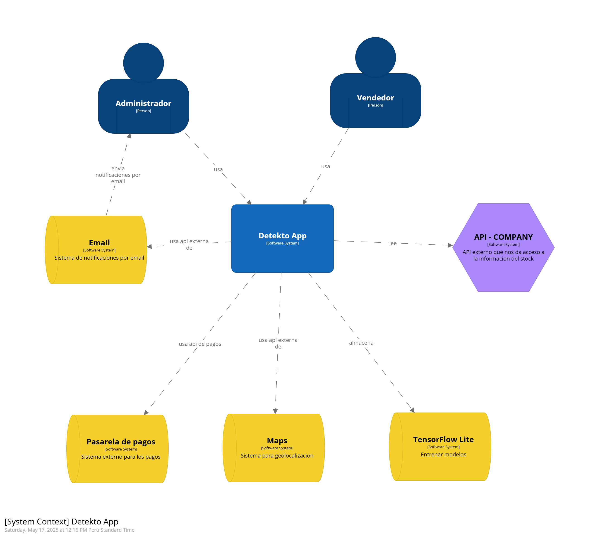
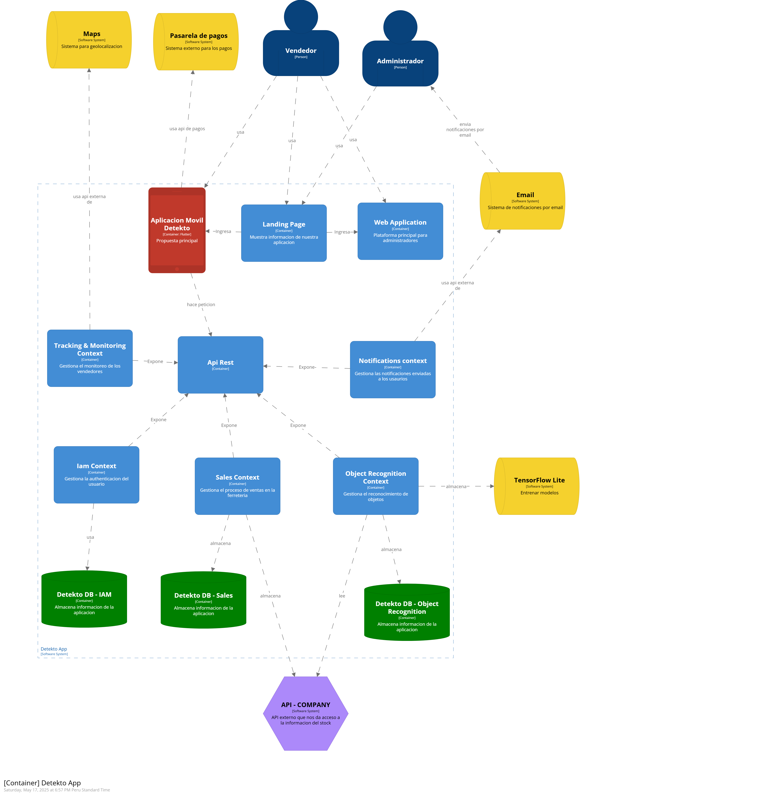
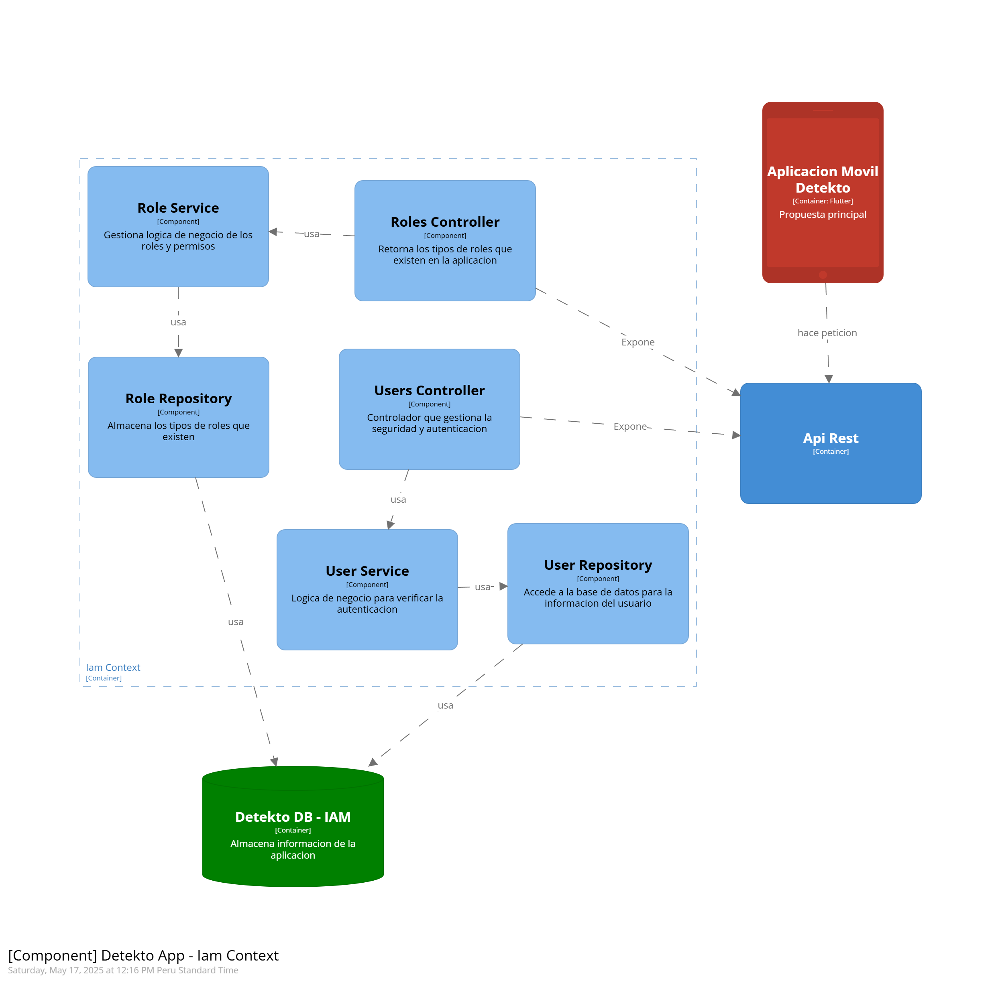

# Softwarinos - Report

  

# Universdiad Peruana de Ciencias Aplicadas

# INGENIERÍA DE SOFTWARE

### Ciclo: 8

## CURSO: Arquitecturas De Software Emergentes | SECCIÓN 4253

Profesor: De Los Rios Fernandez, Christian Luis

# Proyecto de curso

## Informe de Trabajo Final

#### StartUp: Softwarinos

#### Producto: Detekto

### Integrantes:

| Integrantes                            | Codigo     |
| -------------------------------------- | ---------- |
| Ampudia Flores, Jose Carlos Isaac      | u202112936 |
| De La Piedra Quintanilla, Erwin Miquel | U202112179 |
| Elsner De La Torre Ugarte              | u202111654 |
| Gutierrez Zumaeta, Manuel Alonso       | U202112353 |

#### Ciclo 2025-10

##### Abril, 2025

---

# Registro de Versiones del informe

| Versión | Fecha | Autor | Descripción de modificación |
| ------- | ----- | ----- | --------------------------- |
| 0.1     |       |       |                             |
| 0.2     |       |       |                             |
| 0.3     |       |       |                             |
| 0.4     |       |       |                             |
| 0.5     |       |       |                             |

# Project Report Collaboration Insights

Para el desarrollo del proyecto, se ha utilizado la plataforma de GitHub para el control correcto de versiones y la colaboración de los integrantes del equipo. A continuación se presenta el link directo a la organización del equipo:

**Link de organización Softwarinos:**  
[https://github.com/Emergentes-Softwarinos](https://github.com/Emergentes-Softwarinos)

## TB1

Para la entrega de la TB1 se realizó una reunión donde se asignaron las responsabilidades a cada integrante del equipo. A continuación se muestra la siguiente tabla con los detalles:

| Integrante          | Responsabilidad                                                                                                                                                                                                                                                                                                                                                                                                      |
| ------------------- | -------------------------------------------------------------------------------------------------------------------------------------------------------------------------------------------------------------------------------------------------------------------------------------------------------------------------------------------------------------------------------------------------------------------- |
| José Ampudia        | Desarrollo del diseño de las entrevistas, registro de entrevistas, Análisis de entrevistas, Needfinding, User Personas, User Task Matrix, Empathy Mapping, As-Is Scenario Mapping, Ubiquitous Language, To-Be Scenario Mapping y User Stories                                                                                                                                                                        |
| Manuel Gutierrez    | Desarrollo de Solution Profile, Antecedentes y problemática, Lean UX Process, Lean UX Problem Statements, Lean UX Assumptions, Lean UX Hypothesis Statements, Lean UX Canvas, Segmentos objetivos, Competidores, Análisis competitivo, Estrategias y tácticas frente a competidorees y Registro de entrevistas                                                                                                       |
| Miquel De la Piedra | Desarrollo del Impact Mapping, Product Backlog, Strategic-Level Attribute-Driven Design, Design Purpose, Attribute-Driven Design Inputs, Primary Functionality (Primary User Stories), Quality attribute Scenarios, Constraints, Architectural Drivers Backlog, Architectural Design Decisions y Quality Attribute Scenario Refinements y Registro de entrevistas                                                    |
| Julio De la Torre   | Desarrollo de Strategic-Level Domain-Driven Design, EventStorming, Candidate Context Discovery, Domain Message Flows Modeling, Bounded Context Canvases, Context Mapping y Software Architecture, Software Architecture System Landscape Diagram, Software Architecture Context Level Diagrams, Software Architecture Container Level Diagrams y Software Architecture Deployment Diagrams y Registro de entrevistas |

Durante la elaboración de las aplicaciones, tanto web como mobile, se realizaron _commits_ respectivos con el fin de mantener el orden y un control de versiones eficiente.

Para tener mejor precisión en los integrantes del equipo, a continuación presentamos los usuarios de GitHub de los integrantes:

- José Ampudia (@IsaacAmp24)
- Manuel Gutierrez (@ManuGZ)
- Miquel De la Piedra (@MiquelDlp)
- Julio De la Torre (@JulioElsnerDLTU)

A continuación se presentan las capturas del repositorio de GitHub donde se realizaron los avances correspondientes.

# Tabla de contenidos
- [Student Outcome](#student-outcome)

[Capítulo I: Introducción](#capítulo-i-introducción)
  - [1.1. Startup Profile](#11-startup-profile)
    - [1.1.1. Descripción de la Startup](#111-descripción-de-la-startup)
    - [1.1.2. Perfiles de integrantes del equipo](#112-perfiles-de-integrantes-del-equipo)
  - [1.2. Solution Profile](#12-solution-profile)
    - [1.2.1. Antecedentes y problemática](#121-antecedentes-y-problemática)
    - [1.2.2. Lean UX Process](#122-lean-ux-process)
      - [1.2.2.1. Lean UX Problem Statements](#1221-lean-ux-problem-statements)
      - [1.2.2.2. Lean UX Assumptions](#1222-lean-ux-assumptions)
      - [1.2.2.3. Lean UX Hypothesis Statements](#1223-lean-ux-hypothesis-statements)
      - [1.2.2.4. Lean UX Canvas](#1224-lean-ux-canvas)
  - [1.3. Segmentos objetivo](#13-segmentos-objetivo)

[Capítulo II: Requirements Elicitation & Analysis](#capítulo-ii-requirements-elicitation--analysis)
  - [2.1. Competidores](#21-competidores)
    - [2.1.1. Análisis competitivo](#211-análisis-competitivo)
    - [2.1.2. Estrategias y tácticas frente a competidores](#212-estrategias-y-tácticas-frente-a-competidores)
  - [2.2. Entrevistas](#22-entrevistas)
    - [2.2.1. Diseño de entrevistas](#221-diseño-de-entrevistas)
    - [2.2.2. Registro de entrevistas](#222-registro-de-entrevistas)
    - [2.2.3. Análisis de entrevistas](#223-análisis-de-entrevistas)
  - [2.3. Needfinding](#23-needfinding)
    - [2.3.1. User Personas](#231-user-personas)
    - [2.3.2. User Task Matrix](#232-user-task-matrix)
    - [2.3.3. Empathy Mapping](#233-empathy-mapping)
    - [2.3.4. As-is Scenario Mapping](#234-as-is-scenario-mapping)
  - [2.4. Ubiquitous Language](#24-ubiquitous-language)

[Capítulo III: Requirements Specification](#capítulo-iii-requirements-specification)
  - [3.1. To-Be Scenario Mapping](#31-to-be-scenario-mapping)
  - [3.2. User Stories](#32-user-stories)
  - [3.3. Impact Mapping](#33-impact-mapping)
  - [3.4. Product Backlog](#34-product-backlog)

[Capítulo IV: Strategic-Level Software Design](#capítulo-iv-strategic-level-software-design)
  - [4.1. Strategic-Level Attribute-Driven Design](#41-strategic-level-attribute-driven-design)
    - [4.1.1. Design Purpose](#411-design-purpose)
    - [4.1.2. Attribute-Driven Design Inputs](#412-attribute-driven-design-inputs)
      - [4.1.2.1. Primary Functionality (Primary User Stories)](#4121-primary-functionality-primary-user-stories)
      - [4.1.2.2. Quality attribute Scenarios](#4122-quality-attribute-scenarios)
      - [4.1.2.3. Constraints](#4123-constraints)
    - [4.1.3. Architectural Drivers Backlog](#413-architectural-drivers-backlog)
    - [4.1.4. Architectural Design Decisions](#414-architectural-design-decisions)
    - [4.1.5. Quality Attribute Scenario Refinements](#415-quality-attribute-scenario-refinements)
  - [4.2. Strategic-Level Domain-Driven Design](#42-strategic-level-domain-driven-design)
    - [4.2.1. EventStorming](#421-eventstorming)
    - [4.2.2. Candidate Context Discovery](#422-candidate-context-discovery)
    - [4.2.3. Domain Message Flows Modeling](#423-domain-message-flows-modeling)
    - [4.2.4. Bounded Context Canvases](#424-bounded-context-canvases)
    - [4.2.5. Context Mapping](#425-context-mapping)
  - [4.3. Software Architecture](#43-software-architecture)
    - [4.3.1. Software Architecture System Landscape Diagram](#431-software-architecture-system-landscape-diagram)
    - [4.3.2. Software Architecture Context Level Diagrams](#432-software-architecture-context-level-diagrams)
    - [4.3.3. Software Architecture Container Level Diagrams](#433-software-architecture-container-level-diagrams)
    - [4.3.4. Software Architecture Deployment Diagrams](#434-software-architecture-deployment-diagrams)

### Capítulo V: Tactical-Level Software Design

- [5.X. Bounded Context: Nombre del Contexto](#5x-bounded-context-nombre-del-contexto)
  - [5.X.1. Domain Layer](#5x1-domain-layer)
  - [5.X.2. Interface Layer](#5x2-interface-layer)
  - [5.X.3. Application Layer](#5x3-application-layer)
  - [5.X.4. Infrastructure Layer](#5x4-infrastructure-layer)
  - [5.X.6. Bounded Context Software Architecture Component Level Diagrams](#5x6-bounded-context-software-architecture-component-level-diagrams)
  - [5.X.7. Bounded Context Software Architecture Code Level Diagrams](#5x7-bounded-context-software-architecture-code-level-diagrams)
    - [5.X.7.1. Domain Layer Class Diagrams](#5x71-domain-layer-class-diagrams)
    - [5.X.7.2. Database Design Diagram](#5x72-database-design-diagram)

### Capítulo VI: Solution UX Design

- [6.1. Style Guidelines](#61-style-guidelines)
  - [6.1.1. General Style Guidelines](#611-general-style-guidelines)
  - [6.1.2. Web, Mobile & Devices Style Guidelines](#612-web-mobile--devices-style-guidelines)
- [6.2. Information Architecture](#62-information-architecture)
  - [6.2.2. Labeling Systems](#622-labeling-systems)
  - [6.2.3. Searching Systems](#623-searching-systems)
  - [6.2.4. SEO Tags and Meta Tags](#624-seo-tags-and-meta-tags)
  - [6.2.5. Navigation Systems](#625-navigation-systems)
- [6.3. Landing Page UI Design](#63-landing-page-ui-design)
  - [6.3.1. Landing Page Wireframe](#631-landing-page-wireframe)
  - [6.3.2. Landing Page Mock-up](#632-landing-page-mock-up)
- [6.4. Applications UX/UI Design](#64-applications-uxui-design)
  - [6.4.1. Applications Wireframes](#641-applications-wireframes)
  - [6.4.2. Applications Wireflow Diagrams](#642-applications-wireflow-diagrams)
  - [6.4.3. Applications Mock-ups](#643-applications-mock-ups)
  - [6.4.4. Applications User Flow Diagrams](#644-applications-user-flow-diagrams)
- [6.5. Applications Prototyping](#65-applications-prototyping)

### Capítulo VII: Product Implementation, Validation & Deployment

- [7.1. Software Configuration Management](#71-software-configuration-management)
  - [7.1.1. Development Environment Configuration](#711-development-environment-configuration)
  - [7.1.2. Source Code Management](#712-source-code-management)
  - [7.1.3. Code Style Guide & Conventions](#713-code-style-guide--conventions)
  - [7.1.4. Deployment Configuration](#714-deployment-configuration)
- [7.2. Solution Implementation](#72-solution-implementation)
  - [7.2.X. Sprint n](#72x-sprint-n)
    - [7.2.X.1. Sprint Planning](#72x1-sprint-planning)
    - [7.2.X.2. Sprint Backlog](#72x2-sprint-backlog)
    - [7.2.X.3. Development Evidence](#72x3-development-evidence)
    - [7.2.X.4. Testing Suite Evidence](#72x4-testing-suite-evidence)
    - [7.2.X.5. Execution Evidence](#72x5-execution-evidence)
    - [7.2.X.6. Services Documentation](#72x6-services-documentation)
    - [7.2.X.7. Deployment Evidence](#72x7-deployment-evidence)
    - [7.2.X.8. Team Collaboration Insights](#72x8-team-collaboration-insights)
- [7.3. Validation Interviews](#73-validation-interviews)
  - [7.3.1. Diseño de Entrevistas](#731-diseño-de-entrevistas)
  - [7.3.2. Registro de Entrevistas](#732-registro-de-entrevistas)
  - [7.3.3. Evaluaciones según heurísticas](#733-evaluaciones-según-heurísticas)
- [7.4. Video About-the-Product](#74-video-about-the-product)

### Conclusiones

- [Conclusiones y recomendaciones](#conclusiones-y-recomendaciones)

### Video About-the-Team

- [Video del equipo](#video-del-equipo)

### Bibliografía

- [Referencias](#referencias)

### Anexos

- [Anexos](#anexos)

# Student Outcome

ABET – EAC - Student Outcome 3: Capacidad de comunicarse efectivamente con un
rango de audiencias.

<table>
  <thead>
    <tr>
      <th>Criterio específico</th>
      <th>Acciones realizadas</th>
      <th>Conclusiones</th>
    </tr>
  </thead>
  <tbody>
    <tr>
      <td><strong>Comunica oralmente con efectividad a diferentes rangos de audiencia</strong></td>
      <td>
        <strong>José Ampudia</strong> 
        <strong>TB1</strong> 
        Participó activamente en entrevistas con usuarios para la recopilación de información clave sobre necesidades reales. Durante estas sesiones, empleó un lenguaje claro y empático para asegurar la comprensión del propósito del proyecto, facilitando así una retroalimentación útil y precisa.
          
        <strong>Manuel Gutierrez</strong> 
        <strong>TB1</strong> 
        Comunicó de manera clara la problemática y el enfoque estratégico del proyecto durante las entrevistas con usuarios y discusiones del equipo, asegurando que todos comprendieran la visión general del producto. Además, facilitó sesiones explicativas sobre la propuesta de valor frente a competidores.
          
        <strong>Miquel De la Piedra</strong> 
        <strong>TB1</strong> 
        Explicó el propósito y funcionamiento del Impact Mapping a su equipo, así como las decisiones de diseño arquitectónico a nivel estratégico, asegurando que todos los miembros comprendieran la relación entre funcionalidades y metas del proyecto.
          
        <strong>Julio De la Torre</strong> 
        <strong>TB1</strong> 
        Facilitó el entendimiento de conceptos técnicos complejos como el EventStorming, Candidate Context Discovery y la arquitectura del sistema mediante presentaciones orales y debates dentro del equipo, adaptando el lenguaje técnico según el nivel de conocimiento de la audiencia.
      </td>
      <td>
        Las habilidades de comunicación oral del equipo permitieron un entendimiento claro y compartido del proyecto tanto a nivel técnico como no técnico, mejorando la colaboración con usuarios y entre los miembros del equipo.
      </td>
    </tr>
    <tr>
      <td><strong>Comunica por escrito con efectividad a diferentes rangos de audiencia</strong></td>
      <td>
        <strong>José Ampudia</strong> 
        <strong>TB1</strong> 
        Redactó documentos como el análisis de entrevistas, User Personas, y escenarios As-Is/To-Be de forma estructurada y clara, facilitando la comprensión por parte del equipo y stakeholders del contexto del usuario y sus necesidades.
          
        <strong>Manuel Gutierrez</strong> 
        <strong>TB1</strong> 
        Elaboró entregables como el Lean UX Canvas, Problem Statements y el análisis competitivo con una redacción precisa y orientada a la toma de decisiones estratégicas. Su documentación fue esencial para definir la propuesta de valor del proyecto.
          
        <strong>Miquel De la Piedra</strong> 
        <strong>TB1</strong> 
        Documentó el diseño arquitectónico a través del Attribute-Driven Design y Backlog técnico, asegurando claridad en los lineamientos técnicos para los futuros desarrolladores y partes interesadas.
          
        <strong>Julio De la Torre</strong> 
        <strong>TB1</strong> 
        Generó documentación técnica detallada sobre los componentes de la arquitectura del sistema, diagramas y mapeos de contexto, facilitando así la comprensión integral del sistema por parte de audiencias tanto técnicas como no técnicas.
      </td>
      <td>
        La calidad de los entregables escritos permitió transmitir efectivamente tanto el enfoque de usuario como las decisiones técnicas, mejorando la comunicación y coordinación entre todos los actores involucrados.
      </td>
    </tr>
  </tbody>
</table>
  

# Capítulo I: Introducción

## 1.1. Startup Profile

En esta sección presentaremos la descripción del startup y los perfiles de los miembros del team.

### 1.1.1. Descripción de la Startup

En Softwarinos, estamos desarrollando una solución con respecto al reconocimiento de objetos a través de una aplicación móvil, para facilitar la búsqueda de productos y la venta de estos mismos por parte de vendedores, además de un seguimiento de estas ventas y proyecciones de parte del administrador.

**Misión**: Crear una aplicación móvil que reconozca objetos de forma rápida y precisa, para ayudar a los vendedores a encontrar y vender productos fácilmente, y permitir a los administradores llevar un mejor control de las ventas y hacer proyecciones para su negocio.

**Visión**: Convertirnos en una empresa destacada en soluciones tecnológicas para el comercio, facilitando el trabajo de vendedores y administradores a través de herramientas inteligentes que mejoran la gestión y el crecimiento de sus negocios.

### 1.1.2. Perfiles de integrantes del equipo

| Foto                                                              | Nombre y Descripción                                                                                                                                                                                                                                                                                                                                                                                                                                                                                                       |
| ----------------------------------------------------------------- | -------------------------------------------------------------------------------------------------------------------------------------------------------------------------------------------------------------------------------------------------------------------------------------------------------------------------------------------------------------------------------------------------------------------------------------------------------------------------------------------------------------------------- |
|                         | **Nombre:** Manuel Alonso Gutierrez Zumaeta **Código:** u202112353 **Descripción:** Soy Manuel Gutierrez, estudiante de la carrera de Ingeniería de Software, tengo 20 años. Tengo experiencia en el desarrollo de aplicaciones web, tanto frontend como backend, programación móvil en Flutter. Me considero una persona responsable y que se propone hacer un buen trabajo.                                                                                                                                        |
|                                      | **Nombre:** Julio Elsner De La Torre Ugarte **Código:** u202111654 **Descripción:** Estudiante de Ingeniería de software, tengo 21 años. Cuento con experiencia en desarrollo de aplicaciones Web Full Stack (Front, Back-end) y bases de datos. Me considero una persona indagadora y que hace las cosas con una idea plasmada antes de realizarla.                                                                                                                                                                 |
|                                     | **Nombre:** Erwin Miquel De la Piedra Quintanilla **Código:** u202112179 **Descripción:** Soy Miquel De la Piedra, tengo 21 años, estudiante de la carrera de Ingeniería de Software. Poseo conocimientos relacionados a la programación en C++, Python, HTML y CSS. Además poseo experiencia con el manejo de bases de datos. Considero que estos conocimientos ayudarán a la realización de este trabajo, además de mejorar nuestros métodos de organización y trabajo en equipo.                                  |
|  | **Nombre:** José Carlos Isaac Ampudia Flores **Código:** u202112936 **Descripción:** Soy estudiante de Ingeniería de Software, con sólida formación en desarrollo Backend utilizando frameworks como Spring Boot. También cuento con conocimientos en el desarrollo Frontend, trabajando con herramientas como Angular. Me caracterizo por mi capacidad para trabajar bajo presión, así como por mi enfoque organizado y metódico, lo que me permite adaptarme correctamente a los desafíos del entorno tecnológico. |

## 1.2. Solution Profile

### 1.2.1 Antecedentes y problemática

- **What (¿Qué?)**  
 El problema principal es la dificultad que enfrentan ferreterías y comercios de productos físicos para identificar, buscar y gestionar herramientas y materiales de forma rápida y precisa. Los sistemas actuales no están adaptados al sector y requieren conocimientos técnicos o procesos manuales lentos.

- **When (¿Cuándo?)**  
  Este problema ocurre diariamente en el momento de la atención al cliente, la búsqueda de productos en almacén, la actualización del inventario y el registro de ventas. Es especialmente crítico durante horas de alta demanda o cuando se requiere atención eficiente.

- **Where (¿Dónde?)**  
  Sucede en ferreterías, depósitos, puntos de venta físicos y almacenes, donde los empleados necesitan reconocer y registrar productos con rapidez, y los administradores requieren visibilidad clara sobre el movimiento de stock y ventas.

- **Who (¿Quién?)**  
  Afecta principalmente a los vendedores que deben identificar productos de forma rápida, a los clientes que experimentan demoras, y a los administradores que necesitan gestionar inventario y ventas sin sistemas complejos.

- **Why (¿Por qué?)**  
  Porque los sistemas actuales como Shopify, Zoho CRM o TradeGecko están diseñados para otros tipos de negocios, no cuentan con funciones de reconocimiento visual, y son demasiado generales o complejos para el día a día de una ferretería tradicional.

- **How (¿Cómo?)**  
  El problema se intenta resolver actualmente con métodos manuales (catálogos impresos, búsqueda visual, listas), aplicaciones genéricas o incluso sin ningún sistema, lo que lleva a errores, pérdida de tiempo y falta de control.

- **How much (¿Cuánto?)**  
  El impacto puede medirse en tiempo perdido (minutos por venta), errores en inventario, insatisfacción del cliente, y pérdida de ventas por no poder identificar o encontrar un producto a tiempo. A nivel económico, esto representa una baja en la eficiencia operativa y en la competitividad del negocio.

### 1.2.2 Lean UX Process.

#### 1.2.2.1. Lean UX Problem Statements.
El estado actual de la gestión de productos en las ferreterías está centrado principalmente en métodos tradicionales, como catálogos físicos y búsqueda manual, lo que resulta en tiempos de espera largos, ineficiencia en la atención al cliente y una gestión de inventario poco precisa. Lo que los sistemas existentes no logran abordar es la integración efectiva de tecnología para agilizar la identificación de productos, mejorar la precisión en el registro de ventas e inventario, y optimizar el seguimiento de las operaciones comerciales.

Nuestro producto, Detekto, resolverá esta brecha mediante el desarrollo de una solución móvil innovadora que utiliza reconocimiento visual a través de la cámara del dispositivo. Nos enfocaremos en proporcionar una plataforma que permita a los vendedores identificar productos rápidamente, registrar ventas, acceder a informes de inventario en tiempo real y obtener reportes automatizados. Además, simplificaremos la gestión del inventario y mejoraremos la comunicación entre vendedores y administradores, todo desde una interfaz sencilla y fácil de usar.

Nuestro enfoque inicial será dirigirnos a ferreterías y pequeños comercios especializados en herramientas y materiales, proporcionando una solución tecnológica accesible que optimice sus procesos. Sabremos que hemos tenido éxito cuando veamos una disminución significativa en los tiempos de atención al cliente, una mejora en la precisión del inventario y una mayor satisfacción tanto de empleados como de clientes, resultando en un aumento en las ventas y eficiencia operativa.

#### 1.2.2.2. Lean UX Assumptions.
- **Business Assumptions**

Los vendedores y administradores de ferreterías necesitan una herramienta rápida y sencilla para identificar productos y gestionar inventarios.

Detekto solucionará esto mediante una app móvil con reconocimiento visual, facilitando la identificación de productos y la gestión de ventas e inventarios.

El modelo de negocio se basará en suscripciones mensuales para ferreterías, con opciones premium como reportes avanzados.

La principal competencia son plataformas generales como Shopify y Zoho CRM, que no están especializadas en ferreterías.

Nos diferenciamos al ofrecer una solución sencilla y enfocada, con reconocimiento visual que ahorra tiempo y mejora la eficiencia operativa.

- **User Assumptions**

  - **¿Quién es el usuario?**  
    Vendedores de ferretería, encargados de mostrador, y administradores de pequeñas y medianas ferreterías.

  - **¿Dónde encaja nuestro producto en su trabajo o vida?**  
    Detekto se utilizará en el punto de venta o durante la organización de inventario, como una herramienta rápida para identificar productos y facilitar su registro, venta o seguimiento.

  - **¿Qué problema tiene nuestro producto? ¿Cómo se resuelve?**  
    El usuario necesita identificar productos sin perder tiempo revisando catálogos físicos o digitales. El reconocimiento visual automatizado reduce este tiempo, mejora la precisión y acelera la atención al cliente.

  - **¿Cuándo y cómo es usado nuestro producto?**  
    Detekto se usa durante el horario laboral en ferreterías, a través de dispositivos móviles (principalmente smartphones) al momento de interactuar con clientes o gestionar productos en bodega.

  - **¿Qué características son importantes?**  
    Reconocimiento visual rápido y preciso, facilidad para registrar ventas, reportes automáticos, historial de productos buscados y acceso desde el celular sin depender de otros sistemas externos.

  - **¿Cómo debe verse nuestro producto y comportarse?**  
    Debe tener una interfaz limpia, visual e intuitiva, con navegación simple, botones grandes y flujos cortos. Debe ser confiable, ágil y estar optimizada para ambientes de trabajo (ruido, poco tiempo, poca conectividad).

- **User Benefits**

  - **Identificación instantánea de productos:**  
    El usuario puede reconocer herramientas y materiales en segundos sin buscar manualmente.

  - **Optimización de ventas y atención al cliente:**  
    Se reduce el tiempo de atención, mejorando la experiencia del cliente y la eficiencia del vendedor.

  - **Gestión simplificada para administradores:**  
    Los responsables pueden monitorear ventas y productos más vendidos desde un panel claro.

  - **Reducción de errores:**  
    Se evita registrar productos incorrectos gracias al reconocimiento visual automatizado.

  - **Adopción sencilla:**  
    La app no requiere conocimientos técnicos avanzados, lo que permite una adopción rápida incluso por usuarios con baja familiaridad digital.

#### 1.2.2.3. Lean UX Hypothesis Statements.
- **Creemos que** la experiencia del vendedor mejorará si se ofrece reconocimiento automático de herramientas mediante la cámara del móvil.**Sabremos que hemos tenido éxito, cuando** el tiempo promedio de identificación de productos disminuya en un 50% durante el primer mes de uso.

- **Creemos que** los administradores podrán tomar mejores decisiones si se les proporciona un panel con reportes automáticos de ventas e inventario.**Sabremos que hemos tenido éxito, cuando** el 70% de los administradores usen el panel semanalmente y reporten una mejora en la gestión del stock en los primeros tres meses.

- **Creemos que** los usuarios adoptarán más rápidamente la app si la interfaz es simple, visual e intuitiva. **Sabremos que hemos tenido éxito, cuando** al menos el 80% de los nuevos usuarios completen su primera venta con ayuda de Detekto en menos de 10 minutos, durante el primer uso.

- **Creemos que** Detekto tendrá una mayor aceptación que soluciones genéricas si se enfoca únicamente en ferreterías. **Sabremos que hemos tenido éxito, cuando** al menos el 60% de los usuarios prefieren Detekto sobre otros sistemas después de un mes de uso, según encuestas de satisfacción.

#### 1.2.2.4. Lean UX Canvas.

## 1.3. Segmentos objetivo.

El estado actual de la gestión de productos en las ferreterías está centrado principalmente en métodos tradicionales, como catálogos físicos y búsqueda manual, lo que resulta en tiempos de espera largos, ineficiencia en la atención al cliente y una gestión de inventario poco precisa. Lo que los sistemas existentes no logran abordar es la integración efectiva de tecnología para agilizar la identificación de productos, mejorar la precisión en el registro de ventas e inventario, y optimizar el seguimiento de las operaciones comerciales.

Nuestro producto, Detekto, resolverá esta brecha mediante el desarrollo de una solución móvil innovadora que utiliza reconocimiento visual a través de la cámara del dispositivo. Nos enfocaremos en proporcionar una plataforma que permita a los vendedores identificar productos rápidamente, registrar ventas, acceder a informes de inventario en tiempo real y obtener reportes automatizados. Además, simplificaremos la gestión del inventario y mejoraremos la comunicación entre vendedores y administradores, todo desde una interfaz sencilla y fácil de usar.

Nuestro enfoque inicial será dirigirnos a ferreterías y pequeños comercios especializados en herramientas y materiales, proporcionando una solución tecnológica accesible que optimice sus procesos. Sabremos que hemos tenido éxito cuando veamos una disminución significativa en los tiempos de atención al cliente, una mejora en la precisión del inventario y una mayor satisfacción tanto de empleados como de clientes, resultando en un aumento en las ventas y eficiencia operativa.

# Capítulo II: Requirements Elicitation & Analysis

## 2.1. Competidores.

### 2.1.1. Análisis competitivo.

<table><tr><th colspan="6" valign="top">Competitive Analysis Landscape</th></tr>
<tr><td colspan="1" valign="top">¿Por qué llevar a cabo este análisis?</td><td colspan="5" valign="top">El objetivo de este análisis es identificar las características de los competidores y encontrar maneras de diferenciarnos.</td></tr>
<tr><td colspan="2" rowspan="2" valign="top">Startup y Competidores</td><td colspan="1" valign="top">Detekto</td><td colspan="1" valign="top">TradeGecko</td><td colspan="1" valign="top">Zoho CRM</td><td colspan="1" valign="top">Shopify</td></tr>
<tr><td colspan="1" valign="top"></td><td colspan="1" valign="top"></td><td colspan="1" valign="top"></td><td colspan="1" valign="top"></td></tr>
<tr><td rowspan="2" valign="top">Perfil</td><td valign="top">Overview</td>
<td valign="top">App móvil centrada en reconocimiento de herramientas de ferretería mediante cámara. Enfocada en facilitar búsqueda, venta y seguimiento de producto.</td>
<td valign="top">Plataforma de gestión de inventario para pequeñas empresas. Adquirido por QuickBooks.</td>
<td valign="top">CRM completo con automatización de ventas y análisis, enfocado en todo tipo de industria.</td>
<td valign="top">Plataforma de ecommerce para crear y gestionar tiendas online con herramientas integradas de ventas.</td></tr>
<tr><td valign="top">Ventaja competitiva ¿Qué valor ofrece a los clientes?</td>
<td valign="top">Reconocimiento de productos en tiempo real con IA + enfoque específico en ferreterías. Integración con ventas y control.</td>
<td valign="top">Gestión de inventario multi-canal con buena interfaz, pero sin reconocimiento visual.</td>
<td valign="top">Gran capacidad de personalización y automatización, pero no especializado.</td>
<td valign="top">Alto poder de personalización en ecommerce, pero más generalista, sin reconocimiento visual.</td></tr>
<tr><td rowspan="2" valign="top">Perfil de Marketing</td><td valign="top">Mercado objetivo</td>
<td valign="top">Ferreterías, vendedores de productos físicos, administradores de puntos de venta.</td>
<td valign="top">PYMES con múltiples canales de venta.</td>
<td valign="top">Empresas medianas y grandes con procesos de ventas complejos.</td>
<td valign="top">Emprendedores, pymes y empresas que venden en línea.</td></tr>
<tr><td valign="top">Estrategias de marketing</td>
<td valign="top">Enfoque en contenido visual (demostraciones), alianzas con ferreterías, participación en ferias del sector.</td>
<td valign="top">Marketing B2B digital, webinars, presencia en comunidades de comercio electrónico.</td>
<td valign="top">Publicidad online, inbound marketing, fuerza de ventas directa.</td>
<td valign="top">Marketing digital masivo, influencers, SEO, redes sociales.</td></tr>
<tr><td rowspan="3" valign="top">Perfil de producto</td><td valign="top">Productos & Servicios</td>
<td valign="top">Reconocimiento de objetos, gestión de ventas, seguimiento de stock, reportes para administradores.</td>
<td valign="top">Gestión de inventario, pedidos, reportes, integración con ecommerce.</td>
<td valign="top">CRM, automatización de marketing, analíticas, gestión de clientes.</td>
<td valign="top">Tienda online, pagos, envíos, herramientas de marketing y reportes.</td></tr>
<tr><td valign="top">Precios & Costos</td>
<td valign="top">Modelo freemium con funcionalidades avanzadas por suscripción mensual (propuesta).</td>
<td valign="top">Planes desde $39/mes a más de $200, dependiendo de la funcionalidad.</td>
<td valign="top">Planes desde $14/mes, escalables por necesidades.</td>
<td valign="top">Desde $39/mes hasta planes empresariales. Costos adicionales por plugins.</td></tr>
<tr><td valign="top">Canales de distribución (Web y/o Móvil)</td>
<td valign="top">App móvil (iOS/Android), versión web en desarrollo (futuro).</td>
<td valign="top">Web app, sin versión móvil independiente.</td>
<td valign="top">Web app y apps móviles.</td>
<td valign="top">Web app y apps móviles.</td></tr>
<tr><td rowspan="4" valign="top">Análisis SWOT</td><td valign="top">Fortalezas</td>
<td valign="top">Enfoque especializado en ferreterías. Reconocimiento visual innovador. Facilidad de uso.</td>
<td valign="top">Sólido en inventario multi-canal. Buena integración con QuickBooks.</td>
<td valign="top">Potente CRM con automatizaciones. Altamente configurable.</td>
<td valign="top">Ecosistema completo de ecommerce. Alto reconocimiento de marca.</td></tr>
<tr><td valign="top">Debilidades</td>
<td valign="top">Producto nuevo, aún en fase inicial. Menor reconocimiento de marca.</td>
<td valign="top">No incluye funciones de reconocimiento visual. Puede ser complejo para nuevos usuarios.</td>
<td valign="top">No es específico para el sector ferretería. Curva de aprendizaje.</td>
<td valign="top">Competencia feroz, enfoque generalista. Costos ocultos con apps externas.</td></tr>
<tr><td valign="top">Oportunidades</td>
<td valign="top">Asociaciones con proveedores de ferretería. Escalabilidad con inteligencia artificial.</td>
<td valign="top">Integrarse con nuevas plataformas de ecommerce.</td>
<td valign="top">Expandirse en sectores nicho como retail técnico.</td>
<td valign="top">Aumentar integraciones con IA y automatización visual.</td></tr>
<tr><td valign="top">Amenazas</td>
<td valign="top">Entrada de grandes plataformas al nicho. Adopción tecnológica baja en ciertos mercados.</td>
<td valign="top">Dependencia de QuickBooks. Competencia creciente.</td>
<td valign="top">Saturación del mercado CRM. Nuevos players con IA.</td>
<td valign="top">Altos costos de operación. Competencia con marketplaces como Amazon.</td></tr>
</table>

### 2.1.2. Estrategias y tácticas frente a competidores.

Detekto puede diferenciarse en el mercado ofreciendo una solución móvil especializada en el reconocimiento de herramientas y productos de ferretería mediante inteligencia artificial, un enfoque único frente a competidores más generalistas como TradeGecko, Zoho CRM y Shopify. Al centrarse en un mercado específico como el de las ferreterías y comercios de productos físicos, Detekto puede desarrollar funcionalidades para vendedores y administradores, como la identificación instantánea de productos, seguimiento de inventario y reportes automatizados de ventas.

A diferencia de plataformas como Shopify, que están orientadas a la creación de tiendas online generales, Detekto puede destacar por su simplicidad de uso, velocidad en el reconocimiento de objetos y utilidad directa en puntos de venta físicos. Frente a Zoho CRM, que apunta a la gestión de relaciones con clientes de múltiples industrias, Detekto puede posicionarse como una herramienta operativa y directa, que no requiere grandes configuraciones ni curvas de aprendizaje complejas.

Además, el desarrollo de capacidades avanzadas basadas en visión por computadora y el uso de datos para generar proyecciones y sugerencias de ventas permitirá que Detekto evolucione hacia una plataforma inteligente, útil tanto para vendedores como para administradores. Esta tecnología, poco explotada en el sector ferretero, representa una ventaja competitiva significativa.

Para enfrentar a TradeGecko, que ofrece sólidas funciones de gestión de inventario pero sin reconocimiento visual, Detekto puede aprovechar su facilidad de uso desde dispositivos móviles y su interfaz adaptada al trabajo en campo o mostrador. También puede incluir integraciones simples con sistemas contables o puntos de venta, cerrando así el ciclo completo de atención comercial.

Una estrategia de marketing centrada en demostrar el funcionamiento en tiempo real de la app, mediante videos y casos de éxito, junto a alianzas con cadenas de ferreterías, distribuidores de herramientas y cámaras de comercio local, puede permitir a Detekto ganar visibilidad y confianza. Además, capacitar a los usuarios con contenido sencillo y práctico ayudará a reducir barreras tecnológicas en sectores menos digitalizados.

## 2.2. Entrevistas.

### 2.2.1. Diseño de entrevistas.

Se han planteado varias interrogantes dirigidas a nuestro público objetivo, con el fin de recolectar información que nos proporcionen requisitos, lo que fortalecerá para el desarrollo de nuestra solución.

- Segmento 1: Vendedor

  - Preguntas generales (Vendedor):

    - ¿Cuál es tu nombre y edad?
    - ¿En qué distrito vives actualmente?
    - ¿Cuál es tu estado civil y con quién vives?
    - ¿Cuál es tu ocupación actual y cuántos años llevas trabajando como vendedor?
    - ¿Con qué frecuencia usas el celular o dispositivos móviles en tu trabajo?

  - Preguntas sobre necesidades (Vendedor)

    - ¿Cómo sueles buscar un producto en la tienda actualmente?
    - ¿Qué haces cuando un cliente no sabe el nombre de lo que necesita, pero lo describe o muestra una imagen?
    - ¿Cómo verificas si hay stock de un producto?
    - ¿Te sientes cómodo usando tecnología como apps móviles para trabajar? ¿Por qué?

  - Preguntas para profundizar (Vendedor)

    - ¿Te ha pasado que pierdes una venta por no encontrar rápido el producto?
    - ¿Usas alguna aplicación o sistema digital actualmente en tu trabajo? ¿Cuál?
    - ¿Qué tipo de celular usas? (marca/modelo)
    - ¿Qué tan frecuentemente accedes a redes sociales o apps desde el celular?
    - ¿Qué esperas de una app que te ayude en tu trabajo como vendedor?
    - ¿Qué es lo que más te frustra de tu día a día en el trabajo?

- Segmento 2: Administrador

  - Preguntas generales (Administrador):

    - ¿Cuál es su nombre y edad?
    - ¿Dónde vive actualmente?
    - ¿Cuál es su ocupación dentro del negocio? ¿Desde cuándo ocupa ese cargo?
    - ¿Qué nivel educativo tiene?
    - ¿Con qué frecuencia utiliza una computadora en su trabajo?

  - Preguntas sobre necesidades (Administrador)

    - ¿Cómo realiza actualmente el seguimiento de productos y stock en la tienda?
    - ¿Qué tipo de información le gustaría ver respecto a las ventas que realizan los vendedores?
    - ¿Cómo hace proyecciones o predicciones de ingresos o ganancias?
    - ¿Usa alguna herramienta digital (Excel, sistema contable, etc.) para la gestión del negocio?
    - ¿Qué tan cómodo se siente usando plataformas web o dashboards de datos?

  - Preguntas para profundizar (Administrador)

    - ¿Qué tipo de decisiones toma a partir de la información de ventas?
    - ¿Con qué frecuencia revisa el rendimiento de los vendedores?
    - ¿Qué tipo de reportes o gráficos le gustaría ver en una plataforma web?
    - ¿Qué le frustra más al momento de hacer seguimiento o gestión del negocio?
    - ¿Cuáles son sus objetivos principales como administrador de la tienda?

### 2.2.2. Registro de entrevistas.

### 2.2.3. Análisis de entrevistas.

## 2.3. Needfinding.

### 2.3.1. User Personas.

A continuación se presentan los perfiles de nuestros segmentos objetivos, tales como los Vendedores, y los Administradores de las ferreterías, esta información es primordial para entender las necesidades específicas y diseñar una herramienta que facilite la detección de objetos de ferretería y de esta manera aumentar sus ventas.

- Segmento 1: Vendedor:

- Segmento 2: Administrador:

### 2.3.2. User Task Matrix.

En esta sección se detallan las tareas principales de los segmentos objetivos, en este caso, los vendedores y administradores de ferreterías, así como su frecuencia e importancia.

<table border="1">
  <tr>
    <th rowspan="2">Tareas</th>
    <th colspan="2">Vendedores</th>
    <th colspan="2">Administradores</th>
  </tr>
  <tr>
    <th>Frecuencia</th>
    <th>Importancia</th>
    <th>Frecuencia</th>
    <th>Importancia</th>
  </tr>
  <tr>
    <td>Buscar productos en el almacén o tienda</td>
    <td>Diario</td>
    <td>Alta</td>
    <td>Quincenal</td>
    <td>Media</td>
  </tr>
  <tr>
    <td>Identificar productos a partir de imágenes o descripciones</td>
    <td>Diario</td>
    <td>Alta</td>
    <td>Rara vez</td>
    <td>Baja</td>
  </tr>
  <tr>
    <td>Consultar stock</td>
    <td>Diario</td>
    <td>Alta</td>
    <td>Semanal</td>
    <td>Alta</td>
  </tr>
  <tr>
    <td>Reservar productos para un cliente</td>
    <td>Varias veces por semana</td>
    <td>Alta</td>
    <td>Ocasional</td>
    <td>Media</td>
  </tr>
  <tr>
    <td>Registrar ventas o informar sobre ventas realizadas</td>
    <td>Diario</td>
    <td>Alta</td>
    <td>Semanal</td>
    <td>Alta</td>
  </tr>
  <tr>
    <td>Hacer seguimiento a ventas realizadas</td>
    <td>Rara vez</td>
    <td>Media</td>
    <td>Semanal</td>
    <td>Alta</td>
  </tr>
  <tr>
    <td>Analizar productos más vendidos</td>
    <td>Rara vez</td>
    <td>Media</td>
    <td>Semanal</td>
    <td>Alta</td>
  </tr>
  <tr>
    <td>Hacer proyecciones de ingresos</td>
    <td>-</td>
    <td>-</td>
    <td>Quincenal</td>
    <td>Alta</td>
  </tr>
  <tr>
    <td>Interactuar con tecnología</td>
    <td>Diario</td>
    <td>Media</td>
    <td>Diario</td>
    <td>Alta</td>
  </tr>
</table>

Las tareas que realizan en una empresa de ferretería son bastante similares a cualquier empresa de ventas, lo cual nos permite identificar las principales necesidades de nuestro público objetivo. A través de este análisis se pudo entender que, el vendedor realiza principalmente tareas operativas con una frecuencia diaria, relacionadas con la atención al cliente y búsqueda de productos. Por otro lado, la administradora desempeña un rol más estratégico y analítico, con tareas menos frecuentes pero de alta importancia, enfocadas a la supervisión de las ventas. Se destaca que ambos segmentos interactúan con herramientas digitales, aunque el enfoque y los propósitos son distintos.

### 2.3.3. Empathy Mapping.

Mediante este gráfico se evidencia las percepciones y sentimientos de los usuarios al interactuar con nuestra solución, este análisis nos permite conocer sobre sus desafíos que ellos poseen, y diseñar una propuesta más adecuada y centrada a sus requisitos.

Segmento 1 - Vendedor:

Segmento 2 - Administrador:

### 2.3.4. As-is Scenario Mapping.

En esta sección, se describen los procesos cotidianos, antes de la implementación de nuestra solución, esto nos permite identificar desafíos que sufren nuestro segmento objetivo, y a través de estos, encontrar oportunidades de mejora para mejorar el reconocimiento de objetos y mejorar las ventas en el sector ferretero.

- Segmento 1 - Vendedor:

- Segmento 2 - Administrador:

## 2.4. Ubiquitous Language.

En esta sección, se definen términos clave para el dominio del negocio, basándose en el enfoque de Ubiquitous Language propuesto por Eric Evans en Domain-Driven Design. Estas definiciones buscan asegurar una comunicación clara y efectiva entre los miembros del equipo, alineando el vocabulario técnico con las necesidades del proyecto.

- **Product (Producto)**: Herramienta o material físico que se encuentra en venta dentro de la ferretería.

- **Stock (Stock/Inventario)**: Cantidad disponible de cada producto en el almacén o tienda.

- **Sale (Venta)**: Transacción realizada entre un vendedor y un cliente por uno o más productos.

- **Seller (Vendedor)**: Persona encargada de atender al cliente, identificar los productos y concretar las ventas.

- **Administrator (Administrador)**: Persona responsable de supervisar el negocio, controlar las ventas y monitorear el inventario.

- **Recognition (Reconocimiento visual)**: Proceso por el cual la app identifica un producto mediante la cámara del celular.

- **Reservation (Reserva)**: Acción de apartar un producto para un cliente hasta que se concrete su compra.

- **Report (Reporte)**: Documento o visualización con datos organizados sobre ventas, productos o inventario.

- **Projection (Proyección)**: Estimación de ventas o ingresos futuros basada en el análisis de datos pasados.

- **Unavailable Product (Producto no disponible):** Producto que no se encuentra en stock al momento de la búsqueda.

- **Best Seller (Producto más vendido)**: Producto que ha tenido mayor número de ventas en un período determinado.

- **Break in Stock (Quiebre de stock)**: Situación en la que se agota un producto y no se cuenta con reposición inmediata.

- **Storefront (Mostrador)**: Zona de atención al cliente donde el vendedor interactúa directamente y realiza las ventas.

- **Warehouse (Almacén)**: Espacio físico donde se guardan los productos no exhibidos.

- **Shift (Turno)**: Período asignado de trabajo para los vendedores en el día.

- **Sales Summary (Resumen de ventas)**: Informe breve que muestra el total de ventas realizadas en un día o período específico.

- **Restock (Reabastecimiento)**: Acción de reponer productos que se han agotado en el inventario.

- **Visual Search (Búsqueda visual)**: Método para encontrar un producto a través de una imagen o la cámara, en lugar de una búsqueda por nombre.

# Capítulo III: Requirements Specification

## 3.1. To-Be Scenario Mapping.

## 3.2. User Stories.

## 3.3. Impact Mapping.

## 3.4. Product Backlog.

# Capítulo IV: Strategic-Level Software Design.

## 4.1. Strategic-Level Attribute-Driven Design.

### 4.1.1. Design Purpose.

### 4.1.2. Attribute-Driven Design Inputs.
#### 4.1.2.1. Primary Functionality (Primary User Stories).
#### 4.1.2.3. Constraints.
### 4.1.2.2. Technical Stories
### 4.1.3. Architectural Drivers Backlog.
### 4.1.3. Architectural Drivers Backlog
### 4.1.4. Architectural Design Decisions.
### 4.1.4. Architectural Design Decisions
### 4.1.5. Quality Attribute Scenario Refinements.
### 4.1.5. Quality Attribute Scenario Refinements
## 4.2. Strategic-Level Domain-Driven Design.
## 4.2. Strategic-Level Domain-Driven Design.

### 4.2.1. EventStorming.
Dentro de este punto nos encontramos con estos 9 pasos a realizar:

**Step 1: Unstructured Exploration**

En este paso, se detectaron los siguientes puntos, los cuales posteriormente fueron utilizados dentro del sistema.

**Step 2: Timelines:**

En este paso se realizaron las distintas conexiones entre eventos del flujo de la aplicación.

**Step 3: Pain points**

En este paso se colocaron los eventos críticos y sus respectivos pain events identificados.

**Step 4: Pivotal points**

En este paso se incluyeron los pivotal points dentro del flujo de la aplicación

**Step 5: Commands**

En este paso se identificó los comandos realizados por sus respectivos actores.

**Step 6: Policies**

En este paso se incluyeron las políticas, escenarios donde la aplicación ejecuta alguna acción.

**Step 7: Read Models**

En este paso se realizó el modelo de lectura de cada sistema de la aplicación.

**Step 8: External systems**

En este paso se identificaron algunos sistemas externos.

**Step 9: Aggregates**

En este paso se implementan los agregados de cada sistema de la aplicación.

### 4.2.2. Candidate Context Discovery.

En este punto luego de la realización del Event storming, se identificaron los bounded context a trabajar. En este caso se lograron identificar 6.

Aquí podemos apreciarlo completo:

### 4.2.3. Domain Message Flows Modeling.

**Actor:** Supplier

**Escenario:** El proveedor inicia sesión

**Actor:** Supplier

**Escenario:** El proveedor registra una venta luego del escaneo exitoso

**Actor:** Supplier

**Escenario:** El proveedor registra una venta luego del escaneo exitoso

**Actor:** Admin

**Escenario:** El administrador revisa rutas y estado en vivo de vendedores

### 4.2.4. Bounded Context Canvases.

- IAM:

- Sales:

- Object Recognition:

- Tracking & Monitoring:

- Notifications:

- Reporting:

### 4.1.2 Context Mapping

Después de realizar la técnica de **EventStorming**, se identificaron los siguientes **4 Bounded Contexts**:

- **Stock Management**  
  Encargado de la gestión automática de inventario mediante reconocimiento de objetos usando modelos de TensorFlow.

- **Sales Tracking**  
  Encargado de registrar, visualizar y analizar las ventas realizadas a lo largo del día mediante la aplicación web.

- **User Management**  
  Responsable de la creación, autenticación y gestión de usuarios en el sistema.

- **Product Catalog**  
  Encargado de almacenar y administrar información detallada de los productos (nombre, descripción, precio, imagen de referencia, etc).

---

Se ha decidido utilizar los patrones de **Conformist** y **Customer/Supplier** para definir la relación entre los Bounded Contexts:

## Conformist

- **Definición:**  
  Los Bounded Contexts tienen modelos de dominio similares y pueden adaptarse fácilmente entre sí sin comprometer la integridad de sus modelos. Se adopta un enfoque conformista cuando no se requiere modificar el modelo del proveedor.

- **Uso en el sistema:**  
  El Bounded Context de **Sales Tracking** necesita acceder a datos de productos gestionados por **Product Catalog** (por ejemplo, nombre del producto, precio) para poder registrar ventas correctamente.  
  Dado que el modelo de producto es estable y compatible, **Sales Tracking** actúa como **Conformist** respecto a **Product Catalog**.

---

Link del LucidChart: https://lucid.app/lucidchart/ebfb06fe-73a6-4849-b4dc-4d220b98fe36/edit?viewport_loc=-1926%2C-1255%2C1933%2C1013%2C0_0&invitationId=inv_c91eb06c-12ca-4864-a806-19eaf5e528d8
## 4.3. Software Architecture.

### 4.3.1. Software Architecture System Landscape Diagram.

  

### 4.3.2. Software Architecture Context Level Diagrams.

  

### 4.3.3. Software Architecture Deployment Diagrams.

  

# Capítulo V: Tactical-Level Software Design.
## 5.1. Bounded Context: IAM
### 5.1.1. Domain Layer.
En la capa de dominio del contexto de IAM de la aplicacion, se definen las entidades del usuario y roles. El usuario representa a diferentes tipos de usuarios que interactuan con la aplicacion. Los roles definen los permisos y privilegios de cada usuario.

### Aggregate 1: Usuario

| **Nombre** | **Categoría** | **Proposito** |
|------------|----------------|----------------|
| Usuario    | Entidad        | Representa a un usuario de la aplicación de Detekto, y contiene información sobre la identidad y los roles del usuario. |

#### Atributos del Usuario

| **Nombre** | **Tipo de dato** | **Visibilidad** | **Descripción** |
|------------|------------------|-----------------|-----------------|
| id         | UUID             | Privado         | Identificador único del usuario. |
| nombre     | String           | Privado         | Nombre del usuario. |
| email      | String           | Privado         | Correo electrónico del usuario. |
| password   | String           | Privado         | Contraseña del usuario. |
| fechaCreacion | DateTime      | Privado         | Fecha de creación del usuario. |

#### Metodos del Usuario

| **Nombre** | **Tipo de retorno** | **Visibilidad** | **Descripción** |
|------------|---------------------|-----------------|-----------------|
| Constructor | Void | Public | Constructor de la clase Usuario. |
| authenticateUser | Boolean | Public | Autentica al usuario utilizando su correo electrónico y contraseña. |

### Aggregate 2: Role

| **Nombre** | **Categoría** | **Proposito** |
|------------|----------------|----------------|
| Role       | Entidad        | Representa un rol de usuario en la aplicación de Detekto, y contiene información sobre los permisos asociados a ese rol. |

#### Atributos del Role

| **Nombre** | **Tipo de dato** | **Visibilidad** | **Descripción** |
|------------|------------------|-----------------|-----------------|
| id         | UUID             | Privado         | Identificador único del rol. |
| nombre     | String           | Privado         | Nombre del rol. |
| permisos   | List<String>     | Privado         | Lista de permisos asociados al rol. |

#### Metodos del Role

| **Nombre** | **Tipo de retorno** | **Visibilidad** | **Descripción** |
|------------|---------------------|-----------------|-----------------|
| Constructor | Void | Public | Constructor de la clase Role. |
| addPermission | Void | Public | Agrega un permiso al rol. |
| getPermissions | List<String> | Public | Devuelve la lista de permisos asociados al rol. |

### 5.1.2. Interface Layer.
En la capa de interfaz del contexto de IAM de la aplicacion, se definen los controladores y servicios que manejan las solicitudes y respuestas de la API. Los controladores son responsables de recibir las solicitudes HTTP y devolver las respuestas correspondientes.

### Controller 1: UsersController

| **Nombre** | **Categoría** | **Proposito** |
|------------|----------------|----------------|
| UsersController | Controlador | Maneja las solicitudes relacionadas con los usuarios, como la autenticación y la creación de nuevos usuarios. |

#### Atributos del UsersController

| **Nombre** | **Tipo de dato** | **Visibilidad** | **Descripción** |
|------------|------------------|-----------------|-----------------|
| userService | UserService     | Privado         | Servicio que maneja la lógica de negocio relacionada con los usuarios. |
| roleService | RoleService     | Privado         | Servicio que maneja la lógica de negocio relacionada con los roles. |

#### Metodos del UsersController

| **Nombre** | **Tipo de retorno** | **Visibilidad** | **Descripción** |
|------------|---------------------|-----------------|-----------------|
| authenticateUser | ResponseEntity | Public | Metodo para el inicio de sesion de un usuario usando credenciales y devuelve un token JWT. |
| registerUser | ResponseEntity | Public | Metodo para registrar un nuevo usuario en la aplicacion. |
| getAllUsers | ResponseEntity | Public | Metodo para obtener todos los usuarios registrados en la aplicacion. |
| getUserById | ResponseEntity | Public | Metodo para obtener un usuario por su ID. |
| updateUser | ResponseEntity | Public | Metodo para actualizar la informacion de un usuario. |
| deleteUser | ResponseEntity | Public | Metodo para eliminar un usuario de la aplicacion. |
| getUserRoles | ResponseEntity | Public | Metodo para obtener los roles de un usuario. |

### Controller 2: RolesController

| **Nombre** | **Categoría** | **Proposito** |
|------------|----------------|----------------|
| RolesController | Controlador | Maneja las solicitudes relacionadas con los roles, como la creación y asignación de roles a usuarios. |

#### Atributos del RolesController

| **Nombre** | **Tipo de dato** | **Visibilidad** | **Descripción** |
|------------|------------------|-----------------|-----------------|
| roleService | RoleService     | Privado         | Servicio que maneja la lógica de negocio relacionada con los roles. |
| userService | UserService     | Privado         | Servicio que maneja la lógica de negocio relacionada con los usuarios. |

#### Metodos del RolesController

| **Nombre** | **Tipo de retorno** | **Visibilidad** | **Descripción** |
|------------|---------------------|-----------------|-----------------|
| getAllRoles | ResponseEntity | Public | Metodo para obtener todos los roles disponibles en la aplicacion. |
| assignRoleToUser | ResponseEntity | Public | Metodo para asignar un rol a un usuario. |
| removeRoleFromUser | ResponseEntity | Public | Metodo para eliminar un rol de un usuario. |

### 5.1.3. Application Layer.
En la capa de aplicacion del contexto de IAM de la aplicacion, se definen los servicios que manejan la logica de negocio relacionada con los usuarios y roles. Estos servicios son utilizados por los controladores para realizar las operaciones necesarias.

### Service 1: UserService
| **Nombre** | **Categoría** | **Proposito** |
|------------|----------------|----------------|
| UserService | Servicio       | Maneja la logica de negocio relacionada con los usuarios, como la autenticacion y la gestion de usuarios. |

### Atributos del UserService

| **Nombre** | **Tipo de dato** | **Visibilidad** | **Descripción** |
|------------|------------------|-----------------|-----------------|
| userRepository | UserRepository | Privado         | Repositorio que maneja la persistencia de los usuarios. |
| passwordEncoder | PasswordEncoder | Privado         | Codificador de contraseñas para la autenticacion de usuarios. |
| jwtHandler | JwtHandler | Privado         | Manejador de tokens JWT para la autenticacion de usuarios. |

#### Metodos del UserService

| **Nombre** | **Tipo de retorno** | **Visibilidad** | **Descripción** |
|------------|---------------------|-----------------|-----------------|
| authenticateUser | User | Public | Autentica a un usuario utilizando su correo electronico y contraseña. |
| registerUser | User | Public | Registra un nuevo usuario en la aplicacion. |
| getAllUsers | List<User> | Public | Devuelve todos los usuarios registrados en la aplicacion. |
| updateUser | User | Public | Actualiza la informacion de un usuario. |
| deleteUser | Void | Public | Elimina un usuario de la aplicacion. |
| getUserById | User | Public | Devuelve un usuario por su ID. |
| getUserByEmail | User | Public | Devuelve un usuario por su correo electronico. |
| getUserRoles | List<Role> | Public | Devuelve los roles de un usuario. |
| assignRoleToUser | Void | Public | Asigna un rol a un usuario. |

#### Service 2: RoleService

| **Nombre** | **Categoría** | **Proposito** |
|------------|----------------|----------------|
| RoleService | Servicio       | Maneja la logica de negocio relacionada con los roles, como la creacion y asignacion de roles a usuarios. |

#### Atributos del RoleService

| **Nombre** | **Tipo de dato** | **Visibilidad** | **Descripción** |
|------------|------------------|-----------------|-----------------|
| roleRepository | RoleRepository | Privado         | Repositorio que maneja la persistencia de los roles. |

#### Metodos del RoleService

| **Nombre** | **Tipo de retorno** | **Visibilidad** | **Descripción** |
|------------|---------------------|-----------------|-----------------|
| getAllRoles | List<Role> | Public | Devuelve todos los roles disponibles en la aplicacion. |
| assignRoleToUser | Void | Public | Asigna un rol a un usuario. |
| removeRoleFromUser | Void | Public | Elimina un rol de un usuario. |

### 5.1.4. Infrastructure Layer.
En la capa de infraestructura del contexto de IAM de la aplicacion, se definen los repositorios que manejan la persistencia de los usuarios y roles. Estos repositorios son utilizados por los servicios para realizar las operaciones necesarias.

### Repository 1: UserRepository

| **Nombre** | **Categoría** | **Proposito** |
|------------|----------------|----------------|
| UserRepository | Repositorio    | Maneja la persistencia de los usuarios en la base de datos. |

#### Metodos del UserRepository

| **Nombre** | **Tipo de retorno** | **Visibilidad** | **Descripción** |
|------------|---------------------|-----------------|-----------------|
| findByEmail | User | Public | Busca un usuario por su correo electronico. |
| findById | User | Public | Busca un usuario por su ID. |
| existsByEmail | Boolean | Public | Verifica si un usuario existe por su correo electronico. |
| save | User | Public | Guarda un usuario en la base de datos. |
| delete | Void | Public | Elimina un usuario de la base de datos. |

### Repository 2: RoleRepository

| **Nombre** | **Categoría** | **Proposito** |
|------------|----------------|----------------|
| RoleRepository | Repositorio    | Maneja la persistencia de los roles en la base de datos. |

#### Metodos del RoleRepository

| **Nombre** | **Tipo de retorno** | **Visibilidad** | **Descripción** |
|------------|---------------------|-----------------|-----------------|
| findById | Role | Public | Busca un rol por su ID. |
| findByName | Role | Public | Busca un rol por su nombre. |
| save | Role | Public | Guarda un rol en la base de datos. |
| deleteById | Void | Public | Elimina un rol de la base de datos. |

### 5.1.6. Bounded Context Software Architecture Component Level Diagrams.
Esta seccion presenta los diagramas de componentes de la arquitectura de software del contexto de IAM. Estos diagramas muestran la estructura y las relaciones entre los diferentes componentes del sistema.

### 5.1.7. Bounded Context Software Architecture Code Level Diagrams.
En esta seccion, el equipo de Softwarinos presenta la implementacion de los componentes dentro de cada contexto.

  - **Domain Layer Class Diagrams**: Muestra la estructura de las clases y sus relaciones en el contexto de IAM.

  - **Database Design Diagram**: Presenta el diseño de la base de datos, incluyendo las tablas y sus relaciones.

#### 5.1.7.1. Bounded Context Domain Layer Class Diagrams.
En esta seccion se presentan los diagramas de clases del contexto de IAM, en el que se muestrran las entidades claves para la autenticacion del usuario, los roles, junto la relacion que tienen los mismos

#### 5.1.7.2. Bounded Context Database Design Diagram.
En esta seccion, el diagrama de base de datos nos muestra la estructura de las tablas y sus relaciones en el contexto de IAM. Este diagrama es fundamental para entender cómo se almacenan y gestionan los datos en la aplicación.

## 5.2. Bounded Context: OBJECT RECOGNITION
### 5.2.1. Domain Layer.
En la capa de dominio del contexto de Object-Recognition de la aplicación, se definen las entidades centrales que permiten registrar y gestionar los datos generados por el reconocimiento visual de herramientas y materiales. Este contexto no realiza inferencias directamente, sino que registra los resultados obtenidos desde la app móvil y permite el seguimiento de versiones del modelo de reconocimiento.

### Aggregate 1: ImageRecognition

| **Nombre** | **Categoría** | **Proposito** |
|------------|----------------|----------------|
| ImageRecognition | Entidad        | Representa una imagen escaneada por la app móvil que ha sido identificada mediante reconocimiento visual. Guarda el resultado, la confianza del modelo, y el producto reconocido. |

#### Atributos del ImageRecognition

| **Nombre** | **Tipo de dato** | **Visibilidad** | **Descripción** |
|------------|------------------|-----------------|-----------------|
| id         | UUID             | Privado         | Identificador único de la imagen reconocida. |
| nombreArchivo | String           | Privado         | Nombre del archivo de la imagen escaneada. |
| resultado  | String           | Privado         | Resultado del reconocimiento visual (Ej: "Destornillador"). |
| fechaEscaneo | LocalDateTime | Privado         | Fecha y hora en que se realizó el escaneo. |
| productoId | UUID | Privado | Identificador al producto reconocido (referencia al contexto externo **SALES**). |
| estado | EstadoReconocimiento | Privado | Estado del reconocimiento (Ej: "Pendiente", "Exitoso", "Fallido"). |

#### Metodos del ImageRecognition

| **Nombre** | **Tipo de retorno** | **Visibilidad** | **Descripción** |
|------------|---------------------|-----------------|-----------------|
| Constructor | Void | Public | Constructor de la clase ImageRecognition. |
| asociarProducto | Void | Public | Asocia un producto al reconocimiento de la imagen. |
| actualizarEstado | Void | Public | Actualiza el estado del reconocimiento. |

### Aggregate 2: VersionModeloReconocimiento

| **Nombre** | **Categoría** | **Proposito** |
|------------|----------------|----------------|
| VersionModeloReconocimiento | Entidad        | 	Representa una versión del modelo de reconocimiento visual utilizado en la app Detekto, incluyendo información sobre la fecha de implementación y el estado del modelo. |

#### Atributos del VersionModeloReconocimiento

| **Nombre** | **Tipo de dato** | **Visibilidad** | **Descripción** |
|------------|------------------|-----------------|-----------------|
| id         | UUID             | Privado         | Identificador único de la versión del modelo. |
| version   | String           | Privado         | Número de versión del modelo (Ej: "1.0.0"). |
| rutaModelo | String           | Privado         | Ruta del modelo .tflite utilizado para el reconocimiento. |
| fechaImplementacion | LocalDateTime | Privado | Fecha y hora en que se implementó la versión del modelo. |

#### Metodos del VersionModeloReconocimiento

| **Nombre** | **Tipo de retorno** | **Visibilidad** | **Descripción** |
|------------|---------------------|-----------------|-----------------|
| Constructor | Void | Public | Constructor de la clase VersionModeloReconocimiento. |
| esVersionActual | Boolean | Public | Verifica si la versión del modelo es la actual. |

#### Enum 1: EstadoReconocimiento

| **Nombre** | **Categoría** | **Proposito** |
|------------|----------------|----------------|
| EstadoReconocimiento | Enumeración   | Enum que representa los posibles estados de un reconocimiento visual. |

#### Valores del Enum
  - **PENDIENTE**: El reconocimiento está pendiente de ser procesado.
  - **EXITOSO**: El reconocimiento se realizó con éxito y se obtuvo un resultado.
  - **FALLIDO**: El reconocimiento falló y no se obtuvo un resultado.

### 5.2.2. Interface Layer.
En esta capa se define el controlador encargado de recibir solicitudes relacionadas con el registro y gestión de imágenes reconocidas. Aunque el reconocimiento ocurre en la app móvil, el backend permite guardar y auditar estos eventos.

#### Controller: ReconocimientoController

| **Nombre**                | **Categoría** | **Propósito** |
|---------------------------|---------------|---------------|
| ReconocimientoController  | Controlador   | Maneja las solicitudes HTTP relacionadas con la recepción de imágenes reconocidas desde la app móvil. |

**Métodos**

| **Nombre**           | **Tipo de retorno** | **Visibilidad** | **Descripción** |
|----------------------|---------------------|-----------------|-----------------|
| registrarImagen      | ResponseEntity      | Público         | Recibe una imagen reconocida y la registra en el sistema. |
| obtenerPorProducto   | ResponseEntity      | Público         | Devuelve las imágenes asociadas a un determinado producto. |
| obtenerEstadisticas  | ResponseEntity      | Público         | Devuelve estadísticas sobre los resultados del reconocimiento. |

### 5.2.3. Application Layer.
En esta capa se orquesta la lógica del dominio. El servicio principal permite registrar imágenes y asociarlas con una versión del modelo.

#### Service: ReconocimientoService

| **Nombre**               | **Categoría** | **Propósito** |
|--------------------------|----------------|----------------|
| ReconocimientoService    | Servicio       | Encapsula la lógica de negocio para registrar imágenes reconocidas y asociarlas a modelos y productos. |

**Métodos**

| **Nombre**           | **Tipo de retorno**       | **Visibilidad** | **Descripción** |
|----------------------|---------------------------|-----------------|-----------------|
| registrarImagen      | ImagenReconocida          | Público         | Registra una imagen reconocida con su predicción y versión del modelo. |
| asociarProducto      | Void                      | Público         | Asocia un producto a una imagen previamente registrada. |
| actualizarEstado     | Void                      | Público         | Cambia el estado de una imagen reconocida. |

#### Service: VersionModeloService

| **Nombre**            | **Categoría** | **Propósito** |
|-----------------------|---------------|----------------|
| ModelVersionService   | Servicio       | Maneja la lógica de negocio relacionada con el control de versiones del modelo de reconocimiento visual. |

**Métodos**

| **Nombre**                  | **Tipo de retorno**               | **Visibilidad** | **Descripción** |
|-----------------------------|-----------------------------------|-----------------|-----------------|
| registrarNuevaVersion       | VersionModeloReconocimiento       | Público         | Registra una nueva versión del modelo. |
| establecerComoActual        | Void                              | Público         | Marca una versión como la actual. |
| obtenerVersionActual        | VersionModeloReconocimiento       | Público         | Devuelve la versión actual en uso. |
| listarVersiones             | List<VersionModeloReconocimiento> | Público         | Retorna todas las versiones del modelo. |

### 5.2.4. Infrastructure Layer.
Esta capa se encarga de manejar la persistencia de las entidades del dominio, así como integrarse con sistemas externos si se requiere almacenar imágenes o versiones del modelo.

#### Repository: ImagenReconocidaRepository

| **Nombre**                  | **Categoría** | **Propósito** |
|-----------------------------|----------------|----------------|
| ImagenReconocidaRepository  | Repositorio    | Accede a la base de datos para guardar y recuperar imágenes reconocidas. |

**Métodos**

| **Nombre**           | **Tipo de retorno**            | **Visibilidad** | **Descripción** |
|----------------------|--------------------------------|-----------------|-----------------|
| save                 | ImagenReconocida               | Público         | Guarda una nueva imagen reconocida. |
| findByProductoId     | List<ImagenReconocida>         | Público         | Recupera imágenes por ID de producto. |

---

#### Repository: VersionModeloRepository

| **Nombre**             | **Categoría** | **Propósito** |
|------------------------|----------------|----------------|
| VersionModeloRepository | Repositorio   | Accede a las versiones de los modelos cargados. |

**Métodos**

| **Nombre**       | **Tipo de retorno**                 | **Visibilidad** | **Descripción** |
|------------------|-------------------------------------|-----------------|-----------------|
| save             | VersionModeloReconocimiento         | Público         | Guarda una nueva versión del modelo. |
| findActual       | VersionModeloReconocimiento         | Público         | Recupera la versión del modelo marcada como actual. |

### 5.2.6. Bounded Context Software Architecture Component Level Diagrams.
Esta seccion presenta los diagramas de componentes de la arquitectura de software del contexto de **OBJECT RECOGNITION**. Estos diagramas muestran la estructura y las relaciones entre los diferentes componentes del sistema.

### 5.2.7. Bounded Context Software Architecture Code Level Diagrams.
#### 5.2.7.1. Bounded Context Domain Layer Class Diagrams.
En esta seccion se presentan los diagramas de clases del contexto de OBJECT RECOGNITION, en el que se muestrran las entidades claves para la gestion del reconocimiento de objetos, junto la relacion que tienen los mismos.

#### 5.2.7.2. Bounded Context Database Design Diagram.
En esta seccion, el diagrama de base de datos nos muestra la estructura de las tablas y sus relaciones en el contexto de OBJECT RECOGNITION. Este diagrama es fundamental para entender cómo se almacenan y gestionan los datos en la aplicación.

## 5.3. Bounded Context: SALES
### 5.3.1. Domain Layer.

En la capa de dominio del contexto de SALES de la aplicación, se definen las entidades principales que permiten registrar y gestionar las ventas realizadas por los usuarios.  
Una venta contiene productos, cantidades, totales y la información del cliente que realizó la compra.

### Aggregate 1: Sale

| **Nombre** | **Categoría** | **Propósito** |
|------------|----------------|----------------|
| Sale       | Entidad        | Representa una venta realizada dentro de la aplicación, incluyendo la fecha, los productos vendidos, el cliente y el estado de la transacción. |

#### Atributos del Sale

| **Nombre**      | **Tipo de dato**  | **Visibilidad** | **Descripción**                                  |
|-----------------|-------------------|------------------|--------------------------------------------------|
| id              | UUID              | Privado          | Identificador único de la venta.                 |
| fecha           | DateTime          | Privado          | Fecha en la que se realizó la venta.             |
| total           | Decimal           | Privado          | Monto total de la venta.                         |
| metodoPago      | String            | Privado          | Medio de pago utilizado por el cliente.          |
| usuarioId       | UUID              | Privado          | ID del usuario que realizó la venta.             |
| estado          | EstadoVenta       | Privado          | Estado actual de la venta.                       |
| items           | List<Product>   | Privado          | Lista de productos vendidos en la transacción.   |

#### Métodos del Sale

| **Nombre**          | **Tipo de retorno** | **Visibilidad** | **Descripción**                                 |
|---------------------|---------------------|------------------|-------------------------------------------------|
| calcularTotal       | Decimal             | Public           | Calcula el monto total de la venta.             |
| marcarComoPagada    | Void                | Public           | Cambia el estado de la venta a "PAGADA".        |
| cancelar            | Void                | Public           | Cancela la venta cambiando su estado.           |

### Aggregate 2: Product

| **Nombre**   | **Categoría** | **Propósito** |
|--------------|----------------|----------------|
| Product    | Entidad        | Representa un producto incluido en una venta, con su cantidad y precio unitario. |

#### Atributos del Product

| **Nombre**        | **Tipo de dato** | **Visibilidad** | **Descripción**                             |
|-------------------|------------------|------------------|---------------------------------------------|
| productoId        | UUID             | Privado          | ID del producto vendido.                    |
| cantidad          | Int              | Privado          | Cantidad vendida del producto.              |
| precioUnitario    | Decimal          | Privado          | Precio por unidad del producto en la venta. |

#### Métodos del Product

| **Nombre**           | **Tipo de retorno** | **Visibilidad** | **Descripción**                                 |
|----------------------|---------------------|------------------|-------------------------------------------------|
| calcularSubtotal     | Decimal             | Public           | Calcula el subtotal del ítem (cantidad * precio). |

### Enumerado: EstadoVenta

| **Nombre**     | **Tipo** | **Propósito**                                      |
|----------------|----------|----------------------------------------------------|
| EstadoVenta    | Enum     | Define el estado de una venta dentro del sistema.  |

**Valores posibles:**
- PENDIENTE  
- PAGADA  
- CANCELADA

### 5.3.2. Interface Layer.
En la capa de interfaz del contexto de SALES de la aplicacion, se definen los controladores y servicios que manejan las solicitudes y respuestas de la API. Los controladores son responsables de recibir las solicitudes HTTP y devolver las respuestas correspondientes.

### Controller 1: SalesController

| **Nombre** | **Categoría** | **Proposito** |
|------------|----------------|----------------|
| SalesController | Controlador | Expone endpoints públicos para la gestión de ventas. |

#### Atributos del SalesController

| **Nombre** | **Tipo de dato** | **Visibilidad** | **Descripción** |
|------------|------------------|-----------------|-----------------|
| saleService | SaleService     | Privado         | Servicio que maneja la lógica de negocio de las ventas. |

#### Metodos del SalesController

| **Nombre**         | **Tipo de retorno** | **Visibilidad** | **Descripción**                                                                 |
|--------------------|---------------------|------------------|----------------------------------------------------------------------------------|
| registerSale        | ResponseEntity      | Public           | Método para registrar una nueva venta en el sistema.                            |
| getAllSales         | ResponseEntity      | Public           | Método para obtener todas las ventas registradas en la aplicación.              |
| getSaleById         | ResponseEntity      | Public           | Método para obtener los detalles de una venta por su ID.                        |
| deleteSale          | ResponseEntity      | Public           | Método para eliminar una venta existente.                                       |
| getSalesByUserId    | ResponseEntity      | Public           | Método para obtener todas las ventas realizadas por un usuario específico.      |

### 5.3.3. Application Layer.
En la capa de aplicacion del contexto de IAM de la aplicacion, se definen los servicios que manejan la logica de negocio relacionada con los usuarios y roles. Estos servicios son utilizados por los controladores para realizar las operaciones necesarias.

### Service 1: SalesService

| **Nombre**       | **Categoría** | **Propósito**                                                                 |
|------------------|----------------|--------------------------------------------------------------------------------|
| SalesService     | Servicio       | Maneja la lógica de negocio relacionada con el registro, consulta y gestión de ventas. |

### Atributos del SalesService

| **Nombre**         | **Tipo de dato**    | **Visibilidad** | **Descripción**                                             |
|--------------------|---------------------|------------------|-------------------------------------------------------------|
| salesRepository    | SalesRepository     | Privado          | Repositorio que gestiona la persistencia de las ventas.     |

#### Métodos del SalesService

| **Nombre**           | **Tipo de retorno** | **Visibilidad** | **Descripción**                                                                  |
|----------------------|---------------------|------------------|----------------------------------------------------------------------------------|
| registerSale         | Sale                | Public           | Registra una nueva venta en el sistema.                                          |
| getAllSales          | List<Sale>          | Public           | Retorna todas las ventas registradas en la aplicación.                          |
| getSaleById          | Sale                | Public           | Obtiene los detalles de una venta a partir de su ID.                             |
| deleteSale           | Void                | Public           | Elimina una venta existente por su ID.                                           |
| getSalesByUserId     | List<Sale>          | Public           | Devuelve las ventas asociadas a un usuario específico.                          |

### 5.3.4. Infrastructure Layer.
En la capa de infraestructura del contexto de SALES de la aplicacion, se definen los repositorios que manejan la persistencia de los usuarios y roles. Estos repositorios son utilizados por los servicios para realizar las operaciones necesarias.

### Repository 1: SalesRepository

| **Nombre**         | **Categoría** | **Propósito**                                                       |
|--------------------|----------------|----------------------------------------------------------------------|
| SalesRepository    | Repositorio    | Maneja la persistencia de las ventas en la base de datos.           |

#### Métodos del SalesRepository

| **Nombre**         | **Tipo de retorno** | **Visibilidad** | **Descripción**                                                      |
|--------------------|---------------------|------------------|----------------------------------------------------------------------|
| findAll            | List<Sale>          | Public           | Retorna todas las ventas almacenadas.                                |
| findById           | Sale                | Public           | Busca una venta por su ID.                                           |
| findByUserId       | List<Sale>          | Public           | Devuelve las ventas asociadas a un usuario específico.               |
| save               | Sale                | Public           | Guarda una venta en la base de datos.                                |
| deleteById         | Void                | Public           | Elimina una venta específica de la base de datos.                    |

### 5.3.6. Bounded Context Software Architecture Component Level Diagrams.
Esta seccion presenta los diagramas de componentes de la arquitectura de software del contexto de **SALES**. Estos diagramas muestran la estructura y las relaciones entre los diferentes componentes del sistema.

### 5.3.7. Bounded Context Software Architecture Code Level Diagrams.
En esta seccion, el equipo de Softwarinos presenta la implementacion de los componentes dentro de cada contexto.

  - **Domain Layer Class Diagrams**: Muestra la estructura de las clases y sus relaciones en el contexto de SALES.

  - **Database Design Diagram**: Presenta el diseño de la base de datos, incluyendo las tablas y sus relaciones.

#### 5.3.7.1. Bounded Context Domain Layer Class Diagrams.
En esta seccion se presentan los diagramas de clases del contexto de SALES, en el que se muestrran las entidades claves para la autenticacion del usuario, los roles, junto la relacion que tienen los mismos

#### 5.3.7.2. Bounded Context Database Design Diagram.
En esta seccion, el diagrama de base de datos nos muestra la estructura de las tablas y sus relaciones en el contexto de SALES. Este diagrama es fundamental para entender cómo se almacenan y gestionan los datos en la aplicación.

## 5.4. Bounded Context: NOTIFICATIONS
### 5.4.1. Domain Layer.
En la capa de dominio del contexto de Notifications, se definen las entidades y servicios que permiten gestionar el envío de notificaciones hacia los administradores o usuarios del sistema. Las notificaciones pueden enviarse a través de canales externos como el correo electrónico, y se lleva un registro de su estado.

#### Aggregate 1: Notificacion

| **Nombre**    | **Categoría** | **Propósito** |
|---------------|---------------|----------------|
| Notificacion  | Entidad       | Representa un mensaje dirigido a un usuario, el cual puede ser enviado mediante un canal externo como el correo electrónico. |

**Atributos**

| **Nombre**       | **Tipo de dato**     | **Visibilidad** | **Descripción** |
|------------------|----------------------|------------------|-----------------|
| id               | UUID                 | Privado          | Identificador único de la notificación. |
| destinatarioEmail| String               | Privado          | Correo del destinatario de la notificación. |
| asunto           | String               | Privado          | Título o asunto de la notificación. |
| mensaje          | String               | Privado          | Contenido del mensaje enviado. |
| fechaEnvio       | LocalDateTime        | Privado          | Fecha y hora en la que se intentó enviar la notificación. |
| estado           | EstadoNotificacion   | Privado          | Estado actual de la notificación (enviada, fallida, pendiente). |

**Métodos**

| **Nombre**             | **Tipo de retorno** | **Visibilidad** | **Descripción** |
|------------------------|---------------------|------------------|-----------------|
| Constructor            | Void                | Público          | Constructor de la clase. |
| marcarComoEnviada      | Void                | Público          | Cambia el estado a ENVIADA. |
| marcarComoFallida      | Void                | Público          | Cambia el estado a FALLIDA. |

#### Enum: EstadoNotificacion

| **Nombre**             | **Categoría** | **Propósito** |
|------------------------|---------------|----------------|
| EstadoNotificacion     | Enumeración   | Enum que representa el estado actual de una notificación enviada. |

**Valores del Enum**

  - **ENVIADA**: La notificación fue enviada exitosamente.
  - **FALLIDA**: La notificación no pudo ser enviada.
  - **PENDIENTE**: La notificación está pendiente de envío.

### 5.4.2. Interface Layer.
En esta capa se define el controlador que expone los endpoints para consultar o generar notificaciones desde otros módulos de la aplicación.

#### Controller: NotificacionesController

| **Nombre**                  | **Categoría** | **Propósito** |
|-----------------------------|---------------|----------------|
| NotificacionesController    | Controlador   | Maneja las solicitudes relacionadas con la generación y visualización de notificaciones. |

**Métodos**

| **Nombre**              | **Tipo de retorno** | **Visibilidad** | **Descripción** |
|-------------------------|---------------------|------------------|-----------------|
| enviarNotificacion      | ResponseEntity      | Público          | Recibe los datos de una notificación y la envía al destinatario. |
| listarNotificaciones    | ResponseEntity      | Público          | Devuelve la lista de notificaciones registradas. |
| obtenerPorEstado        | ResponseEntity      | Público          | Devuelve las notificaciones según su estado. |

### 5.4.3. Application Layer.
En esta capa se orquesta el envío de notificaciones, validando la lógica del negocio antes de delegar a la infraestructura el envío final.

#### Service: NotificacionService

| **Nombre**           | **Categoría** | **Propósito** |
|----------------------|---------------|----------------|
| NotificacionService  | Servicio      | Se encarga de validar, registrar y gestionar el proceso de envío de una notificación. |

**Métodos**

| **Nombre**                | **Tipo de retorno** | **Visibilidad** | **Descripción** |
|---------------------------|---------------------|------------------|-----------------|
| crearYEnviarNotificacion  | Notificacion        | Público          | Registra una nueva notificación y gestiona su envío. |
| listarNotificaciones      | List<Notificacion>  | Público          | Devuelve la lista de notificaciones registradas. |
| obtenerPorEstado          | List<Notificacion>  | Público          | Devuelve notificaciones según su estado. |

#### External Service Interface: EmailSender

| **Nombre**      | **Categoría** | **Propósito** |
|-----------------|---------------|----------------|
| EmailSender     | Interface     | Representa un proveedor externo de correo que permite el envío de notificaciones. |

**Métodos**

| **Nombre**           | **Tipo de retorno** | **Descripción** |
|----------------------|---------------------|-----------------|
| enviar               | Boolean             | Envía un correo al destinatario y retorna si fue exitoso. |

### 5.4.4. Infrastructure Layer.
Esta capa se encarga de la persistencia de las notificaciones y de su envío a través de sistemas externos como servicios de correo.

#### Repository: NotificacionRepository

| **Nombre**              | **Categoría** | **Propósito** |
|-------------------------|---------------|----------------|
| NotificacionRepository  | Repositorio   | Maneja la persistencia de las notificaciones. |

**Métodos**

| **Nombre**           | **Tipo de retorno**    | **Visibilidad** | **Descripción** |
|----------------------|------------------------|------------------|-----------------|
| save                 | Notificacion           | Público          | Guarda una notificación en la base de datos. |
| findByEstado         | List<Notificacion>     | Público          | Recupera notificaciones filtradas por estado. |
| findAll              | List<Notificacion>     | Público          | Devuelve todas las notificaciones registradas. |

### 5.4.6. Bounded Context Software Architecture Component Level Diagrams.
Esta seccion presenta los diagramas de componentes de la arquitectura de software del contexto de **NOTIFICATIONS**. Estos diagramas muestran la estructura y las relaciones entre los diferentes componentes del sistema.

### 5.4.7. Bounded Context Software Architecture Code Level Diagrams.
Esta seccion presenta la implementacion de los componentes dentro de cada contexto.

  - **Domain Layer Class Diagrams**: Muestra la estructura de las clases y sus relaciones en el contexto de NOTIFICATIONS.

  - **Database Design Diagram**: Presenta el diseño de la base de datos, incluyendo las tablas y sus relaciones.

#### 5.4.7.1. Bounded Context Domain Layer Class Diagrams.
En esta seccion se presenta el diagrama de clases del contexto de NOTIFICATIONS, en el que se muestrran las entidades primordiales para la gestion de las notificaciones, junto la relacion que tienen los mismos.

#### 5.4.7.2. Bounded Context Database Design Diagram.
En esta seccion, el diagrama de base de datos nos muestra la estructura de las tablas y sus relaciones en el contexto de NOTIFICATIONS. Este diagrama es fundamental para entender cómo se almacenan y gestionan los datos en la aplicación.

## 5.5. Bounded Context: TRACKING & MONITORING
### 5.5.1. Domain Layer.

En la capa de dominio del contexto de **Tracking & Monitoring**, se definen las entidades responsables de representar la ubicación de los usuarios y el seguimiento en tiempo real.  
Este módulo permite almacenar, actualizar y consultar la posición geográfica de un usuario para fines de monitoreo, seguridad o logística.

### Aggregate 1: Location

| **Nombre** | **Categoría** | **Propósito** |
|------------|----------------|----------------|
| Location   | Entidad        | Representa la ubicación geográfica de un usuario en un momento determinado. |

#### Atributos del Location

| **Nombre**     | **Tipo de dato** | **Visibilidad** | **Descripción**                                 |
|----------------|------------------|------------------|-------------------------------------------------|
| id             | UUID             | Privado          | Identificador único de la ubicación.            |
| userId         | UUID             | Privado          | Identificador del usuario al que pertenece.     |
| latitud        | Double           | Privado          | Coordenada de latitud.                          |
| longitud       | Double           | Privado          | Coordenada de longitud.                         |
| fechaHora      | DateTime         | Privado          | Fecha y hora en la que se registró la ubicación.|

#### Métodos del Location

| **Nombre**     | **Tipo de retorno** | **Visibilidad** | **Descripción**                                  |
|----------------|---------------------|------------------|--------------------------------------------------|
| actualizar     | Void                | Public           | Permite actualizar latitud y longitud.           |
| esReciente     | Boolean             | Public           | Indica si la ubicación fue registrada recientemente. |

### Aggregate 2: TrackingSession

| **Nombre**       | **Categoría** | **Propósito** |
|------------------|----------------|----------------|
| TrackingSession  | Entidad        | Representa una sesión de seguimiento activo de un usuario. |

#### Atributos del TrackingSession

| **Nombre**     | **Tipo de dato** | **Visibilidad** | **Descripción**                                       |
|----------------|------------------|------------------|-------------------------------------------------------|
| id             | UUID             | Privado          | Identificador único de la sesión.                     |
| userId         | UUID             | Privado          | Usuario que está siendo monitoreado.                  |
| inicio         | DateTime         | Privado          | Fecha y hora de inicio del seguimiento.               |
| fin            | DateTime?        | Privado          | Fecha y hora de finalización (puede ser nula).        |
| ubicaciones    | List<Location>   | Privado          | Lista de ubicaciones registradas durante la sesión.   |

#### Métodos del TrackingSession

| **Nombre**         | **Tipo de retorno** | **Visibilidad** | **Descripción**                                             |
|--------------------|---------------------|------------------|-------------------------------------------------------------|
| agregarUbicacion   | Void                | Public           | Añade una nueva ubicación al historial de la sesión.        |
| finalizarSesion    | Void                | Public           | Marca la sesión como finalizada.                           |
| obtenerRecorrido   | List<Location>      | Public           | Devuelve la lista de ubicaciones ordenadas cronológicamente.|

### 5.5.2. Interface Layer.
En la capa de interfaz del contexto de TRACKING & MONITORING de la aplicacion, se definen los controladores y servicios que manejan las solicitudes y respuestas de la API. Los controladores son responsables de recibir las solicitudes HTTP y devolver las respuestas correspondientes.

### Controller 1: MonitoringController

| **Nombre**           | **Categoría** | **Propósito**                                           |
|----------------------|----------------|----------------------------------------------------------|
| MonitoringController | Controlador    | Expone endpoints públicos para geolocalizar usuarios.    |

#### Atributos del MonitoringController

| **Nombre**         | **Tipo de dato**    | **Visibilidad** | **Descripción**                                         |
|--------------------|---------------------|------------------|----------------------------------------------------------|
| monitoringService  | MonitoringService   | Privado          | Servicio que contiene la lógica de negocio de localización. |

#### Métodos del MonitoringController

| **Nombre**       | **Tipo de retorno** | **Visibilidad** | **Descripción**                                                |
|------------------|---------------------|------------------|-----------------------------------------------------------------|
| getCurrentLocation | ResponseEntity    | Public           | Retorna la ubicación actual del usuario.                        |
| trackUserLocation  | ResponseEntity    | Public           | Realiza el seguimiento de un usuario en tiempo real.            |

### 5.5.3. Application Layer.

En la capa de aplicacion del contexto de TRACKING & MONITORING de la aplicacion, se definen los servicios que manejan la logica de negocio relacionada con los usuarios y roles. Estos servicios son utilizados por los controladores para realizar las operaciones necesarias.

### Service 1: MonitoringService

| **Nombre**          | **Categoría** | **Propósito**                                                  |
|---------------------|----------------|-----------------------------------------------------------------|
| MonitoringService   | Servicio       | Gestiona la lógica de negocio para la obtención de ubicación.  |

### Atributos del MonitoringService

| **Nombre**      | **Tipo de dato** | **Visibilidad** | **Descripción**                                        |
|------------------|------------------|------------------|--------------------------------------------------------|
| mapsApiClient    | MapsAPIClient    | Privado          | Cliente que consume la API de geolocalización externa. |

#### Métodos del MonitoringService

| **Nombre**       | **Tipo de retorno** | **Visibilidad** | **Descripción**                                               |
|------------------|---------------------|------------------|----------------------------------------------------------------|
| fetchLocation    | Location            | Public           | Consulta la ubicación del usuario mediante el sistema externo. |
| trackInRealtime  | Stream<Location>    | Public           | Inicia la monitorización en tiempo real de un usuario.         |

### 5.5.4. Infrastructure Layer.

Esta capa define el repositorio responsable de acceder y persistir los datos relacionados con la ubicación y sesiones de seguimiento en la base de datos del sistema.

### Repository 1: LocationRepository

| **Nombre**         | **Categoría** | **Propósito**                                                                 |
|--------------------|----------------|--------------------------------------------------------------------------------|
| LocationRepository | Repositorio    | Gestiona la persistencia de las ubicaciones geográficas de los usuarios.      |

#### Métodos del LocationRepository

| **Nombre**         | **Tipo de retorno**  | **Visibilidad** | **Descripción**                                                    |
|--------------------|----------------------|------------------|--------------------------------------------------------------------|
| save               | Location             | Public           | Guarda una nueva ubicación en la base de datos.                   |
| findByUserId       | List<Location>       | Public           | Obtiene todas las ubicaciones asociadas a un usuario.             |
| findLatestByUserId | Location             | Public           | Retorna la última ubicación registrada de un usuario.             |
| deleteByUserId     | Void                 | Public           | Elimina las ubicaciones asociadas a un usuario.                   |

### Repository 2: TrackingSessionRepository

| **Nombre**                | **Categoría** | **Propósito**                                                        |
|---------------------------|----------------|-----------------------------------------------------------------------|
| TrackingSessionRepository | Repositorio    | Administra el acceso a las sesiones de seguimiento de los usuarios.  |

#### Métodos del TrackingSessionRepository

| **Nombre**             | **Tipo de retorno**   | **Visibilidad** | **Descripción**                                                       |
|------------------------|-----------------------|------------------|------------------------------------------------------------------------|
| save                   | TrackingSession       | Public           | Guarda una nueva sesión de seguimiento.                               |
| findActiveByUserId     | TrackingSession       | Public           | Devuelve la sesión activa actual de un usuario, si existe.            |
| findById               | TrackingSession       | Public           | Busca una sesión por su identificador.                                |
| closeSessionById       | Void                  | Public           | Finaliza una sesión marcándola con fecha de cierre.                   |
| getSessionHistoryByUserId | List<TrackingSession> | Public        | Retorna todas las sesiones de seguimiento de un usuario.              |

### 5.5.6. Bounded Context Software Architecture Component Level Diagrams.
Esta seccion presenta los diagramas de componentes de la arquitectura de software del contexto de TRACKING & MONITORING. Estos diagramas muestran la estructura y las relaciones entre los diferentes componentes del sistema.

### 5.5.7. Bounded Context Software Architecture Code Level Diagrams.
En esta seccion, el equipo de Softwarinos presenta la implementacion de los componentes dentro de cada contexto.

- **Domain Layer Class Diagrams**: Muestra la estructura de las clases y sus relaciones en el contexto de TRACKING & MONITORING.

  - **Database Design Diagram**: Presenta el diseño de la base de datos, incluyendo las tablas y sus relaciones.

#### 5.5.7.1. Bounded Context Domain Layer Class Diagrams.

En esta seccion se presentan los diagramas de clases del contexto de TRACKING & MONITORING, en el que se muestrran las entidades claves para la autenticacion del usuario, los roles, junto la relacion que tienen los mismos

#### 5.5.7.2. Bounded Context Database Design Diagram.

En esta seccion, el diagrama de base de datos nos muestra la estructura de las tablas y sus relaciones en el contexto de TRACKING & MONITORING. Este diagrama es fundamental para entender cómo se almacenan y gestionan los datos en la aplicación.

# Capítulo VI: Solution UX Design
## 6.1. Style Guidelines.
En esta sección se definirán las guías visuales clave para el diseño de DETEKTO, incluyendo colores, tipografía, logotipo y tono de comunicación. Estos lineamentos asegurarán una identidad coherente y profesional que refleje los valores de confianza e innovación de la marc
### 6.1.1. General Style Guidelines.
Es fundamental considerar las decisiones y elementos visuales que respaldan los principios generales de diseño para DETEKTO. Por esta razón, resulta esencial definir aspectos clave como la identidad de marca, la paleta de colores y la tipografía. Además, es necesario establecer el tono de comunicación y el lenguaje utilizado, que abarcan características como divertido o serio, formal o casual, respetuoso o irreverente, y entusiasta o sereno.
### 6.1.2. Web, Mobile & Devices Style Guidelines.

  

DETEKTO representa innovación, confianza y eficiencia en la gestión y ventas y stock con reconocimiento por objetos con IA. Nuestra esencia radica en ofrecer soluciones tecnológicas modernas que permiten monitorear, optimizar y mejorar sus ventas. La marca es sinónimo de precisión, confiabilidad y una experiencia de usuario simplificada, orientada a un entorno urbano inteligente.

Logotipo: El logotipo de DETEKTO refleja la identidad de una marca moderna, segura y tecnológica. Mediante una combinación de colores vivos y un diseño minimalista pero sofisticado, el logo simboliza la eficiencia, la confianza y el uso de tecnología de vanguardia en la vigilancia de parqueo. Este logotipo debe transmitir una imagen clara de control, innovación y accesibilidad para usuarios y operadores.
Colores:

  

Se ha utilizado los colores blanco, negro y azul oscuro como colores principales para nuestro diseño.
🔵 Azul oscuro (#2E3447): El color azul oscuro se utiliza como color principal de la marca, aportando confianza, seguridad y modernidad. Representa la tecnología y la eficiencia que caracterizan a DETEKTO en su enfoque hacia la optimización del estacionamiento urbano. Es protagonista en los botones principales, encabezados y elementos destacados de la interfaz.

⚪ Blanco (#FFFFFF): El blanco se emplea como color de fondo predominante, transmitiendo limpieza, claridad y simplicidad en la experiencia del usuario. Sirve como base para resaltar los demás colores y garantizar una lectura fluida, orden visual y una navegación intuitiva.

⚫ Gris (#4F566B / #8E9099): Los tonos grises se utilizan para los textos secundarios, bordes de campos de entrada, íconos y elementos informativos. Brindan equilibrio visual, profesionalismo y elegancia. Este color apoya al azul oscuro sin competir con él, manteniendo una estética sobria y tecnológica.

Tipografía:

  

La tipografía utilizada para DETEKTO es Inter , la cual es, moderna y legible, con líneas limpias y claras. Se ha elegido una fuente que refleje la tecnología y la seguridad de la marca, mientras mantiene un aspecto novedoso y actual. Usaremos las variantes Regular, Medium, Semi-Bold y Bold.

Tonos de Comunicación:

- Formal / Confiable: En DETEKTO adoptamos un tono formal y profesional que transmite confianza y responsabilidad, especialmente en lo relacionado a la seguridad del usuario y la gestión de sus reservas. Sin embargo, mantenemos una comunicación cercana y comprensible, accesible para todos los usuarios que buscan una solución eficiente para estacionar.

- Respetuoso / Cercano: Siempre nos comunicamos con respeto, claridad y empatía. Entendemos las frustraciones comunes en la búsqueda de estacionamiento y respondemos con soluciones y mensajes que conectan con las verdaderas necesidades de nuestros usuarios, manteniendo una relación transparente y honesta.

- Entusiasta / Sereno: Transmitimos entusiasmo por cambiar la forma en que las personas se estacionan en la ciudad, destacando nuestra innovación tecnológica y eficiencia. Al mismo tiempo, mantenemos un tono sereno y confiable que le brinda al usuario la tranquilidad de saber que su experiencia con DETEKTOUp será rápida, segura y sin complicaciones.

## 6.2. Information Architecture.
### 6.2.2. Labeling Systems.

En esta sección se presenta el sistema de etiquetado que Detekto utilizará para facilitar la comprensión y navegación dentro de la plataforma, tanto en la aplicación como en la landing page. Los encabezados estarán organizados de forma clara, accesible y adaptada a los distintos perfiles de usuarios.

Inicio/Home: Vista principal con acceso a funcionalidades clave, como escaneo de productos, sincronización de stock, historial de ventas y alertas de inventario. Se incluirá una introducción breve sobre la misión de Detekto: optimizar la gestión de ventas y control de inventario en tiempo real usando tecnologías inteligentes.

Funcionalidades/Features: Se describirán las principales funcionalidades, como el reconocimiento automático de objetos, actualización en tiempo real del stock, generación de reportes de ventas, integración con sistemas de gestión y facilidad de uso para pequeños y medianos negocios. También se destacará el valor agregado de la automatización del proceso de inventariado mediante escaneo móvil.

Preguntas Frecuentes/FAQs: Se responderán preguntas comunes sobre cómo registrarse, realizar escaneos, sincronizar datos con sistemas externos, revisar el historial de stock y ventas, así como la configuración de notificaciones automáticas.

Contáctanos/Contact Us: Incluirá canales de atención como correo electrónico, WhatsApp y un formulario de contacto directo para soporte técnico o consultas comerciales.

### 6.2.3. Searching Systems.

En esta sección se presenta el sistema de etiquetado que <strong>Detekto</strong> utilizará para facilitar la comprensión y navegación dentro de la plataforma, tanto en la aplicación como en la landing page. Los encabezados estarán organizados de forma clara, accesible y adaptada a los distintos perfiles de usuarios.

<strong>Inicio/Home:</strong> Vista principal con acceso a funcionalidades clave, como escaneo de productos, sincronización de stock, historial de ventas y alertas de inventario. Se incluirá una introducción breve sobre la misión de Detekto: optimizar la gestión de ventas y control de inventario en tiempo real usando tecnologías inteligentes.

<strong>Funcionalidades/Features:</strong> Se describirán las principales funcionalidades, como el reconocimiento automático de objetos, actualización en tiempo real del stock, generación de reportes de ventas, integración con sistemas de gestión y facilidad de uso para pequeños y medianos negocios. También se destacará el valor agregado de la automatización del proceso de inventariado mediante escaneo móvil.

<strong>Preguntas Frecuentes/FAQs:</strong> Se responderán preguntas comunes sobre cómo registrarse, realizar escaneos, sincronizar datos con sistemas externos, revisar el historial de stock y ventas, así como la configuración de notificaciones automáticas.

<strong>Contáctanos/Contact Us:</strong> Incluirá canales de atención como correo electrónico, WhatsApp y un formulario de contacto directo para soporte técnico o consultas comerciales.

<strong>5.2.3. SEO Tags and Meta Tags</strong> 
Para optimizar la visibilidad de <strong>Detekto</strong> en los motores de búsqueda, se definirán las siguientes etiquetas SEO y metadatos para su landing page:

<strong>Title:</strong> Detekto | Gestión inteligente de stock y ventas con escaneo móvil. 
<strong>Description:</strong> Detekto - Escanea, reconoce productos y actualiza tu inventario en tiempo real desde tu celular. 
<strong>Keywords:</strong> gestión de ventas, control de stock, escaneo de productos, inventario inteligente, reconocimiento de objetos, Detekto app. 
<strong>Author:</strong> Detekto Team 
<strong>Canonical:</strong> [URL principal de la landing page, por definir]

<strong>6.2.3. Searching Systems</strong> 
El sistema de búsqueda en <strong>Detekto</strong> ha sido diseñado para brindar rapidez, precisión y facilidad de uso, adaptándose a las necesidades operativas de usuarios que gestionan inventario desde dispositivos móviles. Existen dos modalidades principales de búsqueda implementadas dentro de la plataforma:

<strong>1. Búsqueda por escaneo (Scan-to-Search)</strong> 
El núcleo de Detekto es su sistema de reconocimiento de objetos mediante cámara o escáner móvil. Al escanear un producto, el sistema:
<ul>
<li>Reconoce el objeto utilizando visión por computadora y machine learning.</li>
<li>Busca automáticamente el producto en la base de datos del inventario.</li>
<li>Devuelve los datos asociados, como nombre del producto, cantidad en stock, precio, historial de ventas y alertas relacionadas.</li>
</ul>
Esta búsqueda es ideal para situaciones de alta rotación de productos o actualización inmediata de inventario.

<strong>2. Búsqueda textual (Text Search)</strong> 
La aplicación también permite la búsqueda manual mediante texto para mayor flexibilidad. El usuario puede introducir:
<ul>
<li>Nombre del producto.</li>
<li>Código SKU.</li>
<li>Categoría o etiqueta personalizada.</li>
</ul>
El motor de búsqueda implementa funcionalidades de <em>autocompletado</em>, <em>tolerancia a errores tipográficos (fuzzy search)</em> y <em>filtros por estado de stock</em>, lo que facilita encontrar productos incluso en catálogos extensos.

<strong>Características adicionales:</strong>
<ul>
<li>Historial de búsquedas recientes.</li>
<li>Resultados ordenados por relevancia y frecuencia de actualización.</li>
<li>Acceso rápido desde la barra de navegación superior.</li>
</ul>
Estas funcionalidades permiten que tanto operadores de almacén como encargados de ventas accedan de forma inmediata a la información necesaria, optimizando la toma de decisiones y reduciendo errores operativos.

### 6.2.4. SEO Tags and Meta Tags.

Para optimizar la visibilidad de Detekto en los motores de búsqueda, se definirán las siguientes etiquetas SEO y metadatos para su landing page:

Title: Detekto | Gestión inteligente de stock y ventas con escaneo móvil.

Description: Detekto - Escanea, reconoce productos y actualiza tu inventario en tiempo real desde tu celular.

Keywords: gestión de ventas, control de stock, escaneo de productos, inventario inteligente, reconocimiento de objetos, Detekto app.

Author: Detekto Team

Canonical: [URL principal de la landing page, por definir]

### 6.2.5. Navigation Systems.

La navegación en <strong>Detekto</strong> se diseñará para ofrecer una experiencia fluida, intuitiva y centrada en las tareas más frecuentes del usuario relacionadas con la gestión de ventas e inventario.

<strong>Menú de navegación principal:</strong> Estará disponible en la parte inferior (en dispositivos móviles) o lateral (en tabletas), con acceso directo a secciones como “Inicio”, “Escanear Producto”, “Inventario”, “Ventas”, “Alertas” y “Perfil”. Este menú prioriza las acciones operativas más comunes en el flujo de trabajo de supervisores y vendedores.

<strong>Búsqueda centralizada:</strong> Se incluirá un campo de búsqueda visible y accesible desde la pantalla principal para localizar rápidamente productos por nombre, código SKU o categoría. También podrá activarse el escáner directamente desde esta barra de búsqueda.

<strong>Botones de acción estratégicos (CTAs):</strong> Botones como “Escanear Ahora”, “Actualizar Stock”, “Registrar Venta”, “Enviar Reporte” y “Ver Detalles” estarán claramente identificados y ubicados en lugares clave dentro de cada flujo, facilitando la interacción eficiente con la aplicación.

<strong>Navegación coherente y simplificada:</strong> Toda la plataforma mantendrá una estructura de navegación consistente, con iconografía clara, rutas predecibles, menú de retroceso accesible y jerarquías visuales definidas. Esto permite que tanto nuevos usuarios como operadores experimentados puedan moverse rápidamente dentro de la aplicación sin curva de aprendizaje significativa.

## 6.3. Landing Page UI Design.

**...:**

### 6.3.1. Landing Page Wireframe.
### 6.3.2. Landing Page Mock-up.
## 6.4. Applications UX/UI Design.

**Incia sesion, Registrom, Recupera tu cuenta:**

  

 

**Recupera tu cuenta:**

  

 

**Inicio y Ventas:**

  

 

**Buscar Objeto y Métricas**

  

 

**Ganancias, Stock y Agregar Ítem:**

  

 

**Escaneo de objetos, Stock IA:**

  

 

**Perfil:**

  

 

### 6.4.1. Applications Wireframes.

**PAGINA 1:**

  

 

**PAGINA 2:**

  

 

### 6.4.2. Applications Wireflow Diagrams.

### 6.4.2. Applications Mock-ups.
### 6.4.3. Applications User Flow Diagrams.
## 6.5. Applications Prototyping.
