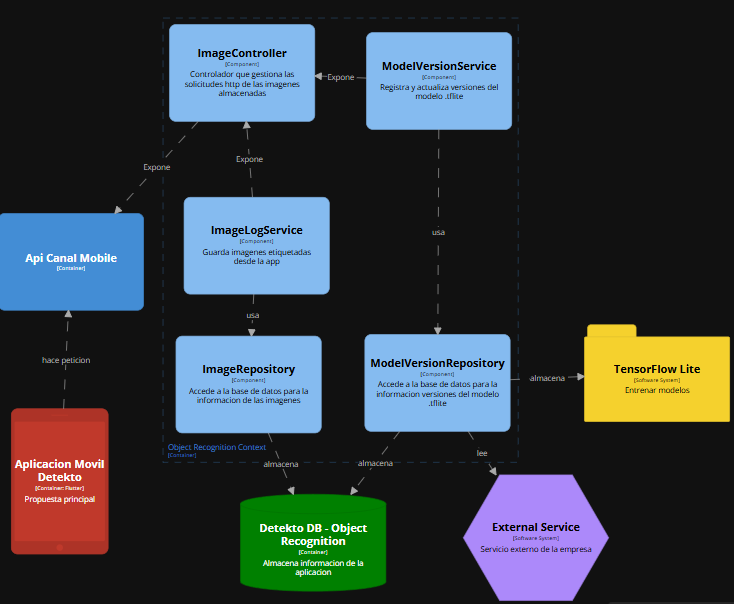
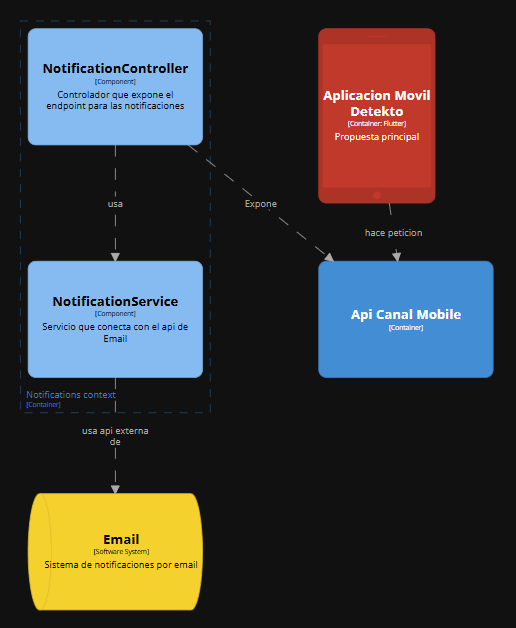

# Softwarinos - Report

  

# Universdiad Peruana de Ciencias Aplicadas

# INGENIERÍA DE SOFTWARE

### Ciclo: 8

## CURSO: Arquitecturas De Software Emergentes | SECCIÓN 4253

Profesor: De Los Rios Fernandez, Christian Luis

# Proyecto de curso

## Informe de Trabajo Final

#### StartUp: Softwarinos

#### Producto: Detekto

### Integrantes:

| Integrantes                            | Codigo     |
| -------------------------------------- | ---------- |
|  Ampudia Flores, Jose Carlos Isaac| u202112936 |
|  De La Piedra Quintanilla, Erwin Miquel      | U202112179 |
|  Elsner De La Torre Ugarte, Julio Esteban         | u202111654 |
| Gutierrez Zumaeta, Manuel Alonso           | U202112353 |

#### Ciclo 2025-10

##### Abril, 2025

---

# Registro de Versiones del informe

| Versión | Fecha | Autor | Descripción de modificación |
|---------|-------|--------|------------------------------|
| 0.1     |       |        |                              |
| 0.2     |       |        |                              |
| 0.3     |       |        |                              |
| 0.4     |       |        |                              |
| 0.5     |       |        |                              |

# Project Report Collaboration Insights
Para el desarrollo del proyecto, se ha utilizado la plataforma de GitHub para el control correcto de versiones y la colaboración de los integrantes del equipo. A continuación se presenta el link directo a la organización del equipo:

**Link de organización Softwarinos:**  
[https://github.com/Emergentes-Softwarinos](https://github.com/Emergentes-Softwarinos)

## TB1

Para la entrega de la TB1 se realizó una reunión donde se asignaron las responsabilidades a cada integrante del equipo. A continuación se muestra la siguiente tabla con los detalles:

| Integrante           | Responsabilidad |
|----------------------|-----------------|
| José Ampudia         |                 |
| Manuel Gutierrez     |                 |
| Miquel De la Piedra  |                 |
| Julio De la Torre    |   Diagrama C4 Y todos sus aspectos              |

Durante la elaboración de las aplicaciones, tanto web como mobile, se realizaron *commits* respectivos con el fin de mantener el orden y un control de versiones eficiente.

Para tener mejor precisión en los integrantes del equipo, a continuación presentamos los usuarios de GitHub de los integrantes:

- José Ampudia (@IsaacAmp24)  
- Manuel Gutierrez (@ManuGZ)  
- Miquel De la Piedra (@MiquelDlp)  
- Julio De la Torre (@)  

A continuación se presentan las capturas del repositorio de GitHub donde se realizaron los avances correspondientes.

# Tabla de contenidos

# Studen Outcome

# Capítulo I: Introducción
## 1.1. Startup Profile
### 1.1.1. Descripción de la Startup
### 1.1.2. Perfiles de integrantes del equipo
## 1.2. Solution Profile
### 1.2.1 Antecedentes y problemática
### 1.2.2 Lean UX Process.
#### 1.2.2.1. Lean UX Problem Statements.
#### 1.2.2.2. Lean UX Assumptions.
#### 1.2.2.3. Lean UX Hypothesis Statements.
#### 1.2.2.4. Lean UX Canvas.
## 1.3. Segmentos objetivo.
# Capítulo II: Requirements Elicitation & Analysis
## 2.1. Competidores.
### 2.1.1. Análisis competitivo.
### 2.1.2. Estrategias y tácticas frente a competidores.
## 2.2. Entrevistas.
### 2.2.1. Diseño de entrevistas.
### 2.2.2. Registro de entrevistas.
### 2.2.3. Análisis de entrevistas.
## 2.3. Needfinding.
### 2.3.1. User Personas.
### 2.3.2. User Task Matrix.
### 2.3.3. Empathy Mapping.
### 2.3.4. As-is Scenario Mapping.
## 2.4. Ubiquitous Language.
# Capítulo III: Requirements Specification
## 3.1. To-Be Scenario Mapping.
## 3.2. User Stories.
## 3.3. Impact Mapping.
## 3.4. Product Backlog.
# Capítulo IV: Strategic-Level Software Design.
## 4.1. Strategic-Level Attribute-Driven Design.
### 4.1.1. Design Purpose.
### 4.1.2. Attribute-Driven Design Inputs.
#### 4.1.2.1. Primary Functionality (Primary User Stories).
#### 4.1.2.3. Constraints.
### 4.1.2.2. Technical Stories
### 4.1.3. Architectural Drivers Backlog.
### 4.1.3. Architectural Drivers Backlog
### 4.1.4. Architectural Design Decisions.
### 4.1.4. Architectural Design Decisions
### 4.1.5. Quality Attribute Scenario Refinements.
### 4.1.5. Quality Attribute Scenario Refinements
## 4.2. Strategic-Level Domain-Driven Design.
### 4.2.1. EventStorming.
### 4.2.2. Candidate Context Discovery.
### 4.2.3. Domain Message Flows Modeling.
### 4.2.4. Bounded Context Canvases.
### 4.2.5. Context Mapping.
## 4.3. Software Architecture.
### 4.3.1. Software Architecture System Landscape Diagram.
### 4.3.1. Software Architecture Context Level Diagrams.
### 4.3.2. Software Architecture Container Level Diagrams.
### 4.3.3. Software Architecture Deployment Diagrams.

# Capítulo V: Tactical-Level Software Design.
## 5.1. Bounded Context: IAM
### 5.1.1. Domain Layer.
En la capa de dominio del contexto de IAM de la aplicacion, se definen las entidades del usuario y roles. El usuario representa a diferentes tipos de usuarios que interactuan con la aplicacion. Los roles definen los permisos y privilegios de cada usuario.

### Aggregate 1: Usuario

| **Nombre** | **Categoría** | **Proposito** |
|------------|----------------|----------------|
| Usuario    | Entidad        | Representa a un usuario de la aplicación de Detekto, y contiene información sobre la identidad y los roles del usuario. |

#### Atributos del Usuario

| **Nombre** | **Tipo de dato** | **Visibilidad** | **Descripción** |
|------------|------------------|-----------------|-----------------|
| id         | UUID             | Privado         | Identificador único del usuario. |
| nombre     | String           | Privado         | Nombre del usuario. |
| email      | String           | Privado         | Correo electrónico del usuario. |
| password   | String           | Privado         | Contraseña del usuario. |
| fechaCreacion | DateTime      | Privado         | Fecha de creación del usuario. |

#### Metodos del Usuario

| **Nombre** | **Tipo de retorno** | **Visibilidad** | **Descripción** |
|------------|---------------------|-----------------|-----------------|
| Constructor | Void | Public | Constructor de la clase Usuario. |
| authenticateUser | Boolean | Public | Autentica al usuario utilizando su correo electrónico y contraseña. |

### Aggregate 2: Role

| **Nombre** | **Categoría** | **Proposito** |
|------------|----------------|----------------|
| Role       | Entidad        | Representa un rol de usuario en la aplicación de Detekto, y contiene información sobre los permisos asociados a ese rol. |

#### Atributos del Role

| **Nombre** | **Tipo de dato** | **Visibilidad** | **Descripción** |
|------------|------------------|-----------------|-----------------|
| id         | UUID             | Privado         | Identificador único del rol. |
|
| nombre     | String           | Privado         | Nombre del rol. |
| permisos   | List<String>     | Privado         | Lista de permisos asociados al rol. |

#### Metodos del Role

| **Nombre** | **Tipo de retorno** | **Visibilidad** | **Descripción** |
|------------|---------------------|-----------------|-----------------|
| Constructor | Void | Public | Constructor de la clase Role. |
| addPermission | Void | Public | Agrega un permiso al rol. |
| getPermissions | List<String> | Public | Devuelve la lista de permisos asociados al rol. |

### 5.1.2. Interface Layer.
En la capa de interfaz del contexto de IAM de la aplicacion, se definen los controladores y servicios que manejan las solicitudes y respuestas de la API. Los controladores son responsables de recibir las solicitudes HTTP y devolver las respuestas correspondientes.

### Controller 1: UsersController

| **Nombre** | **Categoría** | **Proposito** |
|------------|----------------|----------------|
| UsersController | Controlador | Maneja las solicitudes relacionadas con los usuarios, como la autenticación y la creación de nuevos usuarios. |

#### Atributos del UsersController

| **Nombre** | **Tipo de dato** | **Visibilidad** | **Descripción** |
|------------|------------------|-----------------|-----------------|
| userService | UserService     | Privado         | Servicio que maneja la lógica de negocio relacionada con los usuarios. |
| roleService | RoleService     | Privado         | Servicio que maneja la lógica de negocio relacionada con los roles. |

#### Metodos del UsersController

| **Nombre** | **Tipo de retorno** | **Visibilidad** | **Descripción** |
|------------|---------------------|-----------------|-----------------|
| authenticateUser | ResponseEntity | Public | Metodo para el inicio de sesion de un usuario usando credenciales y devuelve un token JWT. |
| registerUser | ResponseEntity | Public | Metodo para registrar un nuevo usuario en la aplicacion. |
| getAllUsers | ResponseEntity | Public | Metodo para obtener todos los usuarios registrados en la aplicacion. |
| getUserById | ResponseEntity | Public | Metodo para obtener un usuario por su ID. |
| updateUser | ResponseEntity | Public | Metodo para actualizar la informacion de un usuario. |
| deleteUser | ResponseEntity | Public | Metodo para eliminar un usuario de la aplicacion. |
| getUserRoles | ResponseEntity | Public | Metodo para obtener los roles de un usuario. |

### Controller 2: RolesController

| **Nombre** | **Categoría** | **Proposito** |
|------------|----------------|----------------|
| RolesController | Controlador | Maneja las solicitudes relacionadas con los roles, como la creación y asignación de roles a usuarios. |

#### Atributos del RolesController

| **Nombre** | **Tipo de dato** | **Visibilidad** | **Descripción** |
|------------|------------------|-----------------|-----------------|
| roleService | RoleService     | Privado         | Servicio que maneja la lógica de negocio relacionada con los roles. |
| userService | UserService     | Privado         | Servicio que maneja la lógica de negocio relacionada con los usuarios. |

#### Metodos del RolesController

| **Nombre** | **Tipo de retorno** | **Visibilidad** | **Descripción** |
|------------|---------------------|-----------------|-----------------|
| getAllRoles | ResponseEntity | Public | Metodo para obtener todos los roles disponibles en la aplicacion. |
| assignRoleToUser | ResponseEntity | Public | Metodo para asignar un rol a un usuario. |
| removeRoleFromUser | ResponseEntity | Public | Metodo para eliminar un rol de un usuario. |

### 5.1.3. Application Layer.
En la capa de aplicacion del contexto de IAM de la aplicacion, se definen los servicios que manejan la logica de negocio relacionada con los usuarios y roles. Estos servicios son utilizados por los controladores para realizar las operaciones necesarias.

### Service 1: UserService
| **Nombre** | **Categoría** | **Proposito** |
|------------|----------------|----------------|
| UserService | Servicio       | Maneja la logica de negocio relacionada con los usuarios, como la autenticacion y la gestion de usuarios. |

### Atributos del UserService

| **Nombre** | **Tipo de dato** | **Visibilidad** | **Descripción** |
|------------|------------------|-----------------|-----------------|
| userRepository | UserRepository | Privado         | Repositorio que maneja la persistencia de los usuarios. |
| passwordEncoder | PasswordEncoder | Privado         | Codificador de contraseñas para la autenticacion de usuarios. |
| jwtHandler | JwtHandler | Privado         | Manejador de tokens JWT para la autenticacion de usuarios. |

#### Metodos del UserService

| **Nombre** | **Tipo de retorno** | **Visibilidad** | **Descripción** |
|------------|---------------------|-----------------|-----------------|
| authenticateUser | User | Public | Autentica a un usuario utilizando su correo electronico y contraseña. |
| registerUser | User | Public | Registra un nuevo usuario en la aplicacion. |
| getAllUsers | List<User> | Public | Devuelve todos los usuarios registrados en la aplicacion. |
| updateUser | User | Public | Actualiza la informacion de un usuario. |
| deleteUser | Void | Public | Elimina un usuario de la aplicacion. |
| getUserById | User | Public | Devuelve un usuario por su ID. |
| getUserByEmail | User | Public | Devuelve un usuario por su correo electronico. |
| getUserRoles | List<Role> | Public | Devuelve los roles de un usuario. |
| assignRoleToUser | Void | Public | Asigna un rol a un usuario. |

#### Service 2: RoleService

| **Nombre** | **Categoría** | **Proposito** |
|------------|----------------|----------------|
| RoleService | Servicio       | Maneja la logica de negocio relacionada con los roles, como la creacion y asignacion de roles a usuarios. |

#### Atributos del RoleService

| **Nombre** | **Tipo de dato** | **Visibilidad** | **Descripción** |
|------------|------------------|-----------------|-----------------|
| roleRepository | RoleRepository | Privado         | Repositorio que maneja la persistencia de los roles. |

#### Metodos del RoleService

| **Nombre** | **Tipo de retorno** | **Visibilidad** | **Descripción** |
|------------|---------------------|-----------------|-----------------|
| getAllRoles | List<Role> | Public | Devuelve todos los roles disponibles en la aplicacion. |
| assignRoleToUser | Void | Public | Asigna un rol a un usuario. |
| removeRoleFromUser | Void | Public | Elimina un rol de un usuario. |

### 5.1.4. Infrastructure Layer.
En la capa de infraestructura del contexto de IAM de la aplicacion, se definen los repositorios que manejan la persistencia de los usuarios y roles. Estos repositorios son utilizados por los servicios para realizar las operaciones necesarias.

### Repository 1: UserRepository

| **Nombre** | **Categoría** | **Proposito** |
|------------|----------------|----------------|
| UserRepository | Repositorio    | Maneja la persistencia de los usuarios en la base de datos. |

#### Metodos del UserRepository

| **Nombre** | **Tipo de retorno** | **Visibilidad** | **Descripción** |
|------------|---------------------|-----------------|-----------------|
| findByEmail | User | Public | Busca un usuario por su correo electronico. |
| findById | User | Public | Busca un usuario por su ID. |
| existsByEmail | Boolean | Public | Verifica si un usuario existe por su correo electronico. |
| save | User | Public | Guarda un usuario en la base de datos. |
| delete | Void | Public | Elimina un usuario de la base de datos. |

### Repository 2: RoleRepository

| **Nombre** | **Categoría** | **Proposito** |
|------------|----------------|----------------|
| RoleRepository | Repositorio    | Maneja la persistencia de los roles en la base de datos. |

#### Metodos del RoleRepository

| **Nombre** | **Tipo de retorno** | **Visibilidad** | **Descripción** |
|------------|---------------------|-----------------|-----------------|
| findById | Role | Public | Busca un rol por su ID. |
| findByName | Role | Public | Busca un rol por su nombre. |
| save | Role | Public | Guarda un rol en la base de datos. |
| deleteById | Void | Public | Elimina un rol de la base de datos. |

### 5.1.6. Bounded Context Software Architecture Component Level Diagrams.
Esta seccion presenta los diagramas de componentes de la arquitectura de software del contexto de IAM. Estos diagramas muestran la estructura y las relaciones entre los diferentes componentes del sistema.

### 5.1.7. Bounded Context Software Architecture Code Level Diagrams.
En esta seccion, el equipo de Softwarinos presenta la implementacion de los componentes dentro de cada contexto.

  - **Domain Layer Class Diagrams**: Muestra la estructura de las clases y sus relaciones en el contexto de IAM.

  - **Database Design Diagram**: Presenta el diseño de la base de datos, incluyendo las tablas y sus relaciones.

#### 5.1.7.1. Bounded Context Domain Layer Class Diagrams.
En esta seccion se presentan los diagramas de clases del contexto de IAM, en el que se muestrran las entidades claves para la autenticacion del usuario, los roles, junto la relacion que tienen los mismos

#### 5.1.7.2. Bounded Context Database Design Diagram.
En esta seccion, el diagrama de base de datos nos muestra la estructura de las tablas y sus relaciones en el contexto de IAM. Este diagrama es fundamental para entender cómo se almacenan y gestionan los datos en la aplicación.

## 5.2. Bounded Context: OBJECT RECOGNITION
### 5.2.1. Domain Layer.
En la capa de dominio del contexto de Object-Recognition de la aplicación, se definen las entidades centrales que permiten registrar y gestionar los datos generados por el reconocimiento visual de herramientas y materiales. Este contexto no realiza inferencias directamente, sino que registra los resultados obtenidos desde la app móvil y permite el seguimiento de versiones del modelo de reconocimiento.

### Aggregate 1: ImageRecognition

| **Nombre** | **Categoría** | **Proposito** |
|------------|----------------|----------------|
| ImageRecognition | Entidad        | Representa una imagen escaneada por la app móvil que ha sido identificada mediante reconocimiento visual. Guarda el resultado, la confianza del modelo, y el producto reconocido. |

#### Atributos del ImageRecognition

| **Nombre** | **Tipo de dato** | **Visibilidad** | **Descripción** |
|------------|------------------|-----------------|-----------------|
| id         | UUID             | Privado         | Identificador único de la imagen reconocida. |
| nombreArchivo | String           | Privado         | Nombre del archivo de la imagen escaneada. |
| resultado  | String           | Privado         | Resultado del reconocimiento visual (Ej: "Destornillador"). |
| fechaEscaneo | LocalDateTime | Privado         | Fecha y hora en que se realizó el escaneo. |
| productoId | UUID | Privado | Identificador al producto reconocido (referencia al contexto externo **SALES**). |
| estado | EstadoReconocimiento | Privado | Estado del reconocimiento (Ej: "Pendiente", "Exitoso", "Fallido"). |

#### Metodos del ImageRecognition

| **Nombre** | **Tipo de retorno** | **Visibilidad** | **Descripción** |
|------------|---------------------|-----------------|-----------------|
| Constructor | Void | Public | Constructor de la clase ImageRecognition. |
| asociarProducto | Void | Public | Asocia un producto al reconocimiento de la imagen. |
| actualizarEstado | Void | Public | Actualiza el estado del reconocimiento. |

### Aggregate 2: VersionModeloReconocimiento

| **Nombre** | **Categoría** | **Proposito** |
|------------|----------------|----------------|
| VersionModeloReconocimiento | Entidad        | 	Representa una versión del modelo de reconocimiento visual utilizado en la app Detekto, incluyendo información sobre la fecha de implementación y el estado del modelo. |

#### Atributos del VersionModeloReconocimiento

| **Nombre** | **Tipo de dato** | **Visibilidad** | **Descripción** |
|------------|------------------|-----------------|-----------------|
| id         | UUID             | Privado         | Identificador único de la versión del modelo. |
| version   | String           | Privado         | Número de versión del modelo (Ej: "1.0.0"). |
| rutaModelo | String           | Privado         | Ruta del modelo .tflite utilizado para el reconocimiento. |
| fechaImplementacion | LocalDateTime | Privado | Fecha y hora en que se implementó la versión del modelo. |

#### Metodos del VersionModeloReconocimiento

| **Nombre** | **Tipo de retorno** | **Visibilidad** | **Descripción** |
|------------|---------------------|-----------------|-----------------|
| Constructor | Void | Public | Constructor de la clase VersionModeloReconocimiento. |
| esVersionActual | Boolean | Public | Verifica si la versión del modelo es la actual. |

#### Enum 1: EstadoReconocimiento

| **Nombre** | **Categoría** | **Proposito** |
|------------|----------------|----------------|
| EstadoReconocimiento | Enumeración   | Enum que representa los posibles estados de un reconocimiento visual. |

#### Valores del Enum
  - **PENDIENTE**: El reconocimiento está pendiente de ser procesado.
  - **EXITOSO**: El reconocimiento se realizó con éxito y se obtuvo un resultado.
  - **FALLIDO**: El reconocimiento falló y no se obtuvo un resultado.

### 5.2.2. Interface Layer.
En esta capa se define el controlador encargado de recibir solicitudes relacionadas con el registro y gestión de imágenes reconocidas. Aunque el reconocimiento ocurre en la app móvil, el backend permite guardar y auditar estos eventos.

#### Controller: ReconocimientoController

| **Nombre**                | **Categoría** | **Propósito** |
|---------------------------|---------------|---------------|
| ReconocimientoController  | Controlador   | Maneja las solicitudes HTTP relacionadas con la recepción de imágenes reconocidas desde la app móvil. |

**Métodos**

| **Nombre**           | **Tipo de retorno** | **Visibilidad** | **Descripción** |
|----------------------|---------------------|-----------------|-----------------|
| registrarImagen      | ResponseEntity      | Público         | Recibe una imagen reconocida y la registra en el sistema. |
| obtenerPorProducto   | ResponseEntity      | Público         | Devuelve las imágenes asociadas a un determinado producto. |
| obtenerEstadisticas  | ResponseEntity      | Público         | Devuelve estadísticas sobre los resultados del reconocimiento. |

### 5.2.3. Application Layer.
En esta capa se orquesta la lógica del dominio. El servicio principal permite registrar imágenes y asociarlas con una versión del modelo.

#### Service: ReconocimientoService

| **Nombre**               | **Categoría** | **Propósito** |
|--------------------------|----------------|----------------|
| ReconocimientoService    | Servicio       | Encapsula la lógica de negocio para registrar imágenes reconocidas y asociarlas a modelos y productos. |

**Métodos**

| **Nombre**           | **Tipo de retorno**       | **Visibilidad** | **Descripción** |
|----------------------|---------------------------|-----------------|-----------------|
| registrarImagen      | ImagenReconocida          | Público         | Registra una imagen reconocida con su predicción y versión del modelo. |
| asociarProducto      | Void                      | Público         | Asocia un producto a una imagen previamente registrada. |
| actualizarEstado     | Void                      | Público         | Cambia el estado de una imagen reconocida. |

#### Service: VersionModeloService

| **Nombre**            | **Categoría** | **Propósito** |
|-----------------------|---------------|----------------|
| ModelVersionService   | Servicio       | Maneja la lógica de negocio relacionada con el control de versiones del modelo de reconocimiento visual. |

**Métodos**

| **Nombre**                  | **Tipo de retorno**               | **Visibilidad** | **Descripción** |
|-----------------------------|-----------------------------------|-----------------|-----------------|
| registrarNuevaVersion       | VersionModeloReconocimiento       | Público         | Registra una nueva versión del modelo. |
| establecerComoActual        | Void                              | Público         | Marca una versión como la actual. |
| obtenerVersionActual        | VersionModeloReconocimiento       | Público         | Devuelve la versión actual en uso. |
| listarVersiones             | List<VersionModeloReconocimiento> | Público         | Retorna todas las versiones del modelo. |

### 5.2.4. Infrastructure Layer.
Esta capa se encarga de manejar la persistencia de las entidades del dominio, así como integrarse con sistemas externos si se requiere almacenar imágenes o versiones del modelo.

#### Repository: ImagenReconocidaRepository

| **Nombre**                  | **Categoría** | **Propósito** |
|-----------------------------|----------------|----------------|
| ImagenReconocidaRepository  | Repositorio    | Accede a la base de datos para guardar y recuperar imágenes reconocidas. |

**Métodos**

| **Nombre**           | **Tipo de retorno**            | **Visibilidad** | **Descripción** |
|----------------------|--------------------------------|-----------------|-----------------|
| save                 | ImagenReconocida               | Público         | Guarda una nueva imagen reconocida. |
| findByProductoId     | List<ImagenReconocida>         | Público         | Recupera imágenes por ID de producto. |

---

#### Repository: VersionModeloRepository

| **Nombre**             | **Categoría** | **Propósito** |
|------------------------|----------------|----------------|
| VersionModeloRepository | Repositorio   | Accede a las versiones de los modelos cargados. |

**Métodos**

| **Nombre**       | **Tipo de retorno**                 | **Visibilidad** | **Descripción** |
|------------------|-------------------------------------|-----------------|-----------------|
| save             | VersionModeloReconocimiento         | Público         | Guarda una nueva versión del modelo. |
| findActual       | VersionModeloReconocimiento         | Público         | Recupera la versión del modelo marcada como actual. |

### 5.2.6. Bounded Context Software Architecture Component Level Diagrams.
Esta seccion presenta los diagramas de componentes de la arquitectura de software del contexto de **OBJECT RECOGNITION**. Estos diagramas muestran la estructura y las relaciones entre los diferentes componentes del sistema.

### 5.2.7. Bounded Context Software Architecture Code Level Diagrams.
#### 5.2.7.1. Bounded Context Domain Layer Class Diagrams.
En esta seccion se presentan los diagramas de clases del contexto de OBJECT RECOGNITION, en el que se muestrran las entidades claves para la gestion del reconocimiento de objetos, junto la relacion que tienen los mismos.

#### 5.2.7.2. Bounded Context Database Design Diagram.
En esta seccion, el diagrama de base de datos nos muestra la estructura de las tablas y sus relaciones en el contexto de OBJECT RECOGNITION. Este diagrama es fundamental para entender cómo se almacenan y gestionan los datos en la aplicación.

## 5.3. Bounded Context: SALES
### 5.3.1. Domain Layer.

En la capa de dominio del contexto de SALES de la aplicación, se definen las entidades principales que permiten registrar y gestionar las ventas realizadas por los usuarios.  
Una venta contiene productos, cantidades, totales y la información del cliente que realizó la compra.

### Aggregate 1: Sale

| **Nombre** | **Categoría** | **Propósito** |
|------------|----------------|----------------|
| Sale       | Entidad        | Representa una venta realizada dentro de la aplicación, incluyendo la fecha, los productos vendidos, el cliente y el estado de la transacción. |

#### Atributos del Sale

| **Nombre**      | **Tipo de dato**  | **Visibilidad** | **Descripción**                                  |
|-----------------|-------------------|------------------|--------------------------------------------------|
| id              | UUID              | Privado          | Identificador único de la venta.                 |
| fecha           | DateTime          | Privado          | Fecha en la que se realizó la venta.             |
| total           | Decimal           | Privado          | Monto total de la venta.                         |
| metodoPago      | String            | Privado          | Medio de pago utilizado por el cliente.          |
| usuarioId       | UUID              | Privado          | ID del usuario que realizó la venta.             |
| estado          | EstadoVenta       | Privado          | Estado actual de la venta.                       |
| items           | List<Product>   | Privado          | Lista de productos vendidos en la transacción.   |

#### Métodos del Sale

| **Nombre**          | **Tipo de retorno** | **Visibilidad** | **Descripción**                                 |
|---------------------|---------------------|------------------|-------------------------------------------------|
| calcularTotal       | Decimal             | Public           | Calcula el monto total de la venta.             |
| marcarComoPagada    | Void                | Public           | Cambia el estado de la venta a "PAGADA".        |
| cancelar            | Void                | Public           | Cancela la venta cambiando su estado.           |

### Aggregate 2: Product

| **Nombre**   | **Categoría** | **Propósito** |
|--------------|----------------|----------------|
| Product    | Entidad        | Representa un producto incluido en una venta, con su cantidad y precio unitario. |

#### Atributos del Product

| **Nombre**        | **Tipo de dato** | **Visibilidad** | **Descripción**                             |
|-------------------|------------------|------------------|---------------------------------------------|
| productoId        | UUID             | Privado          | ID del producto vendido.                    |
| cantidad          | Int              | Privado          | Cantidad vendida del producto.              |
| precioUnitario    | Decimal          | Privado          | Precio por unidad del producto en la venta. |

#### Métodos del Product

| **Nombre**           | **Tipo de retorno** | **Visibilidad** | **Descripción**                                 |
|----------------------|---------------------|------------------|-------------------------------------------------|
| calcularSubtotal     | Decimal             | Public           | Calcula el subtotal del ítem (cantidad * precio). |

### Enumerado: EstadoVenta

| **Nombre**     | **Tipo** | **Propósito**                                      |
|----------------|----------|----------------------------------------------------|
| EstadoVenta    | Enum     | Define el estado de una venta dentro del sistema.  |

**Valores posibles:**
- PENDIENTE  
- PAGADA  
- CANCELADA

### 5.3.2. Interface Layer.
En la capa de interfaz del contexto de SALES de la aplicacion, se definen los controladores y servicios que manejan las solicitudes y respuestas de la API. Los controladores son responsables de recibir las solicitudes HTTP y devolver las respuestas correspondientes.

### Controller 1: SalesController

| **Nombre** | **Categoría** | **Proposito** |
|------------|----------------|----------------|
| SalesController | Controlador | Expone endpoints públicos para la gestión de ventas. |

#### Atributos del SalesController

| **Nombre** | **Tipo de dato** | **Visibilidad** | **Descripción** |
|------------|------------------|-----------------|-----------------|
| saleService | SaleService     | Privado         | Servicio que maneja la lógica de negocio de las ventas. |

#### Metodos del SalesController

| **Nombre**         | **Tipo de retorno** | **Visibilidad** | **Descripción**                                                                 |
|--------------------|---------------------|------------------|----------------------------------------------------------------------------------|
| registerSale        | ResponseEntity      | Public           | Método para registrar una nueva venta en el sistema.                            |
| getAllSales         | ResponseEntity      | Public           | Método para obtener todas las ventas registradas en la aplicación.              |
| getSaleById         | ResponseEntity      | Public           | Método para obtener los detalles de una venta por su ID.                        |
| deleteSale          | ResponseEntity      | Public           | Método para eliminar una venta existente.                                       |
| getSalesByUserId    | ResponseEntity      | Public           | Método para obtener todas las ventas realizadas por un usuario específico.      |

### 5.3.3. Application Layer.
En la capa de aplicacion del contexto de IAM de la aplicacion, se definen los servicios que manejan la logica de negocio relacionada con los usuarios y roles. Estos servicios son utilizados por los controladores para realizar las operaciones necesarias.

### Service 1: SalesService

| **Nombre**       | **Categoría** | **Propósito**                                                                 |
|------------------|----------------|--------------------------------------------------------------------------------|
| SalesService     | Servicio       | Maneja la lógica de negocio relacionada con el registro, consulta y gestión de ventas. |

### Atributos del SalesService

| **Nombre**         | **Tipo de dato**    | **Visibilidad** | **Descripción**                                             |
|--------------------|---------------------|------------------|-------------------------------------------------------------|
| salesRepository    | SalesRepository     | Privado          | Repositorio que gestiona la persistencia de las ventas.     |

#### Métodos del SalesService

| **Nombre**           | **Tipo de retorno** | **Visibilidad** | **Descripción**                                                                  |
|----------------------|---------------------|------------------|----------------------------------------------------------------------------------|
| registerSale         | Sale                | Public           | Registra una nueva venta en el sistema.                                          |
| getAllSales          | List<Sale>          | Public           | Retorna todas las ventas registradas en la aplicación.                          |
| getSaleById          | Sale                | Public           | Obtiene los detalles de una venta a partir de su ID.                             |
| deleteSale           | Void                | Public           | Elimina una venta existente por su ID.                                           |
| getSalesByUserId     | List<Sale>          | Public           | Devuelve las ventas asociadas a un usuario específico.                          |

### 5.3.4. Infrastructure Layer.
En la capa de infraestructura del contexto de SALES de la aplicacion, se definen los repositorios que manejan la persistencia de los usuarios y roles. Estos repositorios son utilizados por los servicios para realizar las operaciones necesarias.

### Repository 1: SalesRepository

| **Nombre**         | **Categoría** | **Propósito**                                                       |
|--------------------|----------------|----------------------------------------------------------------------|
| SalesRepository    | Repositorio    | Maneja la persistencia de las ventas en la base de datos.           |

#### Métodos del SalesRepository

| **Nombre**         | **Tipo de retorno** | **Visibilidad** | **Descripción**                                                      |
|--------------------|---------------------|------------------|----------------------------------------------------------------------|
| findAll            | List<Sale>          | Public           | Retorna todas las ventas almacenadas.                                |
| findById           | Sale                | Public           | Busca una venta por su ID.                                           |
| findByUserId       | List<Sale>          | Public           | Devuelve las ventas asociadas a un usuario específico.               |
| save               | Sale                | Public           | Guarda una venta en la base de datos.                                |
| deleteById         | Void                | Public           | Elimina una venta específica de la base de datos.                    |

### 5.3.6. Bounded Context Software Architecture Component Level Diagrams.
Esta seccion presenta los diagramas de componentes de la arquitectura de software del contexto de **SALES**. Estos diagramas muestran la estructura y las relaciones entre los diferentes componentes del sistema.

### 5.3.7. Bounded Context Software Architecture Code Level Diagrams.
En esta seccion, el equipo de Softwarinos presenta la implementacion de los componentes dentro de cada contexto.

  - **Domain Layer Class Diagrams**: Muestra la estructura de las clases y sus relaciones en el contexto de SALES.

  - **Database Design Diagram**: Presenta el diseño de la base de datos, incluyendo las tablas y sus relaciones.

#### 5.3.7.1. Bounded Context Domain Layer Class Diagrams.
En esta seccion se presentan los diagramas de clases del contexto de SALES, en el que se muestrran las entidades claves para la autenticacion del usuario, los roles, junto la relacion que tienen los mismos

#### 5.3.7.2. Bounded Context Database Design Diagram.
En esta seccion, el diagrama de base de datos nos muestra la estructura de las tablas y sus relaciones en el contexto de SALES. Este diagrama es fundamental para entender cómo se almacenan y gestionan los datos en la aplicación.

## 5.4. Bounded Context: NOTIFICATIONS
### 5.4.1. Domain Layer.
En la capa de dominio del contexto de Notifications, se definen las entidades y servicios que permiten gestionar el envío de notificaciones hacia los administradores o usuarios del sistema. Las notificaciones pueden enviarse a través de canales externos como el correo electrónico, y se lleva un registro de su estado.

#### Aggregate 1: Notificacion

| **Nombre**    | **Categoría** | **Propósito** |
|---------------|---------------|----------------|
| Notificacion  | Entidad       | Representa un mensaje dirigido a un usuario, el cual puede ser enviado mediante un canal externo como el correo electrónico. |

**Atributos**

| **Nombre**       | **Tipo de dato**     | **Visibilidad** | **Descripción** |
|------------------|----------------------|------------------|-----------------|
| id               | UUID                 | Privado          | Identificador único de la notificación. |
| destinatarioEmail| String               | Privado          | Correo del destinatario de la notificación. |
| asunto           | String               | Privado          | Título o asunto de la notificación. |
| mensaje          | String               | Privado          | Contenido del mensaje enviado. |
| fechaEnvio       | LocalDateTime        | Privado          | Fecha y hora en la que se intentó enviar la notificación. |
| estado           | EstadoNotificacion   | Privado          | Estado actual de la notificación (enviada, fallida, pendiente). |

**Métodos**

| **Nombre**             | **Tipo de retorno** | **Visibilidad** | **Descripción** |
|------------------------|---------------------|------------------|-----------------|
| Constructor            | Void                | Público          | Constructor de la clase. |
| marcarComoEnviada      | Void                | Público          | Cambia el estado a ENVIADA. |
| marcarComoFallida      | Void                | Público          | Cambia el estado a FALLIDA. |

#### Enum: EstadoNotificacion

| **Nombre**             | **Categoría** | **Propósito** |
|------------------------|---------------|----------------|
| EstadoNotificacion     | Enumeración   | Enum que representa el estado actual de una notificación enviada. |

**Valores del Enum**

  - **ENVIADA**: La notificación fue enviada exitosamente.
  - **FALLIDA**: La notificación no pudo ser enviada.
  - **PENDIENTE**: La notificación está pendiente de envío.

### 5.4.2. Interface Layer.
En esta capa se define el controlador que expone los endpoints para consultar o generar notificaciones desde otros módulos de la aplicación.

#### Controller: NotificacionesController

| **Nombre**                  | **Categoría** | **Propósito** |
|-----------------------------|---------------|----------------|
| NotificacionesController    | Controlador   | Maneja las solicitudes relacionadas con la generación y visualización de notificaciones. |

**Métodos**

| **Nombre**              | **Tipo de retorno** | **Visibilidad** | **Descripción** |
|-------------------------|---------------------|------------------|-----------------|
| enviarNotificacion      | ResponseEntity      | Público          | Recibe los datos de una notificación y la envía al destinatario. |
| listarNotificaciones    | ResponseEntity      | Público          | Devuelve la lista de notificaciones registradas. |
| obtenerPorEstado        | ResponseEntity      | Público          | Devuelve las notificaciones según su estado. |

### 5.4.3. Application Layer.
En esta capa se orquesta el envío de notificaciones, validando la lógica del negocio antes de delegar a la infraestructura el envío final.

#### Service: NotificacionService

| **Nombre**           | **Categoría** | **Propósito** |
|----------------------|---------------|----------------|
| NotificacionService  | Servicio      | Se encarga de validar, registrar y gestionar el proceso de envío de una notificación. |

**Métodos**

| **Nombre**                | **Tipo de retorno** | **Visibilidad** | **Descripción** |
|---------------------------|---------------------|------------------|-----------------|
| crearYEnviarNotificacion  | Notificacion        | Público          | Registra una nueva notificación y gestiona su envío. |
| listarNotificaciones      | List<Notificacion>  | Público          | Devuelve la lista de notificaciones registradas. |
| obtenerPorEstado          | List<Notificacion>  | Público          | Devuelve notificaciones según su estado. |

#### External Service Interface: EmailSender

| **Nombre**      | **Categoría** | **Propósito** |
|-----------------|---------------|----------------|
| EmailSender     | Interface     | Representa un proveedor externo de correo que permite el envío de notificaciones. |

**Métodos**

| **Nombre**           | **Tipo de retorno** | **Descripción** |
|----------------------|---------------------|-----------------|
| enviar               | Boolean             | Envía un correo al destinatario y retorna si fue exitoso. |

### 5.4.4. Infrastructure Layer.
Esta capa se encarga de la persistencia de las notificaciones y de su envío a través de sistemas externos como servicios de correo.

#### Repository: NotificacionRepository

| **Nombre**              | **Categoría** | **Propósito** |
|-------------------------|---------------|----------------|
| NotificacionRepository  | Repositorio   | Maneja la persistencia de las notificaciones. |

**Métodos**

| **Nombre**           | **Tipo de retorno**    | **Visibilidad** | **Descripción** |
|----------------------|------------------------|------------------|-----------------|
| save                 | Notificacion           | Público          | Guarda una notificación en la base de datos. |
| findByEstado         | List<Notificacion>     | Público          | Recupera notificaciones filtradas por estado. |
| findAll              | List<Notificacion>     | Público          | Devuelve todas las notificaciones registradas. |

### 5.4.6. Bounded Context Software Architecture Component Level Diagrams.
Esta seccion presenta los diagramas de componentes de la arquitectura de software del contexto de **NOTIFICATIONS**. Estos diagramas muestran la estructura y las relaciones entre los diferentes componentes del sistema.

### 5.4.7. Bounded Context Software Architecture Code Level Diagrams.
Esta seccion presenta la implementacion de los componentes dentro de cada contexto.

  - **Domain Layer Class Diagrams**: Muestra la estructura de las clases y sus relaciones en el contexto de NOTIFICATIONS.

  - **Database Design Diagram**: Presenta el diseño de la base de datos, incluyendo las tablas y sus relaciones.

#### 5.4.7.1. Bounded Context Domain Layer Class Diagrams.
En esta seccion se presenta el diagrama de clases del contexto de NOTIFICATIONS, en el que se muestrran las entidades primordiales para la gestion de las notificaciones, junto la relacion que tienen los mismos.

#### 5.4.7.2. Bounded Context Database Design Diagram.
En esta seccion, el diagrama de base de datos nos muestra la estructura de las tablas y sus relaciones en el contexto de NOTIFICATIONS. Este diagrama es fundamental para entender cómo se almacenan y gestionan los datos en la aplicación.

## 5.5. Bounded Context: TRACKING & MONITORING
### 5.5.1. Domain Layer.

En la capa de dominio del contexto de **Tracking & Monitoring**, se definen las entidades responsables de representar la ubicación de los usuarios y el seguimiento en tiempo real.  
Este módulo permite almacenar, actualizar y consultar la posición geográfica de un usuario para fines de monitoreo, seguridad o logística.

### Aggregate 1: Location

| **Nombre** | **Categoría** | **Propósito** |
|------------|----------------|----------------|
| Location   | Entidad        | Representa la ubicación geográfica de un usuario en un momento determinado. |

#### Atributos del Location

| **Nombre**     | **Tipo de dato** | **Visibilidad** | **Descripción**                                 |
|----------------|------------------|------------------|-------------------------------------------------|
| id             | UUID             | Privado          | Identificador único de la ubicación.            |
| userId         | UUID             | Privado          | Identificador del usuario al que pertenece.     |
| latitud        | Double           | Privado          | Coordenada de latitud.                          |
| longitud       | Double           | Privado          | Coordenada de longitud.                         |
| fechaHora      | DateTime         | Privado          | Fecha y hora en la que se registró la ubicación.|

#### Métodos del Location

| **Nombre**     | **Tipo de retorno** | **Visibilidad** | **Descripción**                                  |
|----------------|---------------------|------------------|--------------------------------------------------|
| actualizar     | Void                | Public           | Permite actualizar latitud y longitud.           |
| esReciente     | Boolean             | Public           | Indica si la ubicación fue registrada recientemente. |

### Aggregate 2: TrackingSession

| **Nombre**       | **Categoría** | **Propósito** |
|------------------|----------------|----------------|
| TrackingSession  | Entidad        | Representa una sesión de seguimiento activo de un usuario. |

#### Atributos del TrackingSession

| **Nombre**     | **Tipo de dato** | **Visibilidad** | **Descripción**                                       |
|----------------|------------------|------------------|-------------------------------------------------------|
| id             | UUID             | Privado          | Identificador único de la sesión.                     |
| userId         | UUID             | Privado          | Usuario que está siendo monitoreado.                  |
| inicio         | DateTime         | Privado          | Fecha y hora de inicio del seguimiento.               |
| fin            | DateTime?        | Privado          | Fecha y hora de finalización (puede ser nula).        |
| ubicaciones    | List<Location>   | Privado          | Lista de ubicaciones registradas durante la sesión.   |

#### Métodos del TrackingSession

| **Nombre**         | **Tipo de retorno** | **Visibilidad** | **Descripción**                                             |
|--------------------|---------------------|------------------|-------------------------------------------------------------|
| agregarUbicacion   | Void                | Public           | Añade una nueva ubicación al historial de la sesión.        |
| finalizarSesion    | Void                | Public           | Marca la sesión como finalizada.                           |
| obtenerRecorrido   | List<Location>      | Public           | Devuelve la lista de ubicaciones ordenadas cronológicamente.|

### 5.5.2. Interface Layer.
En la capa de interfaz del contexto de TRACKING & MONITORING de la aplicacion, se definen los controladores y servicios que manejan las solicitudes y respuestas de la API. Los controladores son responsables de recibir las solicitudes HTTP y devolver las respuestas correspondientes.

### Controller 1: MonitoringController

| **Nombre**           | **Categoría** | **Propósito**                                           |
|----------------------|----------------|----------------------------------------------------------|
| MonitoringController | Controlador    | Expone endpoints públicos para geolocalizar usuarios.    |

#### Atributos del MonitoringController

| **Nombre**         | **Tipo de dato**    | **Visibilidad** | **Descripción**                                         |
|--------------------|---------------------|------------------|----------------------------------------------------------|
| monitoringService  | MonitoringService   | Privado          | Servicio que contiene la lógica de negocio de localización. |

#### Métodos del MonitoringController

| **Nombre**       | **Tipo de retorno** | **Visibilidad** | **Descripción**                                                |
|------------------|---------------------|------------------|-----------------------------------------------------------------|
| getCurrentLocation | ResponseEntity    | Public           | Retorna la ubicación actual del usuario.                        |
| trackUserLocation  | ResponseEntity    | Public           | Realiza el seguimiento de un usuario en tiempo real.            |

### 5.5.3. Application Layer.

En la capa de aplicacion del contexto de TRACKING & MONITORING de la aplicacion, se definen los servicios que manejan la logica de negocio relacionada con los usuarios y roles. Estos servicios son utilizados por los controladores para realizar las operaciones necesarias.

### Service 1: MonitoringService

| **Nombre**          | **Categoría** | **Propósito**                                                  |
|---------------------|----------------|-----------------------------------------------------------------|
| MonitoringService   | Servicio       | Gestiona la lógica de negocio para la obtención de ubicación.  |

### Atributos del MonitoringService

| **Nombre**      | **Tipo de dato** | **Visibilidad** | **Descripción**                                        |
|------------------|------------------|------------------|--------------------------------------------------------|
| mapsApiClient    | MapsAPIClient    | Privado          | Cliente que consume la API de geolocalización externa. |

#### Métodos del MonitoringService

| **Nombre**       | **Tipo de retorno** | **Visibilidad** | **Descripción**                                               |
|------------------|---------------------|------------------|----------------------------------------------------------------|
| fetchLocation    | Location            | Public           | Consulta la ubicación del usuario mediante el sistema externo. |
| trackInRealtime  | Stream<Location>    | Public           | Inicia la monitorización en tiempo real de un usuario.         |

### 5.5.4. Infrastructure Layer.

Esta capa define el repositorio responsable de acceder y persistir los datos relacionados con la ubicación y sesiones de seguimiento en la base de datos del sistema.

### Repository 1: LocationRepository

| **Nombre**         | **Categoría** | **Propósito**                                                                 |
|--------------------|----------------|--------------------------------------------------------------------------------|
| LocationRepository | Repositorio    | Gestiona la persistencia de las ubicaciones geográficas de los usuarios.      |

#### Métodos del LocationRepository

| **Nombre**         | **Tipo de retorno**  | **Visibilidad** | **Descripción**                                                    |
|--------------------|----------------------|------------------|--------------------------------------------------------------------|
| save               | Location             | Public           | Guarda una nueva ubicación en la base de datos.                   |
| findByUserId       | List<Location>       | Public           | Obtiene todas las ubicaciones asociadas a un usuario.             |
| findLatestByUserId | Location             | Public           | Retorna la última ubicación registrada de un usuario.             |
| deleteByUserId     | Void                 | Public           | Elimina las ubicaciones asociadas a un usuario.                   |

### Repository 2: TrackingSessionRepository

| **Nombre**                | **Categoría** | **Propósito**                                                        |
|---------------------------|----------------|-----------------------------------------------------------------------|
| TrackingSessionRepository | Repositorio    | Administra el acceso a las sesiones de seguimiento de los usuarios.  |

#### Métodos del TrackingSessionRepository

| **Nombre**             | **Tipo de retorno**   | **Visibilidad** | **Descripción**                                                       |
|------------------------|-----------------------|------------------|------------------------------------------------------------------------|
| save                   | TrackingSession       | Public           | Guarda una nueva sesión de seguimiento.                               |
| findActiveByUserId     | TrackingSession       | Public           | Devuelve la sesión activa actual de un usuario, si existe.            |
| findById               | TrackingSession       | Public           | Busca una sesión por su identificador.                                |
| closeSessionById       | Void                  | Public           | Finaliza una sesión marcándola con fecha de cierre.                   |
| getSessionHistoryByUserId | List<TrackingSession> | Public        | Retorna todas las sesiones de seguimiento de un usuario.              |

### 5.5.6. Bounded Context Software Architecture Component Level Diagrams.
Esta seccion presenta los diagramas de componentes de la arquitectura de software del contexto de TRACKING & MONITORING. Estos diagramas muestran la estructura y las relaciones entre los diferentes componentes del sistema.

### 5.5.7. Bounded Context Software Architecture Code Level Diagrams.
En esta seccion, el equipo de Softwarinos presenta la implementacion de los componentes dentro de cada contexto.

- **Domain Layer Class Diagrams**: Muestra la estructura de las clases y sus relaciones en el contexto de TRACKING & MONITORING.

  - **Database Design Diagram**: Presenta el diseño de la base de datos, incluyendo las tablas y sus relaciones.

#### 5.5.7.1. Bounded Context Domain Layer Class Diagrams.

En esta seccion se presentan los diagramas de clases del contexto de TRACKING & MONITORING, en el que se muestrran las entidades claves para la autenticacion del usuario, los roles, junto la relacion que tienen los mismos

#### 5.5.7.2. Bounded Context Database Design Diagram.

En esta seccion, el diagrama de base de datos nos muestra la estructura de las tablas y sus relaciones en el contexto de TRACKING & MONITORING. Este diagrama es fundamental para entender cómo se almacenan y gestionan los datos en la aplicación.

# Capítulo VI: Solution UX Design
## 6.1. Style Guidelines.
En esta sección se definirán las guías visuales clave para el diseño de DETEKTO, incluyendo colores, tipografía, logotipo y tono de comunicación. Estos lineamentos asegurarán una identidad coherente y profesional que refleje los valores de confianza e innovación de la marc
### 6.1.1. General Style Guidelines.
Es fundamental considerar las decisiones y elementos visuales que respaldan los principios generales de diseño para DETEKTO. Por esta razón, resulta esencial definir aspectos clave como la identidad de marca, la paleta de colores y la tipografía. Además, es necesario establecer el tono de comunicación y el lenguaje utilizado, que abarcan características como divertido o serio, formal o casual, respetuoso o irreverente, y entusiasta o sereno.
### 6.1.2. Web, Mobile & Devices Style Guidelines.

  

DETEKTO representa innovación, confianza y eficiencia en la gestión y ventas y stock con reconocimiento por objetos con IA. Nuestra esencia radica en ofrecer soluciones tecnológicas modernas que permiten monitorear, optimizar y mejorar sus ventas. La marca es sinónimo de precisión, confiabilidad y una experiencia de usuario simplificada, orientada a un entorno urbano inteligente.

Logotipo: El logotipo de DETEKTO refleja la identidad de una marca moderna, segura y tecnológica. Mediante una combinación de colores vivos y un diseño minimalista pero sofisticado, el logo simboliza la eficiencia, la confianza y el uso de tecnología de vanguardia en la vigilancia de parqueo. Este logotipo debe transmitir una imagen clara de control, innovación y accesibilidad para usuarios y operadores.
Colores:

  

Se ha utilizado los colores blanco, negro y azul oscuro como colores principales para nuestro diseño.
🔵 Azul oscuro (#2E3447): El color azul oscuro se utiliza como color principal de la marca, aportando confianza, seguridad y modernidad. Representa la tecnología y la eficiencia que caracterizan a DETEKTO en su enfoque hacia la optimización del estacionamiento urbano. Es protagonista en los botones principales, encabezados y elementos destacados de la interfaz.

⚪ Blanco (#FFFFFF): El blanco se emplea como color de fondo predominante, transmitiendo limpieza, claridad y simplicidad en la experiencia del usuario. Sirve como base para resaltar los demás colores y garantizar una lectura fluida, orden visual y una navegación intuitiva.

⚫ Gris (#4F566B / #8E9099): Los tonos grises se utilizan para los textos secundarios, bordes de campos de entrada, íconos y elementos informativos. Brindan equilibrio visual, profesionalismo y elegancia. Este color apoya al azul oscuro sin competir con él, manteniendo una estética sobria y tecnológica.

Tipografía:

  

La tipografía utilizada para DETEKTO es Inter , la cual es, moderna y legible, con líneas limpias y claras. Se ha elegido una fuente que refleje la tecnología y la seguridad de la marca, mientras mantiene un aspecto novedoso y actual. Usaremos las variantes Regular, Medium, Semi-Bold y Bold.

Tonos de Comunicación:

- Formal / Confiable: En DETEKTO adoptamos un tono formal y profesional que transmite confianza y responsabilidad, especialmente en lo relacionado a la seguridad del usuario y la gestión de sus reservas. Sin embargo, mantenemos una comunicación cercana y comprensible, accesible para todos los usuarios que buscan una solución eficiente para estacionar.

- Respetuoso / Cercano: Siempre nos comunicamos con respeto, claridad y empatía. Entendemos las frustraciones comunes en la búsqueda de estacionamiento y respondemos con soluciones y mensajes que conectan con las verdaderas necesidades de nuestros usuarios, manteniendo una relación transparente y honesta.

- Entusiasta / Sereno: Transmitimos entusiasmo por cambiar la forma en que las personas se estacionan en la ciudad, destacando nuestra innovación tecnológica y eficiencia. Al mismo tiempo, mantenemos un tono sereno y confiable que le brinda al usuario la tranquilidad de saber que su experiencia con DETEKTOUp será rápida, segura y sin complicaciones.

## 6.2. Information Architecture.
### 6.2.2. Labeling Systems.

En esta sección se presenta el sistema de etiquetado que Detekto utilizará para facilitar la comprensión y navegación dentro de la plataforma, tanto en la aplicación como en la landing page. Los encabezados estarán organizados de forma clara, accesible y adaptada a los distintos perfiles de usuarios.

Inicio/Home: Vista principal con acceso a funcionalidades clave, como escaneo de productos, sincronización de stock, historial de ventas y alertas de inventario. Se incluirá una introducción breve sobre la misión de Detekto: optimizar la gestión de ventas y control de inventario en tiempo real usando tecnologías inteligentes.

Funcionalidades/Features: Se describirán las principales funcionalidades, como el reconocimiento automático de objetos, actualización en tiempo real del stock, generación de reportes de ventas, integración con sistemas de gestión y facilidad de uso para pequeños y medianos negocios. También se destacará el valor agregado de la automatización del proceso de inventariado mediante escaneo móvil.

Preguntas Frecuentes/FAQs: Se responderán preguntas comunes sobre cómo registrarse, realizar escaneos, sincronizar datos con sistemas externos, revisar el historial de stock y ventas, así como la configuración de notificaciones automáticas.

Contáctanos/Contact Us: Incluirá canales de atención como correo electrónico, WhatsApp y un formulario de contacto directo para soporte técnico o consultas comerciales.

### 6.2.3. Searching Systems.

En esta sección se presenta el sistema de etiquetado que <strong>Detekto</strong> utilizará para facilitar la comprensión y navegación dentro de la plataforma, tanto en la aplicación como en la landing page. Los encabezados estarán organizados de forma clara, accesible y adaptada a los distintos perfiles de usuarios.

<strong>Inicio/Home:</strong> Vista principal con acceso a funcionalidades clave, como escaneo de productos, sincronización de stock, historial de ventas y alertas de inventario. Se incluirá una introducción breve sobre la misión de Detekto: optimizar la gestión de ventas y control de inventario en tiempo real usando tecnologías inteligentes.

<strong>Funcionalidades/Features:</strong> Se describirán las principales funcionalidades, como el reconocimiento automático de objetos, actualización en tiempo real del stock, generación de reportes de ventas, integración con sistemas de gestión y facilidad de uso para pequeños y medianos negocios. También se destacará el valor agregado de la automatización del proceso de inventariado mediante escaneo móvil.

<strong>Preguntas Frecuentes/FAQs:</strong> Se responderán preguntas comunes sobre cómo registrarse, realizar escaneos, sincronizar datos con sistemas externos, revisar el historial de stock y ventas, así como la configuración de notificaciones automáticas.

<strong>Contáctanos/Contact Us:</strong> Incluirá canales de atención como correo electrónico, WhatsApp y un formulario de contacto directo para soporte técnico o consultas comerciales.

<strong>5.2.3. SEO Tags and Meta Tags</strong> 
Para optimizar la visibilidad de <strong>Detekto</strong> en los motores de búsqueda, se definirán las siguientes etiquetas SEO y metadatos para su landing page:

<strong>Title:</strong> Detekto | Gestión inteligente de stock y ventas con escaneo móvil. 
<strong>Description:</strong> Detekto - Escanea, reconoce productos y actualiza tu inventario en tiempo real desde tu celular. 
<strong>Keywords:</strong> gestión de ventas, control de stock, escaneo de productos, inventario inteligente, reconocimiento de objetos, Detekto app. 
<strong>Author:</strong> Detekto Team 
<strong>Canonical:</strong> [URL principal de la landing page, por definir]

<strong>6.2.3. Searching Systems</strong> 
El sistema de búsqueda en <strong>Detekto</strong> ha sido diseñado para brindar rapidez, precisión y facilidad de uso, adaptándose a las necesidades operativas de usuarios que gestionan inventario desde dispositivos móviles. Existen dos modalidades principales de búsqueda implementadas dentro de la plataforma:

<strong>1. Búsqueda por escaneo (Scan-to-Search)</strong> 
El núcleo de Detekto es su sistema de reconocimiento de objetos mediante cámara o escáner móvil. Al escanear un producto, el sistema:
<ul>
<li>Reconoce el objeto utilizando visión por computadora y machine learning.</li>
<li>Busca automáticamente el producto en la base de datos del inventario.</li>
<li>Devuelve los datos asociados, como nombre del producto, cantidad en stock, precio, historial de ventas y alertas relacionadas.</li>
</ul>
Esta búsqueda es ideal para situaciones de alta rotación de productos o actualización inmediata de inventario.

<strong>2. Búsqueda textual (Text Search)</strong> 
La aplicación también permite la búsqueda manual mediante texto para mayor flexibilidad. El usuario puede introducir:
<ul>
<li>Nombre del producto.</li>
<li>Código SKU.</li>
<li>Categoría o etiqueta personalizada.</li>
</ul>
El motor de búsqueda implementa funcionalidades de <em>autocompletado</em>, <em>tolerancia a errores tipográficos (fuzzy search)</em> y <em>filtros por estado de stock</em>, lo que facilita encontrar productos incluso en catálogos extensos.

<strong>Características adicionales:</strong>
<ul>
<li>Historial de búsquedas recientes.</li>
<li>Resultados ordenados por relevancia y frecuencia de actualización.</li>
<li>Acceso rápido desde la barra de navegación superior.</li>
</ul>
Estas funcionalidades permiten que tanto operadores de almacén como encargados de ventas accedan de forma inmediata a la información necesaria, optimizando la toma de decisiones y reduciendo errores operativos.

### 6.2.4. SEO Tags and Meta Tags.

Para optimizar la visibilidad de Detekto en los motores de búsqueda, se definirán las siguientes etiquetas SEO y metadatos para su landing page:

Title: Detekto | Gestión inteligente de stock y ventas con escaneo móvil.

Description: Detekto - Escanea, reconoce productos y actualiza tu inventario en tiempo real desde tu celular.

Keywords: gestión de ventas, control de stock, escaneo de productos, inventario inteligente, reconocimiento de objetos, Detekto app.

Author: Detekto Team

Canonical: [URL principal de la landing page, por definir]

### 6.2.5. Navigation Systems.

La navegación en <strong>Detekto</strong> se diseñará para ofrecer una experiencia fluida, intuitiva y centrada en las tareas más frecuentes del usuario relacionadas con la gestión de ventas e inventario.

<strong>Menú de navegación principal:</strong> Estará disponible en la parte inferior (en dispositivos móviles) o lateral (en tabletas), con acceso directo a secciones como “Inicio”, “Escanear Producto”, “Inventario”, “Ventas”, “Alertas” y “Perfil”. Este menú prioriza las acciones operativas más comunes en el flujo de trabajo de supervisores y vendedores.

<strong>Búsqueda centralizada:</strong> Se incluirá un campo de búsqueda visible y accesible desde la pantalla principal para localizar rápidamente productos por nombre, código SKU o categoría. También podrá activarse el escáner directamente desde esta barra de búsqueda.

<strong>Botones de acción estratégicos (CTAs):</strong> Botones como “Escanear Ahora”, “Actualizar Stock”, “Registrar Venta”, “Enviar Reporte” y “Ver Detalles” estarán claramente identificados y ubicados en lugares clave dentro de cada flujo, facilitando la interacción eficiente con la aplicación.

<strong>Navegación coherente y simplificada:</strong> Toda la plataforma mantendrá una estructura de navegación consistente, con iconografía clara, rutas predecibles, menú de retroceso accesible y jerarquías visuales definidas. Esto permite que tanto nuevos usuarios como operadores experimentados puedan moverse rápidamente dentro de la aplicación sin curva de aprendizaje significativa.

## 6.3. Landing Page UI Design.

**...:**

### 6.3.1. Landing Page Wireframe.
### 6.3.2. Landing Page Mock-up.
## 6.4. Applications UX/UI Design.

**Incia sesion, Registrom, Recupera tu cuenta:**

  

 

**Recupera tu cuenta:**

  

 

**Inicio y Ventas:**

  

 

**Buscar Objeto y Métricas**

  

 

**Ganancias, Stock y Agregar Ítem:**

  

 

**Escaneo de objetos, Stock IA:**

  

 

**Perfil:**

  

 

### 6.4.1. Applications Wireframes.

**PAGINA 1:**

  

 

**PAGINA 2:**

  

 

### 6.4.2. Applications Wireflow Diagrams.

### 6.4.2. Applications Mock-ups.
### 6.4.3. Applications User Flow Diagrams.
## 6.5. Applications Prototyping.
